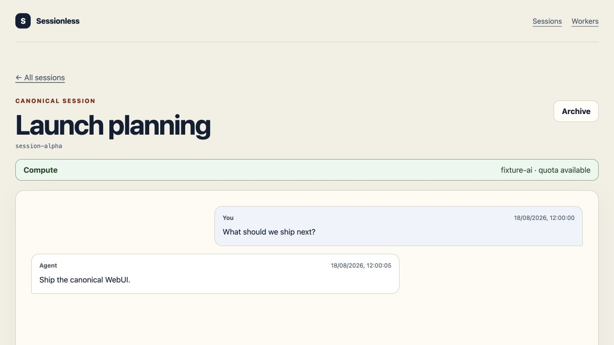
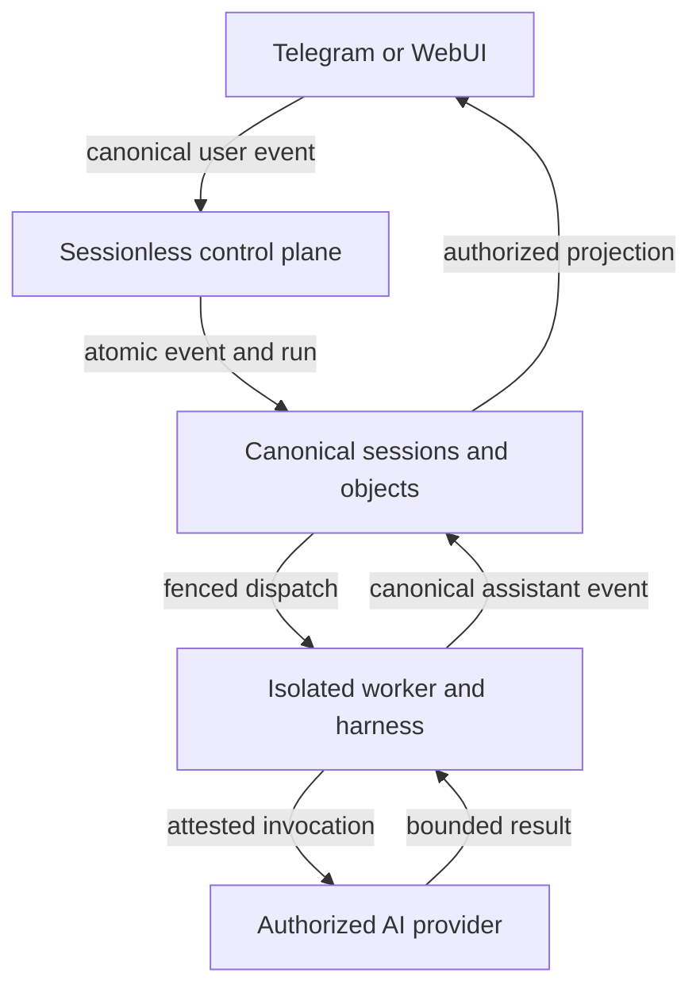

# Sessionless

**A serverless control plane that keeps conversations canonical while isolated,
pluggable agent workers do the work.**

[](https://github.com/urandon/sessionless/actions/workflows/ci.yml)
[](LICENSE)
[](https://deepwiki.com/urandon/sessionless)

> **MVP in progress.** The canonical session core, Telegram path, local WebUI,
> deterministic worker, and feature-disabled provider adapters are implemented.
> Cloud WebUI rollout, provider composition, and the attached-worker runtime are
> the remaining MVP delivery tracks.

[Explore the documentation](docs/README.md) ·
[Run the local stand](docs/local-development-stand.md#lifecycle) ·
[Run Dockerless on macOS](docs/macos-dockerless-development.md) ·
[See the MVP plan](https://gitcode.com/urandon/sessionless/issues/6)



_The implemented WebUI running against the repository's deterministic local
fixture. No cloud account, provider credential, or private user data is used._

Sessionless gives every frontend the same conversation and execution truth:

- an append-only, strictly ordered `SessionEvent` stream;
- tenant-scoped sessions, bindings, objects, quotas, and worker authority;
- durable, replay-safe scheduling and delivery across at-least-once queues;
- isolated harness adapters that cannot redefine the domain model;
- a local stand that proves the Telegram-to-worker-to-Telegram path end to end.

## How it fits together



The control plane owns identity, ordering, authorization, quotas, and durable
state. Workers receive only invocation-scoped capabilities. Frontend adapters
project canonical events without becoming an alternate source of truth.

## Try the complete local path

The local stand uses pinned YDB Local, MinIO, ElasticMQ, a Telegram fixture, and
the production Go boundaries. It does not need cloud, Telegram, or AI-provider
credentials.

```sh
make tools
make dev-up
make e2e-local
make dev-down
```

`make dev-down` preserves local data. Read the
[local stand runbook](docs/local-development-stand.md) before using the separate,
explicitly confirmed reset command.

## Delivery status

| Track | Status | Evidence and next boundary |
| --- | --- | --- |
| Canonical core and Telegram | **Implemented** | Ordered sessions/events, YDB state, durable ingress/delivery, deterministic two-tenant E2E; tracked by [MVP epic #6](https://gitcode.com/urandon/sessionless/issues/6). |
| WebUI | **Implemented locally** | Authenticated Go BFF, canonical API, and Svelte UI are complete; cloud deployment and tenant-isolation E2E remain in [WebUI epic #29](https://gitcode.com/urandon/sessionless/issues/29). |
| Provider and serverless harness | **Experimental, feature-disabled** | Immutable contracts, conformance fixtures, credential lifecycle, isolation/egress boundaries, and Codex/Pi/OpenCode adapters exist; composition and credentialed cloud E2E remain in [provider epic #13](https://gitcode.com/urandon/sessionless/issues/13). |
| Attached workers | **Protocol foundation implemented** | Owner-scoped identity and capability conformance are complete; transport, fenced dispatch, daemon, UX, and security E2E remain in [attached-worker epic #72](https://gitcode.com/urandon/sessionless/issues/72). |
| Personal-agent research | **Planned / post-MVP** | Memory, tools, web search, subagents, analytics, and federation stay outside the MVP gate until promoted through their research issues. |

“Implemented” means code plus repository checks exist. It does not imply a
production SLA. “Experimental” paths remain disabled unless their documented
release gates and explicit configuration are satisfied.

## Find your path

- **User or evaluator:** start with the [local product flow](docs/local-e2e.md).
- **Operator:** use the [local stand](docs/local-development-stand.md), then the
  [cloud-development runbook](docs/cloud-development.md).
- **Contributor:** read [CONTRIBUTING.md](CONTRIBUTING.md),
  [development.md](docs/development.md), and the
  [Go testing practices](docs/testing-best-practices.md).
- **Architect or security reviewer:** start with the
  [domain/runtime contracts](docs/contracts.md) and
  [security documentation](docs/README.md#security-and-trust-boundaries).
- **Frontend, provider, or worker integrator:** use the
  [integration map](docs/README.md#integration-surfaces).

The complete goal-oriented index is in [docs/README.md](docs/README.md); the
component inventory and command map live in
[docs/components.md](docs/components.md).

## Contributing and review

Changes are reviewed against deterministic local gates and mirrored exact-SHA
GitHub CI. See [CONTRIBUTING.md](CONTRIBUTING.md) for the development workflow.
The [security and trust-boundary index](docs/README.md#security-and-trust-boundaries)
routes reviewers to the applicable threat models and contracts.

Sessionless is distributed under the [MIT License](LICENSE).
