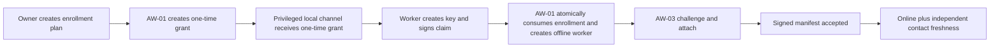
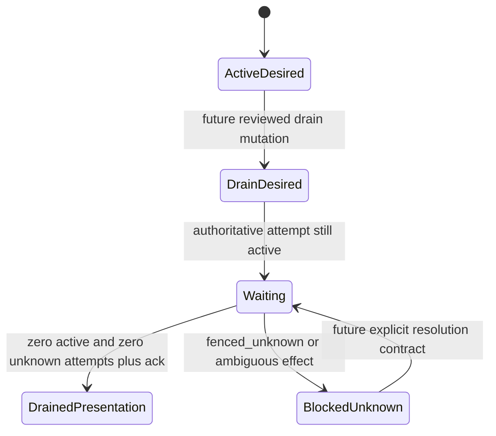
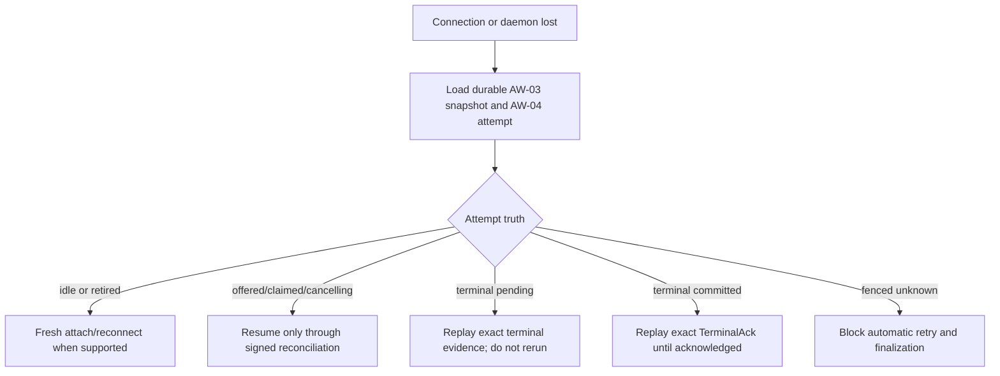

# Attached-worker UX observability and control contract

Status: AW-06a design contract for issues #82 and #78. This document is an
implementation prerequisite for attached-worker WebUI, CLI, and control
operations. It does not enable a product surface or add a state transition.

The first #78 implementation slice lives in `internal/attachedworkerux` and
`internal/ports/attached_worker_ux.go`. It provides only owner-scoped V1
list/detail/diagnostic reducers and public DTOs. It does not mount an endpoint,
enable a control, evaluate a candidate, or implement WebUI/CLI behavior.

## Scope and authority

The attached-worker UX is a redacted, owner-scoped projection of the existing
AW-01 through AW-05 authorities. It is not a second state machine. In
particular:

- AW-01 owns identity, enrollment, worker revision, desired/observed state,
  enrollment generation, connection generation, and deny-first revocation;
- AW-02 owns the signed protocol state, directional watermarks, attempt
  binding, cancellation evidence, terminal evidence, and acknowledgement;
- AW-03 owns the current connection head, presence lease, immutable advertised
  capability snapshot, and signed connection observation;
- AW-04 owns placement eligibility, the durable attempt/lease/fence, canonical
  cancellation and terminal commit, retained replay evidence, and admission;
- AW-05 owns local daemon/process observations, credential lifecycle outcomes,
  and isolation-launcher evidence.

The read service must point-load these authorities in the authenticated
`(tenant_id, owner_user_id)` scope and reduce them without mutation. Loading a
list, detail, diagnostics, or action-preview endpoint has no side effects. A
body field, query parameter, capability advertisement, daemon report, or
worker timestamp never becomes authorization.

Another tenant member or another owner receives the same not-found result as a
missing worker. There is no sharing model in V1. Mutations repeat the same
owner-first lookup and revision/generation preconditions; possession of a
public worker ID is insufficient.

## Truth vocabulary

Every UX fact belongs to one of these classes. Implementations must not turn
them into one synthetic health badge.

| Class | Meaning | Required metadata |
|---|---|---|
| `authoritative` | Current durable product state used for a decision or mutation. | source, revision or generation, `effective_at` when known |
| `observed` | Signed or authenticated evidence reported by a worker, provider, daemon, or probe. | source, `observed_at`, freshness |
| `derived` | A deterministic reduction of named authoritative and observed inputs. | stable reason codes, `evaluated_at`, input revisions/digests |
| `historical_failure` | The last bounded, sanitized failure. It does not replace current truth. | stable code, `occurred_at`, operation, retry class |
| `acknowledgement` | Evidence that another boundary observed a requested transition. | requested revision/generation, acknowledged revision/generation, `acknowledged_at` |
| `unknown` | The source cannot establish the fact. Unknown is never false, zero, healthy, erased, or exhausted. | stable reason and last attempted observation time when safe |

All timestamps in public DTOs are server-normalized UTC timestamps. Worker or
provider timestamps may be exposed only as diagnostic observations and are
never used to order authoritative transitions.

### Required separations

1. **Current truth and last error.** Current worker/connection/attempt state is
   rendered independently from `last_failure`. A recovered online worker may
   retain a visible historical failure only when a bounded authority recorded
   it; an offline worker can have no recorded error. AW-03 currently has no
   transport-failure ledger, so its last transport failure is `unknown`, never
   inferred from presence expiry or logs.
2. **Online and contact freshness.** `online` is the current AW-01/AW-03 state.
   `last_contact_at` and computed freshness describe the latest authenticated
   exchange. A connection may still be `online` while its observation is
   nearing expiry; stale or expired presence must never be rendered as a fresh
   green check.
3. **Advertised capability and admission evaluation.** The immutable,
   worker-signed manifest is evidence. A generic worker view has no candidate
   run, workload shape, placement, resource, or policy scope and therefore
   reports admission `not_evaluated`, never a reusable eligibility boolean. A
   scoped preview may copy a decision from the canonical scheduler evaluator
   and pin all inputs, but only the AW-04 admission transaction grants
   execution. Advertising a feature never authorizes it.
4. **Quota unknown, zero, and exhausted.** `unknown` has no remaining or reset
   value. A trustworthy `remaining=0` is a numeric observation and is displayed
   as zero; `exhausted` is the provider-observed state. Neither zero nor
   exhausted may be inferred when the source is unavailable.
5. **Cancellation phases.** `requested`, `acknowledged`, `process_stopped`, and
   `terminal_committed` are separate facts. CancelAck does not prove process
   termination. A daemon process exit does not commit a canonical Sessionless
   terminal. `fenced_unknown` means automatic retry/finalization remains
   blocked.
6. **Revocation/fence and remote erasure.** AW-01 deny-first revocation and
   AW-04 fencing apply immediately to control-plane authority. They do not
   prove that an offline host erased credentials, attempt files, or identity
   material. Erasure remains `not_requested`, `pending`, `acknowledged`, or
   `unknown`; V1 cannot claim `acknowledged` until an authoritative receipt
   contract exists.
7. **Isolation configured, verified, and unsupported.** A selected launcher
   profile is configuration. Worker-advertised isolation evidence is signed
   evidence. `verified` requires a reviewed platform-specific launcher and its
   external conformance result. Missing production support is `unsupported`,
   never `configured`, `verified`, or a skipped pass.
8. **Worker terminal and canonical terminal.** A signed AW-02 Terminal is
   evidence only. `terminal_committed` is true only after AW-04 atomically
   materializes canonical output/failure and persists the matching TerminalAck.

## Six semantic cohorts

### 1. Identity and ownership

This cohort answers: “Which owner-scoped worker is this, and which identity
generation is authoritative?”

Observable facts are the opaque worker ID, display name, lifecycle timestamps,
worker revision, enrollment generation, connection generation, desired state,
observed state, and redacted enrollment status. Public identity evidence may
include an algorithm and a short fingerprint, but never the Ed25519 public key,
proof, bootstrap secret, bootstrap digest, or audience.

Controls are enrollment creation/consumption and rename. Identity rotation is
unavailable in the generic WebUI action catalog until a daemon/local signed
flow can supply both current-key and new-key possession proofs without putting
proof material in public read/action DTOs.
Each mutation uses authoritative tenant/owner context, bounded confirmation,
an expected revision where the AW-01 contract requires one, and an idempotency
key. Consumed, expired, cross-owner, wrong-proof, and missing enrollment
outcomes retain the existing collapsed public error boundary.

### 2. Readiness and isolation

This cohort answers: “Can the reviewed local runtime safely accept the exact
kind of work being considered?”

It is designed to project daemon state/version, selected protocol version,
harness name and version, executable digest fingerprint, credential readiness,
isolation configuration, advertised isolation evidence, and external
verification status. Current AW-05a has no authenticated persisted daemon
report, side-effect-free credential-readiness port, production launcher, or
external verification record. Server/WebUI projections therefore report
daemon and credential observations as `unknown` and production isolation as
`unsupported`. A future local CLI may use a direct local source, but must label
its source, observation time, and freshness and must not upgrade server truth.

`credential_state` is a bounded readiness class (`ready`, `reauth_required`,
`unavailable`, or `unknown`), not a token inspector. Isolation has independent
`configuration_state`, `advertised_evidence`, and `verification_state` fields.
Legal isolation tuples are fail-closed: an unsupported platform or launcher
means `configuration_state=unsupported` and
`verification_state=unsupported`; configured but not externally proven means
`configured/unverified`; only a versioned external result bound to platform,
profile, daemon build, harness executable digest, and an explicit validity
bound may say `verified`. Signed advertisement never upgrades either state,
and fixture launchers never appear as configured or verified production
isolation.

Candidate controls are reconnect/reauth remediation, update check, logout, and
uninstall dry-run/plan. They are disabled with
`control_contract_unavailable` until AW-05 defines their bounded ports and
receipts. `CredentialLifecycle.RevokeConnection` and `Daemon.Shutdown` are not
logout, uninstall, remote-erasure, or product-terminal receipts. No action can
return a raw path, command line,
environment, credential, provider error, stdout, or stderr.

### 3. Connectivity and presence

This cohort answers: “Which connection generation is current, and how recent
is its last authenticated contact?”

It projects the current connection ID, generation, state, selected protocol,
connected time, last authenticated checkpoint, presence expiry, authentication
expiry, and last contact. A separate last sanitized transport failure is
optional only when an explicit bounded authority stores it. Current AW-03 has
no failure ledger and returns that field as `unknown`; expiry must not be
relabelled as a transport failure or sleeping host. Freshness is computed at
read time from authoritative server timestamps:

- `fresh`: before the authoritative presence expiry;
- `expired`: at or after presence expiry;
- `unknown`: no authenticated contact can be established.

`offline`, superseded generation, auth expiry, and an explicitly observed
transport failure are distinct reason codes. A sleeping-host diagnosis remains
unknown until a bounded AW-05 observation source exists. Reconnect is not
offered while the durable
AW-03/AW-04 reconciliation contract is feature-disabled. A new attachment may
be suggested only when it does not claim to resume or renew an old lease.

### 4. Eligibility, capability, and capacity

This cohort answers: “What did the worker advertise, and is this exact worker
authorized and available for this exact placement now?”

The capability view exposes only allowlisted manifest fields: manifest
revision/digest fingerprint, protocol offer, OS/architecture class, build ID,
harness name/version/surface, executable digest fingerprint, isolation
evidence, protocol features, and concurrency limit. It does not expose
arbitrary metadata, hostnames, paths, endpoints, providers, models, tools, MCP
configuration, or commands.

The generic detail read model reports `admission_preview=not_evaluated`. A
future candidate-scoped preview must invoke the same canonical evaluator used
by admission, return its exact decision code, and seal the candidate/evaluation
reference, workload/placement/resource scope, evaluation time, and every input
revision/digest. It is advisory, expires with any input change, and is neither
a grant nor a reservation; AW-04 must re-evaluate in its transaction. Quota
`unknown` and a trustworthy numeric zero are observations/warnings, not current
scheduler denials. The current scheduler denies provider-observed `exhausted`
and its other canonical policy states; a future policy change belongs there
before it appears here. Capacity advertised by Heartbeat is advisory and never
mutates canonical attempt state or grants admission.

The provider/credential entity is represented by an opaque owner-scoped
resource reference, readiness/entitlement/quota classes, observation times,
and provenance class. Raw tokens, provider account identifiers, route secrets,
quota response bodies, and provider errors are forbidden.

### 5. Execution and recovery

This cohort answers: “Which canonical attempt/fence owns execution, and which
effects are known, acknowledged, ambiguous, or committed?”

It projects owner-safe run, attempt, lease, and reservation IDs; lease
generation; a short fence fingerprint; lease expiry; attempt state; progress
stage/sequence; cancellation revision/deadline; terminal status; and the
separate worker-terminal and canonical-terminal acknowledgement facts. Context,
capability, policy, and evidence digests may be exposed only as short
correlation fingerprints, never as inputs that a caller can edit.

The exact AW-04 attempt states remain authoritative: `offered`, `claimed`,
`cancel_requested`, `cancel_acknowledged`, `terminal_pending`,
`terminal_committed`, `cancelled_before_claim`, `fenced_unknown`, and `retired`.
The UX may group them visually but must retain the exact state in the read
model.

Candidate controls are cancellation and bounded recovery guidance. There is
no force-complete, result rewrite, fence clear/override, same-attempt retry, or
silent managed/cloud fallback. An ambiguous external effect remains blocked
until AW-04 defines an explicit resolution contract. Any later retry allocates
a new attempt, lease, and fence.

### 6. Policy, lifecycle, and governance

This cohort answers: “What admission/lifecycle policy is in force, what did the
control plane apply, and what did the remote worker acknowledge?”

It includes desired/observed lifecycle state, admission decision, drain and
revoke revisions, identity/connection generations, audit receipts, update and
local-cleanup observations, and available actions with denial reasons.

Pause/resume admission must be backed by a future AW-04 authoritative admission
policy; V1 must not repurpose `offline`, daemon `stopped`, or AW-01 desired
state as a pause flag. AW-04 already rejects a new offer when AW-01 desired
state is not active. What remains unavailable is the reviewed drain mutation
and receipt plus remote `Drained` acknowledgement. A drained presentation
requires zero active and zero unknown attempts.
Revocation is deny-first. Remote revoked/erase acknowledgement is separate and
may remain unknown indefinitely for an offline host.

Update check is observation-only. Logout and uninstall are plan/confirm/apply
flows whose receipts enumerate only stable step codes. Uninstall dry-run must
not delete files or unregister identity. Actual logout/uninstall remains
unavailable until AW-05 defines exact local authority, rollback, and erasure
receipts.

## Entity observability and control matrix

“Current” below means current within the named authority, not necessarily a
fresh remote observation.

| Entity | Public-safe identity | Observable | Controllable | Unavailable/forbidden | Authority | Freshness | Acknowledgement/receipt |
|---|---|---|---|---|---|---|---|
| AttachedWorker | opaque `worker_id`, display name | revision, desired/observed state, enrollment/connection generations, created/updated/revoked times | rename; request drain; revoke; future admission pause/resume | identity key bytes, raw audit content, cross-owner lookup; pause until AW-04 policy exists | AW-01 worker row and audit | authoritative row revision; observed state timestamp comes from its transition audit | mutation receipt with worker revision/generations/action code; observed remote ack remains separate |
| Enrollment | opaque `enrollment_id`, preallocated `worker_id` | state `active/consumed/expired`, created/expires time, display name | public UX may plan/track; privileged local flow creates and consumes | bootstrap secret, digest, audience, proof, consumed/expired oracle to invalid claimant | AW-01 enrollment transaction time and revision | expiry evaluated by store time; public views never receive the grant | enrollment-created/claimed content-free audit; claim exact-replay status |
| Identity key and generations | key algorithm plus bounded fingerprint; numeric generations | enrollment and connection generations, rotated/revoked time | future daemon/local signed rotation; later reconnect contract | public key bytes, private key, signatures/proofs, caller-chosen generation; generic rotate apply | AW-01 worker row | current revision | rotation/revocation receipt; remote key deletion is not implied |
| Current connection and presence | opaque `connection_id` | state, generation, protocol, connected/checkpoint/presence/auth times and freshness; failure only from a future explicit ledger | initial attach; future safe reconnect/reauth remediation | inferred sleep/failure cause, bearer, secret/digest, channel binding, nonces, proofs, protocol snapshot, raw frames | AW-03 connection head plus AW-01 generations; optional future failure ledger | computed from server checkpoint and expiry; worker clock diagnostic only | AttachAccepted/Manifest transition and content-free audit; reconnect unavailable until accepted |
| Capability manifest/snapshot | short capability digest and manifest revision | allowlisted platform/build/harness/surface/isolation/features/concurrency evidence | none; refresh occurs only through signed protocol | editing capability as authorization; arbitrary maps, paths, endpoints, provider/model/tool/MCP discovery | AW-02 signed manifest, immutable AW-03 content, current connection observation | immutable content plus `manifest_observed_at`; stale when generation/connection no longer matches | signed manifest acceptance audit; no eligibility acknowledgement |
| Provider/credential resource reference | opaque owner-scoped resource reference | readiness, entitlement, quota state, numeric remaining if trustworthy, reset and observation times, provenance | reauth remediation only when supported | token/auth material, provider account ID, raw route, provider error/body, treating unknown as zero | credential lifecycle plus entitlement/quota observation contracts; policy engine for use | each observation carries its own `observed_at`; unknown is first-class | reauth receipt when defined; credential cleanup is not remote erase receipt |
| Run/attempt/lease/fence | opaque run/attempt/lease IDs, lease generation, short fence fingerprint | exact AW-04 state, lease expiry, progress, cancel and terminal phases, stable recovery reasons | request cancel; future explicit recovery resolution only | force-complete, clear fence, edit result/evidence, reuse ambiguous attempt, fallback | AW-04 attempt head, protocol snapshot, message ledger, canonical run finalization | authoritative transaction time and deadlines; progress is observed evidence | durable Cancel, CancelAck, Terminal evidence, canonical TerminalAck and retirement are distinct |
| Local daemon | worker ID plus version/build fingerprint | server view is unknown until an authenticated report exists; future local/source-labelled state, active attempt, times, count and separate last failure | future drain/shutdown, update check, logout/uninstall after owning ports exist | treating in-process status as server truth; arbitrary PID/signal/shell, stdout/stderr, argv, env, host paths, process list | AW-05 daemon/supervisor for direct local observation; future authenticated report for server view | explicit source, observation time and freshness; never synthesized at page read | future daemon action receipt; process stop observation is not terminal commit |
| Isolation profile | stable profile name/version and harness digest fingerprints | configuration state, advertised evidence, verification state, verification time/code | none in V1 except selecting an already reviewed supported profile during setup | raw allowlists/paths, self-asserted verification, skipped probe as pass, fixture launcher | AW-05 reviewed production launcher + versioned external verification; AW-02 manifest only advertises | verified result is bound to platform/profile/build/harness digest and validity; unsupported does not age into verified | verification receipt with profile/build/digest and stable outcome; remote erasure unrelated |

## Public read model and API DTOs

The V1 API is a query projection, not a persistence schema. Fields are additive
only within V1 when absence has an unambiguous meaning; semantic changes require
V2. Unknown values use explicit enums or nullable value fields and are never
encoded as empty strings or zero timestamps.

Suggested endpoints:

```text
GET  /v1/attached-workers
GET  /v1/attached-workers/{worker_id}
GET  /v1/attached-workers/{worker_id}/diagnostics
POST /v1/attached-worker-enrollments:plan
GET  /v1/attached-worker-enrollments/{enrollment_id}
POST /v1/attached-workers/{worker_id}/actions:plan
POST /v1/attached-workers/{worker_id}/actions:apply
GET  /v1/attached-worker-actions/{operation_id}
```

The public enrollment plan returns only a safe local-handoff plan identifier
and expiry. Enrollment creation/claim that yields or consumes bootstrap/proof
material is a separate privileged local setup protocol, not a public V1 action
operation. Its later status is visible through the safe enrollment projection.

List/detail/diagnostics are side-effect free. Control uses mandatory
plan/confirm/apply for destructive or remote-impacting actions. The plan seals
action-specific authority and preconditions; apply contains only `plan_id`, an
exact confirmation token, and an idempotency key. AW-01 plans may seal an
expected worker revision. Cancellation seals the exact attempt ID, lease
generation, and server-bounded acknowledgement timeout, without depending on
unrelated worker metadata revisions. Apply never accepts tenant, owner,
revision, generation, deadline, desired result, fence, capability, policy,
terminal, or raw command fields from the caller.

Every unsigned 64-bit revision, generation, sequence, and quota value is a
canonical base-10 JSON string in public V1. This preserves exact authority in
browsers, whose native `number` cannot represent all `uint64` values. Bounded
`uint32` fields such as `version` and advertised concurrency remain JSON
numbers.

The conceptual JSON shape is:

```json
{
  "version": 1,
  "evaluated_at": "2026-08-25T15:00:00Z",
  "worker": {
    "worker_id": "wrk_opaque",
    "display_name": "Studio Mac",
    "revision": "12",
    "enrollment_generation": "2",
    "connection_generation": "7",
    "desired_state": "active",
    "observed_state": "online",
    "created_at": "2026-08-01T09:00:00Z",
    "updated_at": "2026-08-25T14:59:00Z"
  },
  "identity": {"algorithm": "ed25519", "fingerprint": "sha256:12ab…", "enrollment_state": "consumed"},
  "readiness": {
    "daemon_observation": {"state": "unknown", "source": "unavailable", "freshness": "unknown"},
    "last_daemon_failure": {"state": "unknown"},
    "credential_state": "unknown",
    "isolation": {
      "configuration_state": "unsupported",
      "advertised_evidence": ["filesystem_boundary", "network_boundary", "process_boundary"],
      "verification_state": "unsupported"
    }
  },
  "connectivity": {
    "connection_id": "wcn_opaque",
    "state": "online",
    "last_contact_at": "2026-08-25T14:45:00Z",
    "presence_expires_at": "2026-08-25T15:10:00Z",
    "freshness": "fresh",
    "last_failure": {"state": "unknown"}
  },
  "capability": {
    "state": "advertised",
    "manifest_revision": "4",
    "digest_fingerprint": "sha256:34cd…",
    "harness": {"name": "sessionless", "version": "1.2.3", "surface": "session_turn_v1"},
    "isolation_evidence": ["filesystem_boundary", "network_boundary", "process_boundary"],
    "features": ["cancellation"],
    "max_concurrent_attempts": 1
  },
  "admission_preview": {
    "state": "not_evaluated"
  },
  "observation_warnings": ["isolation_unsupported", "quota_unknown"],
  "resource": {
    "state": "unknown",
    "resource_ref": "air_opaque",
    "credential_state": "unknown",
    "entitlement_state": "active",
    "quota": {"state": "unknown", "observed_at": "2026-08-25T14:40:00Z"}
  },
  "execution": {
    "state": "cancel_requested",
    "run_id": "run_opaque",
    "attempt_id": "att_opaque",
    "lease_id": "lea_opaque",
    "lease_generation": "3",
    "fence_fingerprint": "sha256:56ef…",
    "cancel_request": {"state": "requested", "revision": "1", "requested_at": "2026-08-25T14:50:00Z", "ack_deadline": "2026-08-25T14:51:00Z"},
    "cancel_ack": {"state": "pending", "revision": "1"},
    "process_observation": {"state": "unknown", "attempt_id": "att_opaque", "lease_generation": "3", "fence_fingerprint": "sha256:56ef…", "source": "unavailable", "freshness": "unknown"},
    "worker_terminal": {"state": "none"},
    "canonical_terminal": {"state": "none"}
  },
  "governance": {
    "admission_control": "unavailable",
    "remote_erase": "not_requested",
    "available_actions": [
      {"code": "request_cancel", "enabled": false, "reason_code": "control_contract_unavailable"},
      {"code": "revoke", "enabled": false, "reason_code": "control_contract_unavailable"},
      {"code": "resume_admission", "enabled": false, "reason_code": "control_contract_unavailable"}
    ]
  }
}
```

The example is illustrative: adapters omit a cohort only when its authority is
not applicable, not when the value is unknown. They use an explicit unknown
state when an applicable authority cannot establish a value.

Execution facts are orthogonal projections, not a synthesized lifecycle:

- `cancel_request` contains the durable cancel revision, request time, and
  acknowledgement deadline from AW-04;
- `cancel_ack` is `none`, `pending`, or `acknowledged` and carries the exact
  revision and acknowledgement time when established;
- `process_observation` is `unknown`, `running`, or `stopped` and is usable only
  when its source, observation time, freshness, attempt ID, lease generation,
  and fence fingerprint match the displayed attempt;
- `worker_terminal` is `none`, `received`, or `discarded` and may expose only
  sequence, status, and a short evidence fingerprint;
- `canonical_terminal` is `none` or `committed` and carries commit time plus
  the bounded matching TerminalAck metadata.

The AW-06 read adapter obtains cancel-request, CancelAck, and TerminalAck
occurrence times from the bounded, immutable, owner-scoped AW-04 message
ledger. It exact-checks the attempt scope and connection generation before
projecting them. Missing or divergent ledger evidence fails the established
projection closed; reducers never substitute an attempt or worker
`updated_at`. Diagnostics likewise publish current `observed_state` without an
`observed_at` until the AW-01 transition audit supplies it.

Each overview item carries its own `evaluated_at`. When the client explicitly
appends another page, it preserves that per-item timestamp; the later page
timestamp cannot make retained freshness observations appear newer.

No stale daemon observation is joined to a newer lease. Because current AW-04
does not persist a public cause taxonomy for `fenced_unknown`, V1 exposes only
the exact attempt state and generic `attempt_ambiguous`; it does not reconstruct
a cause after deadline evidence is consumed.

An optional failure projection is either `{state:"unknown"}` or a recorded
fact containing stable `code`, `occurred_at`, `operation`, `retry_class`, and
`source`. It never contains an error string. Daemon observations similarly
require `source`, `observed_at`, and `freshness`; page-read time is not a
substitute for the source observation time.

### Stable reason codes

Public reason codes are bounded, snake_case, content-free, and versioned with
the read model. Unknown internal errors map to `backend_unavailable`; raw nested
errors are logged only under the repository's protected diagnostic policy.

Observation/warning codes do not by themselves deny admission:

```text
worker_not_active
worker_revoked
worker_draining
worker_offline
connection_attaching
connection_superseded
presence_expired
authentication_expired
protocol_incompatible
capability_missing
capability_stale
capability_mismatch
policy_mismatch
isolation_unsupported
isolation_unverified
credential_unavailable
credential_reauth_required
entitlement_unknown
entitlement_inactive
quota_unknown
quota_zero
quota_exhausted
capacity_busy
attempt_active
attempt_ambiguous
control_contract_unavailable
backend_unavailable
```

A scoped `admission_preview` returns only `not_evaluated`, `admitted`, or
`denied` plus the exact decision code produced by the canonical scheduler. The
UX does not maintain a parallel denial-code list. In particular,
`quota_unknown` and `quota_zero` are observation warnings under current policy;
`quota_exhausted` is also a blocker only when the scheduler reports its
corresponding canonical denial.

Action unavailability codes:

```text
not_found
stale_revision
stale_generation
invalid_state
active_attempt
ambiguous_attempt
awaiting_acknowledgement
already_applied
unsupported_platform
feature_disabled
control_contract_unavailable
confirmation_required
operation_in_progress
```

Every public adapter, including HTTP, WebUI, CLI, enrollment status,
diagnostics, plan/apply, and operation lookup, returns the same `not_found`
outcome and response/timing
class for a missing or foreign-owner worker. Owner mismatch may be a protected
internal audit classification but never a public V1 value. `quota_zero` is emitted only
when a trustworthy remaining value is exactly zero. `quota_exhausted` is
emitted only from the provider-observed exhausted state. Both may be present if
both facts are established; neither substitutes for `quota_unknown`.

### Stable action codes and safety catalog

| Action code | Authority and precondition | Confirmation/apply | Receipt and acknowledgement |
|---|---|---|---|
| `create_enrollment` | AW-01; owner authenticated through the local setup flow | generic public UX may plan and track it, but bootstrap creation/handoff occurs only in the privileged local enrollment channel | public receipt has enrollment ID, worker ID, expiry and audit only; no bootstrap/auth material |
| `consume_enrollment` | AW-01 signed local claim; not a generic WebUI mutation | exact local proof and idempotent replay | claimed/consumed/expired safe result; public UX never receives bootstrap or proof |
| `rename` | AW-01 current revision, not cross-owner | optimistic apply; no destructive confirmation | resulting revision and audit action |
| `rotate_identity` | AW-01 requires current/new key proofs and revision | disabled in generic actions until a daemon/local signed flow exists; public plan/apply never carries proofs | future flow returns new enrollment generation/revision; no remote key-erasure claim |
| `pause_admission` / `resume_admission` | future AW-04 admission policy only | unavailable until contract exists | future policy revision and audit; never inferred from daemon/connection |
| `drain` | AW-01 desired state plus future AW-04 durable admission closure | confirmation includes active/unknown attempt count | applied revision, then separate drained acknowledgement only at zero active/unknown |
| `revoke` | AW-01 deny-first CAS | destructive confirmation states that offline remote cleanup may remain unknown | new enrollment/connection generations and revision; remote revoked/erase ack separate |
| `request_cancel` | AW-04 exact active attempt/lease/fence | confirmation shows ambiguity semantics; idempotent | Cancel revision, ack deadline, separate CancelAck/process/terminal fields |
| `reconnect_remediation` | future AW-03/AW-04 reconciliation | unavailable while reconnect is feature-disabled | new connection generation and signed reconciliation receipt |
| `reauth_remediation` | credential resource contract | never accepts raw token through generic action DTO | bounded credential state receipt; no provider body/error |
| `check_update` | AW-05 observation-only | no confirmation; no installation side effect | current/available version and check time, or stable unavailable code |
| `logout` | future AW-05 local credential/identity contract | destructive plan then explicit apply | per-step local receipt; remote revoke/erase remains separate |
| `uninstall_plan` | future AW-05 local inventory contract | dry-run only in MVP | bounded step plan, warnings, unsupported steps; no mutation |

Explicitly forbidden action codes do not appear disabled in the catalog; they
do not exist: force-complete, rewrite-result, clear-fence, edit-capability,
upload-token, view-token, arbitrary-shell, arbitrary-process-signal,
claim-erasure, or enable-fallback.

## Mandatory UX flows

### Enroll and first attach



The generic WebUI never displays the bootstrap secret, digest, proof, identity
key, connection secret, or bearer. The privileged local setup flow obtains and
consumes the one-time grant without routing it through the public read model,
action-operation record, diagnostics, cache, logs, or telemetry. Refreshing
the public enrollment view returns only safe current truth. A consumed or
expired grant cannot be regenerated by retry.

### Diagnose an offline worker or blocked candidate

```text
1. Load owner-scoped worker truth without mutation.
2. Show desired/observed state and current generation.
3. Show connection state and last-contact freshness separately.
4. Show readiness/isolation and resource observations with provenance/time.
5. Show advertised capability separately from observation warnings and any
   exact candidate-scoped canonical scheduler decision.
6. On a generic worker page show admission `not_evaluated`; when a sealed
   candidate preview exists, show its exact decision code and inputs. Present
   only actions whose authority and preconditions are currently satisfied.
```

Diagnostics never trigger a heartbeat, reconnect, provider quota call,
credential refresh, update, or process probe. An explicit future “refresh”
operation is an action with its own receipt, not page-load behavior.

### Drain with an active or ambiguous attempt



These are derived presentation labels over AW-01 desired state, AW-04 exact
attempt facts, and a future protocol acknowledgement; they are not persisted
UX states or a parallel admission policy.

The plan names the active attempt and whether it is known, cancelling,
terminal-pending, or fenced-unknown. Drain does not cancel implicitly unless a
separate, explicitly confirmed cancellation action is applied. “Drained” is
forbidden while any active or unknown attempt remains.

### Revoke and remote cleanup

```text
deny-first revocation applied
    -> local control authority fenced immediately
    -> remote revoke observation: pending | acknowledged | unknown
    -> remote credential/filesystem erase: not_requested | pending |
       acknowledged | unknown
```

The completion screen always separates the AW-01 revision/generation receipt
from remote acknowledgements. Offline or superseded workers normally remain
`unknown`; the UX must not turn elapsed time into “erased”.

### Crash, reconnect, and exact recovery



The screen identifies exact connection and lease generations and a short fence
fingerprint. It never offers “retry anyway”. Reconnect does not renew a lease,
change a fence, upgrade worker evidence to canonical output, or erase an
unacknowledged terminal. Until AW-04 reconnect is implemented, guidance is
diagnostic and the remediation action is disabled with
`control_contract_unavailable`.

## Information architecture

### Overview

Owner-scoped list ordered by stable display name/worker ID. Each row shows
identity, desired/observed state, connection state, freshness, observation
warnings, admission `not_evaluated`, active/ambiguous attempt marker, and the
highest-severity stable reason. It
does not show raw capability blobs, errors, or credential details. Filters use
semantic cohorts: lifecycle, freshness, observations, attempt, and action
required.

### Worker detail

One page with the six cohort sections in the order defined above. Current truth
is first; historical failures are visually and semantically secondary. Every
observation has provenance and time. Destructive actions open a plan rather
than mutating inline.

### Enrollment

Create plan, privileged local grant handoff, claim status, and first-attach
progress. The public UI receives only enrollment identity, expiry, and status;
one-time auth material never enters its DTO, cache, operation history,
telemetry, or diagnostic export.

### Active attempt and recovery

Exact attempt/lease/fence, progress evidence, cancel phases, terminal phases,
deadlines, and allowed recovery guidance. Prompt, result, provider error,
artifact content, and terminal evidence bytes are absent.

### Diagnostics

Bounded, redacted facts grouped by cohort; stable codes have human-readable
help text and machine-readable identifiers. Copy/export excludes owner email,
credentials, prompt/result, public keys, signatures, host paths, environment,
stderr/stdout, provider bodies, connection bearer, and raw protocol payloads.

The V1 diagnostic catalog is an ordered projection of existing authorities,
not another lifecycle machine:

- identity: `desired_state`, `observed_state`, `enrollment_state`;
- readiness: `daemon_state`, `last_daemon_failure`, `credential_state`,
  `isolation_configuration`, `isolation_verification`;
- connectivity: `connection_state`, `last_contact`, `transport_failure`;
- eligibility: `capability_state`, `admission_preview`, `entitlement_state`,
  `quota_state`;
- execution: `attempt_state`, `cancel_request`, `cancel_ack`,
  `process_observation`, `worker_terminal`, `canonical_terminal`;
- governance: `admission_control`, `remote_erase`.

`connection_state` never borrows the last-contact timestamp or freshness;
`last_contact` owns those observation fields. Isolation configuration and
verification remain separate, as do capability advertisement and admission,
quota unknown/zero/exhausted, every cancellation/process/terminal fact, and
revoke/fence authority versus remote erasure acknowledgement. The browser
loads diagnostics only after an explicit user gesture and rebuilds copy and
download bytes from the public allowlist. It does not probe, poll, persist, or
send a control mutation.

## Accessibility and interaction requirements

- State is never conveyed by color alone; every badge has exact text and a
  stable machine-readable code.
- Current truth, freshness, last failure, and acknowledgement are separate
  labelled fields in DOM order and screen-reader text.
- Relative time is accompanied by an exact UTC timestamp; automatic refresh
  preserves focus and announces only material state changes.
- Unknown, zero, exhausted, unsupported, unverified, pending, and
  acknowledged have distinct labels and accessible descriptions.
- Plan and apply are separate views. Destructive confirmation names the worker
  and consequence; it never relies on a generic “Are you sure?”.
- Keyboard-only flows can inspect reasons, copy a redacted diagnostic bundle,
  review a plan, cancel it, and apply an allowed action.
- Lists and event histories use bounded pagination and retain a stable cursor;
  loading more does not repeat or silently drop entries.

## #78 implementation decomposition

### 1. API and read model

Bounded scope:

- define `AttachedWorkerUXReadModelV1` and nested public DTOs from this contract;
- implement owner-first list/detail/diagnostics reducers over AW-01–AW-05 ports;
- implement freshness and observation-warning reduction; a future
  candidate-scoped preview delegates to the canonical scheduler and records
  its sealed input revisions/digests;
- define action catalog, plan/apply/operation receipt DTOs, but enable only
  controls whose authoritative mutation ports already exist and are accepted;
- add two-owner not-found/mutation negatives, unknown/zero/exhausted cases,
  stale observation cases, and no-side-effect read tests;
- enforce DTO reflection/JSON denylist and bounded pagination/response sizes.

No WebUI, daemon CLI, new lifecycle transition, or compatibility alias belongs
in this slice.

### 2. UI and CLI

Bounded scope after slice 1 acceptance:

- overview, worker detail, enrollment, active-attempt/recovery, and action-plan
  surfaces using only the V1 DTOs;
- CLI equivalents with stable JSON output and explicit plan/apply;
- semantic cohort navigation and complete reason rendering;
- no direct domain/store access, no client-derived admission decision, and no hidden
  action endpoint outside the catalog.

Controls remain disabled when the API reports unavailable. UI/CLI cannot infer
availability from labels or reconstruct a state machine.

The first accepted implementation slice is deliberately read-only: WebUI list,
detail, and redacted diagnostics consume the canonical V1 projection and show
future controls as inert rows with their exact unavailability codes. It adds no
action endpoint and performs no automatic polling. A networked CLI remains
blocked until an authenticated owner-context transport is accepted; a future
CLI may first add a pure renderer over already-authorized V1 DTOs, but must not
access domain stores directly or substitute local daemon observations for
server truth.

### 3. Diagnostics and accessibility

Bounded scope:

- redacted diagnostic projection/export and stable help catalog;
- accessibility tests for all required separations, focus, live updates,
  confirmation, tables, timestamps, and non-color state;
- responsive/error/empty/stale/unknown/replay fixtures for every cohort;
- telemetry limited to bounded outcome/action/reason codes and duration/size
  buckets, without worker, owner, run, attempt, provider, prompt, result, path,
  or credential labels.

This slice does not add probes with provider, filesystem, process, or network
side effects. Such probes require a separately reviewed action contract.

## Acceptance mapping

| #78/#82 acceptance | Cohort | Entity/read-model field | Required flow or test |
|---|---|---|---|
| identity and version | identity; readiness | `worker`, `identity`, daemon/harness version | enrollment/first attach |
| last contact and health | connectivity | connection state, contact time, freshness, separate failure | offline diagnosis |
| capacity and capabilities | eligibility | advertised manifest, observation warnings, admission `not_evaluated` or sealed canonical preview | blocked-candidate diagnosis; bait-switch negative |
| active attempt and exact reason | execution | exact attempt state plus reason codes | cancel/drain/recovery |
| enroll and rotate | identity | public enrollment tracking plus privileged local setup; generic rotation disabled pending signed local flow | enrollment/first attach; rotation proof/auth-material negatives |
| pause and resume | governance | unavailable until AW-04 admission-policy authority | contract-unavailable test |
| drain | governance/execution | admission state, active/unknown counts, ack | active and ambiguous drain |
| revoke | governance | deny-first receipt and independent remote ack/erase | acknowledged/unacknowledged revoke |
| uninstall plan | readiness/governance | future plan receipt only | dry-run has zero mutations |
| bounded redacted diagnostics | all | public DTO denylist and diagnostic bundle | copy/export security test |
| two-owner isolation | all | owner-scoped not-found | list/detail/plan/apply cross-owner matrix |
| no silent fallback | eligibility/execution | placement `fallback=deny`, canonical admission decision | unavailable attached worker negative |
| current truth vs history | all | truth blocks and separate `last_failure` | recovery with retained old failure |

## Implementation gate and review checklist

Production UI or control implementation must not start until owners of AW-03,
AW-04, and AW-05 accept that:

- every field maps to an existing authority or is explicitly unknown;
- no read path mutates presence, quota, credentials, daemon, or protocol state;
- no action creates a second transition or bypasses owner/revision/generation
  checks;
- advertised capability, Heartbeat availability, worker terminal evidence, and
  daemon observations remain evidence rather than authorization;
- exact cancellation, fencing, terminal commit, drain, revocation, and erase
  acknowledgement semantics are preserved;
- public DTOs and diagnostics contain no credential, prompt, result, raw host
  path, provider error, auth material, proof, signature, bearer, raw protocol
  frame, or arbitrary metadata;
- disabled future actions are honest and use stable unavailability reasons;
- #78 implementation slices consume this document as their source of truth.

Any change to an authoritative AW-01–AW-05 transition belongs in its owning
contract first. This document may then project the accepted change; it must not
lead it by inventing UI-only state.

## Design review record

The bounded AW-06a draft received independent read-only reviews against the
merged contracts on 2026-08-25:

- AW-03 reviewed owner scoping, presence/freshness, transport history,
  capability evidence, enrollment handoff, and admission-preview boundaries;
- AW-04 reviewed scheduler policy, quota observations, action-specific
  preconditions, cancellation/process/terminal separation, fencing, and drain;
- AW-05 reviewed daemon-report authority, credential readiness, isolation
  support/verification, bootstrap/auth redaction, local controls, and
  diagnostics.

The initial findings removed a public owner oracle, a UI-carried bootstrap and
rotation-proof path, invented transport/daemon observations, a reusable global
eligibility boolean, quota-derived policy not present in the scheduler, generic
cross-domain CAS fields, and an under-specified cancellation/process/terminal
projection. All three resolution reviews reported no remaining actionable
P1/P2. This review accepted the information and safety contract only. The
subsequent bounded slice may expose its read-only list, detail, and diagnostics
projections, but it does not accept or enable control operations.
