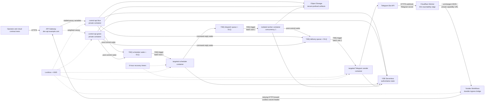

# Cloud development environment

The `cloud-dev` Terraform root creates an isolated, scale-to-zero Yandex Cloud
environment. The optional Telegram reachability edge uses a minimal Cloudflare
Worker, but that frontend-specific deployment is deferred and is not required
for the Yandex-only control plane. The environment is intentionally separate
from the permanent Terraform-state bootstrap root. GitCode is the source
repository; its GitHub push mirror builds verified immutable images on hosted
runners and publishes them to Yandex Container Registry.

## Runtime topology



The Cloudflare Worker is the Telegram-facing ingress. It verifies Telegram's
secret header, rejects malformed or oversized updates, and forwards unchanged
JSON to the private-capability Yandex Workflows execution URL. It returns
success only after Workflows returns an execution ID; otherwise Telegram sees a
non-2xx response and retries. The Worker contains no business state and logs no
payload or credential data.

Workflows durably records the accepted execution, forwards the update to API
Gateway, injects the internal webhook secret from Lockbox, and retries selected
HTTP, timeout, and quota failures with bounded exponential backoff. The
control-plane update transaction remains idempotent, so a repeated workflow
call is safe.

Live cloud-dev testing established this extra boundary: Telegram timed out
before reaching both API Gateway and the native public Workflows execution URL,
while independent IPv4 clients completed the same TLS and HTTP requests and a
synthetic workflow execution finished normally. A second Yandex-hosted public
primitive therefore did not solve ingress reachability. The external Worker
crosses only that network boundary; all durable state and processing remain in
Yandex Cloud.

The control slots are private and invocable only by the gateway service
account. Recovery-timer and YMQ triggers use a separate invoker identity. Runtime
service accounts are split by responsibility. The worker accepts a normalized
YMQ trigger event over HTTP; it does not long-poll YMQ inside a serverless
container. A successful HTTP response acknowledges the trigger delivery, while
a non-2xx response leaves retry and DLQ behavior to the trigger.

Normal dispatch and Telegram delivery are queue-driven. Producers write the
durable YDB outbox first and then publish a payload-free wake containing only
`tenant_id` and `outbox_id`. Consumers perform a primary-key point read and an
idempotent claim; missing or terminal rows are acknowledged as duplicate
no-ops. A failed post-commit publish is repaired by producer retry or by the
bounded recovery scan. The two recovery timers run every six hours by default,
so an idle environment performs 16 dispatch, 16 quota-expiry, and 16 delivery
bucket reads four times per day instead of every minute.

## Resources and ownership

| Concern | Owner | Lifecycle |
| --- | --- | --- |
| Terraform state bucket and deployment-lock YDB | `bootstrap/` root | Permanent; never part of environment destroy |
| Dev folder, YDB, queues, bucket, registry, KMS, Lockbox, log group | `cloud-dev` foundation module | Terraform |
| GitHub image-publisher service account, OIDC federation and repository-scoped push grants | `cloud-dev` foundation module | Terraform; no authorized key |
| Serverless containers and triggers | runtime module | Terraform |
| Private Web BFF container, dedicated gateway, certificate and allowlisted routes | web module | Terraform; separate `web-bff` and `web-gateway` identities |
| Delegated public DNS zone | foundation module | Terraform; parent-zone NS delegation is external |
| Managed certificate, DNS records, API Gateway and canary variables | edge module | Terraform |
| Yandex Workflows Telegram ingress | `infra/yandex/workflows` | Explicit `yc` operator deployment; capability URL never enters Terraform |
| Telegram-facing Cloudflare Worker and `dev-api-sessionless.triborg.dev` custom domain | `infra/cloudflare/telegram-edge` | Pinned Wrangler; same explicit operator deployment as the workflow |
| Cloudflare Worker secrets | Operator credential store and `cloudflare-telegram-edge.sh` | Secret bindings; never Terraform state or repository files |
| Lockbox payload values | Operator credential store and `cloud-secret-load.sh` / `cloud-web-secret-load.sh` | Outside Terraform state |
| YMQ static access keys | Dedicated least-privilege service accounts; generated directly into KMS-backed Lockbox | Terraform metadata only; payload never enters state |
| Runtime Object Storage authentication | Revision service accounts through metadata-issued IAM bearer tokens | Renewable; no S3 static key or Lockbox payload |
| Billing budget | Billing API or console | External prerequisite; provider has no budget resource |
| Monitoring alerts | Monitoring API or console | External prerequisite; provider has no alert resource |

The environment defaults to deletion protection for YDB, KMS, Lockbox, and
the managed certificate. Object Storage does not use `force_destroy`.

## Files kept outside the repository

Copy these examples to a restricted operator directory and set mode `0600`:

- `infra/terraform/cloud-dev/backend.hcl.example`;
- `infra/terraform/cloud-dev/cloud-dev.tfvars.example`.

Neither file contains credentials, but both expose deployment identifiers.
Inject the provider IAM token through the process environment. Issue an
ephemeral Object Storage access key into a restricted external AWS credentials
file for the S3 backend; do not create a long-lived static access key for an
operator workstation. Yandex Cloud ephemeral access keys are supported by
Object Storage only and cannot authorize YMQ. The separate YMQ bootstrap below
therefore creates two static keys: an `ymq.admin` provisioning identity and an
`ymq.writer` scheduler identity. Both payloads are generated directly into
KMS-backed Lockbox secrets. They do not enter Terraform state, tfvars, plans,
argv, or repository files.

This split follows the official constraints: [ephemeral access keys authenticate
only Object Storage](https://yandex.cloud/en/docs/iam/concepts/authorization/ephemeral-keys),
[YMQ tools require a static access key](https://yandex.cloud/en/docs/message-queue/instruments/),
and the Terraform provider can [write generated static-key material directly to
Lockbox](https://yandex.cloud/en/docs/terraform/resources/iam_service_account_static_access_key).

Never put IAM tokens, access keys, Telegram secrets, or subscription
credentials into Terraform variables, plans, shell history, or repository
files. The wrapper reads the provisioning key from Lockbox into the Terraform
provider process environment only. The writer-only runtime YMQ key is mounted
from its own Lockbox secret into the reconciler, control, and worker revisions.
It can publish dispatch and wake messages but cannot consume queues. The
Telegram secret remains separate and is never shared with the worker or
reconciler.

The Cloudflare API token is also external. Use a token restricted to the one
account and the `triborg.dev` zone with Account/Workers Scripts Write and
Zone/Workers Routes Write. Load it into `CLOUDFLARE_API_TOKEN` only for the
Wrangler deployment process. Do not use a Global API Key.

For example, before bootstrap or environment operations:

```sh
export AWS_SHARED_CREDENTIALS_FILE=/secure/path/sessionless.aws-credentials
export AWS_PROFILE=sessionless-terraform
yc iam access-key issue-ephemeral \
  --session-name sessionless-terraform \
  --duration 12h \
  --aws-profile "$AWS_PROFILE" \
  --aws-credentials-file "$AWS_SHARED_CREDENTIALS_FILE"
chmod 0600 "$AWS_SHARED_CREDENTIALS_FILE"
export YC_TOKEN="$(yc iam create-token)"
```

The ephemeral key expires after at most 12 hours. Refresh it before a later
plan/apply and unset `YC_TOKEN` when deployment work ends. The Terraform
wrapper reuses this short-lived token for the YDB deployment-lock client when
`YDB_ACCESS_TOKEN_CREDENTIALS` is not set explicitly; it never persists the token.

Application revisions do not receive that deployer token. Terraform sets
`YDB_METADATA_CREDENTIALS=1` for every YDB-using Serverless Container, and the
YDB Go SDK credential chain obtains renewable IAM tokens from the revision's
service account through the container metadata service. Omitting this explicit
selector makes `ydb-go-sdk-auth-environ` fall back to anonymous credentials and
causes cloud YDB discovery to fail with `Unauthenticated`.

The artifact bucket deliberately leaves static-key authentication enabled.
[Yandex Object Storage terminates all pre-signed URLs when static-key access is
disabled](https://yandex.cloud/en/docs/storage/operations/buckets/disable-statickey-auth),
including short-lived URLs created through the IAM-authenticated Presign API.
This is an explicit capability-versus-hardening tradeoff: Terraform does not
provision a persistent Object Storage static key, anonymous read/list/config
access remains disabled, the bucket is reachable only through IAM grants or an
exact-object signed capability, and runtime roles remain bucket-scoped. A
leaked static key belonging to a storage-authorized principal would
nevertheless work against this bucket until that key is revoked, so key
inventory and revocation remain deployment controls.

Browser capability requests are allowed only from the exact HTTPS
`webui_origin` supplied to Terraform; wildcards, paths, queries, and fragments
are rejected. Bucket CORS permits only `PUT`, `GET`, and `HEAD`, accepts only
the API's `Content-Type` and `Content-MD5` request headers, exposes
only `ETag`, and caches preflight results for five minutes. `Content-Length` is
also signature-bound but is a browser-managed forbidden request header, so it
is not included in the CORS allow-header list. CORS does not grant object
access: every operation still needs IAM authorization or a valid short-lived
capability. See the Object Storage
[CORS configuration contract](https://yandex.cloud/en/docs/storage/operations/buckets/cors).

Terraform sets `S3_IAM_METADATA_CREDENTIALS=true` for the API, worker, and
sender. The blob adapter obtains renewable IAM tokens from the same metadata
service and calls the Object Storage S3 HTTP API with bearer authentication.
Local MinIO remains on the AWS SDK path with explicit development credentials.

The bucket lifecycle keeps immutable `tenants/` payloads in `STANDARD` for 30
days by default, then moves them to `COLD`, and moves objects at least 365 days
old to `ICE`. Override `artifact_cold_transition_days` and
`artifact_ice_transition_days` only in a reviewed cost/retention change; ICE
has a 12-month minimum billable duration. The lifecycle never expires current
canonical objects. See [session-lifecycle.md](session-lifecycle.md).

The permanent bootstrap root begins with local state. After its first apply,
copy `infra/terraform/bootstrap/backend.s3.tf.example` to the ignored
`backend.s3.tf` file and run `terraform init -migrate-state` with the external
bootstrap backend HCL. This two-phase transition is required because the state
bucket cannot be used before the bootstrap root creates it.

The procedures below assume:

```sh
export CLOUD_DEV_BACKEND_CONFIG=/secure/path/cloud-dev.backend.hcl
export CLOUD_DEV_TFVARS=/secure/path/cloud-dev.tfvars
export TERRAFORM_LOCK_YDB_CONNECTION_STRING='grpcs://...bootstrap lock database...'
export DEPLOYMENT_ENVIRONMENT=cloud-dev
```

Before the first foundation plan, run the safe claim-inspection workflow from
the GitHub mirror after it exists on mirrored `main`:

```sh
gh workflow run oidc-claims.yml --repo urandon/sessionless --ref main
gh run list --repo urandon/sessionless --workflow oidc-claims.yml --limit 1
gh run view --repo urandon/sessionless replace-run-id --log
```

The workflow prints only selected non-secret claims, never the JWT. Copy the
exact `subject` value into `github_oidc_subject` in the external tfvars file.
Do not derive it from names: GitHub repositories created after 2026-07-15 can
include immutable owner and repository IDs in `sub`. Terraform binds that exact
subject, the `main` ref, and the configured audience to a dedicated service
account. The account receives only `container-registry.images.pusher` on the
five runtime repositories: `control-api`, `web-bff`, `reconciler`,
`telegram-sender`, and `worker-runtime`.

## First deployment

### 1. Bootstrap only the folder

The budget must reference the folder, while all billable resources must remain
behind the budget gate. The only intentional targeted apply in this runbook is
therefore the first folder creation:

```sh
CONFIRM_FOLDER_BOOTSTRAP=sessionless-cloud-dev:folder \
  ./scripts/cloud-terraform.sh folder-bootstrap
export CLOUD_DEV_FOLDER_ID="$(./scripts/cloud-terraform.sh output -raw folder_id)"
```

Do not reuse `-target` for ordinary deployments.

### 2. Create and verify the budget

Create an active billing budget whose filter contains exactly
`CLOUD_DEV_FOLDER_ID`, and configure threshold notifications for the project
owners. Put its non-secret IDs into the external tfvars file, then export them:

```sh
export BILLING_ACCOUNT_ID=replace-billing-account-id
export BUDGET_ID=replace-folder-scoped-budget-id
./scripts/cloud-preflight.sh
```

The preflight calls the Billing API and fails unless the account is active and
RUB-denominated and the budget is active, monthly, no greater than 100 RUB,
unrestricted by service, and scoped to exactly the dev folder. It also
initializes and validates the Terraform root. This is an admission gate, not a
cost cutoff: Yandex Cloud budgets notify but do not automatically stop
resources.

### 3. Bootstrap least-privilege YMQ credentials

YMQ requires a static access key even when the rest of the deployment uses IAM
tokens, service-account metadata, and ephemeral Object Storage keys. Run the
second and final intentional targeted bootstrap after the budget gate passes:

```sh
CONFIRM_QUEUE_AUTH_BOOTSTRAP=sessionless-cloud-dev:queue-auth \
  ./scripts/cloud-terraform.sh queue-auth-bootstrap
```

This creates only the dedicated queue provisioner and scheduler identities,
their minimum folder roles, two custom-KMS Lockbox secrets, and the two static
keys written directly to those secrets. Ordinary `plan`, `apply`, and destroy
commands then resolve the provisioner key from Lockbox automatically. Do not
export or copy either payload manually. Rotate a key by replacing its Terraform
resource under a reviewed plan, then deploy the generated Lockbox version.

### 4. Apply the foundation

Create a saved plan in a restricted, untracked directory, review it, and apply
that exact plan under the fenced YDB deployment lock:

```sh
./scripts/cloud-terraform.sh plan \
  -target=module.foundation \
  -out=/secure/path/cloud-dev-foundation.tfplan
terraform -chdir=infra/terraform/cloud-dev show /secure/path/cloud-dev-foundation.tfplan
./scripts/cloud-terraform.sh apply /secure/path/cloud-dev-foundation.tfplan
```

This creates the registry and the empty Lockbox secret before any runtime
revision refers to them.

### 5. Delegate the environment DNS zone

The foundation apply also creates the public zone named by `base_domain`.
Delegate that subdomain from the parent DNS provider with these two records:

```text
base_domain. NS ns1.yandexcloud.net.
base_domain. NS ns2.yandexcloud.net.
```

Wait until both authoritative name servers answer for the delegated zone
before applying the Yandex edge resources. Cloudflare proxy/CDN certificates
are not used inside this delegated zone; Certificate Manager terminates TLS at
API Gateway. The Telegram edge hostname is intentionally outside the delegated
child zone: `dev-api-sessionless.triborg.dev` remains a first-level hostname in
the Cloudflare-managed `triborg.dev` parent zone. Wrangler creates its Worker
custom-domain DNS record and edge certificate.

### 6. Load secret payload and publish images from GitHub

Load values from the operator credential store into environment variables,
then stream them to Lockbox. The script never puts payload values in argv or
Terraform state:

```sh
export TELEGRAM_SECRET_ID="$(./scripts/cloud-terraform.sh output -raw telegram_secret_id)"
export TELEGRAM_BOT_TOKEN='loaded by credential-store command'
export TELEGRAM_WEBHOOK_SECRET='loaded by credential-store command'
export TELEGRAM_IDENTITY_HMAC_KEY='loaded by credential-store command'
./scripts/cloud-secret-load.sh
unset TELEGRAM_BOT_TOKEN TELEGRAM_WEBHOOK_SECRET TELEGRAM_IDENTITY_HMAC_KEY
```

Copy the returned version ID into the external tfvars file. Load the Web-only
OIDC and signing material into its separate Lockbox secret. The OIDC client ID
is non-secret configuration; the client secret and both HMAC keys never enter
Terraform:

```sh
export WEB_BFF_SECRET_ID="$(./scripts/cloud-terraform.sh output -raw web_bff_secret_id)"
export TELEGRAM_OIDC_CLIENT_SECRET='loaded by credential-store command'
export SESSION_API_CURSOR_HMAC_KEY='loaded by credential-store command'
export SESSION_API_ID_HMAC_KEY='loaded by credential-store command'
./scripts/cloud-web-secret-load.sh
unset TELEGRAM_OIDC_CLIENT_SECRET SESSION_API_CURSOR_HMAC_KEY SESSION_API_ID_HMAC_KEY
```

Copy only the returned Web secret version ID into the external tfvars file. In
BotFather, register the exact allowed Web URL
`https://web.dev.sessionless.triborg.dev` and exact callback
`https://web.dev.sessionless.triborg.dev/auth/telegram/callback`. Wildcards,
HTTP aliases and direct container URLs are not allowed.

After both secret versions are recorded, configure the GitHub mirror with
Terraform's non-secret outputs:

```sh
gh variable set YANDEX_OIDC_AUDIENCE --repo urandon/sessionless \
  --body "$(./scripts/cloud-terraform.sh output -raw github_oidc_audience)"
gh variable set YANDEX_GITHUB_OIDC_SUBJECT --repo urandon/sessionless \
  --body "$(./scripts/cloud-terraform.sh output -raw github_oidc_subject)"
gh variable set YANDEX_IMAGE_PUBLISHER_SERVICE_ACCOUNT_ID --repo urandon/sessionless \
  --body "$(./scripts/cloud-terraform.sh output -raw image_publisher_service_account_id)"
gh variable set YANDEX_CONTAINER_REGISTRY_ID --repo urandon/sessionless \
  --body "$(./scripts/cloud-terraform.sh output -raw registry_id)"
gh variable set YANDEX_IMAGE_PUBLISH_ENABLED --repo urandon/sessionless --body true
```

The flag is deliberately absent during bootstrap, so the first CI run remains
green before the federation exists. Once enabled, rerun the `CI` workflow on
mirrored `main`. Its final job builds the images once, requests a GitHub OIDC
JWT, verifies its exact safe claims, exchanges it for a short-lived Yandex IAM
token, and pushes the five already-built `linux/amd64` images, including
`web-bff`. It uploads
`deployment-images-<full-sha>` containing immutable registry digests. No GitHub
secret, authorized service-account key, Lockbox access, or Terraform credential
is used.

Download the manifest and convert it into a separate non-secret Terraform
variable file:

```sh
gh run download replace-green-run-id --repo urandon/sessionless \
  --name "deployment-images-$(git rev-parse HEAD)" \
  --dir /secure/path/sessionless-images
export EXPECTED_SOURCE_SHA="$(git rev-parse HEAD)"
export EXPECTED_REGISTRY_ID="$(./scripts/cloud-terraform.sh output -raw registry_id)"
./scripts/cloud-image-tfvars.sh \
  /secure/path/sessionless-images/deployment-images.json \
  >/secure/path/cloud-dev-images.tfvars.json
export CLOUD_DEV_IMAGE_TFVARS=/secure/path/cloud-dev-images.tfvars.json
unset EXPECTED_SOURCE_SHA EXPECTED_REGISTRY_ID
```

`cloud-terraform.sh plan` automatically adds this digest-only variable file.
The base tfvars retains SHA tags solely for the explicit non-Web local fallback
and compatibility with previously deployed revisions. The Web container always
requires the manifest's `cr.yandex/.../web-bff@sha256:...` reference; normal
plans use digest references for every component. The deployment wrapper refuses
every non-foundation plan when `CLOUD_DEV_IMAGE_TFVARS` is absent, so the
bootstrap-only placeholder in the example file cannot reach a Web revision.

For emergency local publication only, configure Docker authentication and run:

```sh
yc container registry configure-docker
CLOUD_IMAGE_TAG="$(git rev-parse HEAD)" ./scripts/cloud-images.sh
```

The fallback uses the same deterministic build metadata, platform checks,
registry push, and manifest format as CI. It refuses a source SHA other than the
checked-out commit. Before publishing, both paths compare the local image config
digest with the config digest behind any existing commit tag: an exact content
match is a no-op and a different config fails before push. This deliberately
does not compare Buildx's load/export manifest digest with the registry manifest
digest because Docker can normalize the outer manifest during push. The remote
descriptor supplies the registry's canonical manifest digest. The raw registry
manifest is then read through that digest-qualified reference, so a concurrent
tag update cannot mix the descriptor of one manifest with the config digest of
another. The remote config digest is verified again after a first publication,
and the canonical manifest digest is recorded in the deployment reference.
Same-ref GitHub image jobs are serialized to close the CI race window. Yandex
Serverless Containers runs AMD64 only; publishing a native Apple Silicon image
creates a valid registry object but revision deployment cannot use it.

### 7. Reset disposable application data after a baseline rebase

Skip this step for an ordinary forward migration. Use it only while cloud-dev
is explicitly disposable and a reviewed change has rebased an already-applied
pre-production migration baseline.

The plan resolves the folder, YDB database, and artifact bucket from the
selected cloud-dev Terraform state. It fails if supplied environment values do
not match those outputs and prints the exact application-table allowlist and
the `tenants/` object prefix. It does not modify anything:

```sh
make cloud-app-reset-plan
```

Review that JSON, then derive the typed confirmation from the same Terraform
outputs and execute with a short-lived IAM token:

```sh
export CLOUD_DEV_FOLDER_ID="$(./scripts/cloud-terraform.sh output -raw folder_id)"
export S3_BUCKET="$(./scripts/cloud-terraform.sh output -raw artifact_bucket_name)"
export YC_TOKEN="$(yc iam create-token)"
export CONFIRM_CLOUD_APP_RESET="reset-sessionless-cloud-dev:${CLOUD_DEV_FOLDER_ID}:${S3_BUCKET}"
make cloud-app-reset
unset CONFIRM_CLOUD_APP_RESET YC_TOKEN S3_BUCKET CLOUD_DEV_FOLDER_ID
```

The command deletes only objects below `tenants/` in the resolved cloud-dev
artifact bucket and drops only repository-owned application and migration
metadata tables in the resolved cloud-dev YDB. It preserves the folder,
database resource, bucket, Terraform state, bootstrap/deployment lock, queues,
registry, IAM, KMS, Lockbox, DNS, certificates, and unrelated bucket prefixes.
Never substitute manual recursive bucket deletion or a broad YDB cleanup.

### 8. Apply schema and complete environment

Use a short-lived operator IAM token only in the child process environment:

```sh
export YDB_CONNECTION_STRING="$(./scripts/cloud-terraform.sh output -raw ydb_connection_string)"
export YDB_ACCESS_TOKEN_CREDENTIALS="$(yc iam create-token)"
go run ./cmd/schema-migrate
go run ./cmd/schema-migrate status
unset YDB_ACCESS_TOKEN_CREDENTIALS

./scripts/cloud-terraform.sh plan -out=/secure/path/cloud-dev.tfplan
terraform -chdir=infra/terraform/cloud-dev show /secure/path/cloud-dev.tfplan
./scripts/cloud-terraform.sh apply /secure/path/cloud-dev.tfplan
```

The Web container is private and has zero prepared instances. Its dedicated
gateway identity can invoke only that container; the control gateway identity
cannot invoke it. The pinned Terraform provider exposes
`provision_policy.min_instances` but does not expose per-zone instance/request
limits for Serverless Containers. Keep the declared concurrency at or below
eight and verify any separately approved folder/revision quota through the
Yandex API before accepting live traffic; never create a manual replacement
revision to hide provider drift.

Certificate issuance can remain pending while the managed DNS challenge
propagates. Wait for the certificate to become issued, rerun the full plan, and
apply only if the second plan contains the expected edge completion.

If an interrupted first apply leaves an `ACTIVE` Serverless Container with no
revision, do not deploy a revision manually with `yc`: Terraform would not own
that recovery operation. First verify the container has `revision_id = null`
and that its Lockbox and custom-KMS IAM grants are present. Then create and
review a saved full plan with an explicit `-replace` for each affected
stateless container resource. This one-time recovery is allowed only before
traffic is routed and must contain no replacement of YDB, buckets, Lockbox,
queues, or other state-bearing resources.

### 9. Verify the Yandex foundation

```sh
export CLOUD_API_URL="$(./scripts/cloud-terraform.sh output -raw api_url)"
export CONTROL_CONTAINER_URL="$(./scripts/cloud-terraform.sh output -json control_slot_urls | jq -r .blue)"
./scripts/cloud-smoke.sh

export CLOUD_WEB_URL="$(./scripts/cloud-terraform.sh output -raw web_url)"
export WEB_CONTAINER_URL="$(./scripts/cloud-terraform.sh output -raw web_container_url)"
export WEB_IMAGE_REF="$(./scripts/cloud-terraform.sh output -raw web_image_ref)"
export WEB_PREPARED_INSTANCES="$(./scripts/cloud-terraform.sh output -raw web_prepared_instances)"
export WEB_CONCURRENCY="$(./scripts/cloud-terraform.sh output -raw web_concurrency)"
./scripts/cloud-web-smoke.sh

export CLOUDFLARE_ACCOUNT_ID='loaded from the Cloudflare account metadata'
export CLOUDFLARE_API_TOKEN='loaded by credential-store command'
export TELEGRAM_WEBHOOK_SECRET='loaded by credential-store command'
export CLOUD_DEV_FOLDER_ID="$(./scripts/cloud-terraform.sh output -raw folder_id)"
export YANDEX_API_FQDN="$(./scripts/cloud-terraform.sh output -raw api_fqdn)"
export YANDEX_GATEWAY_SERVICE_ACCOUNT_ID="$(./scripts/cloud-terraform.sh output -raw gateway_service_account_id)"
export YANDEX_LOG_GROUP_ID="$(./scripts/cloud-terraform.sh output -raw runtime_log_group_id)"
export YANDEX_TELEGRAM_SECRET_ID="$(./scripts/cloud-terraform.sh output -raw telegram_secret_id)"
./scripts/cloudflare-telegram-edge.sh
unset CLOUDFLARE_API_TOKEN TELEGRAM_WEBHOOK_SECRET
unset CLOUD_DEV_FOLDER_ID YANDEX_API_FQDN YANDEX_GATEWAY_SERVICE_ACCOUNT_ID
unset YANDEX_LOG_GROUP_ID YANDEX_TELEGRAM_SECRET_ID

export TELEGRAM_BOT_TOKEN='loaded by credential-store command'
export TELEGRAM_WEBHOOK_SECRET='loaded by credential-store command'
export TELEGRAM_EDGE_URL='https://dev-api-sessionless.triborg.dev'
export CONFIRM_EXTERNAL_TELEGRAM_EDGE='sessionless-external-edge'
./scripts/cloud-webhook.sh
unset TELEGRAM_EDGE_URL TELEGRAM_BOT_TOKEN TELEGRAM_WEBHOOK_SECRET
unset CONFIRM_EXTERNAL_TELEGRAM_EDGE
```

The Web smoke proves anonymous direct invocation is denied, authenticated
private health works, the managed hostname and certificate are usable, the
public version is `web-bff`, auth/API cache policy and browser security headers
survive the gateway, Telegram is the only OIDC redirect target, and unrelated
mutation routes are not exposed. For an explicit cold-start exercise, set
`WEB_COLD_START_WAIT_SECONDS` to the approved idle window before running the
same script and record the printed first-byte latency without publishing auth
callback material.

The workflow is deliberately outside Terraform because its public execution
URL is an unguessable capability and a Terraform provider stores computed
resource attributes in state even when an output is marked `sensitive`. The
operator script creates or updates the workflow through `yc`, reads the URL
without printing it, and writes it with the Telegram secret into a mode-0600
temporary JSON file. `jq` reads both values from its environment, so neither
secret appears in process argv. Wrangler receives only the temporary file path,
and the file is deleted on every exit. Do not publish the URL in an issue, log,
shell trace, or CI output.

The first run creates the fixed
`sessionless-dev-telegram-ingress-external` name with immutable ownership
labels. It never updates an existing workflow by name. On later deployments,
resolve and verify the non-secret workflow ID, then bind both authorization and
the update to that ID:

```sh
export YANDEX_WORKFLOW_ID='verified immutable workflow ID'
export CONFIRM_YANDEX_WORKFLOW_UPDATE="sessionless:telegram-ingress:${YANDEX_WORKFLOW_ID}"
./scripts/cloudflare-telegram-edge.sh
unset YANDEX_WORKFLOW_ID CONFIRM_YANDEX_WORKFLOW_UPDATE
```

The script refuses the update unless the ID, fixed name, and all ownership
labels match. A first-run name collision is also a hard failure and requires
manual identity review before using the ID-bound update path.

Cloud-dev once had a Terraform-managed workflow. Before the first apply of the
external-ownership configuration, detach exactly that resource under the
deployment lock:

```sh
export LEGACY_TELEGRAM_WORKFLOW_ID='verified immutable legacy workflow ID'
export CONFIRM_WORKFLOW_STATE_RELEASE="sessionless-dev:telegram-ingress:${LEGACY_TELEGRAM_WORKFLOW_ID}"
./scripts/cloud-terraform.sh workflow-state-release
unset LEGACY_TELEGRAM_WORKFLOW_ID CONFIRM_WORKFLOW_STATE_RELEASE
```

The command reads both the selected remote state and the live Yandex resource.
It refuses to detach unless the exact state address, supplied immutable ID,
fixed legacy name, and live identity all agree. The state operation does not
delete the live workflow. Deploy the new
`sessionless-dev-telegram-ingress-external` workflow and Worker with the command
above, verify a successful handoff, then delete the old
`sessionless-dev-telegram-ingress` workflow. Deletion revokes the capability
that was present in historical versioned state; current and future state
contain no live workflow URL. Resolve and compare both workflow IDs before the
deletion rather than relying on a name prefix.

After registration, verify redacted `getWebhookInfo` metadata: the destination
host must be `dev-api-sessionless.triborg.dev`, pending updates must drain to
zero, and no new delivery error may appear. Then send a fresh text update and a
fresh image update. Each must create a Workflows execution and complete the
YDB/YMQ/worker/delivery path. Never inspect or publish message or attachment
contents as evidence.

Cloudflare Workers Free currently includes 100,000 requests per day with 10 ms
CPU per request; outbound `fetch()` wait time is not CPU time. The thin edge is
therefore expected to remain at zero cost for rare cloud-dev traffic and inside
the 100 RUB/month budget. A quota-exhausted Worker returns a failure and leaves
Telegram to retry; it is not a hidden API-compute fallback.

Record the Git commit, image digests, migration head, reviewed plan, Terraform
outputs, and smoke-test result as deployment evidence. Do not attach plans or
secret-bearing command output to a public issue.

Do **not** pass the Terraform `api_url` to `cloud-webhook.sh`; Telegram must be
registered only against the independently managed Cloudflare edge URL shown
above.

## Follow-up canary and rollback procedure (#18)

The infrastructure supports the following promotion procedure, but the live
traffic evidence and rollback acceptance gate belong to issue #18 rather than
the #12 bootstrap:

1. Run `make ci`, `make terraform-ci`, and `make cloudflare-edge-ci` locally and wait for mirrored GitHub
   Actions to pass for the same commit SHA.
2. Download the green mirrored-main image manifest and generate the digest-only
   Terraform variable file with `cloud-image-tfvars.sh`.
3. Set the inactive control slot to the new SHA and apply a reviewed plan with
   `canary_weight = 0`.
4. Smoke-test the inactive slot through its private IAM URL.
5. Increase `canary_weight` gradually (for example 5, 25, then 100), using a
   separate reviewed plan and smoke/metric gate for every step.
6. Promote by changing `stable_slot` to the candidate and returning
   `canary_weight` to zero.

Rollback does not rebuild an image. Set `stable_slot` back to the previous
known-good slot, set `canary_weight = 0`, review the plan, apply it under the
deployment lock, and repeat smoke tests. Database changes remain
expand/migrate/contract and forward-compatible; never use an automatic down
migration as an application rollback.

The Web BFF has no blue/green slots. Retain the previous digest-only Web tfvars
file, create a saved plan that changes only `web_image_ref` back to that
known-good digest, review it, and apply it under the same deployment lock. Do
not use an entire old image manifest because that would also roll back control
and worker components. Repeat `cloud-web-smoke.sh`, including the real OIDC
login, after rollback; re-promotion is another reviewed saved plan and never a
rebuild.

## Follow-up monitoring and operational checks (#19)

Issue #19 configures and tests external Monitoring alerts before release. Its
inventory includes:

- Cloudflare Worker 5xx/exception rate and Yandex handoff failures;
- control API 5xx rate and latency;
- Web gateway request count, 4xx/5xx rate and latency;
- Web BFF invocation count, execution duration/errors, cold-start latency and concurrency saturation;
- trigger errors, retry growth, and DLQ message count;
- container execution errors, timeout, and concurrency saturation;
- YDB throttling, RU consumption, storage, and transaction errors;
- Object Storage request/byte volume and capacity, plus Web capability failures;
- Web Lockbox/KMS access failures and Cloud Logging ingestion/retention;
- Telegram delivery terminal failures.

Link alert IDs and the budget ID in the private deployment record. The
Terraform provider currently exposes monitoring dashboards but not alert
resources, so a successful Terraform apply alone is not proof that alerts
exist. Validate them with the Monitoring API/console and execute one test alert
before accepting the environment.

## Safe destroy

Destroy is deliberately two-step. First change `deletion_protection = false`
in the external tfvars, create and apply a normal reviewed plan, and verify that
only protection flags change. Empty or archive the artifact bucket according
to the retention decision; Terraform will not force-delete objects.

Then create a saved destroy plan and apply that exact file:

```sh
export CONFIRM_CLOUD_DESTROY="sessionless-cloud-dev:${CLOUD_DEV_FOLDER_ID}"
./scripts/cloud-terraform.sh destroy-plan -out=/secure/path/cloud-dev-destroy.tfplan
terraform -chdir=infra/terraform/cloud-dev show /secure/path/cloud-dev-destroy.tfplan
./scripts/cloud-terraform.sh destroy-apply /secure/path/cloud-dev-destroy.tfplan
unset CONFIRM_CLOUD_DESTROY
```

The state bucket and deployment-lock database belong to `bootstrap/` and are
not destroyed by this procedure. The Cloudflare Worker is also external to the
Yandex Terraform destroy. First remove the Telegram webhook, then explicitly
delete the Worker/custom domain with Wrangler under a separately reviewed
operator action if the whole cloud-dev environment is being decommissioned.

## Local verification boundary

`make terraform-ci` formats and validates both roots without cloud credentials.
`make cloudflare-edge-ci` tests the secret, shape, size, handoff, and failure
contracts and produces a Wrangler dry-run bundle without deploying. `make test`
covers normalized trigger events and HTTP success/failure semantics. `make
images` builds every runtime image. These checks prove the configuration
contract, not live vendor behavior. The first real cloud-dev deployment must
additionally prove Telegram-to-Cloudflare reachability, a durable Workflows
execution, IAM-only private invocation, YMQ retry/DLQ, timer triggers,
certificate/DNS propagation, schema migration, canary routing, budget scope,
alert delivery, and a rollback to the previous slot.
