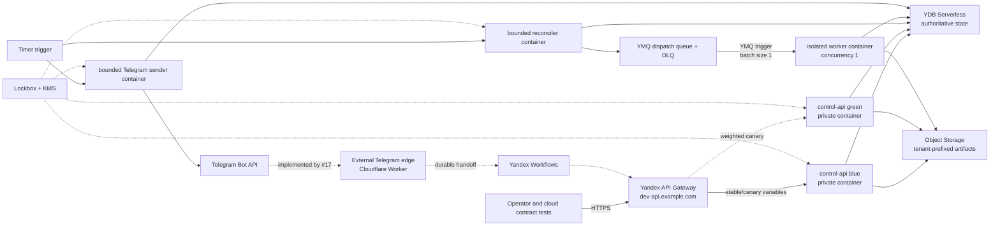

# Yandex Cloud development environment

The `cloud-dev` Terraform root creates an isolated, scale-to-zero development
environment. It is intentionally separate from the permanent Terraform-state
bootstrap root. GitCode is the source repository; immutable commit SHA images
are built by an operator and stored in Yandex Container Registry.

## Runtime topology



Issue #12 provisions and verifies the Yandex foundation through private IAM
invocation and direct operator smoke tests. Telegram cannot reliably reach the
tested Yandex API Gateway or public Workflows endpoints: Telegram timed out
before a request appeared in Yandex logs while independent IPv4 clients
reached the same endpoints successfully. Do not register either native Yandex
endpoint as the Telegram webhook. The external edge and durable handoff are
implemented by issue #17; live text/image proof plus canary rollback belong to
issue #18.

The control slots are private and invocable only by the gateway service
account. Timer and YMQ triggers use a separate invoker identity. Runtime
service accounts are split by responsibility. The worker accepts a normalized
YMQ trigger event over HTTP; it does not long-poll YMQ inside a serverless
container. A successful HTTP response acknowledges the trigger delivery, while
a non-2xx response leaves retry and DLQ behavior to the trigger.

The delivery queue is provisioned for the future push-driven sender. The MVP
sender remains a bounded timer-driven scan of the ready index, which preserves
the transactional YDB delivery claim contract already exercised locally.

## Resources and ownership

| Concern | Owner | Lifecycle |
| --- | --- | --- |
| Terraform state bucket and deployment-lock YDB | `bootstrap/` root | Permanent; never part of environment destroy |
| Dev folder, YDB, queues, bucket, registry, KMS, Lockbox, log group | `cloud-dev` foundation module | Terraform |
| Serverless containers and triggers | runtime module | Terraform |
| Delegated public DNS zone | foundation module | Terraform; parent-zone NS delegation is external |
| Managed certificate, DNS records, API Gateway and canary variables | edge module | Terraform |
| Telegram-facing Cloudflare edge and Yandex Workflows handoff | Issue #17 | Wrangler plus Yandex infrastructure; not part of #12 |
| Lockbox payload values | Operator credential store and `cloud-secret-load.sh` | Outside Terraform state |
| YMQ static access keys | Dedicated least-privilege service accounts; generated directly into KMS-backed Lockbox | Terraform metadata only; payload never enters state |
| Runtime Object Storage authentication | Revision service accounts through metadata-issued IAM bearer tokens | Renewable; no S3 static key or Lockbox payload |
| Billing budget | Billing API or console | External prerequisite; provider has no budget resource |
| Monitoring alerts | Monitoring API or console | External prerequisite; provider has no alert resource |

The environment defaults to deletion protection for YDB, KMS, Lockbox, and
the managed certificate. Object Storage does not use `force_destroy`.

## Files kept outside the repository

Copy these examples to a restricted operator directory and set mode `0600`:

- `infra/terraform/cloud-dev/backend.hcl.example`;
- `infra/terraform/cloud-dev/cloud-dev.tfvars.example`.

Neither file contains credentials, but both expose deployment identifiers.
Inject the provider IAM token through the process environment. Issue an
ephemeral Object Storage access key into a restricted external AWS credentials
file for the S3 backend; do not create a long-lived static access key for an
operator workstation. Yandex Cloud ephemeral access keys are supported by
Object Storage only and cannot authorize YMQ. The separate YMQ bootstrap below
therefore creates two static keys: an `ymq.admin` provisioning identity and an
`ymq.writer` scheduler identity. Both payloads are generated directly into
KMS-backed Lockbox secrets. They do not enter Terraform state, tfvars, plans,
argv, or repository files.

This split follows the official constraints: [ephemeral access keys authenticate
only Object Storage](https://yandex.cloud/en/docs/iam/concepts/authorization/ephemeral-keys),
[YMQ tools require a static access key](https://yandex.cloud/en/docs/message-queue/instruments/),
and the Terraform provider can [write generated static-key material directly to
Lockbox](https://yandex.cloud/en/docs/terraform/resources/iam_service_account_static_access_key).

Never put IAM tokens, access keys, Telegram secrets, or subscription
credentials into Terraform variables, plans, shell history, or repository
files. The wrapper reads the provisioning key from Lockbox into the Terraform
provider process environment only. The scheduler key is mounted from its own
Lockbox secret into the reconciler revision; it is not shared with the
Telegram secret or any other runtime identity.

For example, before bootstrap or environment operations:

```sh
export AWS_SHARED_CREDENTIALS_FILE=/secure/path/sessionless.aws-credentials
export AWS_PROFILE=sessionless-terraform
yc iam access-key issue-ephemeral \
  --session-name sessionless-terraform \
  --duration 12h \
  --aws-profile "$AWS_PROFILE" \
  --aws-credentials-file "$AWS_SHARED_CREDENTIALS_FILE"
chmod 0600 "$AWS_SHARED_CREDENTIALS_FILE"
export YC_TOKEN="$(yc iam create-token)"
```

The ephemeral key expires after at most 12 hours. Refresh it before a later
plan/apply and unset `YC_TOKEN` when deployment work ends. The Terraform
wrapper reuses this short-lived token for the YDB deployment-lock client when
`YDB_ACCESS_TOKEN_CREDENTIALS` is not set explicitly; it never persists the token.

Application revisions do not receive that deployer token. Terraform sets
`YDB_METADATA_CREDENTIALS=1` for every YDB-using Serverless Container, and the
YDB Go SDK credential chain obtains renewable IAM tokens from the revision's
service account through the container metadata service. Omitting this explicit
selector makes `ydb-go-sdk-auth-environ` fall back to anonymous credentials and
causes cloud YDB discovery to fail with `Unauthenticated`.

The artifact bucket rejects static-key authentication. Terraform also sets
`S3_IAM_METADATA_CREDENTIALS=true` for the API, worker, and sender. The blob
adapter obtains renewable IAM tokens from the same metadata service and calls
the Object Storage S3 HTTP API with bearer authentication. Local MinIO remains
on the AWS SDK path with explicit development credentials.

The permanent bootstrap root begins with local state. After its first apply,
copy `infra/terraform/bootstrap/backend.s3.tf.example` to the ignored
`backend.s3.tf` file and run `terraform init -migrate-state` with the external
bootstrap backend HCL. This two-phase transition is required because the state
bucket cannot be used before the bootstrap root creates it.

The procedures below assume:

```sh
export CLOUD_DEV_BACKEND_CONFIG=/secure/path/cloud-dev.backend.hcl
export CLOUD_DEV_TFVARS=/secure/path/cloud-dev.tfvars
export TERRAFORM_LOCK_YDB_CONNECTION_STRING='grpcs://...bootstrap lock database...'
export DEPLOYMENT_ENVIRONMENT=cloud-dev
```

## First deployment

### 1. Bootstrap only the folder

The budget must reference the folder, while all billable resources must remain
behind the budget gate. The only intentional targeted apply in this runbook is
therefore the first folder creation:

```sh
CONFIRM_FOLDER_BOOTSTRAP=sessionless-cloud-dev:folder \
  ./scripts/cloud-terraform.sh folder-bootstrap
export CLOUD_DEV_FOLDER_ID="$(./scripts/cloud-terraform.sh output -raw folder_id)"
```

Do not reuse `-target` for ordinary deployments.

### 2. Create and verify the budget

Create an active billing budget whose filter contains exactly
`CLOUD_DEV_FOLDER_ID`, and configure threshold notifications for the project
owners. Put its non-secret IDs into the external tfvars file, then export them:

```sh
export BILLING_ACCOUNT_ID=replace-billing-account-id
export BUDGET_ID=replace-folder-scoped-budget-id
./scripts/cloud-preflight.sh
```

The preflight calls the Billing API and fails unless the budget is active,
belongs to the configured billing account, and contains the dev folder ID. It
also initializes and validates the Terraform root. This is an admission gate,
not a cost cutoff: Yandex Cloud budgets notify but do not automatically stop
resources.

### 3. Bootstrap least-privilege YMQ credentials

YMQ requires a static access key even when the rest of the deployment uses IAM
tokens, service-account metadata, and ephemeral Object Storage keys. Run the
second and final intentional targeted bootstrap after the budget gate passes:

```sh
CONFIRM_QUEUE_AUTH_BOOTSTRAP=sessionless-cloud-dev:queue-auth \
  ./scripts/cloud-terraform.sh queue-auth-bootstrap
```

This creates only the dedicated queue provisioner and scheduler identities,
their minimum folder roles, two custom-KMS Lockbox secrets, and the two static
keys written directly to those secrets. Ordinary `plan`, `apply`, and destroy
commands then resolve the provisioner key from Lockbox automatically. Do not
export or copy either payload manually. Rotate a key by replacing its Terraform
resource under a reviewed plan, then deploy the generated Lockbox version.

### 4. Apply the foundation

Create a saved plan in a restricted, untracked directory, review it, and apply
that exact plan under the fenced YDB deployment lock:

```sh
./scripts/cloud-terraform.sh plan \
  -target=module.foundation \
  -out=/secure/path/cloud-dev-foundation.tfplan
terraform -chdir=infra/terraform/cloud-dev show /secure/path/cloud-dev-foundation.tfplan
./scripts/cloud-terraform.sh apply /secure/path/cloud-dev-foundation.tfplan
```

This creates the registry and the empty Lockbox secret before any runtime
revision refers to them.

### 5. Delegate the environment DNS zone

The foundation apply also creates the public zone named by `base_domain`.
Delegate that subdomain from the parent DNS provider with these two records:

```text
base_domain. NS ns1.yandexcloud.net.
base_domain. NS ns2.yandexcloud.net.
```

Wait until both authoritative name servers answer for the delegated zone
before applying the edge resources. Cloudflare proxy/CDN certificates are not
used for this delegated zone; Certificate Manager terminates TLS at API
Gateway.

### 6. Load secret payload and build images

Load values from the operator credential store into environment variables,
then stream them to Lockbox. The script never puts payload values in argv or
Terraform state:

```sh
export TELEGRAM_SECRET_ID="$(./scripts/cloud-terraform.sh output -raw telegram_secret_id)"
export TELEGRAM_BOT_TOKEN='loaded by credential-store command'
export TELEGRAM_WEBHOOK_SECRET='loaded by credential-store command'
export TELEGRAM_IDENTITY_HMAC_KEY='loaded by credential-store command'
./scripts/cloud-secret-load.sh
unset TELEGRAM_BOT_TOKEN TELEGRAM_WEBHOOK_SECRET TELEGRAM_IDENTITY_HMAC_KEY
```

Copy the returned version ID into the external tfvars file. Configure Docker
authentication and push all four images under the current commit SHA:

```sh
yc container registry configure-docker
CLOUD_IMAGE_TAG="$(git rev-parse HEAD)" ./scripts/cloud-images.sh
```

The publication script always builds and verifies `linux/amd64` images. Yandex
Serverless Containers runs AMD64 only; publishing a native Apple Silicon image
creates a valid registry object but revision deployment cannot use it.

Set the three image-tag variables in the tfvars file to that immutable SHA.

### 7. Apply schema and complete environment

Use a short-lived operator IAM token only in the child process environment:

```sh
export YDB_CONNECTION_STRING="$(./scripts/cloud-terraform.sh output -raw ydb_connection_string)"
export YDB_ACCESS_TOKEN_CREDENTIALS="$(yc iam create-token)"
go run ./cmd/schema-migrate
go run ./cmd/schema-migrate status
unset YDB_ACCESS_TOKEN_CREDENTIALS

./scripts/cloud-terraform.sh plan -out=/secure/path/cloud-dev.tfplan
terraform -chdir=infra/terraform/cloud-dev show /secure/path/cloud-dev.tfplan
./scripts/cloud-terraform.sh apply /secure/path/cloud-dev.tfplan
```

Certificate issuance can remain pending while the managed DNS challenge
propagates. Wait for the certificate to become issued, rerun the full plan, and
apply only if the second plan contains the expected edge completion.

If an interrupted first apply leaves an `ACTIVE` Serverless Container with no
revision, do not deploy a revision manually with `yc`: Terraform would not own
that recovery operation. First verify the container has `revision_id = null`
and that its Lockbox and custom-KMS IAM grants are present. Then create and
review a saved full plan with an explicit `-replace` for each affected
stateless container resource. This one-time recovery is allowed only before
traffic is routed and must contain no replacement of YDB, buckets, Lockbox,
queues, or other state-bearing resources.

### 8. Verify the Yandex foundation

```sh
export CLOUD_API_URL="$(./scripts/cloud-terraform.sh output -raw api_url)"
export CONTROL_CONTAINER_URL="$(./scripts/cloud-terraform.sh output -json control_slot_urls | jq -r .blue)"
./scripts/cloud-smoke.sh
```

Record the Git commit, image digests, migration head, reviewed plan, Terraform
outputs, and smoke-test result as deployment evidence. Do not attach plans or
secret-bearing command output to a public issue.

Do **not** pass the Terraform `api_url` to `cloud-webhook.sh`. After issue #17
has deployed and verified the external edge, register that independently
managed HTTPS URL explicitly:

```sh
export TELEGRAM_EDGE_URL='https://external-edge.example.com'
export TELEGRAM_BOT_TOKEN='loaded by credential-store command'
export TELEGRAM_WEBHOOK_SECRET='loaded by credential-store command'
export CONFIRM_EXTERNAL_TELEGRAM_EDGE='sessionless-external-edge'
./scripts/cloud-webhook.sh
unset TELEGRAM_EDGE_URL TELEGRAM_BOT_TOKEN TELEGRAM_WEBHOOK_SECRET
unset CONFIRM_EXTERNAL_TELEGRAM_EDGE
```

## Follow-up canary and rollback procedure (#18)

The infrastructure supports the following promotion procedure, but the live
traffic evidence and rollback acceptance gate belong to issue #18 rather than
the #12 bootstrap:

1. Run `make ci` and `make terraform-ci` locally and wait for mirrored GitHub
   Actions to pass for the same commit SHA.
2. Push immutable images with `cloud-images.sh`.
3. Set the inactive control slot to the new SHA and apply a reviewed plan with
   `canary_weight = 0`.
4. Smoke-test the inactive slot through its private IAM URL.
5. Increase `canary_weight` gradually (for example 5, 25, then 100), using a
   separate reviewed plan and smoke/metric gate for every step.
6. Promote by changing `stable_slot` to the candidate and returning
   `canary_weight` to zero.

Rollback does not rebuild an image. Set `stable_slot` back to the previous
known-good slot, set `canary_weight = 0`, review the plan, apply it under the
deployment lock, and repeat smoke tests. Database changes remain
expand/migrate/contract and forward-compatible; never use an automatic down
migration as an application rollback.

## Follow-up monitoring and operational checks (#19)

Issue #19 configures and tests external Monitoring alerts before release. Its
inventory includes:

- control API 5xx rate and latency;
- trigger errors, retry growth, and DLQ message count;
- container execution errors, timeout, and concurrency saturation;
- YDB throttling, RU consumption, storage, and transaction errors;
- Object Storage capacity;
- Telegram delivery terminal failures.

Link alert IDs and the budget ID in the private deployment record. The
Terraform provider currently exposes monitoring dashboards but not alert
resources, so a successful Terraform apply alone is not proof that alerts
exist. Validate them with the Monitoring API/console and execute one test alert
before accepting the environment.

## Safe destroy

Destroy is deliberately two-step. First change `deletion_protection = false`
in the external tfvars, create and apply a normal reviewed plan, and verify that
only protection flags change. Empty or archive the artifact bucket according
to the retention decision; Terraform will not force-delete objects.

Then create a saved destroy plan and apply that exact file:

```sh
export CONFIRM_CLOUD_DESTROY="sessionless-cloud-dev:${CLOUD_DEV_FOLDER_ID}"
./scripts/cloud-terraform.sh destroy-plan -out=/secure/path/cloud-dev-destroy.tfplan
terraform -chdir=infra/terraform/cloud-dev show /secure/path/cloud-dev-destroy.tfplan
./scripts/cloud-terraform.sh destroy-apply /secure/path/cloud-dev-destroy.tfplan
unset CONFIRM_CLOUD_DESTROY
```

The state bucket and deployment-lock database belong to `bootstrap/` and are
not destroyed by this procedure.

## Local verification boundary

`make terraform-ci` formats and validates both roots without cloud credentials.
`make test` covers normalized trigger events and HTTP success/failure
semantics. `make images` builds every runtime image. These checks prove the
configuration contract, not Yandex Cloud behavior. Issue #12 additionally
proves the reviewed apply, budget scope, schema migration, workload metadata
authentication, private IAM invocation, direct API Gateway health and
provisioned YDB/YMQ/Object Storage/Lockbox/runtime resources. External Telegram
reachability is #17, live queue/worker/delivery and canary rollback are #18,
and alert delivery is #19.
