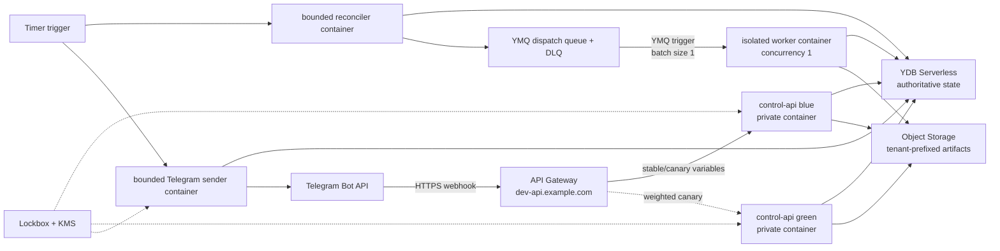

# Yandex Cloud development environment

The `cloud-dev` Terraform root creates an isolated, scale-to-zero development
environment. It is intentionally separate from the permanent Terraform-state
bootstrap root. GitCode is the source repository; immutable commit SHA images
are built by an operator and stored in Yandex Container Registry.

## Runtime topology



The control slots are private and invocable only by the gateway service
account. Timer and YMQ triggers use a separate invoker identity. Runtime
service accounts are split by responsibility. The worker accepts a normalized
YMQ trigger event over HTTP; it does not long-poll YMQ inside a serverless
container. A successful HTTP response acknowledges the trigger delivery, while
a non-2xx response leaves retry and DLQ behavior to the trigger.

The delivery queue is provisioned for the future push-driven sender. The MVP
sender remains a bounded timer-driven scan of the ready index, which preserves
the transactional YDB delivery claim contract already exercised locally.

## Resources and ownership

| Concern | Owner | Lifecycle |
| --- | --- | --- |
| Terraform state bucket and deployment-lock YDB | `bootstrap/` root | Permanent; never part of environment destroy |
| Dev folder, YDB, queues, bucket, registry, KMS, Lockbox, log group | `cloud-dev` foundation module | Terraform |
| Serverless containers and triggers | runtime module | Terraform |
| Managed certificate, DNS records, API Gateway and canary variables | edge module | Terraform |
| Lockbox payload values | Operator credential store and `cloud-secret-load.sh` | Outside Terraform state |
| Billing budget | Billing API or console | External prerequisite; provider has no budget resource |
| Monitoring alerts | Monitoring API or console | External prerequisite; provider has no alert resource |

The environment defaults to deletion protection for YDB, KMS, Lockbox, and
the managed certificate. Object Storage does not use `force_destroy`.

## Files kept outside the repository

Copy these examples to a restricted operator directory and set mode `0600`:

- `infra/terraform/cloud-dev/backend.hcl.example`;
- `infra/terraform/cloud-dev/cloud-dev.tfvars.example`.

Neither file contains credentials, but both expose deployment identifiers.
Inject provider and S3-backend credentials from the OS credential store. Never
put IAM tokens, service-account keys, Telegram secrets, or subscription
credentials into Terraform variables, plans, shell history, or repository
files.

The procedures below assume:

```sh
export CLOUD_DEV_BACKEND_CONFIG=/secure/path/cloud-dev.backend.hcl
export CLOUD_DEV_TFVARS=/secure/path/cloud-dev.tfvars
export TERRAFORM_LOCK_YDB_CONNECTION_STRING='grpcs://...bootstrap lock database...'
export DEPLOYMENT_ENVIRONMENT=cloud-dev
```

## First deployment

### 1. Bootstrap only the folder

The budget must reference the folder, while all billable resources must remain
behind the budget gate. The only intentional targeted apply in this runbook is
therefore the first folder creation:

```sh
CONFIRM_FOLDER_BOOTSTRAP=sessionless-cloud-dev:folder \
  ./scripts/cloud-terraform.sh folder-bootstrap
export CLOUD_DEV_FOLDER_ID="$(./scripts/cloud-terraform.sh output -raw folder_id)"
```

Do not reuse `-target` for ordinary deployments.

### 2. Create and verify the budget

Create an active billing budget whose filter contains exactly
`CLOUD_DEV_FOLDER_ID`, and configure threshold notifications for the project
owners. Put its non-secret IDs into the external tfvars file, then export them:

```sh
export BILLING_ACCOUNT_ID=replace-billing-account-id
export BUDGET_ID=replace-folder-scoped-budget-id
./scripts/cloud-preflight.sh
```

The preflight calls the Billing API and fails unless the budget is active,
belongs to the configured billing account, and contains the dev folder ID. It
also initializes and validates the Terraform root. This is an admission gate,
not a cost cutoff: Yandex Cloud budgets notify but do not automatically stop
resources.

### 3. Apply the foundation

Create a saved plan in a restricted, untracked directory, review it, and apply
that exact plan under the fenced YDB deployment lock:

```sh
./scripts/cloud-terraform.sh plan \
  -target=module.foundation \
  -out=/secure/path/cloud-dev-foundation.tfplan
terraform -chdir=infra/terraform/cloud-dev show /secure/path/cloud-dev-foundation.tfplan
./scripts/cloud-terraform.sh apply /secure/path/cloud-dev-foundation.tfplan
```

This creates the registry and the empty Lockbox secret before any runtime
revision refers to them.

### 4. Load secret payload and build images

Load values from the operator credential store into environment variables,
then stream them to Lockbox. The script never puts payload values in argv or
Terraform state:

```sh
export TELEGRAM_SECRET_ID="$(./scripts/cloud-terraform.sh output -raw telegram_secret_id)"
export TELEGRAM_BOT_TOKEN='loaded by credential-store command'
export TELEGRAM_WEBHOOK_SECRET='loaded by credential-store command'
export TELEGRAM_IDENTITY_HMAC_KEY='loaded by credential-store command'
./scripts/cloud-secret-load.sh
unset TELEGRAM_BOT_TOKEN TELEGRAM_WEBHOOK_SECRET TELEGRAM_IDENTITY_HMAC_KEY
```

Copy the returned version ID into the external tfvars file. Configure Docker
authentication and push all four images under the current commit SHA:

```sh
yc container registry configure-docker
CLOUD_IMAGE_TAG="$(git rev-parse HEAD)" ./scripts/cloud-images.sh
```

Set the three image-tag variables in the tfvars file to that immutable SHA.

### 5. Apply schema and complete environment

Use a short-lived operator IAM token only in the child process environment:

```sh
export YDB_CONNECTION_STRING="$(./scripts/cloud-terraform.sh output -raw ydb_connection_string)"
export YDB_ACCESS_TOKEN_CREDENTIALS="$(yc iam create-token)"
go run ./cmd/schema-migrate
go run ./cmd/schema-migrate status
unset YDB_ACCESS_TOKEN_CREDENTIALS

./scripts/cloud-terraform.sh plan -out=/secure/path/cloud-dev.tfplan
terraform -chdir=infra/terraform/cloud-dev show /secure/path/cloud-dev.tfplan
./scripts/cloud-terraform.sh apply /secure/path/cloud-dev.tfplan
```

Certificate issuance can remain pending while the managed DNS challenge
propagates. Wait for the certificate to become issued, rerun the full plan, and
apply only if the second plan contains the expected edge completion.

### 6. Verify and connect Telegram

```sh
export CLOUD_API_URL="$(./scripts/cloud-terraform.sh output -raw api_url)"
export CONTROL_CONTAINER_URL="$(./scripts/cloud-terraform.sh output -json control_slot_urls | jq -r .blue)"
./scripts/cloud-smoke.sh

export TELEGRAM_BOT_TOKEN='loaded by credential-store command'
export TELEGRAM_WEBHOOK_SECRET='loaded by credential-store command'
./scripts/cloud-webhook.sh
unset TELEGRAM_BOT_TOKEN TELEGRAM_WEBHOOK_SECRET
```

Record the Git commit, image digests, migration head, reviewed plan, Terraform
outputs, and smoke-test result as deployment evidence. Do not attach plans or
secret-bearing command output to a public issue.

## Routine deployment, canary, and rollback

1. Run `make ci` and `make terraform-ci` locally and wait for mirrored GitHub
   Actions to pass for the same commit SHA.
2. Push immutable images with `cloud-images.sh`.
3. Set the inactive control slot to the new SHA and apply a reviewed plan with
   `canary_weight = 0`.
4. Smoke-test the inactive slot through its private IAM URL.
5. Increase `canary_weight` gradually (for example 5, 25, then 100), using a
   separate reviewed plan and smoke/metric gate for every step.
6. Promote by changing `stable_slot` to the candidate and returning
   `canary_weight` to zero.

Rollback does not rebuild an image. Set `stable_slot` back to the previous
known-good slot, set `canary_weight = 0`, review the plan, apply it under the
deployment lock, and repeat smoke tests. Database changes remain
expand/migrate/contract and forward-compatible; never use an automatic down
migration as an application rollback.

## Monitoring and operational checks

Before routing real Telegram traffic, configure external Monitoring alerts for:

- control API 5xx rate and latency;
- trigger errors, retry growth, and DLQ message count;
- container execution errors, timeout, and concurrency saturation;
- YDB throttling, RU consumption, storage, and transaction errors;
- Object Storage capacity;
- Telegram delivery terminal failures.

Link alert IDs and the budget ID in the private deployment record. The
Terraform provider currently exposes monitoring dashboards but not alert
resources, so a successful Terraform apply alone is not proof that alerts
exist. Validate them with the Monitoring API/console and execute one test alert
before accepting the environment.

## Safe destroy

Destroy is deliberately two-step. First change `deletion_protection = false`
in the external tfvars, create and apply a normal reviewed plan, and verify that
only protection flags change. Empty or archive the artifact bucket according
to the retention decision; Terraform will not force-delete objects.

Then create a saved destroy plan and apply that exact file:

```sh
export CONFIRM_CLOUD_DESTROY="sessionless-cloud-dev:${CLOUD_DEV_FOLDER_ID}"
./scripts/cloud-terraform.sh destroy-plan -out=/secure/path/cloud-dev-destroy.tfplan
terraform -chdir=infra/terraform/cloud-dev show /secure/path/cloud-dev-destroy.tfplan
./scripts/cloud-terraform.sh destroy-apply /secure/path/cloud-dev-destroy.tfplan
unset CONFIRM_CLOUD_DESTROY
```

The state bucket and deployment-lock database belong to `bootstrap/` and are
not destroyed by this procedure.

## Local verification boundary

`make terraform-ci` formats and validates both roots without cloud credentials.
`make test` covers normalized trigger events and HTTP success/failure
semantics. `make images` builds every runtime image. These checks prove the
configuration contract, not Yandex Cloud behavior. The first real cloud-dev
deployment must additionally prove IAM-only private invocation, YMQ retry/DLQ,
timer triggers, certificate/DNS propagation, schema migration, canary routing,
budget scope, alert delivery, and a rollback to the previous slot.
