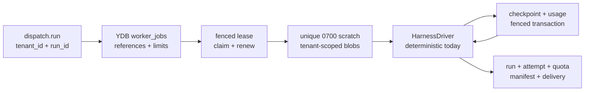

# Domain and runtime contracts

This document describes the Go contracts implemented for MVP-02. They define
the control-plane boundary; they do not select a cloud SDK, frontend SDK, or AI
harness.

## Package boundaries

- `internal/domain` owns tenant-scoped identities, entities, validation,
  transition tables, and structured error classes.
- `internal/queuecontract` owns the versioned messages exchanged over
  at-least-once transports.
- `internal/ports` owns infrastructure and worker adapter interfaces.
- `internal/testkit` provides deterministic fakes for contract and adapter
  tests.

Domain and queue packages import no Telegram, Yandex Cloud, or harness-specific
SDK.

## Frontends and context epochs

`ConversationRef` and `ActorRef` use a generic frontend plus an external
identifier. `TelegramChatRef` and `TelegramUserRef` are first-frontend adapters
that produce those generic references.

Telegram history remains authoritative for the initial product slice. The
control plane persists operational state and derived context artifacts, but
does not invent a competing primary session history.

The initial context epoch is `1`. A clean-context action creates a validated
`CleanContextEvent` that:

- was explicitly triggered by a frontend message;
- belongs to the same tenant, frontend, conversation, and actor;
- advances the epoch by exactly one;
- carries an idempotency key;
- does not delete frontend history.

## Tenant isolation

Every run, attempt, lease, checkpoint, quota record, usage observation,
artifact, and outbox record carries a `TenantID`. Composition validators reject
records when their tenant or owning IDs disagree.

Blob keys must be normalized relative keys under:

```text
tenants/<tenant-id>/
```

This is a domain invariant in addition to adapter-side IAM and bucket policy.

## Run state machine

| From | Allowed next states |
| --- | --- |
| `created` | `admitted`, `quota_blocked`, `cancelled`, `failed` |
| `admitted` | `queued`, `quota_blocked`, `cancelled`, `failed` |
| `queued` | `running`, `quota_blocked`, `cancelled`, `failed` |
| `running` | `succeeded`, `quota_blocked`, `cancelled`, `failed` |
| `quota_blocked` | `admitted`, `cancelled`, `failed` |
| `succeeded` | none |
| `failed` | none |
| `cancelled` | none |

Terminal runs require `finished_at`. Cancellation requests are durable and
idempotent: repeated requests retain the first request time. In-process
deadlines and shutdown still use `context.Context`.

Each attempt belongs to exactly one run. Leases carry monotonically assigned
fence tokens and a bounded validity interval. Checkpoints are sequenced,
tenant-scoped blob references attached to one attempt.

## Quota and usage

One run belongs to exactly one subscription connection.

Quota reservations represent scheduler capacity, not fabricated provider token
allowances. A held reservation can be committed, released, or expired exactly
once.

Provider quota has four explicit states:

- `unknown`: the provider exposes no trustworthy current value;
- `available`;
- `limited`;
- `exhausted`.

An `unknown` observation cannot contain an invented remaining value or reset
time. Usage observations record provider- or harness-reported token counts
separately from provider quota state.

The scheduler derives a separate operational state for each user-owned
subscription connection:

- `ready`: eligible for admission;
- `pressured`: an internal queue, active-run, workload-shape, or one-slot limit
  prevents admission;
- `draining`: operator-directed admission stop;
- `blocked_until_reset`: a provider throttle/exhaustion is known, with
  `blocked_until` present only when the provider exposes a trustworthy reset;
- `reauth_required`: no usable user-owned entitlement is available.

The MVP contention row stores at most one active run/reservation pair per
subscription. Provider quota can remain `unknown` while deterministic product
limits and the one-slot rule are still enforced. There is no fallback to
API-call billing.

## Delivery and outboxes

State changes and their outbox records are written through one `StateStore`
transaction. Queue publication happens after commit and consumers acknowledge
only after an idempotent state transition commits.

Telegram delivery follows:

| From | Allowed next states |
| --- | --- |
| `pending` | `sending`, `cancelled` |
| `sending` | `sent`, `retry_wait`, `failed`, `cancelled` |
| `retry_wait` | `sending`, `failed`, `cancelled` |
| `sent` | none |
| `failed` | none |
| `cancelled` | none |

Entering `retry_wait` requires a future `next_attempt_at`. Each transition to
`sending` increments the attempt count.

## Queue envelope

Schema `sessionless.queue.v1` contains only:

- message ID;
- message kind;
- tenant ID;
- an opaque, kind-specific subject ID (`run_id` for `dispatch.run`,
  `telegram_delivery_id` for `deliver.telegram`);
- enqueue time.

Prompts, frontend messages, attachments, generated content, credential
material, and provider tokens are prohibited. The JSON decoder rejects unknown
fields and trailing values. Versioned fixtures are stored under
`test/fixtures/queue/`.

## Ports

The control plane depends on interfaces for:

- clock and ID generation;
- transactional state storage;
- at-least-once queue publication, acknowledgement, retry, and dead-lettering;
- tenant-partitioned blob storage;
- Telegram delivery as the first frontend client;
- issuing short-lived opaque worker credential handles;
- harness-neutral execute/cancel behavior and event streaming;
- subscription entitlement and provider quota observation;
- durable cancellation observation.

`HarnessDriver` receives only authorized, tenant-scoped references:
context/artifact blobs, an opaque credential handle, and an explicit MCP
allowlist. Concrete harness processes remain isolated worker adapters.

## Isolated worker lifecycle

Scheduler admission atomically creates a point-addressable `worker_jobs` row.
It contains immutable references and admitted product limits; the queue carries
only `tenant_id` plus `run_id`.



One invocation processes at most one queue message. Before materializing data,
it point-loads the worker job, verifies a held reservation, claims a fenced
lease, and transitions the run/attempt to running. Context, inputs, optional
workspace, skills, and the latest checkpoint are copied into a new
invocation-only directory with tenant, path, size, and SHA-256 checks.

Each harness boundary has a contiguous sequence, renews the lease when needed,
stores an immutable checkpoint blob, and commits checkpoint metadata plus
observed usage under the same fence. Limits bound runtime, turns, input/context
bytes, artifacts, and each materialized blob. Durable cancellation is checked
before execution and at every boundary.

Success uploads content-addressed output objects and atomically commits the
terminal run/attempt, quota reservation, artifact manifest, Telegram delivery,
scheduler counters, and lease-index cleanup. Failure, cancellation, and timeout
atomically release the reservation and create a same-chat failure delivery.
At-least-once duplicates observe terminal state and acknowledge without
executing or delivering twice. Retryable failures retain the latest checkpoint
for the next delivery.

## Error taxonomy

Adapters classify failures as:

- `retryable`;
- `terminal`;
- `quota_blocked`;
- `reauthentication_required`;
- `policy_denied`.

The stable class and code drive scheduling. Provider-specific causes remain
wrapped for logs and diagnostics but do not leak into core state transitions.

## Idempotency

Ingress-derived commands carry stable idempotency keys. `StateTx` can look up a
run by that key before creating state. Outbox rows and queue messages use
separate opaque IDs so an at-least-once redelivery replays the same intended
transition rather than creating new work.

Telegram control commands use a terminal run without an attempt or dispatch
row. Update deduplication, subscription/context mutation, run creation, and an
inline-text delivery outbox row commit in the same tenant-scoped serializable
transaction. A duplicate update returns the existing command run and cannot
advance the context epoch or enqueue another logical reply.
