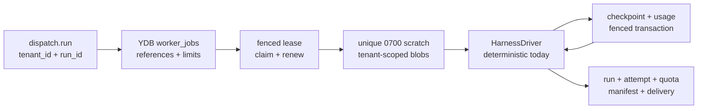

# Domain and runtime contracts

This document describes the Go contracts implemented for MVP-02. They define
the control-plane boundary; they do not select a cloud SDK, frontend SDK, or AI
harness.

## Package boundaries

- `internal/domain` owns tenant-scoped identities, entities, validation,
  transition tables, and structured error classes.
- `internal/queuecontract` owns the versioned messages exchanged over
  at-least-once transports.
- `internal/ports` owns infrastructure and worker adapter interfaces.
- `internal/testkit` provides deterministic fakes for contract and adapter
  tests.

Domain and queue packages import no Telegram, Yandex Cloud, or harness-specific
SDK.

## Canonical sessions and frontend bindings

`Session` is the product conversation and Sessionless is its source of truth.
It belongs to one tenant, records its creator and lifecycle, and owns a strictly
increasing event sequence. A session is either `active` or `archived`;
unarchiving preserves the same identity and history.

`SessionEvent` is append-only and tenant/session scoped. Its stable kinds are
`user_message`, `assistant_message`, `tool_call`, `tool_result`, and
`system_notice`. Each event has an opaque ID, a per-session sequence, a stable
idempotency key, an immutable tenant-scoped payload reference, and optional
author/run references. Exact retries are no-ops; reusing an idempotency key for
different immutable event identity is a conflict. A new append must claim
exactly `last_event_sequence + 1` in the same transaction that advances the
session row. User messages require an author user; assistant and tool events
require the run that produced them.

`FrontendBinding` maps `(tenant, frontend, external conversation)` to one
canonical session. Binding switches use an expected revision so stale tabs,
webhooks, or retries cannot redirect a conversation after a newer switch. A
new-context action creates a new session and atomically switches the binding;
it does not delete, truncate, or rewrite the former session.

The frontend-neutral `SessionStore` exposes create, create-and-switch, bind,
optimistic switch, append, archive, unarchive, list, and ordered-history
operations. `CreateAndSwitchSession` is the `/new` transaction boundary: a
failure cannot leave either an orphan product session or a half-switched
frontend conversation.

`CanonicalIngressStore` is the application persistence boundary shared by all
frontends. An authenticated adapter supplies an internal user, opaque frontend
and external conversation/event identifiers, and a stable delivery time. The
store requires active tenant membership and a writable session participant,
then commits the frontend deduplication fact, canonical user event, run,
initial attempt, input manifest, and dispatch outbox in one serializable YDB
transaction. No Telegram update, chat, or message type crosses this contract.

Frontend deduplication is keyed by tenant, binding, and the normalized delivery
key rather than the current session. Therefore a delayed duplicate received
after a clean-context binding switch still resolves to the original event and
run instead of being appended to the newer session.

`SessionParticipant` grants `owner`, `member`, or `viewer` access to an active
tenant membership. Tenant, session, and user must all match before access is
allowed; viewers cannot append. Authentication establishes a user identity,
while tenant membership is the authorization boundary.

`SessionSnapshot` is an immutable, versioned materialization through a specific
event sequence. It is only an optimization: canonical context is the snapshot
plus the contiguous ordered event range after it. There is no mutable
`context_epoch` product API.

Snapshot format v1 is deterministic newline-delimited JSON compressed with
single-threaded Zstandard. Each line carries the canonical event metadata and
the verified JSON payload. The manifest records format/compression versions,
event count, uncompressed byte count, covered sequence, and the immutable blob
reference. Rebuilding the same event prefix therefore produces the same bytes
and SHA-256 digest.

`ConversationRef`, `ActorRef`, and the old YDB context revision remain only in
the transitional Telegram persistence adapter. They must not cross into new
session, run, scheduling, or worker contracts; #36 removes them from the
Telegram ingress path.

## Tenant isolation

Every run, attempt, lease, checkpoint, quota record, usage observation,
artifact, and outbox record carries a `TenantID`. Composition validators reject
records when their tenant or owning IDs disagree.

Blob keys must be normalized relative keys under:

```text
tenants/<tenant-id>/
```

This is a domain invariant in addition to adapter-side IAM and bucket policy.

## Web identity and authorization

The WebUI contracts separate authentication from authorization. An OIDC
provider subject maps immutably to one internal user, while an active
server-side `TenantMembership` grants tenant access. Login cannot silently
create a tenant or membership. Enrollment requires an existing authorized
frontend grant, a one-time invitation, or an audited `cloud-dev` bootstrap.

Browser sessions are opaque first-party capabilities stored by SHA-256 digest.
They are idle/absolute-expiring, revocable, rotated after login and tenant
switch, and bound to a membership security version. Every mutation requires an
exact HTTPS Origin and a session-bound CSRF token. Browser tenant, session, run,
and upload IDs are selectors that are reauthorized server-side.

`internal/webcontract` defines the same-origin DTO boundary without embedding
tenant authority in normal mutation bodies. Upload intents are tenant, user,
session, size, digest, key, and expiry bound; commit trusts Object Storage
metadata rather than browser claims. Detailed flows, defaults, operator
bootstrap requirements, and the threat model are in
[web-auth-contracts.md](web-auth-contracts.md) and
[web-threat-model.md](web-threat-model.md).

## Run state machine

| From | Allowed next states |
| --- | --- |
| `created` | `admitted`, `quota_blocked`, `cancelled`, `failed` |
| `admitted` | `queued`, `quota_blocked`, `cancelled`, `failed` |
| `queued` | `running`, `quota_blocked`, `cancelled`, `failed` |
| `running` | `succeeded`, `quota_blocked`, `cancelled`, `failed` |
| `quota_blocked` | `admitted`, `cancelled`, `failed` |
| `succeeded` | none |
| `failed` | none |
| `cancelled` | none |

Terminal runs require `finished_at`. Cancellation requests are durable and
idempotent: repeated requests retain the first request time. In-process
deadlines and shutdown still use `context.Context`.

Each attempt belongs to exactly one run. Leases carry monotonically assigned
fence tokens and a bounded validity interval. Checkpoints are sequenced,
tenant-scoped blob references attached to one attempt.

Every run references the canonical `session_id` and the `trigger_event_id`
that caused it. Worker jobs and harness execution requests repeat those IDs for
correlation and authorization. Harness-native conversation identifiers are
attempt metadata only and never become product session identities.

## Canonical finalization and frontend projection

User ingestion first appends the canonical user event, then creates a run whose
`trigger_event_id` references it. Assistant and tool output is finalized by
appending canonical events under the same fenced terminal transaction as the
run result. A frontend projection references the finalized event and records
its own delivery/idempotency state; delivery success never determines whether
the canonical event exists. Retrying or adding a frontend therefore cannot
duplicate or rewrite canonical history.

Until #23 migrates worker finalization, the existing Telegram delivery outbox
is a compatibility projection. Until #36 adapts Telegram to
`CanonicalIngressStore`, the existing Telegram update transaction is a
compatibility ingress path. Neither changes the canonical contract above.

## Quota and usage

One run belongs to exactly one subscription connection.

Quota reservations represent scheduler capacity, not fabricated provider token
allowances. A held reservation can be committed, released, or expired exactly
once.

Provider quota has four explicit states:

- `unknown`: the provider exposes no trustworthy current value;
- `available`;
- `limited`;
- `exhausted`.

An `unknown` observation cannot contain an invented remaining value or reset
time. Usage observations record provider- or harness-reported token counts
separately from provider quota state.

The scheduler derives a separate operational state for each user-owned
subscription connection:

- `ready`: eligible for admission;
- `pressured`: an internal queue, active-run, workload-shape, or one-slot limit
  prevents admission;
- `draining`: operator-directed admission stop;
- `blocked_until_reset`: a provider throttle/exhaustion is known, with
  `blocked_until` present only when the provider exposes a trustworthy reset;
- `reauth_required`: no usable user-owned entitlement is available.

The MVP contention row stores at most one active run/reservation pair per
subscription. Provider quota can remain `unknown` while deterministic product
limits and the one-slot rule are still enforced. There is no fallback to
API-call billing.

## Delivery and outboxes

State changes and their outbox records are written through one `StateStore`
transaction. Queue publication happens after commit and consumers acknowledge
only after an idempotent state transition commits.

Telegram delivery follows:

| From | Allowed next states |
| --- | --- |
| `pending` | `sending`, `cancelled` |
| `sending` | `sent`, `retry_wait`, `failed`, `cancelled` |
| `retry_wait` | `sending`, `failed`, `cancelled` |
| `sent` | none |
| `failed` | none |
| `cancelled` | none |

Entering `retry_wait` requires a future `next_attempt_at`. Each transition to
`sending` increments the attempt count.

## Queue envelope

Schema `sessionless.queue.v1` contains only:

- message ID;
- message kind;
- tenant ID;
- an opaque, kind-specific subject ID (`run_id` for `dispatch.run`,
  `telegram_delivery_id` for `deliver.telegram`);
- enqueue time.

Prompts, frontend messages, attachments, generated content, credential
material, and provider tokens are prohibited. The JSON decoder rejects unknown
fields and trailing values. Versioned fixtures are stored under
`test/fixtures/queue/`.

## Ports

The control plane depends on interfaces for:

- clock and ID generation;
- transactional state storage;
- at-least-once queue publication, acknowledgement, retry, and dead-lettering;
- tenant-partitioned blob storage;
- Telegram delivery as the first frontend client;
- issuing short-lived opaque worker credential handles;
- harness-neutral execute/cancel behavior and event streaming;
- subscription entitlement and provider quota observation;
- durable cancellation observation.

`HarnessDriver` receives a fresh directory containing only authorized,
tenant-scoped material, an opaque credential handle, and an explicit MCP
allowlist. Concrete harness processes remain isolated worker adapters.

## Isolated worker lifecycle

Scheduler admission atomically creates a point-addressable `worker_jobs` row.
It contains immutable references and admitted product limits; the queue carries
only `tenant_id` plus `run_id`.



One invocation processes at most one queue message. Before materializing data,
it point-loads the worker job, verifies a held reservation, claims a fenced
lease, and transitions the run/attempt to running. A newly admitted canonical
job pins the trigger sequence and newest compatible snapshot version. The
worker loads that snapshot plus its bounded contiguous tail, verifies every
event and payload reference, and writes `context/history.jsonl`; referenced
message attachments are written below `context/attachments/<sequence>/`.
Missing, incompatible, or corrupt snapshots fall back to an older snapshot and
finally to bounded replay from event one. Legacy jobs keep their single-blob
bridge until Telegram migration issue #36. Inputs, optional workspace, skills,
and the latest checkpoint are copied into the same new invocation-only
directory with tenant, path, size, and SHA-256 checks.

Snapshot creation is owned by reconciler maintenance after successful canonical
dispatch publication and acknowledgement. The maintenance trigger is an event
interval, with bounded catalog versions, event count, and bytes. It is
best-effort and never changes dispatch correctness; a failed deterministic
build is retried by a later dispatch while workers retain canonical replay.

Each harness boundary has a contiguous sequence, renews the lease when needed,
stores an immutable checkpoint blob, and commits checkpoint metadata plus
observed usage under the same fence. Limits bound runtime, turns, context
events, historical tool events, input/context bytes, artifacts, and each
materialized blob; all context checks finish before harness launch. Durable
cancellation is checked before execution and at every boundary.

Success uploads content-addressed output objects and atomically commits the
terminal run/attempt, quota reservation, artifact manifest, Telegram delivery,
scheduler counters, and lease-index cleanup. Failure, cancellation, and timeout
atomically release the reservation and create a same-chat failure delivery.
At-least-once duplicates observe terminal state and acknowledge without
executing or delivering twice. Retryable failures retain the latest checkpoint
for the next delivery.

## Error taxonomy

Adapters classify failures as:

- `retryable`;
- `terminal`;
- `quota_blocked`;
- `reauthentication_required`;
- `policy_denied`.

The stable class and code drive scheduling. Provider-specific causes remain
wrapped for logs and diagnostics but do not leak into core state transitions.

## Idempotency

Ingress-derived commands carry stable idempotency keys. `StateTx` can look up a
run by that key before creating state. Outbox rows and queue messages use
separate opaque IDs so an at-least-once redelivery replays the same intended
transition rather than creating new work.

Telegram control commands currently use a terminal run without an attempt or
dispatch row. Update deduplication, subscription or binding-compatibility
mutation, run creation, and an inline-text delivery outbox row commit in the
same tenant-scoped serializable transaction. A duplicate update returns the
existing command run and cannot switch the effective session twice or enqueue
another logical reply.
