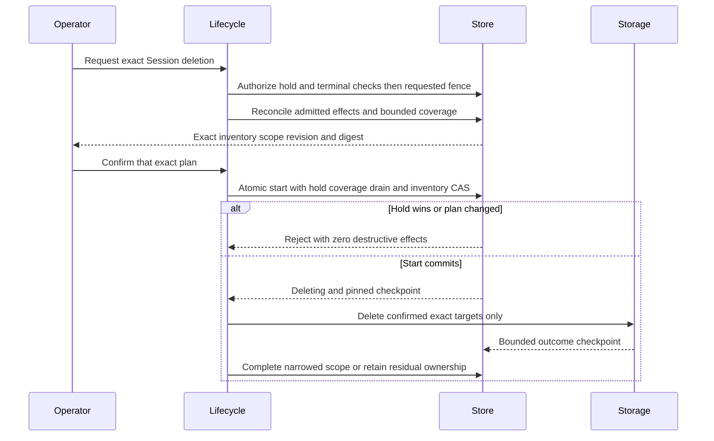

# Session retention replay and upload cleanup

Version: 0.1.0 draft, 2026-10-10. Decision owner: [#159](https://gitcode.com/urandon/sessionless/issues/159); implementation epic: [#57](https://gitcode.com/urandon/sessionless/issues/57). This is a proposed contract, not implemented behavior. Independent exact-document review, owner acceptance and exact-head documentation CI are required before implementation.

## Decision and scope

Separate live workflow data, bounded replay records, exact object cleanup ownership, and durable lifecycle fences. Deletion makes a Session unavailable before erasure; an expired record never authorizes recreation or another external effect. Keep the existing `requested -> deleting -> completed` authority and strict canonical write fence. Do not introduce a second deletion lifecycle.

Select a seven-day, server-issued replay namespace and at most 24 hours of live replay data. Retain a minimized negative replay record until that namespace closes. An expired or missing namespace is rejected before a missing operation row can be interpreted as fresh work. This requires an explicit API version change; it is not a TTL fix to the current caller-key protocol. The author selects the conservative limits below under #159's delegated policy authority. The API/UX change and final contract still require owner acceptance.

The first object scope is current exact staging and promoted objects. Historical/noncurrent versions are excluded. When late-write closure or historical ownership is unknown, retain restricted cleanup ownership and report residual cleanup, not complete physical erasure. Tenant/account erasure, legal-compliance promises and deletion of backups are outside this single-Session policy.

## Inputs and current behavior

Consume [#57 research v0.3](https://gitcode.com/urandon/sessionless/issues/57#note_192411610), [its archived handoff](https://gitcode.com/urandon/sessionless/issues/57#note_192412881), and [the limited R1–R3 resolution and N1 amendment](https://gitcode.com/urandon/sessionless/issues/57#note_192412725). That review does not accept the new namespace/defaults in this draft.

Current source baseline is `d3eb8fdc069938c05be23212e834a7cc3d82a03e`. The API/upload/domain files and four table migrations are unchanged from the research baseline `1e4f2ab9a079f6892cac9d4c13d2fa118281d657`. The lifecycle store adds pending attached-worker output-receipt checks at request/start/completion and includes ready receipts in its bounded inventory. Preserve these checks; a non-terminal or ambiguous receipt cannot be bypassed by the new upload cleanup scope.

| Current source | Consequence for this decision |
| --- | --- |
| [Session API store](../../internal/ydbstore/session_api.go) and [identity derivation](../../internal/sessionapi/service.go) | Create lookup uses tenant/user/caller key; a retained mapping to a missing Session errors. Identity-key rotation changes derived IDs. Archive replay also checks current requested state. |
| [Upload service](../../internal/webapi/service.go) and [intent domain](../../internal/domain/web_upload.go) | Upload identity omits Session ID; signing follows intent persistence using relative TTL. Promotion precedes final canonical ingress. Committed-intent claim does not enforce intent expiry. |
| [Four table migrations](../../migrations/ydb/00073_create_web_upload_intents.sql) and [migration inventory](../../migrations/ydb/README.md) | No TTL or Session reverse indexes for these four tables. Creation-to-Session ownership is indirect through upload ID. Expected hashes and size are not evidence of stored bytes. |
| [Lifecycle store](../../internal/ydbstore/session_lifecycle.go) and [operator contract](../session-lifecycle.md) | Existing inventory omits these tables/staging; extended confirmed inventory must be durably pinned before destructive work. Existing `completed` does not prove this proposal's broader erasure. |

The [YDB TTL contract](https://ydb.tech/docs/en/concepts/ttl) permits delayed physical removal; logical predicates must not depend on removal timing. [Yandex signed URLs](https://yandex.cloud/en/docs/storage/concepts/pre-signed-urls) encode validity relative to signing time. That supports checking an absolute upper bound, not a proof that a previously started PUT has stopped. Provider-specific closure remains an implementation evidence gate.

## Selected limits and tradeoffs

All deadlines use the authoritative database clock. These are proposed limits, not measured capacity, a storage SLA or permission for live experiments. Holds override every destructive minimization or retirement of covered facts, including removal of live replay fields; unresolved external ownership blocks its retirement. Neither exception extends workflow eligibility.

| Concern | Baseline |
| --- | --- |
| Replay namespace | Fixed seven days from issuance; no extension; at most two unexpired namespaces and 4,096 admitted operations per namespace/user |
| Live replay data | Until `min(first_admission + 24 hours, namespace.not_after)`; deleting a target ends live replay immediately |
| Negative replay data | Until namespace closure; eligible for retirement only after no outstanding admission can recreate a row |
| Pending upload commit | Ten minutes from intent creation, preserving the current default |
| Upload capability | At most five minutes and never beyond the original pending deadline; at most two pre-fence issuance admissions per intent |
| Committed unclaimed upload | Claim allowed for one hour from the first verified commit; no extension on retry; at most eight uploads per message |
| Promotion | One admitted destination per upload/message pair, at most eight per message; no ambiguous-send relaunch |
| Inventory | Shared 10,000 rows and 10,000 distinct exact keys across old and new classes; at most 100 MiB serialized plan; no truncation |
| Cleanup invocation | At most 128 ledger rows per page, 256 physical storage requests, 16 MiB response metadata and ten minutes; persist progress before yielding |
| Cleanup attempt budget | At most three physical delete attempts per confirmed target and 30,000 storage requests per confirmed plan, including reads/reconciliation; exhaustion retains residual ownership |
| Recovery schedule | At most three bounded automatic invocations in 24 hours; after that require an operator-reviewed continuation with fresh finite budget, never wider target authority |
| Cleanup escalation | Seven days unresolved without a hold raises an operator incident; never erases ownership or marks cleanup complete |
| Held data | No automatic erasure deadline while held; exact restricted records and ownership retained, workflow deadlines still enforced |

Seven days bounds retry metadata rather than storing raw caller keys forever. Twenty-four hours supports ordinary short retry/recovery without promising indefinite replay. A namespace near expiry offers less than 24 hours; the API exposes the absolute deadline, not a false guaranteed full horizon. One hour separates committed-upload claim eligibility from the ten-minute PUT/commit window. A client must explicitly start a new operation after expiry, not silently re-key an ambiguous old one. These are material retry UX changes to accept with the final document.

No automatic TTL is configured on active receipts, ownership, effect outcomes, pending admissions, holds or inventory checkpoints. A retirement transaction may copy a content-free terminal fence into a TTL-eligible state after the necessary closure proof. Physical deletion timing is not a correctness or erasure deadline.

## Table policy

| Existing table | Live purpose | After deletion or logical replay expiry | Retirement condition |
| --- | --- | --- | --- |
| `session_api_idempotency` | Exact create result and live conflict facts | Replace with a minimized negative record; erase raw caller key/live request facts | Closed namespace, no uncommitted admitted mutation; legacy API retirement and coverage must be proven separately |
| `session_api_mutations` | Exact archive mutation and live conflict facts | Same minimized negative treatment; no retained archived value or request fingerprint merely to preserve a conflict oracle | Same closed-namespace proof; preserve separate canonical Session tombstone |
| `web_upload_intents` | Bounded filename/type/hashes, staging observation, claim workflow | Logically disable workflow at its deadline/fence; erase full workflow JSON only after confirmed deletion start or separately authorized expiry cleanup, preserving minimal exact ownership | Selected object scope verified, issuer/write windows closed, no unresolved effect, hold clear and retirement CAS succeeds |
| `web_upload_intent_creations` | Caller-key lookup to upload | Minimize to negative replay facts; use recorded indirect relation to find the owning Session, never an invented Session column | Closed namespace and all admitted creation writes drained; upload ownership has its own later retirement condition |

Terminal replay fields are tenant/user-scoped opaque lookup identity, namespace/action, protected target/generation, unavailable disposition, policy version and fixed deadlines. Do not retain raw keys, filename, content hash, claim/message key, arbitrary request text or parameter fingerprints in terminal replay records. A held live record is logically unavailable after expiry but its existing covered facts remain restricted until hold release; the table's minimization/retirement action requires a hold-clear check serialized with hold changes. Keyed digests remain linkable metadata, not anonymity. Exact storage keys/versions belong only in restricted ownership until cleanup is proven. Existing Session tombstones, hold records and lifecycle audit have their own durable policy; this proposal does not TTL them.

## Replay namespace and API contract

Proposed `ReplayNamespaceV1` is an immutable, authenticated server-issued namespace, not a bearer authorization grant. It contains one random 128-bit namespace identity, signature and identity-key versions, issuance time and fixed `not_after`, bound to current tenant/user by the MAC. MAC input uses domain separation and length-framed scope fields. No algorithm negotiation or caller-selected key version. Encode the fixed version/key IDs/identity/times and SHA-256 MAC as a canonical base64url token with `rn1.` prefix, bounded to the existing 160-byte opaque-ID grammar. I1 must freeze byte layout and vectors before implementing the encoder.

Propose `POST /api/web/v2/replay-namespaces`, authenticated and subject to the existing origin/CSRF checks. Admission point-reads the owner namespace head and enforces the two-active/4,096-operation limits; server-generated identity and absolute expiry are persisted before returning the token. Reissue of the same namespace never changes its deadline. Namespace creation itself grants no Session, upload or storage write authority. Never log the token or retain it as arbitrary browser analytics; the client keeps the exact namespace with each pending request.

Propose authenticated `GET /api/web/v2/replay-namespaces` for lost-issuance-response recovery: point-read the current authorized owner's head and at most two exact persisted active namespace rows, return their same canonical tokens and immutable deadlines without inserting identities, changing counters or extending expiry. Verify generation/key-version integrity; absent, expired or revoked entries are unavailable, not recreated. A lost first issuance response is recovered this way rather than repeatedly creating until the cap is reached. Before sending a mutation, the client must retain its exact namespace and caller key; recovery of an ambiguous mutation never switches it to another returned namespace. Namespace recovery does not restore lost operation keys or authorize repeating unknown effects.

The v2 counterparts of Session create, archive/unarchive and upload create require `replay_namespace` alongside the existing caller key. Upload commit/claim remain exact upload operations and do not mint replacement identities. Message-ingress deduplication and frontend-neutral canonical event contracts are not replaced by this policy. I1 must enumerate and migrate every caller of the affected SessionAPI/WebUpload ports, not merely the browser.

Operation identity is `(tenant, user, namespace, action, keyed_caller_key_digest)`. Include the namespace and action in stable Session/upload ID derivation under its pinned identity-key version. This retains same-operation identity across key rotation. A different namespace is a distinct new operation, not permission to repeat an old effect. Persist the operation/target and Session-keyed reverse record in the same serializable transaction as admission. Raw caller keys are used only in bounded request memory. Missing namespace/key version/marker denies admission; a missing row alone never proves namespace validity.

Live replay data expires at the fixed minimum deadline above. Before it expires, an exact matching live authorized request can replay; a divergent one conflicts under the existing live semantics, including archive's current-state check. After live expiry, return unavailable immediately and minimize through a revision CAS only after a serialized hold-clear check; while held, retain existing facts under restricted access without replaying them. Do not remove the only same-namespace negative fact. Namespace retirement also checks each covered target's hold before removing its replay evidence; namespace expiry alone permits rejection, not destruction of held data. Once the namespace expires, validation rejects both retained and physically absent records before any insert. Known unavailable target, retired operation or invalid namespace has priority over parameter comparison.

| Current authorized state after syntax validation | Matching request | Divergent same operation identity |
| --- | --- | --- |
| Live replay window and writable target | Existing authorized result; upload URL only within an admitted fixed issuance deadline | `409 conflict`, no effect |
| Requested/deleting/completed target, terminal receipt or logically expired operation | `404 not_found`, no signing, promotion or insertion | Identical `404 not_found`, no parameter oracle |
| Expired/retired/missing authenticated namespace or unavailable key version | `404 not_found`, even if operation rows are absent | Identical response |
| Malformed selectors/token or caller key | `400 invalid_request` | Same syntax contract |
| Current authentication or participant/tenant authority denied | Existing safe authentication/denied/not-found mapping | No key or target disclosure |
| Namespace admission capacity exhausted | `429` with bounded retry guidance; no implicit namespace/key refresh | No new work |

Reauthorize before exposing an operation receipt. Session creation checks current tenant membership and any existing target's participant authority; target-bound archive/upload operations check both requested target authority and the stored operation target. A request pointing elsewhere cannot reveal an old target. No receipt, token or digest substitutes for current authority.

Normal key rotation stops minting under the old signature/identity versions and preserves exact old-version validation/derivation until all namespaces under them close and admission writers drain. Secrets never enter records or logs. Emergency revocation rejects affected namespaces immediately; it cannot permit a missing operation to become fresh. Do not regenerate protected IDs under a new secret. A closed namespace is never reopened or assigned to another user; identity collisions fail closed on insert.

The v1 unbounded caller-key mutations must be drained and disabled at a versioned cutover before legacy receipts become eligible for minimization/removal. Do not silently treat a v1 key as belonging to the current namespace. Historical mappings without a provable association remain a coverage blocker or retained restricted legacy fence, not an invented v2 receipt. Changing the protocol is chosen over indefinite per-key guards; blanket TTL without this gate is rejected.

## Issuance promotion and late outcomes

Proposed `UploadEffectV1` seals tenant, Session, owner, upload, effect ID, immutable generation, operation `issue_put | promote`, exact admitted source/destination key set, policy, revision, fixed deadline, signing/physical claim and bounded outcome. Persist it and ownership before signing or copy admission, serialized with the Session fence. Intent creation alone does not admit a signer. The signing admission also records its started signing lease; recovery cannot start another lease after the fence.

The signer must enforce and verify `X-Amz-Date + X-Amz-Expires <= not_after`, exact operation/key/headers and admitted generation. Do not compute a fresh five-minute window at retry time. A failed/lost signing response is potentially issued. A pre-fence admitted signing attempt may finish within its fixed bound across the fence; a client retry after the fence returns unavailable and never signs again. Crash recovery after the fence reconciles the admitted outcome, not another signing attempt. A signing deadline is not proof that in-flight storage writes have ceased.

N1: new promotion admission and every promotion relaunch are forbidden after the fence. `StartPromotion` must recheck writable Session and win a one-way physical claim before external send. A reservation not yet started cannot become a post-fence send. An already-started exact pre-admitted promotion may finish and must be reconciled. Final ingress still obeys the canonical fence; a successful copy rejected by final ingress remains owned cleanup material, not a canonical attachment.

`RecordUploadEffectOutcome` is a separate internal restricted operation. Authenticate the cleanup actor, point-read exact effect/tenant/Session/generation and CAS its revision. Allow only bounded monotonic evidence about its already admitted keys and issuer/physical claim. Never insert a missing effect, add a key, sign, relaunch promotion, claim workflow, append canonical content or restore deleted JSON. Foreign/stale/missing/retired effects return typed rejection or duplicate no-op, not UPSERT. Conflicting observations are incident evidence.

`RetireUploadOwnership` requires selected-scope cleanup verification, closed issuer/write paths, no unresolved effect and CAS against the same generation/revision. Erase sensitive ownership and seal a content-free terminal fence. Keep that fence while a finite admitted callback/replay obligation remains; unknown callback closure means retain it. Once it is eligible for retirement, the update-only outcome API still rejects absence. Never reuse effect IDs/generations, so a late callback cannot resurrect an expired fence.

Repeated signed PUTs, overwrite/version creation, delayed requests begun before expiry and ambiguous responses must be covered by provider-specific closure evidence. No one-shot PUT assumption, HEAD-only absence proof, arbitrary grace sleep or AWS/Yandex equivalence. With unknown closure, use `residual_cleanup_required` and keep exact ownership. Multipart issuance is not added by this scope.

## Hold and expiry cleanup

The existing per-Session legal hold covers pending, committed-unclaimed and claimed uploads and their replay/ownership/effect evidence, not only canonical attachments. Setting it serializes with minimization/retirement/start. Expiry disables commit/claim/signing and live replay without destroying evidence. A hold blocks removal of live replay facts, workflow-data retirement, ownership/receipt retirement and object deletion, but not non-destructive reconciliation. Releasing it re-enqueues bounded exact work after a fresh predicate check, not a blanket TTL sweep.

Independent orphan/expired-intent cleanup uses the same ownership and hold authority. It requires its own bounded exact plan, explicit operator confirmation and an irreversible cleanup claim before its first delete; it does not request deletion of an otherwise live Session. Its transaction checks the Session is held clear and the exact expired upload is no longer claimable, and persists the confirmed subset. If whole-Session deletion wins, this worker reconciles into that pinned authority without launching a competing wider plan. If expiry cleanup wins, a later hold cannot retroactively restore deleted objects; hold administration must report that exact irreversible effect. I2a/I3 must share this per-upload contention point, not introduce an uncoordinated background deleter. Automatic unattended expiry deletion is outside the first rollout.

## Exact inventory start and recovery

Extend the existing inventory with retry mappings, upload workflow identities, staging/promotion exact ownership, admitted effects, attached receipts, historical coverage, issuer/write closure or explicitly retained residuals. Persist `DeletionInventoryV1` with tenant/Session, policy/scope versions, coverage generation, ownership revision, sorted exact keys and row identities, unresolved dispositions, bounds and digest. Include proposed status claims in the digest. Expected bytes/hash cannot be recorded as observed stored bytes.

Before first destructive work: requested fence → non-destructive coverage/drain → exact operator confirmation → atomic `StartSessionDeletion` CAS and fresh hold/non-terminal/attached-receipt checks → pinned `deleting` checkpoint. A changed target/revision/coverage invalidates confirmation. If hold wins, destructive effects are zero; if start wins, the current irreversible-phase hold rejection is preserved.

Recovery point-reads the accepted inventory and resumes recorded exact targets and per-target request budgets. Known absence updates progress, not authority. It never rebuilds a larger live plan under the old token. Newly observed exact versions or historical orphans require a separately confirmed bounded supplemental plan. No tenant/bucket/prefix wildcard delete; no object scan on serving paths. Budget/clock/response overflow stops safely without truncating the inventory or claiming completion.

`SessionDeletionResultV1` adds `canonical_status`, `retry_metadata_status`, `upload_cleanup_status`, `historical_version_scope`, policy/inventory revision and residual count/reason. Permitted claims are canonical `pending | erased`; retry metadata `pending | minimized_with_fences | erased_after_namespace_closure`; uploads `pending | current_scope_verified | residual_cleanup_required`; historical scope `excluded`. The result remains restricted operator evidence; ordinary APIs return safe unavailability, not object keys or inventory.

Lifecycle `completed` may mean canonical erasure with residual uploads only when the confirmed scope explicitly accepted this distinction and exact restricted ownership survives. It never means all versions or all metadata erased. Older completed tombstones have unverified expanded coverage; do not fill new fields with success defaults. An operator/API unable to express the distinction cannot enable this broadened completion contract.

## Schema and bounded query proposal

New schema is additive and versioned; this draft contains no executable migration. Reuse existing lifecycle/hold/audit tables. The names below are proposed canonical shapes; implementation must freeze types and encoding with no legacy-name aliases.

| Proposed record | Exact primary key | Essential non-key fields |
| --- | --- | --- |
| `api_replay_namespaces_v1` | tenant, user, namespace | signature/identity key versions, issued/not_after, immutable generation, admitted count, state, revision |
| `api_replay_namespace_heads_v1` | tenant, user | At most two active namespace identities and revision for admission/rotation CAS |
| `api_operation_replay_v1` | tenant, user, namespace, action, lookup digest | Protected target/identity generation, live-only request/result facts, disposition, replay deadline, namespace deadline, policy, revision; pending mutation claim must drain before retirement |
| `api_operations_by_session_v1` | tenant, Session, user, namespace, action, lookup digest | Exact operation identity/revision; no copied request content |
| `web_uploads_by_session_v1` | tenant, Session, upload | Owner, creation replay identity, ownership generation/revision; exact indirect legacy creation PK during migration |
| `web_upload_effects_v1` | tenant, Session, upload, effect | Exact key set, kind, generation/revision, fixed deadline, started claim, closure/outcome, cleanup state; no raw URL or credential |
| `upload_cleanup_due_v1` | tenant, bucket, due, Session, upload, effect | Generation/revision; bucket is the repository's stable 16-bucket contract |
| Inventory/checkpoints on existing deletion authority | tenant, Session, inventory revision; per exact target within inventory | Confirmed scope/digest, coverage generation, immutable plan, bounded progress/request counts and result |
| Coverage on existing schema marker authority | exact scope and policy generation | Source watermark, writer versions/drain evidence, counts/digest, completed historical ranges or explicit unknowns |

No session-serving scan of tenant/user history. Replay performs exact namespace/head/operation/target reads. Cleanup performs exact Session reverse-prefix queries with one aggregate row bound. Upload creation and operation admission transactionally write all necessary reverse identities. Enumerating the creation table through `upload_id` requires a recorded exact relationship; missing/foreign relation blocks coverage. Every effect/ledger update touches the Session contention predicate and ownership revision so start cannot race an untracked new target. Pending API mutation claims are drained or provably abandoned before live replay facts disappear; namespace expiry alone does not stop a paused writer.

Expired namespaces can be rejected from their authenticated fixed deadline even after rows are absent. Retirement uses update/CAS only; late mutation completion also cannot insert missing state. Old token refresh never reopens the namespace. Intent/effect/ownership records have no expiry TTL while hold/closure/coverage obligations remain. Index and retirement query plans need actual YDB integration and EXPLAIN evidence in I2b/I4.

## Migration and rollout

Follow [expand migrate contract](../../migrations/ydb/README.md), with one forward schema operation per migration and the existing migration lease/checksum authority. Do not edit an applied migration or reset any environment in this design task.

1. Expand versioned replay/ownership/index/checkpoint schema. Keep feature disabled. Enumerate deployed binaries and every affected writer/reader, including non-Web port callers.
2. Backfill administrative historical ownership through an explicitly approved tenant-keyed resumable traversal: fixed 128-row pages, finite job time/request budgets, source watermark and checkpoints. This is not a serving query. Validate actual indirect creation mappings, missing intents, orphan relations and exact prefixes; unknowns never become empty results.
3. Independently account for past promoted-but-uncommitted objects. Retained intents/new dual writers alone do not prove this coverage. Use exact authoritative historical evidence under an approved bounded inventory; if unavailable, retain `historical_coverage_unknown` and disable the stronger historical-erasure claim. No blanket bucket sweep.
4. Drain old writers under the deployment/migration lock. Require an exact `session-retention-replay-v1` cutover marker binding schema/policy, writer versions, namespace protocol, retained legacy scope and historical coverage disposition. Enable only v2 affected mutations and forbid fallback to unbounded v1 keys. A missing marker or unknown old writer prevents retirement and stronger deletion enablement.
5. Integrate I1/I2a/I2b in I3. Release only exact accepted claim scopes with deterministic I4 evidence and an approved operator plan. Unknown provider closure selects residual cleanup, not fabricated proof. Legacy guards are retained or retired through their explicitly confirmed coverage plan, never unconditionally TTL-deleted.
6. Contract legacy columns/tables only after all readers drain and retained cleanup/replay authority is accounted for. Rollback cannot re-enable v1 writers once v2 retirement occurred. A rollback is a forward compatibility/incident decision, not a down migration.

Noncurrent version erasure needs a separate accepted scope: exact keys and version IDs, bounded list pages/entries/bytes/time/read/delete requests, closed writers, durable cursors and new confirmation. Prefix-list results must be exact-key filtered. Incomplete/overflowing pagination cannot claim complete version erasure. This is not a hidden requirement for the narrower first scope.

## Implementation and acceptance mapping

Use the already registered children; no second epic. Rows below assign work, not tick completed evidence. All use #57's Core platform milestone and normal priority.

| Original requirement and contract | Child and required evidence |
| --- | --- |
| Four-table policy, privacy/audit/retry/cost rationale, finite limits and hold scope | #159 accepted exact ADR; #160 minimized replay fields; #163 workflow retirement and honest result |
| Versioned API/schema, rotation, expired/absent rows and no resurrection | #160 namespace encoder/admission/client protocol, bounded same-namespace lost-response recovery, strict missing-version behavior, held-receipt minimization, rotation/revocation and stale-writer fixtures |
| Upload issuance before signing, fixed bound, lost replies and N1 promotion fence | #161 admission/physical claims/adapter absolute-bound validation; #164 deterministic crossing-fence and repeated/delayed PUT evidence |
| Restricted post-fence outcomes and retirement generation/revision CAS | #161 update-only exact effect port; #164 stale/foreign/missing/retired/TTL-removed outcome fixtures |
| Session reverse indexes, indirect mappings, bounded serving queries | #162 transactional writer/index proofs; #164 actual YDB EXPLAIN and aggregate bounds, same-/cross-tenant sentinels |
| Administrative backfill, historical orphan coverage and cutover separate from new writers | #162 approved resumable traversal/watermark/writer drain; #164 missing-coverage, orphan and rollback fixtures |
| Exact inventory confirmation, atomic start/hold winner and recovery | #163 pinned plan and durable per-target progress; #164 first-effect ordering, stale-token and interrupted-recovery tests |
| Retained-data logical expiry without relying on TTL timing | #160/#161/#163 authoritative-clock and hold/expiry/retirement tests; #164 integrated retained/absent-row equivalence |
| Canonical completion versus residual/current/noncurrent scope, no premature all-metadata claim | #163 versioned operator result; #164 provider-specific exact-scope evidence or tested/disclosed residual fallback |
| Runbook and linkage to completed #25/#27 without reopening their scope | #163 lifecycle/API/migration runbook; #164 integrated operator recovery audit and original-goal acceptance |
| All mandatory children and epic integration accepted | #159–#164 independent snapshot reviews, proportional required checks and exact-head CI; then #57 full audit |

Deterministic tests must follow [Go testing practices](../testing-best-practices.md): barriers/injected clocks, no readiness sleeps, isolated sentinel Sessions, bounded cleanup and race/uncached/shuffled runs where applicable. Cover admission/sign/fence order; reserved-versus-started promotion; final ingress rejected after copy; repeated PUT and unknown late closure; hold/start/retirement races; pending/unclaimed uploads; identity rotation and namespace expiry; missing/expired replay rows; wrong Session/user/tenant; budget exhaustion; late outcome after retirement; incomplete historical coverage; interrupted exact-plan recovery. An unversioned local S3 fixture is not cloud version/late-write proof.

## Acceptance status

This draft chooses finite defaults and the namespace-based alternative to permanent per-key guards. Owner acceptance must specifically cover the v2 retry UX, fixed horizons, held/residual metadata exceptions and narrowed completion vocabulary. Independent review must resolve namespace/paused-writer/hold/promotion/cleanup races and the exact schema handoff. Parser/render evidence is required for the Mermaid diagram, not only balanced fences. Documentation checks and review do not provide implementation, provider/storage, migration or deployment authority. #159 and every #57 child remain open until their own acceptance is proven.
