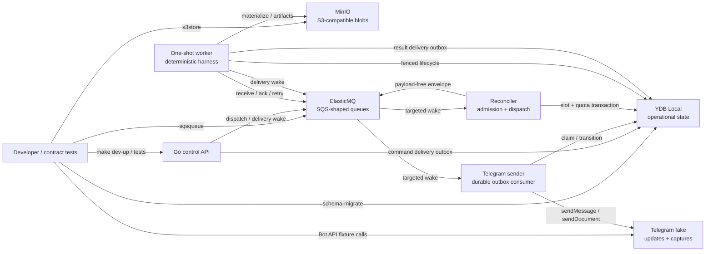

# Local development stand

The local stand is a reproducible integration boundary for the deterministic
Sessionless control plane. It exercises the same YDB migrations and the same Go
blob/queue ports intended for cloud deployment without using a cloud account,
real Telegram traffic, or subscription credentials.

It is a compatibility stand, not a claim that emulators reproduce every Yandex
Cloud behavior. YMQ triggers, IAM, Lockbox, Object Storage bucket policies, and
serverless networking remain cloud-dev release gates.

## Topology



| Service | Container endpoint | Host endpoint | Persistence |
| --- | --- | --- | --- |
| YDB Local | `grpc://ydb-local:2136/local` | `grpc://localhost:2136/local` | `ydb-data`, `ydb-certs` |
| YDB monitoring | `http://ydb-local:8765` | `http://localhost:8765` | n/a |
| MinIO S3 API | `http://object-storage-local:9000` | `http://localhost:9000` | `object-storage-data` |
| MinIO console | `http://object-storage-local:9001` | `http://localhost:9001` | `object-storage-data` |
| ElasticMQ SQS API | `http://queue-local:9324` | `http://localhost:9324` | intentionally ephemeral |
| ElasticMQ UI | `http://queue-local:9325` | `http://localhost:9325` | intentionally ephemeral |
| Telegram fake | `http://telegram-fake:8081` | `http://localhost:8081` | intentionally ephemeral |
| Control API | `http://control-api:8080` | `http://localhost:8080` | stateless |
| Telegram sender | n/a | n/a | stateless outbox consumer |
| Reconciler | n/a | n/a | stateless targeted scheduler consumer plus startup recovery |
| Worker runtime | n/a | n/a | one-shot; invocation scratch is tmpfs |

All image versions are pinned in `tools/versions.env`. Compose loads safe
defaults when no `.env` file is present. The committed access key, secret, and
bot token values are deliberately local emulator credentials; they grant no
access outside the fixed Compose project and must never be copied to cloud
environments.

## Lifecycle

From a fresh checkout:

```sh
make dev-up
make local-integration
make e2e-local
make dev-down
```

`make dev-up` performs the following fail-fast sequence:

1. Build and start only infrastructure services: YDB, MinIO, ElasticMQ, and
   the Telegram fake.
2. Poll their host endpoints until they are ready or emit scoped service logs.
3. Idempotently create the `sessionless-local` bucket.
4. Apply the embedded Goose/YDB migrations before any schema-dependent
   service starts. YDB Local's narrow storage-pool initialization state is
   retried; all other migration failures remain fail-fast.
5. Build and start the control API, Telegram sender, and reconciler, then wait
   for the control API readiness endpoint.
6. Idempotently load `test/fixtures/telegram/text-message.json`.

This phase barrier prevents application logs from being polluted by expected
`table does not exist` errors while a fresh YDB volume is still being
migrated.

The default profile leaves the serverless-shaped worker stopped. Run
`make worker-once` after the reconciler admits a dispatch. Compose starts a
read-only, nonroot worker with a private tmpfs, consumes zero or one message,
and removes the container on exit.

`make dev-down` removes containers and the Compose network but preserves named
volumes. A subsequent `make dev-up` reuses YDB tables and objects, rechecks the
schema, and reloads the update fixture without duplication.

Destructive reset is explicit and fixed to the local project:

```sh
CONFIRM_LOCAL_RESET=sessionless-dev make dev-reset
```

The reset script refuses any missing or different confirmation and runs
`docker compose --project-name sessionless-dev down --volumes
--remove-orphans`. It never resolves a project name from user input and never
deletes source paths.

## Adapter contracts

`internal/s3store` accepts a caller tenant on every read, write, and delete
operation. Relative keys are placed under `tenants/<tenant-id>/`; already
prefixed keys for another tenant and path traversal are rejected before any S3
request. Returned references include size and SHA-256.

`internal/sqsqueue` uses versioned, payload-free queue envelopes. `wake.dispatch`
and `wake.telegram` address one durable outbox row;
`wake.frontend_projection` addresses the bounded projections for one run and
frontend; `dispatch.run` addresses one admitted worker job. The adapter models
at-least-once receive, explicit acknowledgement, visibility-based retry, and
application-controlled dead-letter publication. Queue and DLQ URLs are injected
explicitly, so no emulator hostname leaks into the domain.

`telegram-fake` implements the local subset used by frontend adapter tests:
`getMe`, `getUpdates`, `sendMessage`, `sendDocument`, and `sendPhoto`. Test-only
routes load updates, list captures, and reset in-memory state. Reposting the
same positive `update_id` replaces the fixture instead of duplicating it.

Run all stand contracts with:

```sh
make local-integration
```

The suite proves YDB connectivity, S3 round-trip and cross-tenant rejection,
SQS retry/dead-letter behavior, deterministic Telegram update/capture behavior,
and durable command state/replies for connect, status, disconnect, and a new
canonical session binding. Scheduler unit/YDB integration coverage separately proves
exactly one concurrent reservation per subscription, deterministic wake and
dispatch message IDs, point-read wake handling, bounded recovery traversal,
and idempotent reservation expiry. Worker unit/YDB integration coverage proves
tenant-safe replay and snapshot-plus-tail materialization, corrupt-snapshot
fallback, attachment materialization, checkpoint resume, lease renewal/loss
fencing, cancellation, runtime/context/turn limits, exactly-once terminal
delivery, and lease-index cleanup.

The reconciler also owns best-effort snapshot maintenance after an admitted
canonical dispatch is published and acknowledged. Local defaults create a new
version every 128 covered events and scan at most 32 versions; override
`SNAPSHOT_INTERVAL_EVENTS` and `SNAPSHOT_MAX_VERSIONS` when exercising smaller
fixtures. Context event and byte limits bound each build.

Run the composed deterministic product slice with:

```sh
make e2e-local
```

Unlike the adapter-contract suite, this target drives two Telegram tenants
through the live control API, reconciler, queue, one-shot worker containers,
object storage, durable delivery and Telegram capture. It also injects bounded
queue, worker and Telegram failures. The full scenario list, timing boundary
and operator queries are documented in [local-e2e.md](local-e2e.md).

## Apple Silicon

The pinned YDB Local image is run as `linux/amd64`, matching YDB's documented
Docker setup. Docker Desktop must have Rosetta 2 emulation enabled for the
default disk-backed stand. This is the acceptance-equivalent configuration
because it preserves YDB state.

If Rosetta 2 is unavailable, a developer may temporarily set
`YDB_USE_IN_MEMORY_PDISKS=true`; this removes the disk-persistence guarantee and
must not be used to claim the persistence acceptance check. MinIO and
ElasticMQ's pinned images provide both amd64 and arm64 variants.

## Configuration boundary

Host-side safe defaults are listed in `.env.example`. In-container endpoints
use Compose DNS names and are supplied by Compose service configuration.
Production code must obtain cloud credentials from the workload environment or
metadata chain. Do not commit `.env`, IAM tokens, service-account JSON, real
Telegram tokens, or user/subscription authentication state.
