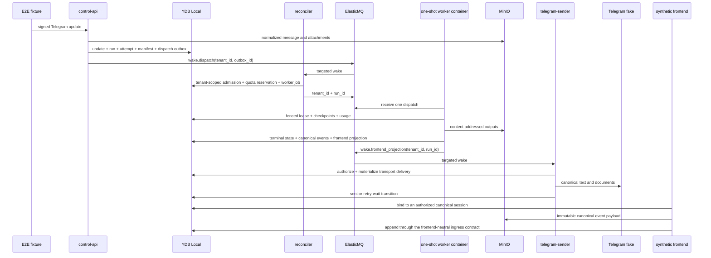

# Deterministic local end-to-end slice

`make e2e-local` is the black-box proof gate between the individual adapter
contracts and cloud-dev deployment. It requires Docker Compose but no cloud,
Telegram, provider, or subscription credential.

## Executed topology



The worker is built and invoked through the Compose `worker` profile. Each
invocation is read-only, nonroot, concurrency-one, receives one queue message,
uses a private tmpfs scratch directory, and is removed on exit.

## Command

```sh
make e2e-local
```

The command:

1. starts and migrates the pinned local stand;
2. builds the worker image;
3. resets only ephemeral Telegram captures and visible queue messages;
4. runs the tagged black-box suite;
5. prints service logs automatically when the suite fails.

The stand is intentionally left running for inspection. Use `make dev-down` for
a non-destructive stop or the guarded `dev-reset` command when local volumes
must be deleted.

## Automated scenarios

The suite proves:

- two tenants submit interleaved and out-of-order Telegram updates;
- a duplicate Bot API update maps to one logical run and one dispatch;
- disconnected subscriptions are blocked, then admitted with provider quota
  explicitly `unknown` without any API-billing fallback;
- provider quota `exhausted` and `blocked_until_reset` recover only after an
  explicit observation/state change;
- a committed dispatch whose first wake or worker-queue publication fails is
  republished without duplicating admission or execution;
- retryable worker failures before the first checkpoint and after checkpoint
  one resume without duplicate terminal state;
- durable cancellation releases the reservation and appends one canonical
  terminal system event;
- canonical assistant/tool finalization creates and consumes one authorized
  Telegram projection while retaining the canonical events;
- a retryable Telegram `429` response is persisted and retried before the
  canonical delivery reaches `sent`;
- replaying a terminal queue message produces no re-execution, charge,
  canonical event, or projection;
- admission pins a compatible immutable session snapshot and its covered
  sequence before a later worker invocation materializes the contiguous tail;
- snapshot-plus-tail materialization remains byte-identical to bounded
  event-only replay even when the snapshot-covered event payload objects are
  unavailable to the worker;
- corrupt snapshot bytes fall back to bounded event-only replay without moving
  the admitted trigger boundary or failing the canonical run;
- output artifact keys and reads remain tenant-scoped;
- two successive `/new` commands create distinct canonical sessions and leave
  both previous sessions participant-authorized, listable and openable;
- a synthetic non-Telegram frontend revision-fences its binding onto the
  current Telegram session and both bindings observe the same canonical event;
- archive moves a session between the active and archived fixed-fan-out lists
  without changing its ordered event payloads or immutable worker artifacts,
  and unarchive restores the active session;
- duplicate ingress and terminal queue replay preserve stable trigger,
  assistant, projection and delivery identities with exact durable row counts;
- cross-tenant session selectors cannot bind, list, open, materialize history
  or artifacts, or authorize a destructive deletion request.

Command replies and projected AI results both exercise the durable Telegram
delivery path; only projected results retain an immutable reference back to
their canonical event and live binding authorization boundary.
The lower-level worker, YDB, S3, queue, ingress, and delivery suites retain
their focused concurrency, fencing, path traversal, size-limit, and
cross-tenant negative cases. The E2E suite composes those same production
adapters rather than replacing them with an in-memory product path.

## Local correctness and cloud evidence

The local gate is authoritative for deterministic structure and isolation. It
uses synthetic Telegram identities, the production frontend-neutral session
API and ingress services, YDB Local, MinIO, ElasticMQ, one-shot worker
containers and the Telegram fake. It proves canonical identity, session
switching, cross-frontend binding, participant authorization, event and
artifact retention across archive, snapshot/replay equivalence, corrupt
snapshot fallback, idempotency and negative tenant boundaries.

The following evidence is deliberately not inferred from the local stand:

| Evidence | Owner |
| --- | --- |
| Real Telegram OIDC, two-user browser authorization and the deployed WebUI as an independently authenticated frontend | WEB-06 #35, after WEB-05 #34 |
| Managed HTTPS, certificate, immutable deployed image digest and scale-to-zero cold start | WEB-05 #34 and WEB-06 #35 |
| Cloud YDB query latency/RU, Object Storage lifecycle behavior, serverless retries, dashboards and alert delivery | release hardening #14 |

Those cloud gates repeat selected scenarios against cloud-dev and link their
evidence; they do not replace or weaken the local canonical-session proof.
`TestOperationalTTLPreservationAndResumableSessionDeletion` deterministically
removes only the target run's TTL-governed operational rows, then proves that
canonical history, artifacts, and the non-TTL delivery/checkpoint ownership
ledgers survive. It composes an exact-object deletion interrupted after one
successful delete, a byte-identical replan and retry, durable audit/tombstone
checks, and same-tenant plus cross-tenant sentinels. This simulates the
structural effect of TTL cleanup; it does not claim wall-clock YDB TTL timing.

## Correlation and timing evidence

The test emits one correlation line per input:

```text
correlation update_id=<id> tenant_id=<opaque> run_id=<opaque> chat_id=<synthetic>
```

The ingress logger emits `update_id` and `run_id`; the scheduler and worker
queue decorators emit `message_id`, `tenant_id`, and `run_id`; the Telegram
delivery decorator emits `tenant_id`, `run_id`, `delivery_id`, and `chat_id`.
This preserves the same opaque correlation chain across process boundaries
without logging message bodies, credentials, or artifact contents.

Worker invocation JSON and Go subtest durations are printed with `go test -v`.
These durations form the named local baseline for control-plane orchestration;
they intentionally exclude provider inference. Compare only runs using the same
commit, pinned images, host/runner class, cache state, and Docker architecture.
They are not a cloud cold-start or product latency qualification.

## Operator inspection

Use the opaque `tenant_id` and `run_id` printed by the test:

```sql
SELECT status, session_id, trigger_event_id, created_at, updated_at
FROM runs
WHERE tenant_id = $tenant_id AND run_id = $run_id;

SELECT attempt_number, status, worker_id, updated_at
FROM attempts
WHERE tenant_id = $tenant_id AND run_id = $run_id;

SELECT sequence, created_at
FROM checkpoints
WHERE tenant_id = $tenant_id AND run_id = $run_id
ORDER BY sequence;

SELECT source, input_tokens, output_tokens, observed_at
FROM usage_observations
WHERE tenant_id = $tenant_id AND run_id = $run_id;

SELECT status, next_attempt_at, updated_at, payload
FROM telegram_delivery_outbox
WHERE tenant_id = $tenant_id AND run_id = $run_id;
```

`attempt_count` is contained in the typed JSON payload; the indexed columns
above remain optimized for delivery scheduling rather than ad hoc reporting.

Queue state is visible at `http://localhost:9325`; MinIO is visible at
`http://localhost:9001`. `docker compose --project-name sessionless-dev logs
control-api reconciler worker-runtime telegram-sender` provides component
logs. Never use these local credentials or endpoints in cloud environments.
