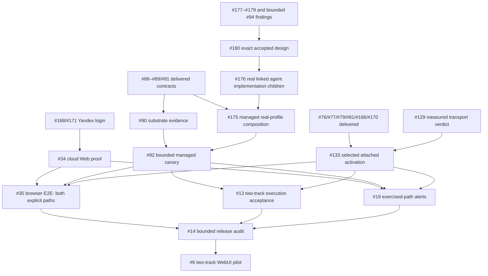
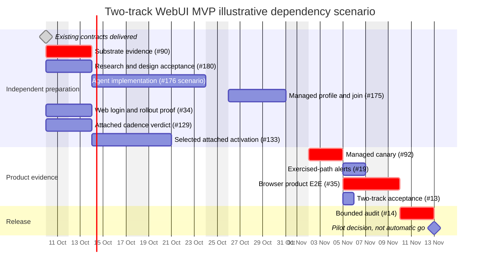

# WebUI-first MVP delivery plan

Status: product-owner-directed two-track scope correction, 2026-10-10;
managed delivery [#176](https://gitcode.com/urandon/sessionless/issues/176)/
[#175](https://gitcode.com/urandon/sessionless/issues/175), attached delivery
[#72](https://gitcode.com/urandon/sessionless/issues/72).
Source snapshot: accepted `d3eb8fdc069938c05be23212e834a7cc3d82a03e` and
live issue read-back on 2026-10-10. The
[owner's two-track decision](https://gitcode.com/urandon/sessionless/wiki/MVP-Execution-Tracks-2026-10-10.md)
supersedes both the attached-only scheduling baseline from #167 and the
attached-optional interpretation in the earlier !159 draft, not their delivered
implementation receipts. Planning is not runtime activation.
Owning epics: [#6](https://gitcode.com/urandon/sessionless/issues/6),
[#29](https://gitcode.com/urandon/sessionless/issues/29),
[#13](https://gitcode.com/urandon/sessionless/issues/13).
[#72](https://gitcode.com/urandon/sessionless/issues/72) owns the independently
required attached route. Release joins both paths; one demo does not close MVP.

## Release promise and boundaries

The first pilot signs in through WebUI/Yandex ID and explicitly selects either
one supported ready-made harness on an attached worker or a Sessionless-managed
cloud execution profile. Both paths must create a canonical session, accept
text or bounded image/file input and return useful durable answers/artifacts.
Refresh and re-login retain history. **The managed path requires no user machine,
daemon installation, attached-worker enrollment or personal coding subscription.**
The attached path uses its owner's enrolled host and reviewed harness/resource.
Invitation/audited bootstrap still grants membership; provider login alone does
not create tenant access.

Sessionless owns the append-only Session stream in YDB, immutable large payloads
in Object Storage and admission/attempt/lease/fence/quota/terminal authority.
The serverless control plane routes work to an isolated managed worker; it does
not run AI inline in the Web BFF. Cloud compute is explicitly selected, never a
silent fallback from an attached subscription. Missing, revoked, quota-blocked,
unavailable or ambiguous authority fails visibly and cannot cause duplicate
provider sends, implicit resource switches or unapproved paid-model use.

The bounded [tool-free serverless profile](serverless-harness.md) is reusable
outer-runtime groundwork, not full managed product acceptance. The managed
harness must continue through a bounded model → structured tool → authorized
result → model loop, perform derived compaction without changing canonical
history, expose one useful constrained MCP integration and provide bounded
general web search with durable source-linked answers and WebUI citations.
Documentation lookup alone does not satisfy general search. Arbitrary shell,
model-generated code execution, full-page fetch/browser, generalized plugins,
memory and subagents remain outside this minimum.

One ready-made attached harness suffices; #133 selects Codex as the existing
activation candidate. Codex/OpenCode/Pi are not all required. A replacement needs
an explicitly reviewed bounded task and acceptance mapping. Native cloud coding
agent processes remain disabled until their own evidence passes. Shared harness
contracts may be reused on user hosts with different platform launch artifacts,
not one binary that runs unchanged on macOS and Linux.

### Cheap/free model and input policy

One pinned real model profile for each selected route is enough.
[OpenCode Zen](https://opencode.ai/docs/zen/) Big Pickle remains only a candidate
for a free synthetic/public **text** smoke, not the accepted managed agent or
attached harness choice. Pin and
verify current model, endpoint, authentication, availability and data terms
before execution; documented availability is not an observed successful call.
Free-model data terms can permit training, so private user files are not admitted
merely because a URL works. API access is distinct from running the OpenCode CLI;
do not extract bundled/shared credentials or pretend a Zen endpoint is an
already attested OpenRouter tuple.

The promised text/file/image product flow remains required. #175 must pin an
eligible profile and any bounded extraction/materialization policy for these
inputs, prove useful outputs/artifacts, and deny unsupported modalities before
provider effects. Big Pickle text proof alone is not file/image or full #35 proof.
No arbitrary provider catalog, silent paid fallback or cloud-hosted consumer
subscription credentials are required.

“Low cost” is a measured target, not zero-cost assurance. #90/#92 record per-turn
and idle expenses for provider, containers, YDB, queue, logs, storage and egress,
with explicit source/confidence and approved ceilings. A free model's unavailable
quota is not unlimited capacity. Existing Web rollout budget is not automatically
expanded to cover this new execution path; canary approval must state its own
cost ceiling, kill switch and teardown.

Telegram messaging and Cloudflare transport remain **post-MVP**. Yandex ID
Authorization Code + S256 PKCE and trusted account API remain the independent
login selected in #168/#171; late account linking #172 remains post-MVP.
Sharing/federation, multi-resource selectors, administration/analytics, other
messengers, exhaustive recovery simulations and the full #144/#145 roadmap are
not hidden launch gates. The [UX roadmap](product-ux-roadmap.md) remains separate.

## What is proved versus what is still missing

- #30–#33 implement local Web BFF/API/UI. #171/#173 deliver selected Yandex
  login/smoke fixtures (MR !151/!152), not complete browser cloud product proof.
  The user has reported a successful dev login/session creation; #34/#35 still
  own exact rollout/cold-start/rollback and joined execution evidence.
- #86–#89/#91 are closed contract/disabled-adapter deliveries. #90 substrate
  evidence and #92 rollout proof remain open. The normal `worker-runtime` still
  uses the deterministic harness; managed real-provider composition is missing.
- #77/#81/#79/#166 deliver attached daemon, disabled Codex adapter and bounded
  canonical receipt/TerminalAck proof (MR !147). Do not reopen their completed
  scope for this promotion or describe it as real provider activation.
- #76/#169 normal default-off Web-to-attached bridge (MR !149) and #170 minimum
  [private onboarding](attached-worker-onboarding.md) (MR !150) are delivered.
  Their deterministic/test-provider proof is not cloud AI execution. #129/#75
  measured transport and #133 real Codex activation remain required attached
  rollout work, independent of managed implementation.
- #177 loop/export research is closed; #178/#179 research phases are accepted.
  [PR !160](https://gitcode.com/urandon/sessionless/pull/160) publishes the 0.2.0
  draft minimum, compaction, tools/MCP and search designs. Independent CLEAN and
  exact-head CI are documentation evidence, not owner acceptance or executable
  agent behavior. Tavily Basic/public-web mode and numeric budgets remain
  proposals. #180 acceptance precedes actual #176 implementation children.
- Dev user feedback shows disabled Send with `not_configured` compute.
  Successful login/session creation does not supply a real execution resource.
  #175 owns explicit managed entitlement/profile admission and normal dispatch;
  no fake attached-worker entity or manual per-run database surgery is needed.

## Actionable remaining work

Primary owns architecture/integration/external mutations. Implementation agents
receive bounded code/test slices; independent reviewers review exact stabilized
snapshots; CI watchers report exact heads. Follow the
[autonomous task-flow protocol](https://gitcode.com/urandon/sessionless/wiki/Autonomous-Development-and-Agent-Orchestration.md):
relevant research → versioned reviewed and accepted design → real linked
implementation children → proportional tests/review/exact-head CI → integration.
Owner high/critical signals receive explicit triage; only the owner assigns
critical. Existing owners are reused; no broad research program becomes a hidden
release gate.

| Owner | Concrete actions | Exit evidence |
| --- | --- | --- |
| #177/#178/#179 and bounded #94 research → #180 design | Reuse accepted source findings; accept/correct the exact !160 minimum, compaction, MCP and search design; retain unknowns, exclusions and independent review | Versioned owner-accepted contract; research acceptance and green docs CI do not implement it |
| #176 agent implementation | After #180 acceptance, populate this existing epic with actual linked mandatory children for loop/effects/exports, compaction, useful MCP, web search/citations and deterministic regressions | Every child has scope, predecessors, labels/milestone, tests/review/exact-head CI; proposed slices are not created or delivered children |
| #90 platform | Execute its bounded synthetic cloud-dev manifest; measure cold/warm isolation, erasure, egress, lease/redelivery and cost; keep no-go explicit | Exact immutable platform/profile and go/conditional/no-go. No real key/user payload required for this spike |
| #175 managed profile | Join implemented #176 agent capabilities with one real provider/model/auth/data/capability tuple, entitlement and normal Web/control/worker dispatch/result flow; account for files/images and durable outputs | Reviewed implementation, exact-profile tool/egress/cost compatibility and deterministic negatives/exact CI; no user host dependency. Registration or a single tool-free call does not activate |
| #92 managed canary | Join #90 and #175 under a separately approved manifest; prove two-owner/tenant isolation, credential/egress/cleanup, ambiguous no-replay, metering, budget and rollback | Actual bounded cloud-dev receipts for one real profile; public-safe evidence and reversible activation, no inferred zero cost |
| #129/#75 attached transport | Freeze and review the exact synthetic experiment, finite budgets/teardown; measure fixed 24-hour cohorts and bounded reconnect cases | Attributed request/RU/duration/egress/RUB and go/conditional/no-go; approved cloud execution only, never inferred free/zero cost |
| #133/#72 attached activation | Reuse delivered #76/#77/#79/#81/#166/#170; pin one exact harness/artifact/resource/policy, prove actual-platform egress/isolation and compose prepared driver/receipt finalizer reversibly | One authorized real turn yields a durable WebUI answer; #129 verdict gates cloud-connected transport, not independent managed implementation; no ambient credentials or blind repeat |
| #34 / #168 Web rollout/login | Reconcile reported dev login against exact image/config/migration; finish private HTTPS/zero-prepared-instance/cold-start/session/rollback evidence | Real registered-client and deployment evidence, not health/apply alone |
| #19 alerts | Cover exercised Web/control/YDB/storage/queue/managed-worker/attached paths and an accessible operator channel | Controlled failure/recovery notification with no payload/secret logging or Telegram dependency |
| #35 product E2E | Prove both #72/#133 attached and #175/#92 managed paths with #34/#168 login/Web rollout; fresh users obtain canonical answers/artifacts from text/file/image and refresh/re-login | Exact commit/image/config/migration/profile plus two-owner/tenant positives/negatives. Managed proof uses no user host; tool/MCP/search/compaction continuation is real, not a tool-free or fake-only smoke |
| #13 / #14 release | Consolidate both route proofs and audit exercised security, cost, incidents and rollback | Explicit two-track go/no-go, no unresolved critical isolation/credential/duplicate-effect/data-loss findings; no exhaustive world-simulation gate |

Both routes stay disabled until their own gates pass. #129's fixed cohorts are
not dependencies of independent managed implementation; #90 is not a predecessor
of the attached demo. Prefer the shortest safe attached demo while preparing
managed research/design/implementation independently. Closed receipts stay
delivered. #90's tool-free synthetic platform preparation may continue, but
full-agent enablement must prove the selected MCP/search/loop egress and effect
extensions on the exact substrate; the older proof alone cannot cover them.

## Dependency graph

Platform experiment design and authorized measurements, accepted disabled
agent/profile implementation, attached preparation and Web preparation have
independent lanes. Joins gate live enablement, not every preparatory action;
implementation never bypasses its own research/design acceptance.
If #90 is no-go, record the actual blocker and review a different substrate; do
not secretly require a user's host or replace proof with weaker safety claims.

## Illustrative Gantt, not a delivery commitment

Dependency scenario anchored on 2026-10-10. Durations are provisional engineering
allowances, not measured effort, staffing or a promised release date. Live canary
authorization, provider availability and platform findings can extend elapsed
time. Re-estimate after first evidence; existing milestone dates remain planning
horizons. Re-estimate managed implementation after accepted design creates real
children; the aggregate box below is not an invented implementation issue or
staffed schedule. This replaces earlier one-track charts, not historical receipts.

## Pilot checklist

- [ ] Independent Web login and audited invitation/bootstrap, without bot setup.
- [ ] Fresh owner enrolls one supported attached harness/resource and obtains
      a real durable WebUI answer; transport verdict and per-resource rollback.
- [ ] Explicit managed profile/entitlement; no user machine, daemon or enrollment.
- [ ] Managed bounded model/tool/result continuation, derived compaction and
      useful constrained MCP, plus general web search and durable WebUI citations;
      real-profile proof, not a tool-free call or documentation lookup alone.
- [ ] Admitted text and file/image → one fenced real execution → durable useful
      answer/artifacts → refresh; unsupported input denies before provider effects.
- [ ] Two tenants and two owners in one tenant cannot cross session/resource,
      input/output, credential, quota or worker authority.
- [ ] Revocation, unavailable/quota/ambiguous outcomes, duplicate submit and
      bounded cancellation/cleanup fail safely; no paid fallback or blind replay.
- [ ] Exact profile/policy/artifact, credential custody, platform isolation and
      egress evidence; reversible activation, measured cost and approved ceiling.
- [ ] Private Yandex Web runtime, HTTPS, zero prepared instances, bounded polling,
      accessible notifications and rehearsed rollback.
- [ ] Independent review/exact-head CI and current image/config/migration/profile
      provenance in #14; no unresolved critical release finding.

Boxes remain unchecked until product/cloud evidence exists. This scope decision
does not authorize deployments, real calls, private payload export, credentials,
migrations or destructive operations. #175 remains open after its planning
checkpoint; contracts and green deterministic fixtures are not release proof.
