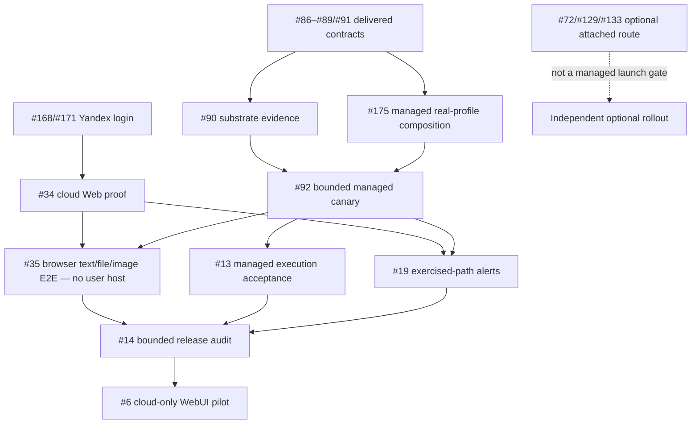
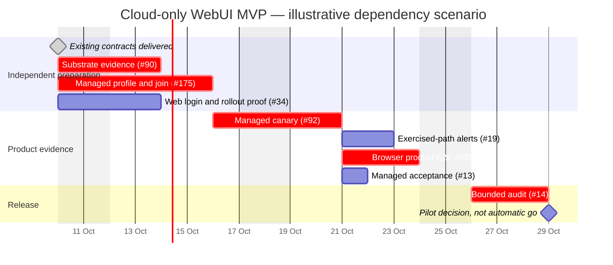

# WebUI-first MVP delivery plan

Status: product-owner-directed managed-cloud promotion, 2026-10-10;
delivery task [#175](https://gitcode.com/urandon/sessionless/issues/175).
Source snapshot: accepted `d3eb8fdc069938c05be23212e834a7cc3d82a03e` and
live issue read-back on 2026-10-10. This supersedes the attached-only release
baseline delivered by [#167](https://gitcode.com/urandon/sessionless/issues/167),
not its implementation receipts. Planning is not runtime activation.
Owning epics: [#6](https://gitcode.com/urandon/sessionless/issues/6),
[#29](https://gitcode.com/urandon/sessionless/issues/29),
[#13](https://gitcode.com/urandon/sessionless/issues/13).
[#72](https://gitcode.com/urandon/sessionless/issues/72) owns the optional
attached-worker route, not a managed-cloud release prerequisite.

## Release promise and boundaries

The first pilot signs in through WebUI/Yandex ID, uses an explicitly authorized
Sessionless-managed cloud execution profile, creates a canonical session, sends
text or a bounded image/file, and receives durable answers/artifacts. Refresh and
re-login retain history. **No user machine, daemon installation, attached-worker
enrollment or personal coding subscription is required for this launch path.**
Invitation/audited bootstrap still grants membership; provider login alone does
not create tenant access.

Sessionless owns the append-only Session stream in YDB, immutable large payloads
in Object Storage and admission/attempt/lease/fence/quota/terminal authority.
The serverless control plane routes work to an isolated managed worker; it does
not run AI inline in the Web BFF. Cloud compute is explicitly selected, never a
silent fallback from an attached subscription. Missing, revoked, quota-blocked,
unavailable or ambiguous authority fails visibly and cannot cause duplicate
provider sends, implicit resource switches or unapproved paid-model use.

The bounded first [serverless profile](serverless-harness.md) is tool-free: no
arbitrary shell, model-generated code execution, plugins or MCP. A real API
backend below Sessionless's outer harness is sufficient; deploying every native
coding agent is not an MVP gate. Native OpenCode/Codex/Pi cloud processes remain
disabled until their own platform/isolation evidence passes. Shared harness
contracts may be reused on user hosts with different platform launch artifacts,
not one binary that runs unchanged on macOS and Linux.

### Cheap/free model and input policy

One pinned real profile is enough. [OpenCode Zen](https://opencode.ai/docs/zen/)
Big Pickle is the candidate for a free synthetic/public **text** smoke. Pin and
verify current model, endpoint, authentication, availability and data terms
before execution; documented availability is not an observed successful call.
Free-model data terms can permit training, so private user files are not admitted
merely because a URL works. API access is distinct from running the OpenCode CLI;
do not extract bundled/shared credentials or pretend a Zen endpoint is an
already attested OpenRouter tuple.

The promised text/file/image product flow remains required. #175 must pin an
eligible profile and any bounded extraction/materialization policy for these
inputs, prove useful outputs/artifacts, and deny unsupported modalities before
provider effects. Big Pickle text proof alone is not file/image or full #35 proof.
No arbitrary provider catalog, silent paid fallback or cloud-hosted consumer
subscription credentials are required.

“Low cost” is a measured target, not zero-cost assurance. #90/#92 record per-turn
and idle expenses for provider, containers, YDB, queue, logs, storage and egress,
with explicit source/confidence and approved ceilings. A free model's unavailable
quota is not unlimited capacity. Existing Web rollout budget is not automatically
expanded to cover this new execution path; canary approval must state its own
cost ceiling, kill switch and teardown.

Telegram messaging and Cloudflare transport remain **post-MVP**. Yandex ID
Authorization Code + S256 PKCE and trusted account API remain the independent
login selected in #168/#171; late account linking #172 remains post-MVP.
Sharing/federation, multi-resource selectors, administration/analytics, other
messengers, exhaustive recovery simulations and the full #144/#145 roadmap are
not hidden launch gates. The [UX roadmap](product-ux-roadmap.md) remains separate.

## What is proved versus what is still missing

- #30–#33 implement local Web BFF/API/UI. #171/#173 deliver selected Yandex
  login/smoke fixtures (MR !151/!152), not complete browser cloud product proof.
  The user has reported a successful dev login/session creation; #34/#35 still
  own exact rollout/cold-start/rollback and joined execution evidence.
- #86–#89/#91 are closed contract/disabled-adapter deliveries. #90 substrate
  evidence and #92 rollout proof remain open. The normal `worker-runtime` still
  uses the deterministic harness; managed real-provider composition is missing.
- #77/#81/#79/#166 deliver attached daemon, disabled Codex adapter and bounded
  canonical receipt/TerminalAck proof (MR !147). Do not reopen their completed
  scope for this promotion or describe it as real provider activation.
- #76/#169 normal default-off Web-to-attached bridge (MR !149) and #170 minimum
  [private onboarding](attached-worker-onboarding.md) (MR !150) are delivered.
  Their deterministic/test-provider proof is not cloud AI execution. #129/#75
  measured transport and #133 real Codex activation remain optional-track work.
- Dev user feedback shows disabled Send with `not_configured` compute.
  Successful login/session creation does not supply a real execution resource.
  #175 owns explicit managed entitlement/profile admission and normal dispatch;
  no fake attached-worker entity or manual per-run database surgery is needed.

## Actionable remaining work

Primary owns architecture/integration/external mutations. Implementation agents
receive bounded code/test slices; independent reviewers review exact stabilized
snapshots; CI watchers report exact heads. Existing owners are reused. Only #175
adds missing managed composition; it does not duplicate #90/#92/#35.

| Owner | Concrete actions | Exit evidence |
| --- | --- | --- |
| #90 platform | Execute its bounded synthetic cloud-dev manifest; measure cold/warm isolation, erasure, egress, lease/redelivery and cost; keep no-go explicit | Exact immutable platform/profile and go/conditional/no-go. No real key/user payload required for this spike |
| #175 managed profile | Pin one real provider/model/auth/data/capability tuple; compose disabled driver, tenant/owner entitlement, cloud worker and normal Web/control dispatch/result flow; materialize admitted files/images and durable outputs | Reviewed implementation plus deterministic negatives/exact CI; no user host dependency. Registration alone does not activate |
| #92 managed canary | Join #90 and #175 under a separately approved manifest; prove two-owner/tenant isolation, credential/egress/cleanup, ambiguous no-replay, metering, budget and rollback | Actual bounded cloud-dev receipts for one real profile; public-safe evidence and reversible activation, no inferred zero cost |
| #34 / #168 Web rollout/login | Reconcile reported dev login against exact image/config/migration; finish private HTTPS/zero-prepared-instance/cold-start/session/rollback evidence | Real registered-client and deployment evidence, not health/apply alone |
| #19 alerts | Cover exercised Web/control/YDB/storage/queue/managed-worker paths and an accessible operator channel | Controlled failure/recovery notification with no payload/secret logging or Telegram dependency |
| #35 product E2E | Join #34/#168 and #175/#92; a fresh provisioned user with no attached host sends text/file/image, gets a real canonical answer/artifacts and refreshes/re-logs in; include two owners/tenants and bounded negatives | Exact commit/image/config/migration/profile and repeatable browser proof; synthetic second frontend reuses #27. Text-only model smoke is insufficient |
| #13 / #14 release | Consolidate managed execution acceptance and audit the exercised path, security, cost, incidents and rollback | Explicit go/no-go, no unresolved critical isolation/credential/duplicate-effect/data-loss findings; no exhaustive world-simulation gate |

Optional #72/#133 attached subscription work remains useful and disabled until
its own gates pass. #129's fixed observation cohorts are not dependencies of the
managed profile. Closed #76/#170 receipts stay preserved; no completed work is
reclassified as unfinished merely because launch priorities changed.

## Dependency graph

Platform measurement, disabled profile implementation and Web preparation can
proceed independently. Joins gate live enablement, not every preparatory action.
If #90 is no-go, record the actual blocker and review a different substrate; do
not secretly require a user's host or replace proof with weaker safety claims.

## Illustrative Gantt, not a delivery commitment

Dependency scenario anchored on 2026-10-10. Durations are provisional engineering
allowances, not measured effort, staffing or a promised release date. Live canary
authorization, provider availability and platform findings can extend elapsed
time. Re-estimate after first evidence; existing milestone dates remain planning
horizons. This replaces the attached-only release charts, not historical receipts.

## Pilot checklist

- [ ] Independent Web login and audited invitation/bootstrap, without bot setup.
- [ ] Explicit managed profile/entitlement; no user machine, daemon or enrollment.
- [ ] Admitted text and file/image → one fenced real execution → durable useful
      answer/artifacts → refresh; unsupported input denies before provider effects.
- [ ] Two tenants and two owners in one tenant cannot cross session/resource,
      input/output, credential, quota or worker authority.
- [ ] Revocation, unavailable/quota/ambiguous outcomes, duplicate submit and
      bounded cancellation/cleanup fail safely; no paid fallback or blind replay.
- [ ] Exact profile/policy/artifact, credential custody, platform isolation and
      egress evidence; reversible activation, measured cost and approved ceiling.
- [ ] Private Yandex Web runtime, HTTPS, zero prepared instances, bounded polling,
      accessible notifications and rehearsed rollback.
- [ ] Independent review/exact-head CI and current image/config/migration/profile
      provenance in #14; no unresolved critical release finding.

Boxes remain unchecked until product/cloud evidence exists. This scope decision
does not authorize deployments, real calls, private payload export, credentials,
migrations or destructive operations. #175 remains open after its planning
checkpoint; contracts and green deterministic fixtures are not release proof.
