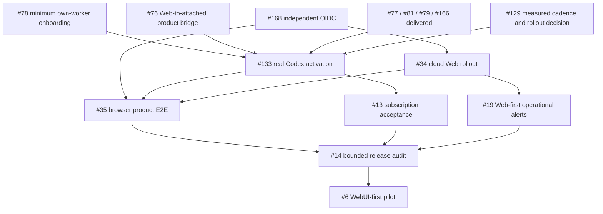
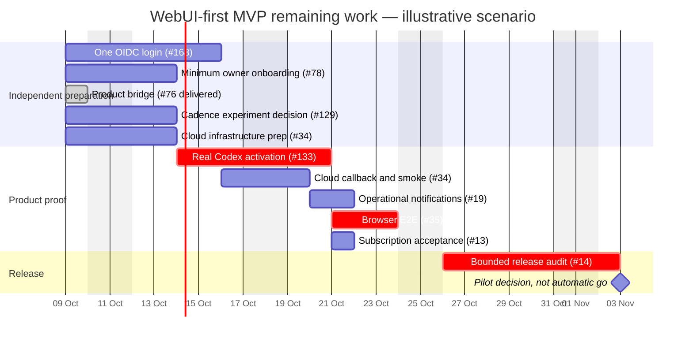

# WebUI-first MVP delivery plan

Status: product-owner-directed rebaseline, 2026-10-09; delivery task
[#167](https://gitcode.com/urandon/sessionless/issues/167).
Source snapshot: `a98edbecc424c5610339bcd80fb7e8beebaf2c26` and live issue
read-back on 2026-10-09. This changes release scope, not runtime activation.
The owning epics are [#6](https://gitcode.com/urandon/sessionless/issues/6),
[#29](https://gitcode.com/urandon/sessionless/issues/29),
[#72](https://gitcode.com/urandon/sessionless/issues/72) and
[#13](https://gitcode.com/urandon/sessionless/issues/13).

## Release promise and boundaries

The first pilot enters through WebUI, connects one own attached worker/AI
resource, creates a canonical session, sends text or an image/file, and receives
a durable answer and artifacts. Refresh/re-login retains history. Another user
cannot use that owner's resource or read its sessions, files, credentials or
quota. Offline, revoked, quota-blocked and ambiguous outcomes are visible;
they never cause silent cloud/API billing fallback or a duplicate provider turn.

Sessionless still owns the append-only Session stream in YDB and immutable
payloads in Object Storage. The Yandex control plane scales to zero; AI executes
on an isolated owner-managed host through the accepted `codex exec` path, with
user-local credential custody. Cloud-hosted App Server feasibility is not a
prerequisite for that path. Provider eligibility must be valid for the exact
resource/policy tuple before activation; a prior research result is not blanket
permission for other plans or credentials.

Telegram messaging and the Cloudflare reachability edge are **post-MVP**.
Their implementations and regression fixtures remain; they are not release
gates. The owner's Telegram/Yandex webhook-delay observation is motivation to
avoid that transport dependency, not a measurement of OIDC availability.
Current Web authentication still uses Telegram OIDC.
[#168](https://gitcode.com/urandon/sessionless/issues/168) owns one independent
OIDC login, reusing membership, invitation/bootstrap and session controls;
no bot initialization, password system or broad SSO framework is required.

Resource sharing/federation, a multi-resource picker, full administration,
analytics, other messengers and exhaustive distributed-failure simulations
are not MVP blockers. The accepted product UX contracts remain valid;
their [post-MVP roadmap](product-ux-roadmap.md) does not add release edges.
Stop/recovery usability may be delivered as a bounded improvement under its
existing owners, but #144/#145 in their entirety are not new launch gates.

## What is proved versus what is still missing

- #30–#33 delivered the local Web BFF/API/UI, not cloud product E2E.
- #77 delivered the daemon/supervisor; #81 delivered a disabled Codex adapter.
- #79/#166 are closed: MR !147 supplied the server-owned output receipt and
  bounded positive two-owner/terminal proof. Source-head CI
  [37845334744, attempt 2](https://github.com/urandon/sessionless/actions/runs/37845334744/attempts/2)
  passed all eight jobs. This does not enable a real provider.
- #76/#169 are delivered by MR !149 (merge `c3dc360`), with exact source-head
  [CI 37917810200](https://github.com/urandon/sessionless/actions/runs/37917810200)
  passing all eight jobs. They add a default-off normal Web-to-attached bridge: explicit
  owner/resource pins, the existing canonical `AdmitDispatch`, sealed canonical
  context, and receipt-only terminal finalization. The default BFF remains the
  deterministic managed fixture. A tagged joined proof starts from Web API
  submission and reads the final canonical result through Session/Web refresh;
  its provider credentials and response-loss injection remain test-only.
- The normal `cmd/control-api` attached composition is explicitly enabled
  independently of Telegram and includes bootstrap/exchange/sealed-input/receipt
  handlers. Without either enabled frontend it remains health-only. Normal
  sealed input is credentialless: source composition and synthetic CI evidence
  are not real-provider product activation. #133 owns that next handoff.
- #75 transport is implemented in disabled slices; #129 still owns measured
  cloud cadence/cost and bounded reconnect rollout evidence. #78 still owns
  interactive lifecycle gaps despite delivered read diagnostics. Its #170
  minimum [private-file onboarding](attached-worker-onboarding.md) supplies
  fresh enrollment, exact own-resource registration and native identity setup;
  entitlement/quota remain unknown until #133 activation evidence.

## Actionable remaining work

Each row is an existing accountable task, not a request to invent another epic.
The implementation agent owns code/tests; an independent reviewer checks the
exact snapshot; the primary agent owns integration, CI/merge and tracker status.

| Owner | Inputs and concrete actions | Exit evidence |
| --- | --- | --- |
| #168 independent login | Select one supported issuer; implement its adapter and issuer-scoped identity mapping through existing auth/session ports; update sign-in and bootstrap runbook | Browser/YDB positives and negatives; no Telegram prerequisite; real callback verified with #34/#35 |
| #78 minimum owner onboarding | Reuse #73/#82/#104/#131; provide documented authenticated enrollment/rotation/revoke and local setup; bind one exact own resource; expose current status/ineligibility | A fresh pilot owner can enroll and recover/revoke without manual database edits; another owner is denied. Operator-assisted invitation/bootstrap is allowed and documented; a full control catalog is not required |
| #76 product bridge — delivered | MR !149 composes Web ingress admission, exact own-resource scheduling/dispatch, sealed input and receipt/finalizer behind default-off gates; Telegram initialization is optional | Exact source-head CI 37917810200, eight jobs passed; credential-bearing test-provider submission → fenced worker → canonical answer/manifest → TerminalAck → Web refresh; cross-owner/stale/ambiguous negatives |
| #129 / #75 transport rollout | Freeze a synthetic cloud-dev experiment manifest, budgets and teardown; measure idle cadence and the bounded reconnect cases already specified in #129 | Attributed request/RU/duration/egress/RUB observations and go/conditional/no-go, not inferred zero cost. Cloud execution requires its approved manifest |
| #133 real Codex activation | Consume #76 and closed #79/#166; pin exact artifact/resource/policy; prove egress/isolation on the rollout platform; compose prepared driver and receipt sink; enable one resource reversibly | One authorized real subscription turn, canonical result and explicit failures; no ambient credentials, API fallback or automatic second invocation. #129 decision required before cloud transport rollout |
| #34 cloud Web rollout | Prepare infrastructure in parallel; register selected #168 callback, deploy exact reviewed digest/config, verify private runtime/HTTPS/zero prepared instances/rollback | Live deployment record and real login/cold-start smoke; health or Terraform apply alone is insufficient |
| #19 minimum alerts | Inventory only used Web/control/YDB/storage/queue/attached paths and accessible operator contact channel | Controlled failure and recovery notification, redacted inventory; no Telegram delivery requirement |
| #35 browser product E2E | Join #168/#78/#76/#133/#34; test two users/tenants, text/files, output/artifacts, refresh, auth revoke, offline/quota/ambiguous outcomes | Exact commit/image/config/migration evidence and repeatable cloud-dev browser proof; synthetic second-frontend compatibility reuses #27 |
| #13 / #14 release acceptance | #13 consolidates subscription execution evidence; #14 audits the exercised path, budget, security, queue/reconciliation where used, rollback and incidents | No unresolved critical isolation/credential/duplicate-effect/data-loss finding; explicit canary go/no-go. No new exhaustive recovery implementation is hidden in the audit |

## Dependency graph

#34 infrastructure preparation, #129 experiment preparation and #168/#78/#76
implementation may proceed independently. Their final joins are gates; graph
edges do not mean every preparatory action must wait. #129 is required for
cloud-connected rollout, not for local test-provider bridge development.

## Illustrative Gantt, not a delivery commitment

This is a dependency/capacity **scenario**, anchored on 2026-10-09, with
provisional engineering allowances. It is not measured remaining effort,
a staffed calendar or a release date. Re-estimate after first concrete checks;
cloud experiment authorization, issuer registration and actual availability can
extend elapsed time. The #129 box includes preparation/observation/decision,
not permission to skip its fixed 24-hour cohorts. Existing milestone dates are
unchanged planning horizons, not extra gates.

Historical full-build SP/day totals and Telegram-dependent Gantts in epic
comments are superseded for **current release scheduling**, not erased as
history. The accepted UX roadmap's chart is a separate post-MVP design scenario.

## Pilot checklist

- [ ] Independent Web login and audited invitation/bootstrap, without bot setup.
- [ ] Fresh owner enrolls one own resource; status, quota confidence and denial
      reasons are honest (unknown is not zero or eligible).
- [ ] Text and image/file → one fenced execution → durable answer/artifacts;
      repeated browser submit/refresh does not duplicate execution or history.
- [ ] Two users/tenants and two owners in one tenant cannot cross authority.
- [ ] Offline/revoke/quota/ambiguous outcomes fail safely; no implicit resource
      switch, paid fallback, false success or blind provider replay.
- [ ] Exact reviewed policy, artifact, platform isolation and egress evidence;
      reversible per-resource activation and measured transport cost.
- [ ] Private Yandex Web runtime, managed HTTPS, zero prepared instances,
      bounded budget, accessible notifications and rehearsed rollback.
- [ ] Exact-head CI and independent reviews; no unresolved critical release
      finding; current image/config/migration provenance in #14.

These boxes remain unchecked until their product/cloud evidence exists.
Neither this planning change nor a green deterministic fixture closes them.
