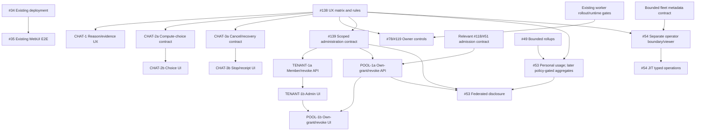
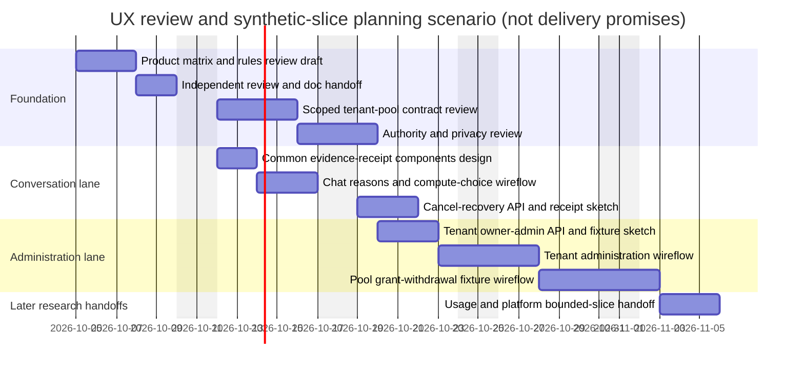
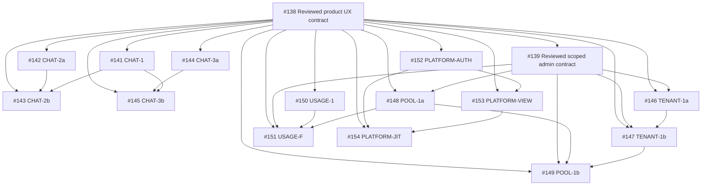

# Product UX delivery roadmap

Status: registered planned backlog, not staffed schedule or implementation acceptance.
Owners: [#138](https://gitcode.com/urandon/sessionless/issues/138) and
[#139](https://gitcode.com/urandon/sessionless/issues/139).
Contracts: [product UX](product-ux-contract.md), [design rules](design-rules.md),
[tenant/federation authority](tenant-federation-admin-contract.md).

Source provenance: wiki snapshot inspected on 2026-10-01 at
`1a6b208468dc99a53a9eb9f4e1444e9716a8aad4`; documentation delivery base
`a463e9780651667be8a28b0bdce339688c7ad453`. Relevant domain/ports/BFF/Svelte,
blob-delivery and existing UX paths were unchanged between these revisions.
File/line evidence below is pinned to the inspection snapshot, not a promise
about an arbitrary future branch.

Independent source-snapshot resolutions:
[#138 CLEAN](https://gitcode.com/urandon/sessionless/issues/138#note_192407004)
and [#139 CLEAN](https://gitcode.com/urandon/sessionless/issues/139#note_192407016).
[Owner acceptance](https://gitcode.com/urandon/sessionless/issues/139#note_192407231)
selects the **initial** D1–D5 scope only. The extracted document delta still
requires normal independent MR review and exact-head checks/CI; source CLEAN
does not transfer to changed text automatically. No implementation, deployment,
migration, provider/credential access or runtime activation is authorized here.

## 1. Track map: reuse before adding epics

| Track | Existing owner | Proposed work / boundary |
|---|---|---|
| Current authenticated WebUI delivery | #29; #30–#33 closed; #34/#35 open in inspected snapshot | Continue deployment → E2E under existing gates. No UX research dependency added |
| Product UX foundation | #138, parent #1 | Fixed-snapshot authority matrix, cohorts, rules, API/screen/test mapping |
| Conversational usability follow-up | Registered #141–#145 follow-ups under #29 | Eligible-compute choice, run reason/recovery, safe cancel only where backend contracts exist; no frontend scheduler |
| Owner capacity UX | #78/#82/#119 | Reuse diagnostics and backend #131 receipts; gated interactive controls |
| Tenant and federation administration | #139 under #51; registered #146–#149 initial slices, broader commands deferred | Owner-only membership revoke / owned use-grant revoke first; delegation deferred |
| User consumption | #53, existing UA decomposition; #49 truth ownership | Personal-only usage first; risky aggregates withheld; future disclosure consumes applicable policy |
| Global operations | #54, existing PA decomposition | Separate identity boundary, metadata viewer first, typed JIT operations later |

Milestone dates are existing planning horizons, not promises: WebUI/provider work 2026-10-15, platform delivery/hardening 2026-10-31, attached workers 2026-11-15, research 2026-12-31. Do not re-date them based on this illustrative chart.

## 2. Proposed bounded slices

SP are relative sizing suggestions with substantial uncertainty, not days. Capacity/fresh source review is required.

| Virtual slice | Outcome and acceptance evidence | Dependencies | Owner / indicative size |
|---|---|---|---|
| UX-F1 | Review #138 draft, extract versioned UX/rules docs; no invented authority; source-to-screen/test matrix | Existing contracts/#82; not #139 completion | #138, existing 5 SP design scope |
| UX-F2 | Resolve #139 D1–D5 and review authority/privacy/recovery matrix | Accepted UX-F1 matrix; inventory parallel | #139, existing 5 SP design scope |
| CHAT-1 | Consistent run/compute explanation drawer and next-action reasons using existing reads; unknown/stale/denied fixture coverage | UX-F1 + existing bounded read contracts | Registered #141 under #29, 3–5 SP |
| CHAT-2a | Eligible-compute list/selection API contract with scope, route revision and admission authority | UX-F1 + resource/route owner agreement (#51) | Registered #142 under #29; #51 contract handoff, 3–5 SP |
| CHAT-2b | Compute-choice flow in chat with conflict/denial handling; no implicit fallback | CHAT-2a implementation/contract + CHAT-1 | Registered #143 under #29, 3–5 SP |
| CHAT-3a | Typed cancellation/recovery API mapping canonical behavior to receipts; distinguish requested/ACK/stopped/terminal | UX-F1 + backend run/attempt owner; fresh no-duplicate check | Registered #144 under #29, 5–8 SP |
| CHAT-3b | Stop/recovery interaction and receipt view, no blind duplicate billed retry | CHAT-3a implemented + CHAT-1 | Registered #145 under #29, 3–5 SP |
| OWNER-1 | Activate a reviewed subset of owner controls with plan/apply and evidence receipts | UX-F1; existing #131 + live #78/runtime readiness and authorization gates | #78/#119, 3–5 SP; do not enable from design alone |
| TENANT-1a | Bounded tenant member read + non-owner membership revoke; version/owner-target/idempotency tests | UX-F2; existing membership auth | Registered #146 under #139, 5–8 SP |
| TENANT-1b | Member listing/non-owner revoke UI first, keyboard-safe preview and receipts, two-tenant negative browser tests; policy editor deferred | TENANT-1a implemented + UX-F1 | Registered #147 under #139, 3–5 SP |
| POOL-1a | Own-grant projection + exact owned use-grant revoke using canonical authority; delegation excluded initially | UX-F2; relevant reviewed #118/#51 contract, not whole parent closure | Registered #148 under #139; #51/#119 handoff, 5–8 SP |
| POOL-1b | Own-grant projection/exact use-grant revoke UI first with disclosure, version conflicts and unknown remote state; broader contribution flows deferred | POOL-1a implemented + TENANT-1b patterns + applicable runtime rollout proof | Registered #149 under #139; #119 handoff, 5–8 SP |
| USAGE-1 | Personal-only bounded overview first; risky tenant aggregates withheld | UX-F1 + #53 UA-01/UA-02/#49 rollup contracts | Reuse UA-03; estimate per #53 |
| USAGE-F | Federated aggregate disclosure, suppression/export guards | USAGE-1 + UX-F2 + POOL-1a + approved privacy policy | Reuse #53 federation subset; 3–5 SP design/implementation sizing pending |
| PLATFORM-1 | Separate operator identity/security boundary + metadata-only viewer overview | UX-F1; #54 PA-01 plus bounded fleet/tenant metadata contracts | Reuse PA-01/PA-03; not blocked on complete financial reconciliation |
| PLATFORM-2 | Typed approved operations/JIT support flows, audited receipts and adversarial tests | PLATFORM-1 + #54 PA-02/PA-04/role-specific controls | Reuse #54, independently security-gated |
| VERIFY | Route-specific keyboard/mobile, cross-scope/revocation, bounded-query and exact-CI proof | Each implemented slice and its contract | Part of each issue; not a single late “test phase” |

CHAT slices are potential MVP usability follow-ups, not a reason to delay existing #34/#35 or claim all admin features are MVP. Mark priorities explicitly when implementation tickets are accepted. Cross-tenant federation admin is excluded from this first slice.

## 3. Acyclic dependency graph

The independent #34→#35 lane intentionally has no new incoming UX edge. #138 can finish with federation decisions proposed; #139 consumes its matrix. #53/#54 read existing research as inputs; do not make their whole parent issues hard blockers for every small projection.

## 4. Gantt: original conditional planning scenario

Illustrative review/prototype scenario, not staffed commitment: two parallel design/integration lanes, start Monday 2026-10-05; weekdays only. Durations are budget hypotheses independent of SP. “Fixture” means synthetic design/prototype data, not working production integration. No work is scheduled onto the main implementer; production dates remain unknown until contract and runtime readiness are confirmed.

The diagram deliberately stops at reviewable contracts/wireflows/handoff. Live UI implementation needs the slice dependencies in the table, independent review, exact-head CI and established merge/deployment gates. Runtime activation, cloud deployment, migrations and provider access are not authorized by this design activity.

## 5. First useful next step and readiness

Source review is CLEAN and the initial scope is owner-approved. Complete independent review/checks/CI of this extracted documentation delta; detailed implementation contracts remain separate. First implementation candidate: CHAT-1, because it primarily reuses current reads and helps users understand denial/uncertainty without enabling new infrastructure controls.

Before starting it, check current/parallel work for an existing equivalent and verify missing reason fields; if fields are missing, split a bounded projection contract first. Worker/action, federation and platform changes require stronger runtime/security gates and should not ride along in the same MR.

Ready for implementation means exact outcome, existing owner/epic, named contract, authorization/negative tests, deterministic fixtures, bounded costs, rollout/non-goals, acceptance evidence and independent review plan. Wiki drafts and green diagrams alone do not satisfy that definition.

## 6. Registered planned issues and milestone (2026-10-01)

[Product UX — Chat, tenant & federation administration](https://gitcode.com/urandon/sessionless/milestones/7) coordinates #138/#139 and 14 planned API/UI follow-ups. Owner-approved horizon: 2026-12-31, not a delivery promise. Original #29/#51/#53/#54 scope ownership and #78/#119 owner-control work remain intact. No new epics, duplicate owner-control task, current-MVP gates or production authority were created.

| Slice | Planned issue | Owning concern | Prerequisites |
|---|---|---|---|
| CHAT-1 | [#141](https://gitcode.com/urandon/sessionless/issues/141) — Explain compute admission and run evidence in the conversation UI | [#29](https://gitcode.com/urandon/sessionless/issues/29) | [#138](https://gitcode.com/urandon/sessionless/issues/138) |
| CHAT-2a | [#142](https://gitcode.com/urandon/sessionless/issues/142) — Add an authorized eligible-compute choice contract for WebUI | [#29](https://gitcode.com/urandon/sessionless/issues/29) | [#138](https://gitcode.com/urandon/sessionless/issues/138) |
| CHAT-2b | [#143](https://gitcode.com/urandon/sessionless/issues/143) — Build the eligible-compute selection and denial-recovery flow | [#29](https://gitcode.com/urandon/sessionless/issues/29) | [#138](https://gitcode.com/urandon/sessionless/issues/138), [#142](https://gitcode.com/urandon/sessionless/issues/142), [#141](https://gitcode.com/urandon/sessionless/issues/141) |
| CHAT-3a | [#144](https://gitcode.com/urandon/sessionless/issues/144) — Add participant-authorized run cancellation and recovery receipts | [#29](https://gitcode.com/urandon/sessionless/issues/29) | [#138](https://gitcode.com/urandon/sessionless/issues/138) |
| CHAT-3b | [#145](https://gitcode.com/urandon/sessionless/issues/145) — Build safe Stop and recovery interactions with operation evidence | [#29](https://gitcode.com/urandon/sessionless/issues/29) | [#138](https://gitcode.com/urandon/sessionless/issues/138), [#144](https://gitcode.com/urandon/sessionless/issues/144), [#141](https://gitcode.com/urandon/sessionless/issues/141) |
| TENANT-1a | [#146](https://gitcode.com/urandon/sessionless/issues/146) — Add bounded owner-only tenant membership and policy administration APIs | [#139](https://gitcode.com/urandon/sessionless/issues/139) | [#138](https://gitcode.com/urandon/sessionless/issues/138), [#139](https://gitcode.com/urandon/sessionless/issues/139) |
| TENANT-1b | [#147](https://gitcode.com/urandon/sessionless/issues/147) — Build owner-scoped workspace membership and policy administration UI | [#139](https://gitcode.com/urandon/sessionless/issues/139) | [#138](https://gitcode.com/urandon/sessionless/issues/138), [#139](https://gitcode.com/urandon/sessionless/issues/139), [#146](https://gitcode.com/urandon/sessionless/issues/146) |
| POOL-1a | [#148](https://gitcode.com/urandon/sessionless/issues/148) — Add explicit pool grants and bounded administrative delegation APIs | [#139](https://gitcode.com/urandon/sessionless/issues/139) | [#138](https://gitcode.com/urandon/sessionless/issues/138), [#139](https://gitcode.com/urandon/sessionless/issues/139) |
| POOL-1b | [#149](https://gitcode.com/urandon/sessionless/issues/149) — Build contribution, beneficiary and withdrawal administration flows | [#139](https://gitcode.com/urandon/sessionless/issues/139) | [#138](https://gitcode.com/urandon/sessionless/issues/138), [#139](https://gitcode.com/urandon/sessionless/issues/139), [#148](https://gitcode.com/urandon/sessionless/issues/148), [#147](https://gitcode.com/urandon/sessionless/issues/147) |
| USAGE-1 | [#150](https://gitcode.com/urandon/sessionless/issues/150) — Build bounded personal and tenant usage overview with provenance | [#53](https://gitcode.com/urandon/sessionless/issues/53) | [#138](https://gitcode.com/urandon/sessionless/issues/138) |
| USAGE-F | [#151](https://gitcode.com/urandon/sessionless/issues/151) — Add privacy-safe federation usage disclosure and suppression | [#53](https://gitcode.com/urandon/sessionless/issues/53) | [#138](https://gitcode.com/urandon/sessionless/issues/138), [#139](https://gitcode.com/urandon/sessionless/issues/139), [#150](https://gitcode.com/urandon/sessionless/issues/150), [#148](https://gitcode.com/urandon/sessionless/issues/148) |
| PLATFORM-AUTH | [#152](https://gitcode.com/urandon/sessionless/issues/152) — Establish the isolated least-privilege platform console boundary | [#54](https://gitcode.com/urandon/sessionless/issues/54) | [#138](https://gitcode.com/urandon/sessionless/issues/138) |
| PLATFORM-VIEW | [#153](https://gitcode.com/urandon/sessionless/issues/153) — Build a bounded metadata-only platform operations overview | [#54](https://gitcode.com/urandon/sessionless/issues/54) | [#138](https://gitcode.com/urandon/sessionless/issues/138), [#152](https://gitcode.com/urandon/sessionless/issues/152) |
| PLATFORM-JIT | [#154](https://gitcode.com/urandon/sessionless/issues/154) — Add a reviewed JIT operator command and durable approval receipts | [#54](https://gitcode.com/urandon/sessionless/issues/54) | [#138](https://gitcode.com/urandon/sessionless/issues/138), [#152](https://gitcode.com/urandon/sessionless/issues/152), [#153](https://gitcode.com/urandon/sessionless/issues/153) |

Platform mapping refines the prior PLATFORM-1/2 proposal into #152 isolated boundary, #153 metadata viewer and #154 one reviewed JIT command family. Backend/API slices precede dependent UI. Domain prerequisites such as relevant #118/#51 admission and #49/#53 bounded rollup contracts remain additional explicit readiness conditions in the issue bodies; the graph above only plots registered slice dependencies and #138/#139. Missing read/rollup contracts must be split before implementation, never bypassed with raw scans.

All new issues are open with **[Planned]** in their titles and an explicit implementation-blocked header, not a claim of a custom GitCode workflow state. Dependency links are recorded in issue bodies and this DAG; no unsupported native dependency API is claimed. The earlier Gantt remains an illustrative design/review scenario, not an actual schedule or task deadline. The wiki source snapshot received independent CLEAN review and the initial scope is owner-approved. This extraction and every implementation delta still require their own review/CI; activation gates remain mandatory.

## Scope refinement and planning evidence

The [owner receipt](https://gitcode.com/urandon/sessionless/issues/139#note_192407231)
and child handoffs select narrower first #146/#148 commands than the broad
registered titles. #147/#149 expose only those accepted implemented
capabilities; invitations, broad policy/limit changes, delegation and contribution
creation are later separately accepted command families, not implicitly in scope.
Existing issue estimates are planning hypotheses; re-size after the exact
command/read/persistence/receipt manifest is accepted.

F1: fresh capability issuance is reauthorized; already issued direct bearer URLs
may allow a first GET until expiry (current cap two minutes), and in-flight/
received bytes cannot be recalled. Exports remain disabled without their own
reviewed delivery contract.

F2: before applicable accepted disclosure policy, withhold potentially revealing
aggregates including own-plus-total, overlapping-window/filter and join/leave
inference. Personal-only #150 remains independently deliverable; missing rollup
contracts must be split, not bypassed by raw scans.

N1: [design rules](design-rules.md#reusable-drawer-and-confirmation-acceptance)
provide route-specific keyboard/focus/error/announcement/zoom/narrow-width
acceptance for #141/#143/#145/#147/#149; these are not executed test results.

N2: [first-command manifests](tenant-federation-admin-contract.md#first-command-readiness-manifests)
separate accepted product selection from still-missing technical contracts.
Numeric query/cost budgets and detailed schema/audit/receipt integration require
their own bounded acceptance. The original Gantt above is preserved as an
illustrative scenario from source discovery; it is not updated task status,
elapsed work, implementer assignment, milestone deadline or promise.

## Success evidence and rollback boundary

Each delivered screen must demonstrate its named user decision, truthful
denial/unknown/recovery behavior, negative authority cases, bounded reads and
route accessibility. Production metrics/targets need the relevant accepted
measurement contract; no invented adoption or completion percentages.

A presentation rollback disables only that new surface/command capability,
without changing canonical Session history, admission, quotas or billing truth.
No provider fallback or new runtime control is enabled by disabling a UI.
Implementation rollout/rollback remains task-specific and separately reviewed.

## Source custody and review limits

| Reviewed wiki body | Exact UTF-8 SHA-256 |
| --- | --- |
| [Product-UX-Contract-Draft-2026-10-01.md](https://gitcode.com/urandon/sessionless/wiki/Product-UX-Contract-Draft-2026-10-01.md) | `c1065fb360df108fa1e95bbb71992fe786397fbd5888b4c5060272c16a271514` |
| [Tenant-Federation-Admin-Draft-2026-10-01.md](https://gitcode.com/urandon/sessionless/wiki/Tenant-Federation-Admin-Draft-2026-10-01.md) | `5f11c974aa436b6e8e5b36f23be1d4156c92f0d8633708207e4610392b964b4e` |
| [UX-Delivery-Roadmap-Draft-2026-10-01.md](https://gitcode.com/urandon/sessionless/wiki/UX-Delivery-Roadmap-Draft-2026-10-01.md) | `54de32273868786754c87ad51ffd0388fa3bcff3cd951d352446df523e8a0986` |

These are source-body hashes, not hashes of these extracted files. The source
wiki remains an immutable review reference for this delivery; this extraction
splits design rules, incorporates the additive owner decision receipt, labels
future capabilities, and adds a screen/API/evidence handoff. Review those
changes independently. GitCode issues own live execution status; this document
does not certify production readiness or close the issues.
