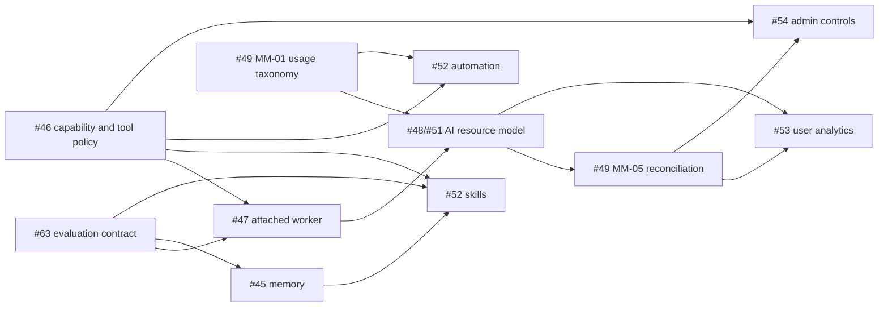

# Sessionless research and design index

Status date: **2026-08-25**. These reports turn the open research backlog into
versioned, reviewable evidence. They are inputs to architecture decisions and
epic decomposition; they do not by themselves close the tracked issues or
authorize a production integration.

## Evidence and decision rules

- **Documented** means a current primary source states the behavior.
- **Observed** means a pinned source revision or controlled experiment shows it.
- **Inferred** means a Sessionless design consequence follows from documented
  or observed evidence.
- **Unknown** means another experiment, cost measurement, operator decision, or
  authoritative provider answer is still required.

Competitor code proves that a mechanism exists, not that a provider permits the
same mechanism in Sessionless. Missing or expired authorization for an account,
surface, placement, custodian, or sharing tuple fails closed. Production
orchestration remains Go/serverless and ships as monolithic Go binaries; Python
SDKs, Hermes Agent, DeepSeek Harness, and RepoWise are research-only inputs or
opt-in developer tools, never production or mandatory CI dependencies.

## Reports

| Track | Report | Primary outcome |
| --- | --- | --- |
| #45, #28 | [Memory and permissions](memory-and-permissions.md) | Versioned, scoped derived memory over canonical Session events; event-driven consolidation plus scheduled repair. |
| #46 | [Tooling, MCP, and permissions](tooling-mcp-and-permissions.md) | Sessionless-owned capability/effect policy, narrow built-ins, worker/MCP isolation and call-time authorization. |
| #47 | [Attachable workers](attachable-workers.md) | Outbound enrolled Go worker, fenced attempts, long-poll first, connection gateway only after measured need. |
| #48, #51 | [AI resources and federation](ai-resources-and-federation.md) | Separate provider, transport, billing, harness, placement, credential generation, and sharing policy; no silent fallback. |
| #51 / PR-05 | [OpenRouter provider architecture](openrouter-provider-architecture.md) | Sessionless-owned harness routing across Pi/OpenCode/Codex/direct adapters, exact OpenRouter policy, credential custody, and synthetic-only Ox Alpha canaries. |
| #49 | [Metering and attribution](metering-and-resource-attribution.md) | Exact idempotent usage facts distinct from sampled telemetry and derived analytics. |
| #52 | [Skills and automation](skills-and-automation.md) | Two separate epics: immutable governed skills and a sharded durable automation scheduler. |
| #53 | [User usage analytics](user-usage-analytics.md) | Membership-scoped read model over #49 with provenance, freshness, coverage, and precision. |
| #54 | [Platform admin console](platform-admin-console.md) | Separate admin identity/API, read-only default, JIT/break-glass, dual control, immutable audit. |
| #63 | [Harness-neutral evaluation](harness-neutral-evaluation.md) | Go-owned fixtures and evidence with non-compensable security gates and variance-aware provider trials. |
| #62, #64 | [Codex surface measurement](../codex-surface-measurement.md) | `codex exec` is the sole Python-free attached-worker candidate; 30/30 happy path is not a production go. |

Pinned competitor snapshots used by the reports:

- OpenCode `3a31c4ea801915c0b050df4b3842997ea62b6e93`;
- Zed `d9ad6aff67e47de43abb270d22de75dd950f1b48`;
- Hermes Agent `c80a0a551c7038517456ee0aeb60203ec92aedb6`;
- DeepSeek Harness `b150a551b8d465e31e418e1b2eaf5e79bbb7d28e`.

## Dependency and delivery order

Near-term MVP work should use only the smallest contracts needed on the critical
path: an attached-worker vertical slice, the explicit AI-resource/policy tuple,
a pinned Go-supervised `codex exec` adapter after its remaining failure-path
gates, and minimum operator kill switches. Broad memory, tools/MCP, learned
skills, automation, analytics, and the full admin UI remain post-MVP epics unless
a security or operability dependency is pulled forward explicitly.

## Review and lifecycle

Each report ends with accepted/rejected options, unknowns, threats/costs,
issue-sized backlog, dependencies, rollout/rollback, and success evidence.
Research issues remain open until maintainers accept the design and create or
link the resulting epic. Normative production decisions move into a dedicated
decision record or contract MR; this directory preserves the evidence and
alternatives that led there.
