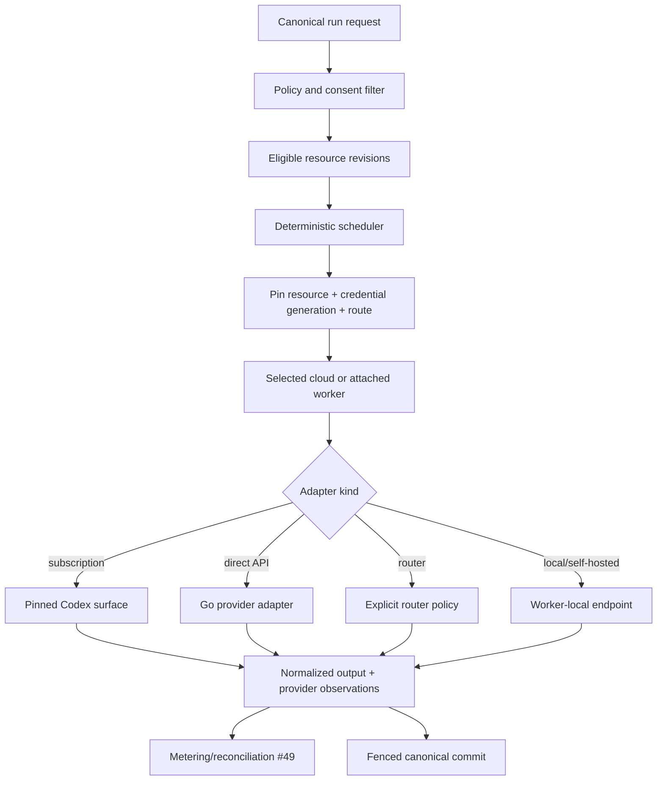

# AI resources, provider diversity, routing, and federation

Research date: 2026-08-25

Tracks: [#48](https://gitcode.com/urandon/sessionless/issues/48), [#51](https://gitcode.com/urandon/sessionless/issues/51)

Status: decision-ready research; both issues remain open for policy evidence and epic acceptance

## Decision summary

Sessionless must represent an AI resource independently from model vendor, transport provider, harness, billing account, credential, and execution placement. A model name is not an entitlement, an OpenAI-compatible endpoint is not a compatibility guarantee, and a successful request is not proof that a subscription-sharing arrangement is authorized.

The MVP keeps distinct resource kinds for personal ChatGPT/Codex subscription, enterprise/workload identity, direct API account, router credit account, local/self-hosted endpoint, and organization-managed endpoint. Every run pins the selected resource revision, credential generation, catalog snapshot, policy evidence, execution placement, and fallback policy. No adapter silently changes billing route, provider, model, data policy, or credential owner.

For OpenAI consumer subscriptions, the only locally evidenced placement is the user's attached worker with the credential retained there. That remains a product no-go until the selected production surface, provider policy, consent, isolation, cancellation/recovery, and quota evidence pass. Cloud custody of consumer credentials and household/federation sharing remain disabled. Missing, ambiguous, or expired provider authorization is a deterministic no-go, not an invitation to emulate private endpoints or reuse another application's OAuth client.

Production adapters and orchestration are Go binaries. Python SDKs and Python harnesses remain research-only comparators. Local vLLM/SGLang deployments may internally require Python, but that runtime is owned by the user/operator behind an attached endpoint and is not added to Sessionless production images or mandatory workflows.

## Evidence matrix

| Resource/surface | Primary or pinned evidence | Observed semantics | Sessionless conclusion |
|---|---|---|---|
| OpenAI ChatGPT/Codex subscription | [Codex CLI sign-in](https://help.openai.com/en/articles/11381614-api-codex-cli-and-sign-in-with-chatgpt), `docs/codex-integration-surface.md`, [#62](https://gitcode.com/urandon/sessionless/issues/62) | Subscription login and API billing are distinct; official surfaces have different automation and lifecycle contracts. | Personal attached-worker research only. API key is a separate resource, never fallback. |
| OpenCode | pinned [`3a31c4e`](https://github.com/anomalyco/opencode/tree/3a31c4ea801915c0b050df4b3842997ea62b6e93) | Catalog merges config, environment, stored auth, plugins, and provider discovery; direct Codex plugin demonstrates technical subscription access; Copilot separates model vendor, transport, and billing resource. | Useful implementation evidence, not provider authorization. Reject copied OAuth clients, private endpoint emulation, ambient env, and provider-global credential records. |
| Zed | pinned [`d9ad6af`](https://github.com/zed-industries/zed/tree/d9ad6aff67e47de43abb270d22de75dd950f1b48) | Separates direct providers, external ACP agents, and terminal-owned CLIs. | Confirms harness, provider, and placement are independent axes. |
| Hermes Agent | pinned [`c80a0a5`](https://github.com/NousResearch/hermes-agent/tree/c80a0a551c7038517456ee0aeb60203ec92aedb6) | Credential pools and multiple backends, but broad environment forwarding and Python application/runtime closure. | Competitor evidence only; not a production dependency. |
| DeepSeek Harness | pinned [`b150a55`](https://github.com/deepseek-ai/deepseek-harness/tree/b150a551b8d465e31e418e1b2eaf5e79bbb7d28e) | Plugin-seamed harness, provider-neutral log, ACP path, preview/RC protocol; credentials are API/endpoint resources. | Harness identity is separate from DeepSeek API or local DeepSeek model. Current SDK wire is rejected; later ACP conformance spike only. |
| DeepSeek API | [API](https://api-docs.deepseek.com/api/deepseek-api), [rate limits](https://api-docs.deepseek.com/quick_start/rate_limit) | API key required; account-level concurrency and `user_id` isolation; no subscription-entitlement evidence. | Direct API resource with observed provider usage/quota, not a consumer subscription. |
| Kimi/Moonshot API | [API overview](https://platform.kimi.ai/docs/api/overview), [pricing and limits](https://platform.kimi.ai/docs/pricing/limits) | OpenAI-compatible API; account recharge tier controls concurrency/RPM/TPM/TPD. | Direct API resource. Kimi consumer/coding subscription is not interchangeable without explicit provider authorization. |
| Ollama | [API documentation](https://docs.ollama.com/api), [embedding usage fields](https://docs.ollama.com/api/embed) | Local HTTP endpoint, model inventory/digests, durations and token counts; model residency is controlled locally. | Endpoint belongs to an attached worker/network placement. Owner pays hardware/power; `localhost` is never stored centrally. |
| vLLM | [OpenAI-compatible server](https://docs.vllm.ai/en/latest/serving/online_serving/openai_compatible_server/) | Broad OpenAI-compatible surface, but compatibility is partial; official docs warn API-key auth does not protect every endpoint. | Require capability probes and an external authenticated reverse proxy/isolated network. Never infer security from `--api-key`. |
| SGLang | [official documentation](https://docs.sglang.io/) | High-throughput local/self-hosted serving with OpenAI-compatible APIs and provider-routing components. | Self-hosted endpoint resource with explicit operator, version, model digest, capacity, and network boundary. |
| OpenRouter | [routing](https://openrouter.ai/docs/guides/routing/provider-selection), [usage accounting](https://openrouter.ai/docs/cookbook/administration/usage-accounting), [provider logging](https://openrouter.ai/docs/guides/privacy/provider-logging), [guardrails](https://openrouter.ai/docs/guides/features/guardrails/overview) | Router may choose providers and permits fallbacks by default; response includes native-token usage/cost; policies differ per endpoint; account/workspace guardrails can restrict spend/models/privacy. | Router is both transport and billing resource. Sessionless must set explicit provider/privacy/fallback constraints per run and record the actual route. |

## Canonical domain model

```text
AIResource {
  tenant_id, resource_id, owner_principal_id
  kind: subscription | enterprise_identity | api_account |
        router_account | local_endpoint | managed_endpoint
  provider, billing_authority, execution_placement
  credential_ref, credential_generation
  sharing_policy_id, egress_policy_id, policy_evidence_id
  catalog_revision, health_revision, lifecycle_state
}

ModelRoute {
  route_id, resource_id, provider_model_id
  model_vendor, transport_provider, billing_resource_id
  harness_kind, history_authority
  capability_set, endpoint_revision, price_revision
  data_policy_revision, region, observed_at, expires_at
}

ProviderObservation {
  resource_id, kind, value, unit
  provenance: provider_response | admin_api | operator | estimated
  observed_at, effective_at, expires_at
}

PolicyEvidence {
  account_plan, surface, placement, credential_custodian, sharing_shape
  authoritative_source, observed_at, decision_owner
  verdict: go | conditional | no_go | unknown
  expires_at, recheck_triggers
}
```

Provider-native thread IDs and harness state remain attempt diagnostics. Sessionless `Session`, `Run`, and `Attempt` remain canonical. Catalog, price, entitlement, availability, quota, and actual billing are distinct observations with their own freshness and provenance.

## Architecture and routing



Eligibility is an intersection, never a union:

```text
membership
AND resource ACL
AND unexpired provider-policy evidence
AND user egress/placement consent
AND model/tool capability requirements
AND data-residency/privacy policy
AND budget and concurrency admission
AND healthy placement
```

The scheduler selects only before an attempt starts. Mid-attempt provider, resource, credential, endpoint, or model fallback is forbidden. A retry may select another route only as a new attempt with a user/policy-approved fallback set and an explicit audit reason.

## Resource classes and fallback semantics

| Class | Credential/cost owner | Catalog/quota authority | Allowed fallback |
|---|---|---|---|
| Personal subscription | Individual user; credential remains on attached worker | Provider-native account observations when available; otherwise unknown | None without a newly approved resource/attempt. |
| Enterprise/workload identity | Organization/tenant | Provider workspace/admin contract | Only within an administrator-approved resource pool and data policy. |
| Direct API | User, tenant, or platform account explicitly selected | Provider response plus admin cost/usage API | Other keys/routes only if listed in resource policy; never subscription or platform credit silently. |
| Router account | Router workspace/credit owner | Router response plus actual provider route | Set `allow_fallbacks=false` by default; explicit ordered providers, max price, data collection, and ZDR constraints when supported. |
| Local Ollama | Worker owner | Endpoint inventory and local capacity observation | Other local model only if capability/policy allows a new attempt. |
| Self-hosted vLLM/SGLang | Operator/tenant/federation owner | Endpoint inventory, deployment configuration, hardware metrics | Only within the same declared pool and model/license policy. |

OpenAI-compatible means only that some wire shapes overlap. Every adapter negotiates or probes streaming, structured output, tools, cancellation, usage, finish reasons, context limits, image/audio, idempotency, and error classes. Unlisted model IDs and advisory capability flags do not pass conformance automatically.

## Federation and sharing policy

Federation is a resource ACL and accounting layer, not credential copying. The platform may share only a resource whose provider/license terms and credential form permit the exact use.

| Shape | Default verdict | Required evidence to change verdict |
|---|---|---|
| User's local Ollama/vLLM/SGLang shared with the same user | Conditional go | Worker ownership, model license, capacity/budget, network and data policy. |
| User-owned local endpoint shared with named tenant members | Conditional no-go until configured | Explicit owner consent, model license, per-member ACL/quota, host threat model, revocation. |
| Organization API/enterprise resource shared inside its workspace | Conditional | Provider organization terms, admin approval, workspace membership, cost attribution, data policy. |
| Personal ChatGPT/Codex subscription used by its owner on attached worker | Research-only | Current official surface/policy evidence, consent, isolation, billing/quota route, cancellation/recovery. |
| Personal subscription shared with household/federation | No-go | Explicit authoritative provider authorization for that exact arrangement; technical feasibility is insufficient. |
| Consumer credential held in Sessionless cloud | No-go | Explicit provider authorization, custody/legal decision, consent, tenant isolation, refresh/revocation and incident evidence. |

Each resource has owner, beneficiaries, scheduling policy, concurrency, budget, provider-policy evidence, and revocation generation. Beneficiaries never receive the underlying credential. Removing membership fences new attempts and invalidates cached eligibility; in-flight behavior follows the resource's documented revoke policy.

## Cost, quota, and capacity model

Admission uses four independent budgets:

1. provider entitlement/quota, observed without inventing remaining values;
2. monetary budget using a versioned price source and currency;
3. platform compute/network/storage budget;
4. local capacity budget such as GPU memory, queue depth, thermal/power policy, and owner availability.

Estimated cost is useful for admission but never replaces provider billing evidence. The canonical usage event records tokens/requests/time with source provenance; reconciliation later attaches provider/router/cloud invoice facts. Subscription quota that exposes only percentage/reset buckets remains an observation, not a currency conversion. Local inference records hardware seconds and energy only when the owner enables/defines those estimates.

Router and self-hosted choices illustrate why cost is multi-dimensional: OpenRouter can report actual upstream inference cost, while local Ollama reports durations and token counts but not the owner's electricity or hardware amortization. The UI must label observed, reconciled, and estimated values separately.

## Threat model

| Threat | Control |
|---|---|
| Credential used by wrong tenant/resource | Opaque credential ref, owner/ACL check, generation pinning, invocation materialization, fenced refresh/writeback. |
| Subscription/API billing confusion | Resource kind and billing authority are immutable for an attempt; no environment-based fallback. |
| Router changes actual provider or data policy | Explicit route constraints; record actual provider/region/privacy observation; fail if unmet or unknown. |
| Stale model/catalog/price facts | Provenance plus expiry; stale state is visible and cannot silently authorize a new capability. |
| Local endpoint exposed outside intended worker | Placement-bound endpoint, replacement network policy, authenticated proxy, no central `localhost`. |
| vLLM/SGLang management endpoint bypass | External reverse proxy/network isolation; conformance includes every exposed path, not only `/v1`. |
| Federation quota theft/starvation | Beneficiary budgets, fair queueing, owner reserve, concurrency lease, immutable usage attribution. |
| Provider terms drift | Versioned policy evidence with expiry and re-review triggers; expired evidence means no-go. |
| Cross-provider data exfiltration | Per-run egress policy and consent pin the provider, region, retention/training constraints, attachments, tools, and memory classes. |
| Model license violation | Store model artifact/license provenance and allowed-use class; deny unknown or incompatible terms. |

## Decisions and rejected alternatives

Accepted:

- canonical `AIResource` plus separate route, credential generation, catalog, policy, price, and observation revisions;
- attached-worker locality for personal subscription and local endpoints;
- explicit route and fallback set per attempt;
- provider-specific adapters behind a Go contract, with conformance tests;
- federation only where provider/license policy affirmatively allows it;
- missing entitlement, quota, price, or policy facts stay unknown.

Rejected:

- `provider -> credential` singleton records;
- model-name-only routing;
- treating OpenAI-compatible APIs as feature/security compatibility;
- OpenCode/Zed private OAuth/backend mechanics as provider permission;
- copying personal credentials into a shared pool;
- default OpenRouter provider fallback;
- API-key fallback when subscription/local resources fail;
- Python SDK or Hermes/DeepSeek Harness runtime in Sessionless production images.

## Open questions

1. Can OpenAI provide an authoritative policy verdict for personal attached-worker product integration and any sharing shape?
2. Which provider admin APIs offer reconcilable cost/usage at user, workspace, key, and project scope?
3. What minimum conformance profile is common across direct APIs, routers, and local endpoints without hiding important differences?
4. Which local-model licenses permit tenant/federation service, and who owns update/vulnerability response?
5. How should owner-reserved capacity and beneficiary fairness interact when an attached GPU is intermittently available?
6. Which catalog observations can remain stale for read-only display but must block execution?

## Proposed epics

### Subscription Resource epic (#48)

| Work item | Estimate | Dependencies | Acceptance |
|---|---:|---|---|
| SR-01 policy-evidence registry and expiry workflow | 5 SP | #62 | Each plan/surface/placement/custody/sharing tuple has a dated verdict; unknown blocks. |
| SR-02 resource/credential-generation contracts | 5 SP | #59, #60 | CAS refresh, revoke, disconnect, and owner checks are race-tested. |
| SR-03 attached-worker Codex resource UX/consent | 5 SP | #47, #64 | User sees exact egress, placement, resource, and no-fallback policy. |
| SR-04 pinned Go-supervised Codex exec adapter | 8 SP | #64; replaces #61 production activation | One fenced canonical turn; cancellation/reap/writeback evidence; no App Server/Python/API fallback. |
| SR-05 quota/account observation contract and reconciliation hooks | 5 SP | #49 MM-01 | Missing values remain unknown; observations include provenance/freshness. |
| SR-06 adversarial owner/revocation E2E | 8 SP | SR-01–SR-05 | Cross-owner, stale credential, revoke/reconnect, and policy-expiry paths fail closed. |

### AI Provider Resources epic (#51)

| Work item | Estimate | Dependencies | Acceptance |
|---|---:|---|---|
| PR-01 canonical resource/route/catalog contracts | 8 SP | #49 MM-01, SR-02 | Model vendor, transport, billing, harness, placement, and history authority are separate. |
| PR-02 provider conformance kit and fixtures | 8 SP | PR-01, #63 | Capability/error/usage/cancel/privacy profiles are reproducible and versioned. |
| PR-03 direct API adapters: DeepSeek and Kimi | 8 SP | PR-02 | Go adapters pass conformance with fake servers; no real key in CI. |
| PR-04 local endpoint adapters: Ollama, vLLM, SGLang | 8 SP | #47, PR-02 | Placement-bound discovery; external auth/network invariants; no central localhost. |
| PR-05 OpenRouter explicit routing adapter | 5 SP | PR-02 | Fallback off by default; actual route/usage/data-policy evidence captured. |
| PR-06 scheduler, budgets, federation ACL | 8 SP | #9, #47, #49, PR-01 | Deterministic pre-attempt selection, fairness, owner reserve, revoke fencing. |
| PR-07 end-to-end multi-resource canary | 8 SP | PR-03–PR-06 | No silent provider/billing/placement change; rollback disables each adapter independently. |

Rollout: fake-provider conformance -> maintainer-owned local endpoint -> one direct API canary -> opt-in tenant adapters. Subscription remains separately gated. Rollback marks a route unavailable and stops new attempts; it never silently chooses another resource.

Success metrics: eligible-route calculation latency, conformance pass rate, catalog freshness, provider-vs-product failure attribution, observed/reconciled usage coverage, scheduler fairness, route-policy violations, cost variance, and zero unauthorized federation/billing fallbacks.
