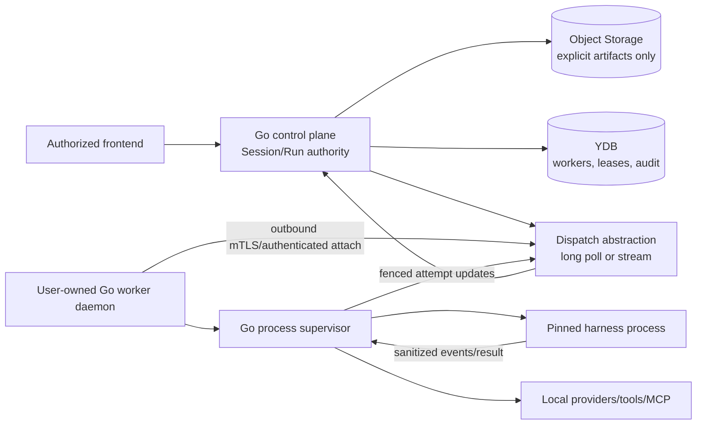
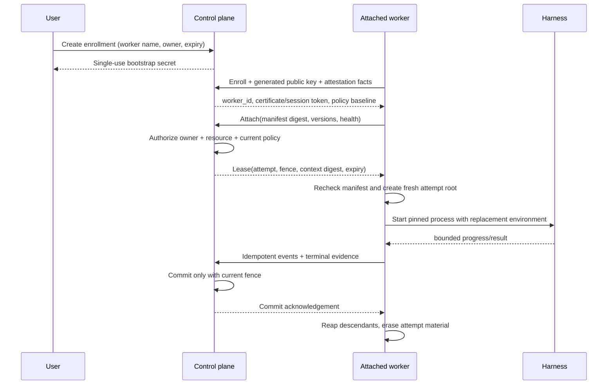

# Attachable workers: product, protocol, security, and operating model

Research date: 2026-08-25

Tracks: [#47](https://gitcode.com/urandon/sessionless/issues/47)

Status: decision-ready research; the issue remains open for epic acceptance and decomposition

## Decision summary

Sessionless should model a user-managed worker as a revocable, owner-scoped compute resource, not as a trusted extension of the control plane. The first supported placement is a single-user attached worker that keeps subscription credentials and local endpoints on the user's host. It initiates an authenticated outbound connection, advertises a signed/versioned capability manifest, and receives one fenced attempt at a time. Sessionless remains authoritative for `Session`, `Run`, `Attempt`, authorization, quotas, and terminal commit.

The MVP protocol should support both a bounded long poll and a bidirectional stream behind the same Go interface. Long polling is the operational default at small scale because it preserves the current serverless control plane; a dedicated connection gateway is enabled only when measured latency and request cost justify an always-on service. A long-lived connection must never hold a Yandex Serverless Container invocation open: container compute is billed by invocation duration, so that design converts idle presence directly into cost.

Production remains Go-first. Enrollment, gateway, scheduler, and worker supervision ship as Go binaries. Python SDKs and Python agent applications may be research comparators, but are not production dependencies, images, sidecars, or mandatory developer tooling.

## Evidence and prior art

| Source | Dated observation | Useful pattern | Boundary for Sessionless |
|---|---|---|---|
| [GitHub self-hosted runners](https://docs.github.com/en/actions/reference/runners/self-hosted-runners) | read 2026-08-25 | GitHub recommends ephemeral runners for autoscaling; a one-job runner reduces state carry-over and compromised-runner reuse. | Sessionless may keep a daemon connection, but every attempt gets a fresh work root, credentials, capability snapshot, and process group. |
| [Cloudflare Tunnel](https://developers.cloudflare.com/tunnel/) | read 2026-08-25 | Outbound-only tunnels avoid inbound ports and public host addresses. | Prior art for connectivity, not an authorization plane or required dependency. Sessionless uses its own owner-bound enrollment and job protocol. |
| [Tailscale auth keys](https://tailscale.com/docs/features/access-control/auth-keys) | read 2026-08-25 | Expiring, ephemeral, tagged enrollment credentials and explicit device identity. | Bootstrap secrets must be single-use and short-lived; worker identity is not user identity and cannot inherit a user's full authority. |
| Zed [`d9ad6af`](https://github.com/zed-industries/zed/tree/d9ad6aff67e47de43abb270d22de75dd950f1b48) | pinned source | ACP has initialize/version/capability negotiation, explicit session lifecycle, deduplicated load, reference-counted close, and local/remote placement. | ACP is useful protocol prior art; provider-agent approvals remain subordinate to Sessionless policy. |
| Hermes Agent [`c80a0a5`](https://github.com/NousResearch/hermes-agent/tree/c80a0a551c7038517456ee0aeb60203ec92aedb6) | pinned source | Local, Docker, SSH, and cloud terminal backends; daemon/service packaging; lazy environment creation and idle cleanup. | Hermes lacks the owner-bound outbound attach protocol and is Python-heavy. It remains competitor evidence, never a dependency. |
| OpenCode [`3a31c4e`](https://github.com/anomalyco/opencode/tree/3a31c4ea801915c0b050df4b3842997ea62b6e93) | pinned source | Local server and externally attached UI; routing chooses a concrete local/remote workspace. | Full host environment inheritance and directory-scoped approvals are unacceptable. `localhost` has meaning only inside the selected worker. |
| [Yandex Serverless Containers pricing](https://yandex.cloud/en/docs/serverless-containers/pricing) | updated 2026-07-23 | Compute is billed by memory, vCPU, and invocation duration, rounded to 100 ms; invocations and egress are additional dimensions. | Never park idle worker streams in request-bound serverless invocations. Measure a dedicated gateway separately. |

## Canonical resource model

```text
AttachedWorker {
  tenant_id, owner_user_id, worker_id
  display_name, platform, architecture
  enrollment_generation, identity_public_key
  desired_state, observed_state, last_seen_at
  software_version, protocol_versions
  capability_manifest_digest, policy_revision
  placement_labels, concurrency_limit
}

WorkerConnection {
  connection_id, worker_id, connection_generation
  transport, connected_at, last_heartbeat_at, expires_at
  peer_key_digest, protocol_version, drain_state
}

CapabilityManifest {
  manifest_id, worker_id, revision, digest
  harnesses[], providers[], models[], tools[], mcp_servers[]
  filesystem_roots[], network_classes[], sandbox_properties
  capacity, health, observed_at, expires_at
}

ExecutionLease {
  tenant_id, run_id, attempt_id, worker_id
  lease_generation, fence_token, expires_at
  context_digest, capability_manifest_digest, policy_revision
}
```

Worker ownership, credential ownership, provider resource, harness process, connection, and execution lease are separate records. A capability advertisement is evidence for scheduling, not authorization. The control plane intersects it with membership, resource ACL, run policy, and current revocations at dispatch and again before every privileged effect.

## Architecture





## Connectivity alternatives and cost model

Let `N` be registered workers, `A` the concurrently attached fraction, `h` the heartbeat interval in seconds, `B` broker instance cost per month, `R` per-request cost, and `D` request-bound duration cost. Exact currency values must be refreshed from the deployment region before an apply.

| Alternative | Monthly activity | Latency | Cost/failure consequence | Decision |
|---|---:|---|---|---|
| 30-second polling | `N * 86,400` polls | <=30 s | 100 workers = 8.64M, 1,000 = 86.4M, 10,000 = 864M polls/month; avoid. | Rejected. |
| Five-minute idle long poll plus explicit wake | `N * 8,640` maximum polls | warm wake seconds; offline-safe | 100 = 864k, 1,000 = 8.64M, 10,000 = 86.4M polls/month. Add jitter/backoff and stop polling when host sleeps. | MVP default for small population; benchmark. |
| Persistent stream held by serverless invocation | approximately `N * A * month` invocation time | lowest | Directly bills idle memory/vCPU duration and couples reconnect storms to container scale. | Rejected. |
| Dedicated Go connection gateway | `B + egress + state writes`; multiplexed streams | lowest | Fixed floor, connection limits, zonal recovery, drain and upgrade complexity. | Later, when measured poll cost or latency crosses a documented threshold. |
| Third-party tunnel/mesh | vendor plan plus gateway | low | Additional trust, identity, availability, and data-processing dependency. | Optional operator transport only, never product authorization. |

The scheduler stores only coarse presence transitions and leased work in YDB. Heartbeats are coalesced in gateway memory and checkpointed on meaningful state changes or a bounded interval. Do not write each heartbeat as an immutable event. An offline worker is normal state, not an incident.

## Security invariants and threat analysis

| Threat | Mandatory control |
|---|---|
| Stolen/replayed bootstrap secret | Single use, short TTL, audience/repository binding, server-side consumed marker, generated worker key proof. |
| Worker impersonation | Rotatable asymmetric worker identity; connection-generation fencing; certificate/token bound to `worker_id` and owner. |
| Cross-tenant scheduling | Tenant-first lookup plus active membership/resource ACL; exact `tenant_id/run_id/attempt_id` in every lease and mutation. |
| Split brain/reconnect race | Monotonic connection and lease generations; only the current fence may emit terminal state. |
| Capability bait-and-switch | Immutable manifest digest pinned to the attempt; revalidate before start; changed capability requires redispatch. |
| Host compromise | Treat worker output as untrusted; sanitize/bound frames; no control-plane credential; revocation kill switch. User-managed isolation changes responsibility, not platform authorization. |
| Ambient credential/tool leakage | Replacement environment, explicit readable roots, deny-by-default network classes, no inherited HOME/plugins/MCP/config. |
| Confused deputy/tool escalation | Provider approval is advisory; Sessionless effect taxonomy and call-time grants are authoritative. |
| Offline/ambiguous completion | Attempt remains nonterminal until fenced commit; retry creates a new attempt; side-effecting tools require idempotency/reconciliation evidence. |
| Malicious update | Pinned digest/signature/SBOM, staged update, protocol compatibility window, canary and rollback. |

Untrusted tools must not read the persistent credential home. Subscription credentials remain connection-local and are exposed to a pinned harness only through the invocation-scoped lifecycle defined in `docs/credential-lifecycle.md`.

## Product and operator experience

The user sees worker state, last contact, version, capabilities, active attempt, resource owner, and why a run was or was not eligible. Enrollment requires an explicit name and expiry. Revocation immediately fences new work and tells a connected worker to drain/erase; it does not claim remote erasure without an acknowledgement. The daemon supports foreground, OS service, and container modes, with `status`, `doctor`, `drain`, `update --check`, `logout`, and `uninstall --dry-run`. Default onboarding exposes no inbound port and never imports the host shell environment.

## Decisions, rejected alternatives, and open questions

Accepted:

- outbound attach; canonical state stays in Sessionless;
- single-user owner scope first; no household/federation scheduling in MVP;
- one active credential-bearing attempt per personal subscription resource;
- manifest pinning, execution fencing, fresh attempt roots, and replacement environment;
- transport abstraction with bounded long poll first and stream later;
- Go production components only.

Rejected:

- direct inbound SSH from Sessionless;
- shared writable worker workspace across users or attempts;
- ambient MCP/tool/provider discovery as authorization;
- holding idle connections in Serverless Container invocations;
- silent cloud fallback when an attached worker is offline;
- treating ACP/provider thread IDs as Sessionless identity.

Open questions requiring prototype evidence:

1. Which Yandex endpoint can deliver an authenticated wake without adding an always-on broker?
2. What attachment size crosses from inline encrypted transfer to exact-object capability?
3. What platform-specific sandbox guarantees are supportable on macOS, Linux, and Windows?
4. How quickly can revocation interrupt a disconnected or sleeping host, and how is non-acknowledgement shown?
5. At what measured `N`, attached ratio, and latency SLO does a dedicated gateway cost less than polling?

## Proposed Attachable Worker epic

| Phase | Issue | Estimate | Dependencies | Acceptance signal |
|---|---|---:|---|---|
| 1 | AW-01 domain contracts, enrollment, worker identity, generations | 5 SP | #20, #58 | Cross-owner lookup and replayed enrollment fail closed. |
| 1 | AW-02 protocol schemas, version/capability negotiation, fixtures | 5 SP | AW-01 | Go conformance fixtures cover upgrade/downgrade and malformed/oversized frames. |
| 2 | AW-03 outbound long-poll transport, jitter/backoff/wake | 8 SP | AW-02 | Sleep/reconnect/offline tests are bounded; idle YDB writes meet budget. |
| 2 | AW-04 fenced dispatch, drain, cancel, ambiguous completion | 8 SP | AW-02, #9 | Split-brain and stale terminal writes are rejected. |
| 2 | AW-05 Go daemon packaging and supervisor isolation | 8 SP | AW-02, #59, #60, #64 | Pinned harness runs with replacement env; descendants and attempt data are removed. |
| 3 | AW-06 resource/capability UX and diagnostics | 5 SP | AW-03, AW-05 | User can enroll, inspect, drain, revoke, and understand ineligibility. |
| 3 | AW-07 adversarial security and two-owner E2E | 8 SP | AW-03–AW-06 | No cross-owner data/capability/credential path; revocation and reconnect races pass. |
| 4 | AW-08 connection-gateway benchmark and decision | 5 SP | AW-03, #49 | Cost/latency curves identify a measured migration threshold. |

Rollout: internal loopback fixture -> one maintainer-owned host -> opt-in single-user canary -> bounded beta. Rollback disables enrollment and new dispatch, drains current leases, and leaves cloud execution unchanged; it never silently reroutes a subscription-backed run.

Success metrics: enrollment success, attach-to-eligible latency, dispatch p50/p95, reconnect recovery, stale-fence rejection, cancellation grace, idle control-plane RU/requests per worker-day, daemon RSS/disk, and zero cross-owner/adversarial escapes. Security invariants are non-compensable release gates.

## Required follow-ups

- #48 records whether each provider permits the exact attached-worker credential/use shape.
- #51 represents local endpoints as capabilities of this worker, never as central `localhost` URLs.
- #49 defines canonical usage and connection-cost events without heartbeat write amplification.
- #46 owns platform tool/effect grants; the worker only enforces the attenuated manifest.
- #64 supplies the first pinned `codex exec` latency baseline and remaining cancel/recovery evidence.
