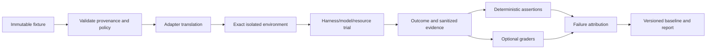

# Harness-neutral personal-agent evaluation and regression gates

Status: research/design artifact for [issue #63](https://gitcode.com/urandon/sessionless/issues/63), dated 2026-08-25. The issue remains open for design acceptance and epic creation.

## Evidence vocabulary

- **Documented**: stated by a first-party framework, benchmark, provider, or standards source.
- **Observed**: verified in pinned source or controlled Sessionless evidence.
- **Inferred**: a Sessionless design conclusion based on documented or observed facts.
- **Unknown**: requires a representative corpus, repeated trials, provider access, or cost measurement.

Pinned competitor code evidence uses OpenCode `3a31c4ea801915c0b050df4b3842997ea62b6e93`, Zed `d9ad6aff67e47de43abb270d22de75dd950f1b48`, Hermes Agent `c80a0a551c7038517456ee0aeb60203ec92aedb6`, and DeepSeek Harness `b150a551b8d465e31e418e1b2eaf5e79bbb7d28e`.

## Recommendation

Build a small Go-owned, harness-neutral evaluation contract before building a large evaluation service. Fixtures describe Sessionless product tasks, authorized inputs, capabilities, environment, and expected outcomes; adapters translate these to Codex, OpenCode, Hermes, DeepSeek Harness, API models, deterministic fakes, or attached workers without adopting their native transcript as canonical.

Separate four questions:

1. **Protocol correctness:** did the adapter obey lifecycle, bounds, cancellation, and evidence contracts?
2. **Safety correctness:** did it preserve tenant, permission, credential, destructive-action, egress, and deletion invariants?
3. **Task outcome:** did the final environment or canonical product state satisfy executable assertions?
4. **Quality/efficiency:** how useful, robust, fast, and expensive was the behavior across repeated trials?

Safety failures are non-compensable. A higher aggregate quality score cannot offset unauthorized access, credential exposure, destructive-policy failure, or deletion failure.

## Source-backed landscape

| Source | Evidence | Useful pattern | Sessionless limitation or lesson |
| --- | --- | --- | --- |
| Anthropic agent-eval guidance | **Documented** in [Demystifying evals for AI agents](https://www.anthropic.com/engineering/demystifying-evals-for-ai-agents) | Defines task, trial, grader, transcript, outcome, evaluation harness, and agent harness; recommends multiple trials and outcome-based grading. | Provider guidance is not a cross-provider evidence format; transcripts may contain sensitive reasoning/tool data and need Sessionless governance. |
| Anthropic infrastructure-noise study | **Documented** in [Quantifying infrastructure noise](https://www.anthropic.com/engineering/infrastructure-noise) | Shows agentic benchmark scores can move materially with resource configuration; infrastructure must be a first-class experimental variable. | Public leaderboard deltas cannot be treated as product regressions without controlling worker/runtime resources. |
| OpenAI Evals | **Documented** in the [Evals API](https://platform.openai.com/docs/api-reference/evals) and [evaluation guidance](https://developers.openai.com/api/docs/guides/evals) | Versioned data sources, runs, and graders support repeatable model evaluation. | Hosted evaluation is not appropriate for raw private Session history and can couple scoring to one provider. |
| Inspect AI | **Documented** in [Inspect](https://inspect.aisi.org.uk/) and its [reference](https://inspect.aisi.org.uk/reference/) | Separates datasets, agents/solvers, tools/sandboxes, scorers, logs, retries, and analysis; bridges external agents including Codex CLI and Claude Code. | It is a Python framework and therefore a research comparator, not a mandatory production dependency in the Go/serverless Sessionless runtime. |
| SWE-bench Verified | **Documented** in OpenAI's [Verified introduction](https://openai.com/index/introducing-swe-bench-verified/) and the [official repository](https://github.com/SWE-bench/SWE-bench) | Human-reviewed real-world issues and executable repository tests demonstrate outcome grading. | Coding-only public tasks do not represent personal-agent permissions, memory, frontends, or provider-resource behavior; contamination is possible. |
| Terminal-Bench | **Documented** by the [official benchmark](https://www.frontierbench.ai/) | Measures tool-using agents in terminal environments and reports uncertainty/cost. | Environment and scaffold materially affect results; it is expensive and not a release gate for Sessionless product semantics. |
| Hermes Agent | **Observed** in pinned [background review](https://github.com/NousResearch/hermes-agent/blob/c80a0a551c7038517456ee0aeb60203ec92aedb6/agent/background_review.py) and [skill usage](https://github.com/NousResearch/hermes-agent/blob/c80a0a551c7038517456ee0aeb60203ec92aedb6/tools/skill_usage.py) | Separates learning review from the foreground turn and records skill activity. | Activity/reuse is not measured downstream correctness; learned artifacts lack mandatory held-out promotion gates. |
| DeepSeek Harness | **Observed** in pinned [architecture](https://github.com/deepseek-ai/deepseek-harness/blob/b150a551b8d465e31e418e1b2eaf5e79bbb7d28e/docs/architecture.md), [SDK protocol](https://github.com/deepseek-ai/deepseek-harness/blob/b150a551b8d465e31e418e1b2eaf5e79bbb7d28e/packages/sdk/protocol/README.md), and [ACP](https://github.com/deepseek-ai/deepseek-harness/blob/b150a551b8d465e31e418e1b2eaf5e79bbb7d28e/packages/acp/acp/README.md) | Replaceable seams and fresh-session ACP are useful adapter comparison points. | Developer-preview SDK lacks version negotiation, terminal prompt result, cancellation, and session close; runtime-wide event broadcast and unbounded queues are negative protocol fixtures. |
| Sessionless #64 | **Observed** in [issue #64](https://gitcode.com/urandon/sessionless/issues/64) | Pinned `codex exec` completed 30/30 exact-output, tool-free, ephemeral cold trials; completion min/p50/p95/p99/max was 6.119/9.864/23.000/26.471/26.471s; first-event p50/p95 was 101/223ms; invocation residue was zero. | Happy path only. Account/billing route, cancellation, crash/restart, quota, refresh/writeback, and ambiguous completion remain unproven. |

## Evaluation taxonomy and failure attribution

Suites should be orthogonal so a failure has one primary owner:

| Suite | Examples | Primary attribution |
| --- | --- | --- |
| Domain/protocol | context reconstruction, event ordering, call/result schema, output bounds | Sessionless contract or adapter |
| Isolation/permission | cross-tenant IDs, revoked grant, denied destructive call, secret paths, egress | control plane, worker, or tool gateway |
| Harness lifecycle | spawn, handshake, progress, interrupt, kill, descendant cleanup, restart | harness adapter/runtime |
| Provider resource | auth route, quota observation, rate limit, outage, model availability | provider/resource adapter |
| Product task | canonical message, artifact, session action, automation outcome | agent+model+harness as a system |
| Memory/skill | recall provenance, conflict, deletion, learned-skill utility | #45/#52 subsystem plus agent |
| Reliability | retry, duplicate, ambiguous side effect, DLQ/reconcile | orchestration/tool adapter |
| Performance/cost | cold/warm latency, RSS, disk, tokens, network, cloud duration | exact environment and resource tuple |

Failure classification precedence:

1. fixture/environment invalid;
2. policy or security invariant failed;
3. Sessionless protocol/product regression;
4. harness/adapter lifecycle failure;
5. provider outage/quota/auth state;
6. model/task-quality failure;
7. grader uncertainty.

The runner records all applicable facts but selects one primary classification using deterministic evidence. Provider outage never lowers a task-quality baseline; it produces an unavailable trial. A product timeout caused by an undersized worker remains an environment/product result, not model quality.

## Canonical fixture and evidence contract

A fixture is immutable and contains no provider-native thread:

```text
fixture_id/version/digest
task_kind and product requirement
input manifest: canonical event/artifact references or synthetic inline data
tenant/user/session/resource roles (synthetic identifiers)
required/optional/forbidden capabilities
environment image/toolchain/resource limits/network policy
attempt count, deadline, cancellation and seed policy
deterministic assertions and optional scoring rubric
data provenance, license, consent, retention and deletion policy
```

An evaluation attempt records:

```text
evaluation_run_id, trial_id, fixture digest, adapter/harness/model/resource versions,
worker/environment digest and limits, policy/capability manifests, start/end/deadlines,
terminal classification, sanitized event counters and artifact digests,
exact assertion results, scores with grader provenance, usage/cost observations,
retry lineage, redaction report, and evidence bundle digest
```

Raw model output, prompts, reasoning, auth material, provider error bodies, private tool payloads, and account identifiers are not public artifacts. Private evidence storage is tenant/research-program scoped with declared retention and deletion. Public reports contain aggregates, schemas, exact versions/digests, and sanitized failure classes.

Adapters must declare `supported`, `unsupported`, or `skipped` for each capability. Unsupported is not failure when the fixture marked the capability optional; it is a deterministic incompatibility when required. No adapter silently emulates a forbidden or absent capability through another provider/tool.



## Corpus and privacy governance

Corpus tiers:

- synthetic contract and adversarial fixtures committed to the repository;
- generated property/fuzz cases with reproducible seeds;
- public licensed tasks pinned to exact versions;
- private manually authored product scenarios;
- de-identified production-derived cases only with explicit authorization, necessity, retention, and deletion paths.

No raw private session automatically becomes a fixture. Selection requires a provenance record, allowed purposes, reviewers, content/secret scan, tenant owner or policy authorization, retention, and deletion propagation. Provider-specific corpora are not replayed to another provider unless their consent and data-handling terms permit it.

Hold out promotion cases for memory/skills to prevent evaluation on extraction sources. Record fixture exposure to agents and public repositories as contamination risk. Rotate or synthesize cases when a benchmark becomes saturated, but preserve old baselines for historical comparisons.

## Scoring and release gates

Use executable outcome assertions wherever possible. Model graders are appropriate for bounded subjective dimensions only after calibration against human labels. Store grader model/prompt/version and disagreement; never let the same agent grade its hidden reasoning as the sole verdict.

For stochastic tasks, run repeated independent trials and publish numerator/denominator, pass@k where relevant, distribution, and confidence/uncertainty. A single unexplained sample cannot block a release. Baselines are immutable tuples of fixture set, adapter, harness, model/resource, environment, and policy versions; rebaselining requires an explicit reviewed reason.

Non-compensable gates:

- tenant/project/session/resource isolation;
- membership, grant, approval, and revocation enforcement;
- no secret or credential disclosure;
- forbidden tool/MCP/network/filesystem effects do not occur;
- destructive or external-human effects require the declared approval;
- deletion/forget guarantees complete within their declared bounds;
- no API-billing or cross-user-resource fallback;
- cancellation/deadline cannot accept late output or reuse a stale fence.

Weighted quality, latency, or cost scores are evaluated only after all applicable hard gates pass.

## Tiered execution and cost model

| Tier | Contents | Cadence | Cost policy |
| --- | --- | --- | --- |
| Per-change | Deterministic contracts, fakes, security negatives, tiny fixed agent smoke | Every relevant MR | Credential-free by default; strict minutes/bytes budget. |
| Nightly | Representative task subset, repeated stochastic trials, failure/cancel cases | Scheduled when code/provider changed | Fixed daily token/compute cap; skip with visible budget state. |
| Release | Full mandatory product, isolation, provider, migration, and rollback suite | Candidate digest | Explicit approved resource budget; no silent provider fallback. |
| Provider/model change | Adapter conformance, task sample, latency/cost and baseline comparison | Before enabling new version | Resource-owner or research budget; exact old/new tuple. |
| Incident | Minimal reproducer plus affected regression family | On reviewed incident workflow | Private bounded evidence; retention tied to incident policy. |

Architecture alternatives:

| Alternative | Advantages | Risks | Decision |
| --- | --- | --- | --- |
| Adopt a Python evaluation platform as production authority | Rich ecosystem and existing adapters. | Violates the Go/serverless monolithic runtime requirement; large dependency/supply-chain closure; product semantics drift to framework. | Reject. Use Inspect as research/reference only. |
| Build a large Sessionless evaluation service immediately | Full control. | High cost before fixtures and decisions stabilize; duplicates mature tooling. | Reject. |
| Go contract/runner plus optional external adapters and offline analysis | Portable production gates, exact Sessionless semantics, small runtime; research frameworks can consume/export evidence. | Requires adapter work and a deliberately small schema. | **Recommended.** |

Exact usage facts are attributed through #49. Sampled logs/traces cannot decide billing. Cost budgets include model/judge calls, worker/container duration, tool/MCP external calls, artifact storage/retention, and scheduled orchestration. Early suites prefer deterministic assertions and fakes; expensive public benchmarks are periodic research, not CI gates.

## Memory and learned-skill promotion gates

Memory extraction and skill learning are evaluated on future utility, not reconstruction of their source sessions.

Required gates:

- source provenance and permission validity;
- held-out tasks from the same declared scope plus adversarial contamination/conflict cases;
- comparison against no-memory/no-skill and previous-version baselines;
- correctness, downstream task success, correction rate, irrelevant recall/invocation, latency, tokens, and cost;
- deletion/revocation propagation;
- canary scope, monitoring window, and automatic rollback criteria.

A learned artifact cannot pass because it was invoked frequently. A memory item cannot pass because it made the answer more fluent while increasing false recall or cross-scope contamination.

## Production-feedback boundary

Privacy-safe product signals may include explicit helpful/correction feedback, retry/abandonment, approval denial, tool/skill outcome, fallback/resource switch, latency, and exact usage references. They are analytics inputs, not canonical Session content, audit evidence, or evaluation labels by default.

Shadow/replay evaluation requires explicit authorization and an allowlisted fixture transformation. Online A/B changes preserve non-compensable gates and resource consent. A sampled trace never contains prompt/tool payload labels that can leak private content or create high cardinality.

## Decisions, rejected alternatives, and unknowns

Accepted recommendations:

- Sessionless-owned Go fixture/evidence contract with optional external analysis adapters;
- outcomes and product state outrank transcript style;
- structural, safety, task, and efficiency results remain separate;
- repeated trials and immutable baselines for stochastic behavior;
- exact environment/resource configuration is part of every result;
- private evidence and public aggregate artifacts are distinct;
- memory/skill promotion requires held-out future utility.

Rejected:

- treating a harness-native transcript or tool schema as canonical;
- one aggregate score that compensates for security failures;
- single-sample release failures without deterministic evidence;
- provider errors counted as model-quality failures;
- model judge as sole grader for executable outcomes;
- raw private-session upload to hosted benchmark services;
- mandatory Python runtime/SDK in production or normal CI;
- optimizing Sessionless for one coding leaderboard.

Open questions:

- What initial private product-task set best predicts personal-agent usefulness beyond coding?
- What minimum repeated-trial count is affordable for nightly and release tiers?
- Which subjective dimensions require human-calibrated graders at MVP?
- Which evidence fields can be public without leaking provider/account or product details?
- How should baseline policy handle provider models that change without stable version identifiers?
- Which #64 failure/cancel/quota experiments are mandatory before re-scoping #61/#13?

## Proposed Agent Evaluation epic

| Phase | Issue-sized outcome | Dependencies | Estimate | Acceptance evidence |
| ---: | --- | --- | ---: | --- |
| 1 | Define fixture, environment, capability, trial, evidence, and classification schemas | #4, #20, #63 | 5 SP / 3d | Versioned fixtures, strict decoders, stable digests, unsupported semantics. |
| 2 | Implement Go local runner with deterministic fake and evidence redaction | phase 1, #10, #24 | 8 SP / 5d | Reproducible success/failure/cancel/timeout/oversize cases and zero secret leakage. |
| 3 | Add harness/resource adapter conformance kit | phases 1-2, #46, #47, #51, #64 | 8 SP / 5d | Same fixture across fake, Codex candidate, and one alternate adapter; exact version evidence. |
| 4 | Add corpus registry, consent/license/retention/deletion governance | phase 1, #25, #45 | 5 SP / 3d | Import review, private/public separation, deletion and contamination tests. |
| 5 | Add deterministic scorers, optional calibrated graders, repeated trials, and baselines | phases 2-4 | 8 SP / 5d | Variance reports, grader disagreement, immutable/reviewed rebaseline. |
| 6 | Add non-compensable security and permission suites | phases 2-5, #46, #58 | 8 SP / 5d | Two-tenant, secret, destructive, egress, stale grant/fence, deletion hard gates. |
| 7 | Add memory and learned-skill promotion/canary gates | phases 4-6, #45, #52 | 8 SP / 5d | Held-out future utility, contamination, rollback, revocation evidence. |
| 8 | Add tiered CI/nightly/release orchestration, budgets, and reports | phases 3-7, #49 | 8 SP / 5d | Per-change/nightly/release cost ceilings, outage classification, rollback drill. |

Estimated total: **58 SP / 36 engineering days**, before reserve. Public benchmark adapters and dashboards are follow-ups unless a product decision requires them.

Rollout: committed deterministic fixtures → local Go runner → credential-free adapter conformance → explicitly consented private provider trials → nightly opt-in suite → release gates. Rollback disables probabilistic/provider suites independently while retaining deterministic safety and protocol tests. A broken grader or unavailable provider cannot waive hard safety gates; it makes the affected quality suite unavailable.

Success metrics:

- 100% evaluation results identify exact fixture, environment, policy, adapter, harness, model/resource, and evidence digests;
- zero private prompt/output/credential leakage in public artifacts;
- zero non-compensable violations accepted by aggregate scoring;
- provider outage/quota, harness failure, product regression, and task failure are deterministically distinguishable for covered cases;
- repeated-trial reports include uncertainty and reproduce within declared infrastructure bounds;
- per-change and nightly suites remain within explicit duration/token/compute/storage budgets;
- memory/skill promotion shows held-out outcome gain and can be rolled back from evidence;
- #64 successor suites cover cancellation, crash/restart, ambiguous completion, quota, and credential writeback before a production Codex surface is selected.
