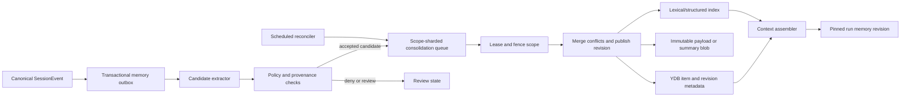

# Personal-agent memory and permissions research

Status: research/design artifact for [issue #45](https://gitcode.com/urandon/sessionless/issues/45), dated 2026-08-25. The issue remains open for design acceptance and epic creation.

## Evidence vocabulary

- **Documented**: stated by a first-party product, specification, or project document.
- **Observed**: verified in a pinned source tree or controlled Sessionless experiment.
- **Inferred**: a Sessionless design conclusion derived from documented or observed facts.
- **Unknown**: requires an experiment, product-policy answer, or cost measurement.

The competitor snapshots used for code evidence are pinned to OpenCode `3a31c4ea801915c0b050df4b3842997ea62b6e93`, Zed `d9ad6aff67e47de43abb270d22de75dd950f1b48`, Hermes Agent `c80a0a551c7038517456ee0aeb60203ec92aedb6`, and DeepSeek Harness `b150a551b8d465e31e418e1b2eaf5e79bbb7d28e`.

## Recommendation

Sessionless should implement memory as a versioned, permissioned derived subsystem over the canonical append-only `SessionEvent` stream. It must not turn a provider thread, model context window, summary, vector index, or harness-local database into product truth.

The product model has three layers:

1. canonical events and immutable snapshots, which remain the reconstructable source of truth;
2. bounded session summaries, which are disposable derived context with explicit source coverage;
3. durable memory items, which have identity, scope, provenance, confidence, revision, supersession, expiry, and tombstone lineage.

Every admitted run pins a `memory_revision`. Concurrent consolidation may publish a newer revision, but it cannot alter the context of an already admitted attempt. Memory reads and writes are authorized separately; an AI-resource grant or tool grant never implies memory access.

## Source-backed competitor matrix

| System | Evidence | Useful pattern | Limitation for Sessionless |
| --- | --- | --- | --- |
| ChatGPT | **Documented** in the [Memory FAQ](https://help.openai.com/en/articles/8590148-memory-and-controls-faq) and [Projects](https://help.openai.com/en/articles/10169521) | Separates saved memories from chat-history recall; exposes a memory summary, corrections, deletion controls, Temporary Chat, and project-only scope. | Product behavior is not a storage or authorization contract. Complete deletion can require deleting several sources; the exposed summary is not necessarily the complete internal memory state. |
| Codex local clients | **Documented** in [Memories](https://learn.chatgpt.com/docs/customization/memories) | Use a separate local store with per-chat read/generation controls, idle background extraction and consolidation, inspectable evidence, optional disablement when external context is present, and a rate-limit threshold. | Same-UID local files are the trust boundary. Generated-field redaction is not a tenant authorization model, and the local store cannot be Sessionless's canonical multi-tenant memory. |
| Claude Code | **Documented** in [project memory](https://code.claude.com/docs/en/memory) and [context-window behavior](https://code.claude.com/docs/en/context-window) | Separates user-authored `CLAUDE.md` instructions from agent-authored auto memory; supports user/project/organization scopes and exposes loaded memory with `/memory`. | Files are local execution-plane state. Conflicting instructions may be resolved by model behavior, not a tenant-safe policy engine. |
| Hermes Agent | **Observed** in pinned [memory docs](https://github.com/NousResearch/hermes-agent/blob/c80a0a551c7038517456ee0aeb60203ec92aedb6/website/docs/user-guide/features/memory.md), [memory tool](https://github.com/NousResearch/hermes-agent/blob/c80a0a551c7038517456ee0aeb60203ec92aedb6/tools/memory_tool.py), [manager](https://github.com/NousResearch/hermes-agent/blob/c80a0a551c7038517456ee0aeb60203ec92aedb6/agent/memory_manager.py), and [background review](https://github.com/NousResearch/hermes-agent/blob/c80a0a551c7038517456ee0aeb60203ec92aedb6/agent/background_review.py) | Keeps a small frozen always-in-context memory separately from searchable SQLite/FTS conversation evidence; serializes background writes; performs atomic drift-checked updates. | Durable memory is largely opaque text, without item-level provenance, scope, confidence, TTL, or tombstone identity. End-to-end erase across indexes and derived state is not proven. |
| Zed | **Observed** in pinned [thread implementation](https://github.com/zed-industries/zed/blob/d9ad6aff67e47de43abb270d22de75dd950f1b48/crates/agent/src/thread.rs) | Separates ordinary summary compaction from provider-native replacement context and records token usage on the thread. | Provider-native compaction is harness state and cannot define Sessionless identity or deletion semantics. |
| OpenCode | **Observed** in pinned [session summaries](https://github.com/anomalyco/opencode/tree/3a31c4ea801915c0b050df4b3842997ea62b6e93/packages/opencode/src/session) | Treats compaction and summaries as session-runtime concerns rather than a universal provider contract. | The local workspace/provider process is the practical trust boundary; it does not supply Sessionless membership isolation or a durable memory permission model. |
| DeepSeek Harness | **Observed** in pinned [architecture](https://github.com/deepseek-ai/deepseek-harness/blob/b150a551b8d465e31e418e1b2eaf5e79bbb7d28e/docs/architecture.md) | Provider-neutral append-only content and plugin seams make derived processors replaceable. | Developer-preview session format and harness-owned history are not stable enough to become canonical memory. |

## Memory taxonomy and contracts

| Class | Canonical? | Default scope | Retention and mutation |
| --- | --- | --- | --- |
| `SessionEvent` | Yes | tenant + session | Append-only; destructive deletion follows the existing audited session lifecycle. |
| `SessionSummary` | No | tenant + session + covered sequence | Immutable version; replace by publishing a newer version; safe to rebuild or discard. |
| `EpisodicMemory` | No | user or project | Time-bound event-derived recollection; expires unless pinned or repeatedly validated. |
| `SemanticMemory` | No | user, tenant, or project | Typed fact/preference with confidence, sources, conflicts, and supersession. |
| `ProceduralMemory` | No | project or agent profile | Guidance only; cannot grant tools, secrets, network, or filesystem access. |
| `PinnedMemory` | No | explicit user-selected scope | User-authored or explicitly promoted; no automatic expiry; still has provenance and delete controls. |
| Worker checkpoint | Operational only | run + attempt + worker | Never eligible for recall or consolidation into personal memory. |

A durable `MemoryItem` should minimally contain:

```text
tenant_id, owner_user_id, memory_id, revision, scope_kind, scope_id,
memory_kind, payload_ref, source_event_refs, created_by, confidence,
policy_class, supersedes, expires_at, tombstoned_at, model/version provenance
```

The item payload may be an exact bounded structured value or an immutable Object Storage object. YDB stores identity, authorization, revision, indexing, and lifecycle metadata. No vector identifier is the identity of the memory.

## Permission model and invariants

Memory authorization is the intersection of active tenant membership, resource ownership or an explicit grant, requested operation, data class, and the pinned policy revision.

Non-negotiable invariants:

- a tenant mismatch is always a denial, including in consolidation, retrieval, export, and deletion jobs;
- a worker receives only the bounded memory revision and items needed by one run;
- model-proposed memory is a candidate, not an authorized write;
- memory cannot grant itself tools, credentials, AI resources, or broader memory access;
- policy-engine, classifier, or provenance failure denies promotion and recall of sensitive candidates;
- every recalled item can be traced to a visible source or an explicit user-authored value;
- tombstones fence stale writers and propagate to every lexical/vector/cache replica before deletion is reported complete;
- disabling memory stops both recall and new automatic extraction; an incognito run pins an empty automatic-memory view;
- revoking membership or a scope grant prevents future recall immediately even if a cache is stale.

### Threats and controls

| Threat | Required control and evidence |
| --- | --- |
| Prompt-injected instruction becomes durable memory | Candidate extraction uses structured schemas; provenance is retained; untrusted tool/web content cannot become user fact without a separate promotion policy. Adversarial fixtures must prove denial. |
| Cross-tenant or cross-project recall | Tenant-first keys, scope-bound indexes, authorization before retrieval, negative two-tenant tests, and no global nearest-neighbor query followed by filtering. |
| Stale fact overrides correction | Explicit conflict sets, monotonic revisions, user correction precedence, supersession lineage, and recall-time freshness checks. |
| Deletion leaves derived copies | Durable deletion plan enumerates summaries, indexes, caches, exports, and object references; completion requires per-replica acknowledgement or a documented bounded expiry. |
| Sensitive memory is silently inferred | Sensitive classes require explicit consent or remain session-only. The UI shows source, scope, and why an item was recalled. |
| Consolidator replays or races | Per-scope lease/fence, deterministic source range, idempotency key, compare-and-publish revision, and retry from canonical events. |

## Consolidation architecture

Use a hybrid lifecycle: cheap event-driven candidate extraction and batching, plus a scheduled reconciliation sweep for missed, stale, or model-version-invalidated work. One cloud scheduler tick scans a sharded bounded due index; there is not one cron resource per user.



Full recomputation writes a new revision and switches the pointer only after validation. Old revisions remain long enough for admitted runs and rollback, then follow bounded garbage collection. A model or schema change never mutates existing items in place.

## Retrieval and context assembly

Start with structured filters and lexical search over authorized scopes. Add embeddings only after #63 shows a recall-quality gain that pays for embedding, storage, reprocessing, and privacy cost.

Recall ranking should combine explicit pinning, scope proximity, freshness, confidence, conflict status, and lexical relevance. Token allocation is bounded per class. When the budget is exhausted, the system prefers explicit pinned memory and current-project facts, reports degraded recall, and never silently substitutes another tenant or provider-owned history.

## Quota and cost alternatives

| Alternative | Advantages | Risks | Decision |
| --- | --- | --- | --- |
| Platform-funded shared memory allowance | Simple onboarding and predictable UX. | Abuse and cross-subsidy; platform pays model/embedding cost without owner intent. | Use only for a small bounded default allowance with hard ceilings. |
| Resource-owner funded processing | Correctly attributes model, compute, storage, and retrieval to the user/tenant owning memory. | Consolidation may stall when the resource is exhausted. | **Recommended default.** Queue pending work, preserve canonical events, and degrade to no automatic memory rather than use another resource. |
| Requesting-run funded recall and updates | Aligns cost with immediate use. | A shared project can make one caller pay for benefits used by others; retry accounting is complex. | Use for per-run retrieval/context cost, not long-lived consolidation ownership. |

Cost controls: batch source ranges, hash-deduplicate unchanged candidates, cache immutable revisions, cap item/payload counts, expire low-confidence episodic items, avoid embeddings by default, and meter exact model/storage operations separately from sampled telemetry. #49 owns the canonical usage-event design.

## Decisions, rejected alternatives, and unknowns

Accepted design recommendations:

- canonical events remain authoritative; all memory is derived;
- revisions are immutable and pinned to runs;
- item-level provenance, scope, conflict, and tombstone data are mandatory;
- policy is enforced in Sessionless control and execution planes, not delegated to a harness;
- consolidation is event-driven with scheduled reconciliation;
- structured/lexical retrieval precedes vector retrieval.

Rejected:

- one mutable memory text blob per user: cannot provide item-level authorization, conflict handling, or deletion proof;
- provider-native threads as canonical memory: couples identity and retention to one provider;
- global vector search then tenant filtering: permits cross-tenant leakage in results, timing, and caches;
- automatic promotion based on repeated model mention or use counts: activity is not correctness;
- synchronous consolidation on every foreground turn: increases latency/cost and couples canonical ingress to provider availability.

Open questions:

- Which sensitive classes require per-item consent versus a scope policy?
- What measured workload justifies embeddings, and which Yandex-compatible index meets deletion and tenant-partition requirements?
- What retention window is required for tombstoned payloads, audit evidence, and rollback revisions?
- Can tenant-shared procedural memory be edited by members, or only by owners/administrators?
- Which model/resource may reprocess memory after a version change, and who approves the spend?

## Proposed Memory epic

| Phase | Issue-sized outcome | Dependencies | Estimate | Acceptance evidence |
| ---: | --- | --- | ---: | --- |
| 1 | Define memory/scope/revision/candidate contracts and threat model | #20, #27, #45 | 5 SP / 3d | Table-driven validation and two-tenant composition tests. |
| 2 | Add YDB item, revision, conflict, tombstone, and due-index schema | phase 1, #57 | 8 SP / 5d | Migration/crash tests; bounded tenant/scope queries; no scans. |
| 3 | Implement deterministic summary and candidate pipeline with fake model | phases 1-2 | 8 SP / 5d | Idempotent replay, concurrent source ranges, fence-loss, and poison fixtures. |
| 4 | Implement consolidation worker and scheduled reconciler | phase 3, #39, #49 contracts | 8 SP / 5d | Missed-event repair, backpressure, DLQ, retry, and cost bounds. |
| 5 | Implement authorized retrieval and bounded context assembly | phases 2-4, #24 | 8 SP / 5d | Recall/source citations, revision pinning, token budgets, two-tenant negatives. |
| 6 | Implement correction, conflict, export, disable/incognito, and deletion propagation | phases 2-5, #25, #57 | 8 SP / 5d | End-to-end erase inventory and stale-cache/revoked-membership tests. |
| 7 | Add user/admin memory controls and explanations | phase 6, #29 | 8 SP / 5d | Accessible browser tests for inspect/correct/delete/scope/why-recalled. |
| 8 | Add promotion and regression gates | phases 3-7, #63 | 5 SP / 3d | Held-out utility, contamination, staleness, deletion, latency, and cost suites. |

Estimated total: **58 SP / 36 engineering days**, before the normal uncertainty reserve. Vector retrieval is a separately approved follow-up, not implicit phase scope.

Rollout proceeds disabled → internal tenant with fake extraction → opt-in session summaries → opt-in explicit/pinned memory → automatic low-sensitivity candidates → broader scopes. Each phase has a kill switch that stops extraction and recall while leaving canonical sessions usable. Rollback pins the prior validated memory revision and drains/rebuilds derived indexes; it never rewrites canonical events.

Success metrics:

- zero cross-tenant/project/session recall in adversarial tests;
- 100% recalled items provide valid provenance and scope evidence;
- deletion completes within the declared replica/cache bound;
- measured task success or correction-rate improvement over no-memory baseline in #63;
- bounded p95 recall latency and token budget;
- consolidation cost per active user/tenant remains inside the #49 budget;
- stale/conflicting memory rate and user correction rate are visible, not hidden by an aggregate score.
