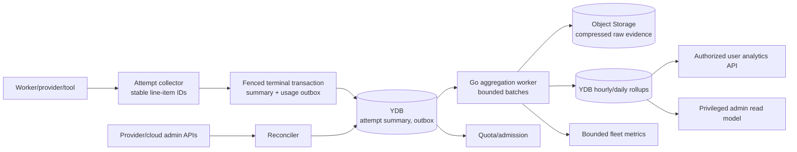

# Cost-efficient metering, usage accounting, and resource attribution

Research date: 2026-08-25

Tracks: [#49](https://gitcode.com/urandon/sessionless/issues/49)

Status: decision-ready research; the issue remains open for epic acceptance and decomposition

## Decision summary

Sessionless needs one canonical, idempotent usage ledger for product and quota decisions, plus derived rollups for UI and operations. It must not treat logs, traces, cloud monitoring, provider dashboards, or estimated token counts as billing truth.

Each provider/tool/compute operation emits a stable usage line item into the owning attempt's fenced terminal commit or a retry-safe usage outbox. A compact exact attempt summary remains in YDB. Raw provider/cloud evidence is normalized, content-free, batched, and retained in tenant-partitioned compressed objects when detail exceeds the hot-read requirement. Hour/day rollups in YDB serve quota and dashboards. Provider and cloud billing facts reconcile asynchronously without rewriting the original event.

User, tenant, session, run, tool, skill, and resource IDs stay out of cloud-monitoring metric labels. Those high-cardinality dimensions belong in authorized YDB read models. Monitoring contains bounded fleet dimensions and histograms only. Prompts, completions, tool arguments/results, credentials, attachment URLs, and provider auth identifiers never enter usage events, metrics, traces, or analytics.

## Correctness taxonomy

| Class | Purpose | Required correctness | Retention/access | Not a substitute for |
|---|---|---|---|---|
| Metering ledger | quotas, chargeback, dispute evidence | Exact-once logical event through idempotent IDs; immutable corrections | Long enough for reconciliation/dispute; tenant/admin authorization | Provider invoice |
| Provider/cloud reconciliation | attach billed cost/credit to ledger scope | Authoritative external source, dated and versioned | Finance/admin restricted | Per-turn real-time admission |
| Product analytics | feature adoption and trends | Defined, reproducible aggregates; may be delayed | Bounded aggregates, privacy thresholds | Billing/audit |
| Operational metrics | health, latency, saturation | Low latency; sampling acceptable where declared | Short/medium time series; bounded cardinality | Tenant usage ledger |
| Logs | diagnosis and incident facts | Best effort except explicit audit log | Short retention, redacted, level-controlled | Metrics or canonical history |
| Traces | causal performance investigation | Sampled; trace loss is expected | Short retention; payload capture off | Metering/audit |
| Audit | who authorized/mutated policy/resources | Append-only, actor/action/target/outcome | Security/admin restricted | Usage/cost |

## Primary evidence

| Source | Observation | Consequence |
|---|---|---|
| [OpenTelemetry GenAI metrics](https://github.com/open-telemetry/semantic-conventions/blob/main/docs/gen-ai/gen-ai-metrics.md) | Token usage should use provider-reported values when available; if efficient counts are unavailable, instrumentation must not invent them. Billable tokens take precedence when both are reported. | Preserve observed token classes and source. Unknown stays unknown; OTel naming informs export but does not define the ledger. |
| [OpenAI Usage API](https://platform.openai.com/docs/api-reference/usage) | Usage and Costs are separate; costs/invoice-aligned data is recommended for financial reconciliation. | Response usage is operational evidence; Costs API/admin evidence attaches later as reconciliation. |
| [Anthropic Usage and Cost API](https://platform.claude.com/docs/en/manage-claude/usage-cost-api) | Admin API offers granular usage and daily cost, with separate key/plan availability and caveats. | Provider admin credentials are separate privileged resources; adapter records scope and missing coverage. |
| [OpenRouter usage accounting](https://openrouter.ai/docs/cookbook/administration/usage-accounting) | Responses expose prompt/output/reasoning/cache tokens and cost, with async lookup by generation ID. | Capture router and upstream cost facts with route provenance; reconcile async without a second model call. |
| [YDB Serverless pricing](https://yandex.cloud/en/docs/ydb/pricing/serverless) | Queries consume RUs; indexes count toward stored data; free tier and price are account/region/date dependent. | Avoid per-token writes, global indexes, dashboard scans, and unbounded corrections. Refresh price facts before cost decisions. |
| [YDB serverless limits](https://yandex.cloud/en/docs/ydb/concepts/serverless-and-dedicated) | RU/s throttling bounds runaway spend and can be reduced to zero; burst behavior exists. | Keep a metering RU budget and admission circuit breaker separate from application quota. |
| [Yandex free tier](https://yandex.cloud/en/docs/billing/concepts/serverless-free-tier) | Free amounts are billing-account-wide and cover YDB, Monitoring/Monium, Logging, Object Storage, queues, and containers with service-specific limits. | Never allocate the whole free tier to one tenant; treat it as account-level reconciliation, not per-user entitlement. |
| [Yandex API Gateway logging](https://yandex.cloud/en/docs/api-gateway/operations/api-gw-logs-write) | Logging is paid and can be filtered or disabled. | Default request/access logging must be minimal and redacted; DEBUG/INFO is not a metering pipeline. |

## Canonical usage model

```text
UsageEvent {
  tenant_id, usage_event_id, occurred_at, recorded_at
  session_id?, run_id, attempt_id, operation_id
  actor_user_id, beneficiary_user_id
  resource_id, resource_revision, credential_generation?
  provider, provider_route?, model?, tool?, skill?
  usage_kind, quantity, unit
  source: provider_response | platform_measurement |
          provider_admin | cloud_billing | operator_correction
  source_record_digest?, source_observed_at?
  estimate: true|false, confidence?, price_revision?
  idempotency_key, supersedes_event_id?, correction_reason?
}

AttemptUsageSummary {
  tenant_id, run_id, attempt_id
  usage_revision, status
  observed_totals_by_unit
  estimated_cost_by_currency
  reconciled_cost_by_currency
  incomplete_dimensions[]
  finalized_at, reconciled_at?
}
```

Quantities are line items, not a sparse bag with invented zeroes. Common units include `input_token`, `output_token`, `reasoning_token`, `cache_read_token`, `cache_write_token`, `request`, `provider_currency_minor`, `worker_millisecond`, `vCPU_millisecond`, `GiB_millisecond`, `network_byte`, `object_byte_hour`, `YDB_RU`, `tool_call`, and `skill_call`. A provider's definition is preserved in metadata/versioned mapping; cross-provider totals are labelled as normalized, not claimed identical.

Corrections append a new event referencing the superseded event. Price changes create a new price revision; historical observed quantity never changes. Attempt fencing prevents a stale retry from finalizing usage, while an accepted late provider invoice may append reconciliation evidence to the committed attempt.

## Collection and storage architecture



The attempt collector batches line items in memory and emits at most one summary mutation plus one outbox record per terminal attempt. Long-running attempts may checkpoint a bounded cumulative revision, never one YDB write per token/event. Tool side effects that complete before a failed model turn still emit idempotent usage; the terminal status and beneficiary remain explicit.

Object batches are tenant-partitioned and encrypted, for example:

```text
tenants/<tenant-id>/usage/date=YYYY-MM-DD/hour=HH/part-<digest>.jsonl.zst
```

The object manifest and aggregate checkpoint are transactional in YDB. A failed upload is retried from the outbox; duplicate object digests and event IDs are harmless. Hot YDB rollups are keyed tenant-first by interval and bounded dimension set. Global platform views use separate low-cardinality bucketed rollups, not tenant fan-out queries.

## Architecture alternatives

| Alternative | Benefits | Cost/risk | Decision |
|---|---|---|---|
| Every usage line item and index in YDB | Simple point reads and exact detail | Write/index RU amplification, storage growth, expensive analytics, schema churn | Rejected as default. Keep compact attempt summary and idempotency metadata only. |
| Logs/Monitoring as usage source | Existing ingestion/query UI | Paid ingestion, high cardinality, retention/sampling loss, weak corrections/auth | Rejected. Export bounded operational metrics only. |
| Object-only raw ledger | Cheap append batches | Poor real-time quota/read paths; manifest/retry complexity | Not sufficient alone. |
| YDB summary/outbox + Object raw batches + YDB rollups | Exact hot state, cheap durable detail, bounded queries | More components and reconciliation jobs | Recommended. |
| Dedicated analytics database immediately | Flexible large-scale queries | Fixed cost/operations and premature duplication | Deferred until measured volume/query needs exceed bounded rollups. |

## Cost and cardinality budgets

The design uses explicit budgets rather than assuming free tiers:

- at most one terminal summary and one usage-outbox append per attempt under normal execution;
- long-running checkpoint interval no shorter than five minutes and only on changed totals;
- raw objects target 1–16 MiB compressed, bounded by tenant/hour and retention latency;
- user-facing rollups: hourly for 30 days, daily for 13 months by default; raw/provider evidence retention is policy-controlled;
- monitoring labels limited to service, operation class, status class, provider class, region, and deployment revision; never tenant/user/session/resource IDs;
- traces sampled by fleet-level status/latency policy; content capture disabled;
- dashboard queries use a bounded date range and precomputed grain; no raw ledger scans;
- Cloud Logging defaults to WARN/ERROR for high-volume paths, with time-bounded incident elevation;
- metering pipeline has its own RU/s, object-write, queue, and reconciliation-call circuit breakers.

For scale planning, let `A` be attempts/month, `L` average line items/attempt, `S` compressed bytes/line, and `G` dashboard groups. The recommended hot write order is `O(A)`, not `O(A*L)`. Raw storage is approximately `A*L*S` plus manifests; rollup rows are `O(tenant * interval * bounded_dimensions)`. Cost projections must apply current regional RU, storage, request, logging, monitoring, egress, and provider rates and present low/base/high scenarios. Free-tier value is applied only during account reconciliation.

## Attribution and reconciliation

Each usage event has both an actor and beneficiary. The actor initiated the work; the beneficiary/resource policy determines whose quota and cost center pays. Shared costs use a declared allocation rule:

1. direct attribution where a cloud/provider record has a resource/project/key/workspace ID;
2. causal allocation by measured compute/network/storage quantity;
3. proportional allocation by normalized usage when causal detail is unavailable;
4. platform overhead shown separately, never hidden inside model token price.

Every allocated value stores method and revision. Provider invoices, router credits, and Yandex billing may arrive at different grains and times. Reconciliation compares totals by compatible scope/window, records variance and completeness, and appends adjustments. It never mutates token facts to force invoice equality.

Quota admission reads current rollup plus reserved in-flight budget. Reservation and finalization are idempotent and fenced. On exhausted quota, the run is denied or queued according to explicit policy; it does not switch provider, use a platform key, or silently spend another federation member's resource.

## Security and privacy

| Threat | Control |
|---|---|
| Cross-tenant analytics leak | Tenant-first keys and membership check on every read; separate platform aggregates; negative-ID tests. |
| Prompt/tool content enters telemetry | Content-free schema allowlist, structured redaction tests, reject unknown fields at exporters. |
| Credential/provider IDs leak | Opaque resource IDs and hashed source digests; admin-only mapping where required. |
| Usage forgery by worker | Control-plane attempt/fence verification; source provenance; provider/admin reconciliation; anomaly flags. |
| Duplicate/replayed usage | Deterministic event/idempotency IDs and immutable duplicate handling. |
| Admin edits billing history | Append-only corrections with actor, reason, approval, old/new references; no overwrite UI. |
| High-cardinality denial of wallet | Label allowlist, dimension caps, bounded group-by API, quotas/circuit breakers. |
| Retention/deletion conflict | Usage policy separates financial/audit minimum from optional product analytics; delete content links while retaining legally required aggregate evidence. |

## Decisions, rejected alternatives, and open questions

Accepted:

- exact content-free ledger plus derived analytics/telemetry;
- provider-reported quantities with provenance, unknown instead of inferred values;
- YDB attempt summary/outbox, tenant-scoped object batches, bounded YDB rollups;
- immutable correction and price revisions;
- actor, beneficiary, resource, and allocation method are explicit;
- finance reconciliation is delayed and separate from admission estimates.

Rejected:

- logs/traces/Monitoring as billing truth;
- per-token or per-stream-frame YDB writes;
- tenant/user/session IDs as metric labels;
- recomputing historical cost with today's prices without versioning;
- treating free tier as a user's quota;
- automatic provider/resource fallback after budget exhaustion.

Open questions:

1. Which Yandex billing export/API grain is available for each MVP resource and with what delay?
2. What statutory/contractual retention applies to financial usage versus optional analytics?
3. Which provider subscription surfaces expose authoritative usage/account route rather than estimates?
4. What measured volume justifies columnar analytics beyond Object Storage plus bounded rollups?
5. How are exchange rates and taxes presented without claiming invoice precision?

## Proposed Metrics/Metering epic

| Work item | Estimate | Dependencies | Acceptance |
|---|---:|---|---|
| MM-01 usage taxonomy, schemas, ID and correction contracts | 5 SP | #20, #23 | Duplicate/retry/correction fixtures are deterministic; unknown values remain absent. |
| MM-02 attempt collector and fenced summary/outbox | 8 SP | #9, #24 | One normal terminal write set; failed/stale attempts cannot double-charge. |
| MM-03 raw batch writer, manifests, retention | 5 SP | MM-02, Object Storage | Crash/retry produces one logical batch; tenant isolation and lifecycle tests pass. |
| MM-04 hourly/daily rollups and quota reservations | 8 SP | MM-02 | Bounded YDB plans; concurrent reserve/finalize cannot overspend. |
| MM-05 provider/router/cloud reconciliation | 8 SP | MM-01, #48, #51 | Dated provenance, variance, completeness, and immutable adjustments. |
| MM-06 telemetry exporters and cardinality guards | 5 SP | MM-01 | Forbidden identifiers/content never export; overload circuit breakers pass. |
| MM-07 cost model, retention policy, adversarial E2E | 5 SP | MM-03–MM-06 | Low/base/high costs and two-tenant negative tests are reproducible. |

Rollout: shadow ledger with no admission decisions -> compare with provider/cloud reports -> tenant-visible read-only totals -> quota reservations -> optional chargeback. Rollback disables derived consumers and admission enforcement while preserving the immutable ledger/outbox; it never deletes or rewrites accepted usage.

Success metrics: ledger completeness, duplicate rejection, reconciliation coverage/variance, write/RU per attempt, bytes per usage line, rollup lag, dashboard query RU/latency, monitoring series cardinality, pipeline spend as a percentage of attributed platform spend, and zero content/cross-tenant leaks.
