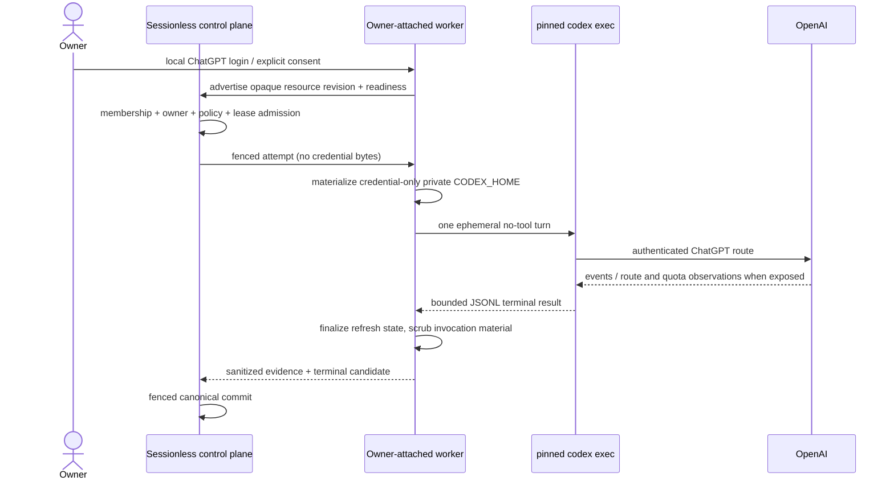
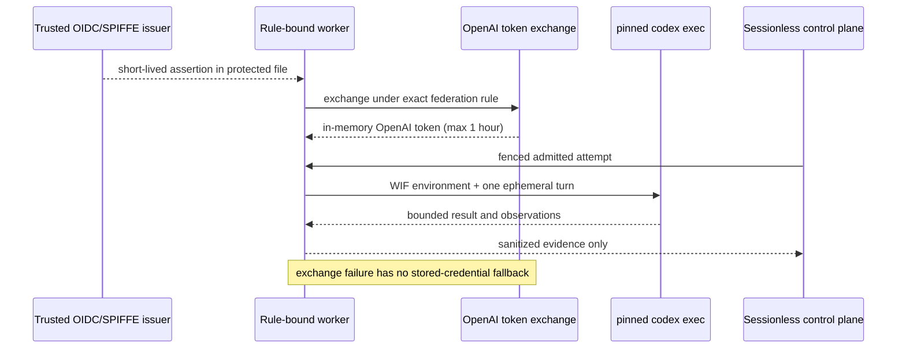

# OpenAI subscription resource policy

Evidence date: **2026-09-16**

Tracks: [#48](https://gitcode.com/urandon/sessionless/issues/48)

Decision owner: Sessionless maintainers. Re-review by **2026-12-15**, or earlier
when an OpenAI term, plan, authentication surface, Codex runtime, workspace
control, or Sessionless credential-placement assumption changes.

## Decision

Sessionless may offer an opt-in OpenAI subscription resource only through a
reviewed, Python-free `codex exec` backend and only when the identity that owns
the OpenAI entitlement also owns or administers the execution placement.

- **Personal Free, Go, Plus, and Pro:** conditional go for a single owner on
  that owner's attached private worker. The ChatGPT credential remains on the
  worker and Sessionless never receives it. No other tenant member may consume
  the entitlement.
- **Business and Enterprise member identity:** conditional go on a trusted
  private worker using a workflow-specific Codex access token when the
  workspace permits it. A browser login may be used only for an owner-local
  interactive setup, not as centrally managed automation.
- **Eligible managed workspace service account:** conditional go for
  organization-owned automation using its own access token. Service accounts
  are currently limited to pay-as-you-go plans.
- **Eligible managed workspace workload identity:** preferred conditional go
  for cloud, Kubernetes, or CI placement. OpenAI's WIF support is beta and must
  be enabled for the workspace, so absence of an enabled, exact federation
  rule is no-go.
- **OpenAI Platform API key:** go only as a separately billed API resource. It
  is never a subscription fallback.
- **Personal credential in Sessionless cloud, household/federation sharing,
  shared personal access tokens, copied competitor OAuth clients, private
  endpoint emulation, cookies, and silent API fallback:** no-go.
- **Codex App Server:** research only. OpenAI still states that the command and
  WebSocket transport are experimental and unsupported for production.

`conditional go` authorizes design and the bounded implementation backlog. It
does not enable the disabled runtime backend. Admission remains fail closed
until the attached-worker, isolation, provider-egress, lifecycle, and exact
artifact gates listed below are satisfied.

## Evidence method and limits

The verdict uses current OpenAI primary sources for policy and product claims,
plus pinned competitor source only for mechanism comparison. Competitor code
cannot authorize an OpenAI usage shape.

| Evidence | Current documented fact | Consequence |
| --- | --- | --- |
| OpenAI [authentication](https://learn.chatgpt.com/docs/auth) | ChatGPT sign-in provides subscription access; API-key sign-in is usage-based. Local CLI supports both. Cached ChatGPT credentials refresh automatically and can be stored in a file, keyring, or memory. | The billing authority is explicit and must be pinned; local credential custody is a supported mechanism. |
| OpenAI [non-interactive mode](https://learn.chatgpt.com/docs/non-interactive-mode) and [pricing](https://learn.chatgpt.com/docs/pricing) | `codex exec` and scriptable workflows are available on ChatGPT plans; API-key automation has separate API billing. | `codex exec` is the only current Python-free subscription candidate. API key is a different resource. |
| OpenAI [advanced CI/CD account authentication](https://learn.chatgpt.com/docs/auth/ci-cd-auth) | Account-auth automation is documented for trusted private runners, with one current `auth.json` copy and serialized refresh ownership. API keys remain the recommended default for ordinary CI. | Owner-private account automation is conditionally admissible; multi-tenant credential custody is not established. |
| OpenAI [access tokens](https://learn.chatgpt.com/docs/enterprise/access-tokens) | Business and Enterprise may issue Codex-scoped credentials for trusted non-interactive local workflows. Tokens belong to a member or service account and require trusted runners, narrow scope, rotation, and revocation. | Managed identities have a documented automation path; shared personal tokens do not. |
| OpenAI [service accounts](https://learn.chatgpt.com/docs/enterprise/service-accounts) | A service account is a non-human workspace identity, administered by workspace owners/admins, currently only on pay-as-you-go plans. | Organization automation must use its own identity rather than an employee credential where available. |
| OpenAI [workload identity federation](https://learn.chatgpt.com/docs/enterprise/workload-identity) | Managed workspaces can exchange OIDC or SPIFFE assertions for an in-memory OpenAI token lasting at most one hour. The feature is beta and requires enablement. | WIF is preferred for eligible cloud workers; a missing/invalid rule fails closed without a credential fallback. |
| OpenAI [App Server](https://learn.chatgpt.com/docs/app-server) | The command and WebSocket transport remain experimental and unsupported for production; individual methods also have explicit maturity. | Keep App Server fixtures for research, never select it for this MVP. |
| OpenAI [account sharing policy](https://help.openai.com/en/articles/10471989-openai-account-sharing-policy) and [Terms of Use](https://openai.com/policies/row-terms-of-use/) | An individual account is for its creator; credentials and account access may not be shared. Multiple devices used by that individual are allowed, subject to limits. | A personal subscription cannot become a tenant pool, household resource, or centrally shared credential. |
| OpenAI [Services Agreement](https://openai.com/policies/services-agreement/) | Business customers may integrate the API in applications, but account and individual login credentials may not be shared between users or resold. | Managed workspace membership and distinct identities are mandatory; API integration rights do not convert a ChatGPT login into a shared app credential. |

This review does not claim that OpenAI guarantees a fixed message quota, a
specific model, uninterrupted service, or a stable price. It also does not
interpret a successful experimental request as a policy decision.

## Versioned policy records

Every admitted resource references one immutable record below. `unknown`, an
expired record, a plan/surface mismatch, or a missing condition evaluates to
no-go. A policy refresh creates a new record; it never mutates an in-flight
attempt.

| ID | Plan and identity | Surface | Placement / custodian / sharing | Verdict | Conditions |
| --- | --- | --- | --- | --- | --- |
| `OAI-SUB-2026-09-PERSONAL-LOCAL` | Free, Go, Plus, or Pro; individual owner | pinned `codex exec --json --ephemeral` | owner-attached private worker / owner-local credential-only home / owner only | **conditional go** | Explicit owner consent; exact ChatGPT route; one refresh owner; supported isolation and egress; no other beneficiary; no API fallback. |
| `OAI-SUB-2026-09-PERSONAL-CLOUD` | Any personal plan | any | Sessionless-hosted multi-tenant worker / Sessionless vault or copied `auth.json` / owner or others | **no-go** | Official docs describe trusted private automation, not Sessionless custody of consumer credentials in a shared SaaS plane. |
| `OAI-SUB-2026-09-PERSONAL-SHARED` | Any personal plan | any | any / any / another person, household, team, or federation | **no-go** | Conflicts with individual-account and credential-sharing rules. |
| `OAI-SUB-2026-09-BIZ-MEMBER` | Business or Enterprise member | pinned `codex exec` with Codex access token | trusted private member worker / approved secret store / token creator's workflow only | **conditional go** | Admin enables creation; local Codex permission; least scope; finite expiry; workflow owner; audit and revoke path. |
| `OAI-SUB-2026-09-BIZ-SERVICE` | eligible pay-as-you-go managed workspace service account | pinned `codex exec` with service-account token | trusted organization worker / approved secret store / authorized workspace workload | **conditional go** | Admin-owned non-human identity; dedicated workflow; group/role limits; rotation, audit, revoke, and offboarding tests. |
| `OAI-SUB-2026-09-BIZ-WIF` | eligible managed workspace user or service account | pinned `codex exec` with WIF | rule-bound cloud/CI/cluster worker / no long-lived OpenAI credential / authorized workload only | **conditional go** | Beta enabled by OpenAI; exact issuer/audience/subject rule; protected assertion file; replay protection where available; fail-closed exchange. |
| `OAI-SUB-2026-09-APP-SERVER` | any | `codex app-server` | any | **no-go** | OpenAI explicitly marks the command unsupported for production. |
| `OAI-API-2026-09-EXPLICIT` | API organization/project | Codex CLI/SDK or later reviewed API adapter | declared worker / project key or WIF / project ACL | **go as a different resource** | Separate consent, billing, data controls, budget, and attempt; never automatic fallback. |

Decision records include `evidence_observed_at=2026-09-16`,
`expires_at=2026-12-15`, the exact document URLs above, the maintainer decision
owner, and these early re-review triggers:

- OpenAI changes account sharing, Terms, Services Agreement, Codex auth,
  access-token, WIF, service-account, pricing, or App Server guidance;
- the selected Codex executable, argv, auth storage, route signal, quota output,
  or refresh behavior changes;
- Sessionless changes placement, custodian, beneficiaries, isolation, egress,
  or fallback semantics;
- an incident, suspension, unexplained billing event, or ambiguous credential
  refresh occurs.

## Ownership and authorization model

`SubscriptionResource` is an `AIResource`, not a model or loose credential.
It binds one entitlement owner, one admitted execution shape, and one credential
generation:

```text
SubscriptionResource {
  tenant_id, resource_id, revision
  provider = "openai", account_plan, workspace_id?
  identity_kind: individual | workspace_member | service_account
  owner_principal_id, beneficiary_principal_ids
  execution_placement_id, credential_custodian
  credential_ref, credential_generation
  policy_evidence_id, policy_expires_at
  harness_id, harness_digest, model_policy_revision
  quota_observation_revision, lifecycle_state
}
```

The control plane authorizes membership and resource use, but it never proves
the OpenAI identity. The worker proves possession of the already-enrolled local
resource and accepts only a fenced attempt whose tenant, owner, worker,
connection, resource revision, credential generation, harness, lease, and
policy record all match. For personal resources,
`beneficiary_principal_ids == [owner_principal_id]` is invariant.

### Personal attached-worker flow



### Managed workload-identity flow



## Credential lifecycle

Personal resources have exactly one refresh owner. A file-backed login can move
only between placements owned by the same individual, through an explicit
user-controlled reseed operation; Sessionless never uploads, downloads, backs
up, logs, or displays it.

Lifecycle states are `pending_login -> ready -> leased -> draining -> ready`,
with terminal branches `reauth_required`, `revoked`, and `disconnected`.

1. Enrollment records the opaque resource and selected policy record.
2. The user logs in locally; the worker reports readiness without token bytes.
3. Admission pins credential generation. Only one refresh-capable lease may be
   active for personal file-backed auth.
4. Codex refreshes during the invocation. The worker atomically finalizes the
   credential-only home before releasing the lease.
5. A refresh/finalization ambiguity blocks replay and moves the resource to
   `reauth_required` or manual reconciliation.
6. Disconnect denies new attempts first, drains/cancels owned work, deletes
   Sessionless-owned materializations, and asks the owner/admin to revoke or
   log out through the provider-supported control.
7. Access-token expiry/revocation and disabled WIF rules block future exchanges;
   deleting a local file is not presented as provider-wide revocation.

No token, refresh token, cookie, authorization header, raw `auth.json`, WIF
assertion, or provider error body may enter YDB, Object Storage, queues, audit
payloads, logs, metrics, Git, CI artifacts, or canonical Session events.

## Scheduling, quota, and fallback

Eligibility is the intersection of tenant membership, exact owner/beneficiary,
unexpired policy record, credential generation, worker/connection health,
isolation and egress attestations, harness digest, consent, and budget. Missing
quota does not become infinity: it is `unknown` and may admit only the bounded
owner-local preview policy that explicitly tolerates unknown preflight quota.

The run pins one resource before the attempt. A 401, 403, 429, exhausted usage
window, revoked WIF rule, token expiry, or route mismatch changes resource
availability and ends that attempt under its retry classification. It never
selects an API key, another member's token, another subscription, a smaller
paid model, or a different provider mid-attempt. A user-approved new resource
can be selected only for a new attempt with a new audit record.

Quota observations preserve provider values, provenance, observation time,
reset time, and coverage. Pricing estimates and plan marketing ranges are not
authoritative remaining capacity. The UI distinguishes `observed`, `estimated`,
`reconciled`, and `unknown` and shows that local and cloud Codex usage may share
the same subscription allowance.

## UX and consent contract

Before connect or first use, show the exact:

- OpenAI plan/workspace and identity kind without exposing credentials;
- owner and permitted beneficiary set;
- attached/private/managed execution placement and credential custodian;
- content and attachment egress destination;
- pinned `codex exec` harness and its no-tool MVP profile;
- no-fallback rule and separate API-billing warning;
- quota freshness and unknown fields;
- disconnect, reauthentication, token expiry, and admin-revocation behavior;
- policy evidence version and expiry.

Consent is versioned and bound to the resource revision. A placement, custodian,
beneficiary, egress, harness, or billing-route change requires new consent and
new admission. Enrollment must never offer household/team sharing for a
personal resource or imply that Sessionless can revoke an OpenAI account.

## Threat and failure model

| Threat / failure | Required control | Fail-closed outcome |
| --- | --- | --- |
| Another tenant or member consumes a personal entitlement | Owner-only beneficiary invariant, membership and resource ACL, fenced worker authority | `owner_mismatch`; no process spawn. |
| Credential exfiltration through prompts, logs, dumps, or ambient home | Credential-only private home/keyring; replacement environment; log allowlist; core-dump denial; no control-plane bytes | Stop, scrub invocation material, revoke/reseed as applicable. |
| Two runners refresh one mutable login | Single refresh owner and exclusive lease; CAS generation finalization | Ambiguous generation blocks reuse and replay. |
| Billing route silently becomes API | Expected `chatgpt` route pinned; no `CODEX_API_KEY`; replacement environment | `billing_route_mismatch`; terminal failure, no fallback. |
| WIF falls back to a long-lived credential | WIF-only environment and OpenAI fail-closed precedence | Exchange failure; no Codex spawn. |
| Stolen access token or assertion | Trusted runner, protected secret/file, narrow scope, short lifetime, issuer/rule constraints, replay protection, rotation | Revoke token/rule and fence its credential generation. |
| Provider accepts a request but terminal outcome is lost | Native acceptance boundary plus fenced ambiguous completion; no internal retry | Reconcile/manual decision; never duplicate blindly. |
| Quota is stale or absent | Typed freshness/provenance and bounded unknown-quota policy | No broad capacity promise; deny policies that require known headroom. |
| Policy or terms drift | Expiring immutable policy record and early re-review triggers | New admissions denied at expiry. |
| Unsupported App Server path leaks into production | Closed harness registry and exact backend ID/digest | Registry rejection before execution. |
| Account/member/service account is offboarded | Admin/user revoke plus Sessionless generation fence and deny-first disconnect | New attempts denied; bounded drain/cancel. |

## Cost model

Personal plan cost is an external subscription paid by the owner. Sessionless
must not convert marketing message ranges into money or promise unused quota.
Its attributable cost is the attached-worker CPU/RAM/disk/network and platform
control-plane work, recorded separately from provider entitlement use.

Managed workspace access may be seat-, credit-, or pay-as-you-go-based. The
resource records the workspace billing authority and reconciles only against
available admin/provider evidence. Service-account and WIF eligibility does not
imply that use is included or free. API-key usage remains usage-based API cost.

Admission budgets therefore remain separate:

1. provider entitlement/quota observation;
2. workspace credits or API monetary budget when authoritative;
3. Sessionless control-plane and network budget;
4. attached/managed worker capacity and operator cost.

## Competitor mechanism audit

| System / pinned revision | Useful mechanism evidence | Rejected transfer |
| --- | --- | --- |
| OpenCode `3a31c4ea801915c0b050df4b3842997ea62b6e93` | Separates stored auth, provider catalog, plugins, and provider discovery; demonstrates technical Codex subscription access. | OAuth client reuse, private backend calls, provider-global credential records, or treating a successful call as OpenAI authorization. |
| Zed `d9ad6aff67e47de43abb270d22de75dd950f1b48` | Separates direct provider, ACP child process, and terminal-owned CLI; keeps credentials near execution. | Direct OAuth/backend implementation as permission for Sessionless. |
| Hermes Agent `c80a0a551c7038517456ee0aeb60203ec92aedb6` | Shows refresh locking/write-back, provider pools, usage projection, and unattended lifecycle hazards. | Soft over-cap leasing, shared personal credential pools, broad environment forwarding, warm provider history, or Python production closure. |
| DeepSeek Harness `b150a551b8d465e31e418e1b2eaf5e79bbb7d28e` | Shows plugin-seamed harnesses, provider-neutral logs, one-shot permissions, and explicit preview maturity. | Assuming file-only sandboxing, preview wire stability, or a harness identity proves provider entitlement. |

## ADR: selected and rejected options

Accepted:

- `codex exec --json --ephemeral` below Sessionless's Go `HarnessDriver`;
- personal owner-local attached worker with credential-local custody;
- workspace access token/service account for trusted managed workflows;
- WIF as preferred managed cloud credential when enabled;
- immutable policy tuples, exact billing-route pinning, and no fallback;
- one external process and one ephemeral provider turn per fenced Attempt.

Rejected:

- App Server in production while OpenAI marks it unsupported;
- Python SDK/runtime in the production worker;
- consumer `auth.json` in Sessionless cloud;
- shared personal accounts/tokens, household/federation pools, warm cross-user
  workers, and multiple refresh owners;
- copied cookies, private endpoints, competitor OAuth clients, or direct OAuth
  token endpoint calls;
- treating API keys, workspace access tokens, service accounts, WIF, and
  personal subscription login as interchangeable credentials;
- silent model/provider/billing fallback and runtime discovery from ambient
  environment variables.

## Subscription Resource implementation epic

The research decision closes #48 when accepted. Runtime activation remains a
separate, reversible sequence:

| Work item | Estimate | Dependencies | Acceptance evidence |
| --- | ---: | --- | --- |
| SR-01 policy-evidence registry | 5 SP | this decision | Immutable tuple/version/expiry records; stale or mismatched records deny admission; audit contains ID, never secret. |
| SR-02 subscription resource and credential-generation contract | 5 SP | canonical AI resource model, credential lifecycle | Owner/beneficiary invariants, single refresh owner, generation fencing, deny-first disconnect, race and crash tests. |
| SR-03 enrollment and consent UX/API | 5 SP | #47, SR-01/02 | Exact placement, custodian, egress, billing, no-fallback, quota freshness, revoke semantics, and policy expiry are shown and versioned. |
| SR-04 activate pinned Go-supervised Codex exec bridge | 8 SP | #81, attached-worker authority | Closed registry binding from admitted immutable resource; exact binary/argv/digest; one turn; no ambient auth or API fallback. |
| SR-05 production isolation and provider egress | 8 SP | attached-worker isolation/egress tracks | Credential-only home, replacement environment, reviewed network allowlist/proxy, process-group cleanup, secret/log/dump tests on supported OS. |
| SR-06 account, route, quota, and lifecycle observations | 5 SP | #49, SR-04 | Auth route and mismatch are authoritative; quota is typed with provenance/freshness; 401/403/429/revoke/expiry classifications are deterministic. |
| SR-07 adversarial owner and recovery E2E | 8 SP | SR-01–06 | Two owners, stale policy, stale generation, disconnect, refresh ambiguity, cancellation, lost terminal, WIF failure, and no-fallback paths fail closed. |
| SR-08 managed identity profiles | 8 SP | SR-01–07 | Separate member-token, service-account, and WIF profiles; admin enablement, scope, audit, rotation/revoke, and WIF replay/expiry evidence. |

Rollout is fake process and credential-free conformance -> personal owner-local
canary with no tools/private data -> bounded opt-in attached-worker preview ->
managed token/service-account preview -> beta WIF preview. Each stage has an
independent kill switch that marks the exact resource/harness/policy revision
unavailable. Rollback never chooses another provider or billing resource.

Success evidence is zero cross-owner admissions, zero credential bytes outside
the worker secret boundary, zero silent billing fallbacks, exact cancellation
and ambiguous-completion classification, policy/consent coverage for every
admitted attempt, quota freshness coverage, and provider-versus-platform error
attribution. A live provider experiment is follow-up evidence, not a prerequisite
for accepting this policy design.

## Remaining questions

1. Which Business/Enterprise pricing configurations expose service accounts,
   credits, and usage APIs in each target customer workspace?
2. Will OpenAI graduate Codex WIF and/or App Server to production support with
   stability guarantees that change the selected surface?
3. Which supported attached-worker operating systems can enforce the complete
   credential, filesystem, process, and egress profile without a Linux VM?
4. Which Codex output is sufficiently authoritative to attest ChatGPT billing
   route and quota without using private endpoints?
5. What exact user-facing name should distinguish an included subscription
   allowance from purchased ChatGPT credits and separately billed API usage?

These questions gate their corresponding runtime profiles or UX claims. They
do not reopen the no-sharing/no-cloud-consumer-custody decisions.
