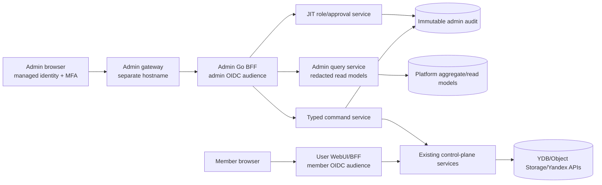
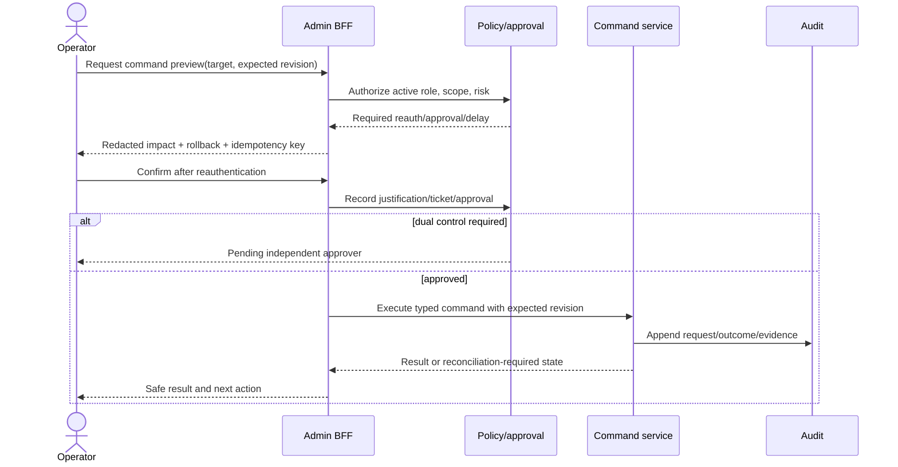

# Privileged platform administration console

Research date: 2026-08-25

Tracks: [#54](https://gitcode.com/urandon/sessionless/issues/54)

Status: decision-ready research; the issue remains open for design/epic acceptance

## Decision summary

The platform admin console must be a separate security product from the member WebUI: separate hostname and Go BFF, separate OIDC client/audience, separate service account and network route, explicit platform roles, shorter sessions, stronger authentication, no shared browser cookie, and comprehensive mutation audit. Hiding admin navigation in the user UI is not an authorization boundary.

Operators receive no standing access to user prompts, attachments, tool payloads, credentials, or worker files. Normal dashboards use aggregate or redacted control-plane data. Sensitive support access is a time-bound, purpose-bound grant requiring justification, a ticket, user/tenant consent where possible, and approval by another authorized person. Emergency break-glass is separately protected, alerting, time-limited, and reviewed after use.

All mutations are typed commands through control-plane services. The console never issues arbitrary YQL, shell, Terraform, cloud-console, provider-admin, or Object Storage operations. High-impact commands use preview, reauthentication, idempotency, expected-version checks, dual control, delayed execution where appropriate, and a tested rollback/reconciliation path.

Production remains Go/serverless and deploys as monolithic Go binaries with embedded static assets. No Python runtime or SDK is introduced.

## Prior art and evidence

| Source | Useful control | Sessionless application |
|---|---|---|
| [Microsoft Entra Privileged Identity Management](https://learn.microsoft.com/en-us/azure/active-directory/privileged-identity-management/pim-configure) | Time-bound/JIT activation, approval, MFA, justification, notifications, access review and audit history. | Admin roles are eligible by default; sensitive roles require reauthentication, approval and bounded duration. |
| [PIM approval workflow](https://learn.microsoft.com/en-us/entra/id-governance/privileged-identity-management/pim-approval-workflow) | Approvers cannot approve their own activation; requests expire; justification is recorded. | No self-approval or service-principal approval for human break-glass/support grants. |
| [Google Cloud Access Approval/Transparency](https://cloud.google.com/docs/security/overview/resources/google_security_wp.pdf) | Customer approval for support access and transparency logs for provider access. | Tenant-consented support access and immutable evidence of what the operator accessed. |
| [GitHub organization audit log](https://docs.github.com/en/organizations/keeping-your-organization-secure/managing-security-settings-for-your-organization/reviewing-the-audit-log-for-your-organization) | Privileged, searchable organization activity log limited to owners. | Dedicated audit viewer/export role; audit availability does not imply mutation rights. |
| [ChatGPT workspace analytics](https://help.openai.com/en/articles/10875114-workspace-analytics-for-chatgpt-enterprise-and-edu) | Analytics viewer is separate from workspace admin/owner; aggregate adoption and skill/tool views. | Split platform analytics, finance, operations, security and support roles. |
| [Anthropic Usage and Cost API](https://platform.claude.com/docs/en/manage-claude/usage-cost-api) | Separate Admin/Analytics credentials and organization-scoped reporting. | Provider-admin credentials remain server-side resource integrations, not browser tokens. |
| [Yandex Audit Trails](https://yandex.cloud/en/docs/audit-trails/) | Cloud control/data-plane audit collection. | Correlate Sessionless command audit with cloud changes; do not expose raw cloud credentials in the console. |

## Personas and privilege model

| Role | Normal capabilities | Explicitly excluded |
|---|---|---|
| Platform viewer | Fleet/service health, redacted incidents, deployment revisions | Mutations, tenant content, secrets, finance detail |
| Operations admin | Drain/retry/reconcile bounded operational objects; manage incidents | Identity roles, billing policy, content access, provider credentials |
| Security admin | Audit, access grants, revocation, policy/kill switches, investigations | Routine tenant support content, finance mutation |
| Support agent | Tenant/resource metadata and user-consented case workflow | Prompts/files/secrets by default; platform IAM and billing changes |
| Finance/billing admin | Reconciliation, budgets, invoice variance, cost allocation | Prompt/session/tool content, credentials, security mutation |
| Identity admin | Admin eligibility, roles, session revocation | Operational/provider/billing mutation unless separately eligible |
| Release admin | Deployment/image/migration evidence and approved rollout commands | Tenant content and permanent platform IAM |
| Break-glass operator | Narrow emergency command set for bounded time | Standing access, self-approval, silent use |
| Auditor | Immutable audit/read/export with redactions | Any mutation or sensitive-content reveal |

Roles are scoped and composable; `platform_admin=*` is not an ordinary assignment. Eligibility and activation are separate. The platform records actor, authenticating identity, eligible role, activated role, scope, approver, ticket, reason, start/expiry, client/session, and every command/access result.

## Security boundary

The admin BFF does not share cookies, session table rows, CSRF scope, OAuth client, service account, CSP origin, or API routes with the member BFF. A user can hold both identities, but each browser session has one audience and authorization path. Admin endpoints reject member tokens even when the subject is an administrator.

## Information architecture and jobs to be done

### Platform overview

- deployment/image/migration revisions and health;
- queue/run/attempt/outbox/worker saturation and SLOs;
- incidents, active kill switches, budget guardrails, provider degradation;
- no prompt or tool payload samples.

### Tenants and memberships

- tenant lifecycle, memberships, quotas, resource bindings, policy revisions;
- suspend/reactivate with preview and explicit consequences;
- never impersonate a member or silently grant support access.

### Sessions, runs, and delivery

- metadata-only lookup by exact tenant/session/run ID;
- attempt/lease/fence/outbox state, classification, retry/reconcile commands;
- content is redacted and separately gated; raw logs are not embedded.

### Workers, AI resources, tools, and automation

- attached/cloud worker state, version/capabilities, drain/revoke;
- resource owner/kind/placement/policy/health/quota freshness, never credentials;
- tool/MCP/skill/schedule policy and emergency disable;
- federation ACL and cost attribution with provider-policy evidence status.

### Usage, cost, and capacity

- #49 reconciled/estimated totals, variance, pipeline cost and coverage;
- platform overhead and tenant allocation without user content;
- budget/circuit-breaker changes through reviewed commands.

### Security and access

- admin eligibility/activation, pending approvals, audit and anomalous access;
- revocations, policy changes, secret/resource rotations by opaque reference;
- support access and break-glass review queues.

### Releases and operations

- exact Git/image/migration/Terraform evidence;
- explicit publish/deploy intent and approved rollout/rollback;
- no long-lived cloud credential in the browser or arbitrary Terraform plan upload.

## Typed mutation lifecycle

Risk classes:

| Class | Examples | Required controls |
|---|---|---|
| Read aggregate | platform health, daily cost | Active role, audit, bounded query |
| Read tenant metadata | exact run/worker/resource metadata | Scoped role, reason, audit |
| Sensitive read | prompt/file/tool payload reveal | JIT grant, ticket, consent or documented emergency exception, dual control, watermark, narrow object/time scope |
| Reversible write | drain worker, pause schedule, retry safe outbox | Preview, reauth, expected revision, idempotency, rollback |
| High-impact write | tenant suspend, revoke resource, budget/kill switch | Independent approval, delay where safe, blast-radius preview, notification, rollback/reconciliation |
| Destructive/irreversible | deletion, key destruction, retention override | Separate workflow, multi-party approval, retention/legal checks, dry run, explicit recovery limits |

## Support access and break-glass

Normal support sees metadata and user-provided case material only. A sensitive-access grant binds tenant, user/consent record, exact session/run/object scope, allowed fields/actions, ticket, reason, approver, operator, start/expiry, and download prohibition. The grant cannot broaden during use. Screens are watermarked and copy/export are disabled unless separately approved; every reveal is audited.

Break-glass exists for identity-provider failure or severe incidents, not convenience. Credentials are held outside normal runtime, tested periodically, require two-person retrieval where feasible, activate a narrow emergency role, expire automatically, trigger out-of-band alerts, and mandate a post-incident review. Break-glass cannot disable its own audit trail. If audit persistence is unavailable, only the smallest predefined containment commands are allowed and a signed local receipt must be reconciled later.

## Query, export, and operating-cost budgets

- admin overview reads platform aggregates, not tenant fan-out or raw ledgers;
- exact tenant/session/run lookup requires an exact selector and tenant-first point/bounded-prefix plan;
- time ranges and group dimensions are capped; arbitrary query languages are rejected;
- content-free platform metrics use bounded labels; tenant IDs remain in authorized read models;
- cache keys include active-role/scope generation and expire no later than the admin session or grant;
- exports are asynchronous, encrypted, exact-scope, watermarked, short-lived, and audited;
- raw cloud/provider logs remain in their controlled systems; the console links a correlation ID instead of copying payloads;
- WARN/ERROR log defaults and #49 rollups prevent the admin dashboard from becoming a logging/Monitoring cost driver;
- expensive investigations show estimated query/export cost and require confirmation/role where applicable.

## Threat model

| Threat | Mandatory control |
|---|---|
| Member token reaches admin API | Separate issuer/audience/client/session/cookie/routes; negative integration tests. |
| Stolen standing admin session | JIT roles, short session/activation, phishing-resistant MFA where available, reauth for mutations, device/network policy. |
| Self-approved privilege escalation | Approver cannot equal requester; service principals cannot approve human access; expected role-policy revision. |
| Support browses user content | Metadata-only default, exact scoped consent grant, field allowlist, watermark, audit and expiry. |
| Confused deputy command | Typed target IDs, tenant/resource ownership recheck, dry-run impact, expected-version CAS, idempotency. |
| Audit tampering | Append-only separate writer/reader roles, immutable export/checkpoint, external cloud audit correlation. |
| Mass export/exfiltration | No arbitrary queries; row/byte/time caps, approval, exact-object capability, rate alerts, short expiry. |
| Browser injection/CSRF | Strict CSP, no user HTML, output escaping, SameSite/HttpOnly/Secure cookie, origin/CSRF checks, no secrets in DOM/URLs. |
| Operator mistakes during incident | Predefined runbooks/commands, preview, blast-radius cap, staged rollout, rollback and reconciliation states. |
| Last-admin lockout | Independently tested break-glass identities and policy checks; high-impact identity changes require retained recovery path. |

## Decisions and rejected alternatives

Accepted:

- separate admin application/security boundary;
- JIT eligible roles, independent approval, bounded activation and reauthentication;
- metadata/aggregate first, sensitive content only through scoped support-access workflow;
- typed commands with preview, CAS/idempotency, audit, and rollback/reconciliation;
- distinct viewer, ops, security, support, finance, identity, release, break-glass, and auditor roles;
- Go BFF with embedded assets; no Python runtime.

Rejected:

- admin tab in the member WebUI using the same BFF/cookie/audience;
- permanent super-admin for routine work;
- direct YDB/YQL, shell, Terraform, provider-console, or cloud credentials in browser;
- operator impersonation of users;
- logging prompts/tool results for support convenience;
- self-approval or silent break-glass;
- deletion/history correction through generic CRUD forms.

## Open questions

1. Which identity provider and phishing-resistant MFA are available for the first operators?
2. Which sensitive support cases legally/product-wise allow tenant consent to be bypassed in an incident?
3. What actions require two approvers versus one independent approver and a delay?
4. Where is the append-only admin audit checkpoint anchored so operators cannot erase both copies?
5. Which Yandex/provider operations can be wrapped safely as typed commands versus remaining external runbooks?
6. What minimum operator staffing makes dual control practical without creating an unusable single-founder system?

## Proposed Platform Admin Console epic

| Work item | Estimate | Dependencies | Acceptance |
|---|---:|---|---|
| PA-01 admin auth, roles, threat model, separate deployment contract | 8 SP | #30, #34 | Member token/cookie cannot access admin routes; admin session/audience isolation proven. |
| PA-02 JIT eligibility, activation, approval and break-glass | 8 SP | PA-01 | No self-approval; expiry/revoke/IdP-outage exercises and post-use review evidence. |
| PA-03 aggregate/read-model API and overview UI | 8 SP | #49, #47, #51 | Bounded platform and exact tenant metadata queries; no content or cross-tenant fan-out. |
| PA-04 typed operational command framework | 8 SP | PA-01 | Preview, expected revision, idempotency, audit, retry/reconcile and rollback fixtures. |
| PA-05 tenant/resource/worker/scheduler operations | 8 SP | PA-03, PA-04, #47, #52 | Risk-class controls and blast-radius caps enforced per command. |
| PA-06 support-access and sensitive-read workflow | 8 SP | PA-02, PA-03 | Consent/grant/scope/expiry/watermark/export negatives pass. |
| PA-07 usage/security/release surfaces | 8 SP | #49, #54 predecessors, release pipeline | Reconciliation, policy evidence, kill switches and exact deployment evidence visible without secrets. |
| PA-08 adversarial security, accessibility, incident E2E | 8 SP | PA-01–PA-07 | Token confusion, CSRF/XSS, self-approval, mass export, audit loss and rollback drills pass. |

Rollout: local fixture IdP -> one viewer-only maintainer -> JIT read-only canary -> low-risk typed commands -> support workflow -> high-impact commands. Every command family has its own feature flag. Rollback disables admin gateway/routes and new activations; emergency containment remains available through the separately tested break-glass runbook.

Success metrics: standing privileged assignments, JIT activation/approval/expiry latency, unauthorized denial count, sensitive-content grants and expiry, commands with preview/audit/rollback coverage, reconciliation-required commands, audit completeness, query RU/latency/cardinality, accessibility violations, and time to diagnose/contain rehearsed incidents without broad content access.
