# RepoWise evaluation for Sessionless

Status date: **2026-08-25**. Issue: #65. Current recommendation: **adjust and
continue the bounded local experiment; do not adopt into production, CI, or a
shared service**.

This record separates static audit facts from measurements that still require a
clean, isolated local run. An unchecked measurement is not evidence and must
not be presented as a RepoWise result.

## Decision constraints

- Sessionless production remains Go/serverless with monolithic deployable
  binaries. A Python SDK or runtime is not an acceptable production dependency.
- RepoWise is an opt-in developer/research tool. Contributors and CI must retain
  identical supported behavior when it is absent.
- The first evaluation is keyless, no-prose, local-only, network-denied after
  installation, and uses stdio MCP.
- Generated state and evidence remain ignored and may not contain credentials,
  private prompts, raw repository payloads, or host-specific paths.
- An MCP answer is a lead, not a finding, until independently verified in the
  source, tests, Git history, or committed architecture contracts.

## Pinned supply-chain facts

The reviewed upstream release is RepoWise `0.45.0`, source tag commit
`e2bb8a2e4eff3d00005a602ac65a8e4be7daa4a3`.

| Artifact | Reviewed SHA-256 |
| --- | --- |
| Python wheel | `c86ec4a505b16dfe0a6df5366aae9908a0a3ef6fabb204c883a6faf94a62492a` |
| Source distribution | `4e7fdaf9d837d09ff53454963c0afda7c98e72e8020914094c2bd431f9950ada` |

Documented package metadata requires Python 3.11 or newer and declares
AGPL-3.0-or-later/commercial licensing. The dependency closure is a substantial
Python stack, including provider SDKs, SciPy, LanceDB, FastAPI, and Uvicorn. Its
weight reinforces the local-tool boundary even if the experiment is useful.
Platform-specific, transitively resolved wheels must also be locked and hashed;
the two top-level hashes alone are not a reproducible installation. The Darwin
arm64 CPython 3.12 experiment therefore pins a PEP 751 lock with 125 unique
packages, one exact wheel URL and SHA-256 per package, generated/consumed with
pip `26.2.1`. The reviewed lock SHA-256 is
`dcbd8913e1b6e7f21990c14696143cad8dea66f8c2704147c4c6fafb02cf8dc8`.
Installation downloads that closed wheel set in the only networked phase, then
installs it with no index and no dependency resolution inside the no-network
sandbox and runs `pip check`.

The first supported artifact set targets Darwin arm64. An unsupported platform
must fail with instructions instead of falling back to an unreviewed sdist or a
newer package.

## Static behavior audit

### Documented or source-observed risks

- telemetry can POST to `api.repowise.dev` unless explicitly disabled;
- doctor/update/serve paths can query PyPI;
- initialization can modify editor, MCP, hook, and agent-instruction files;
- serve can download UI assets and exposes a larger FastAPI/Uvicorn surface;
- MCP can load `.repowise/.env` unless the environment and state are controlled;
- user-level state can be written below `~/.repowise`;
- provider SDKs create accidental credential/egress risk even when the intended
  experiment is keyless;
- an index can silently describe an older commit or a different worktree;
- generated health/dead-code conclusions can be language-dependent and produce
  false positives in generated, embedded, build-tagged, reflection-driven, or
  infrastructure code.

RepoWise `0.45.0` includes the supported `--no-editor-setup` switch, and
`REPOWISE_SKIP_EDITOR_SETUP=1` provides a second guard. Sessionless additionally
requires no-prose, no-workspace, no-seed, no-agent-file, no-hook, no-cost-tracking,
and no-credential-save behavior. Merely setting telemetry flags is insufficient;
the post-install commands also need an OS-enforced no-network sandbox.

### Mitigation adopted for the experiment

```mermaid
flowchart LR
    OP[Explicit developer command] --> WRAP[Repo-owned policy wrapper]
    WRAP --> ENV[env -i allowlist and synthetic HOME/XDG/TMP]
    ENV --> PIN[hash-pinned repo-local virtual environment]
    PIN --> NET[post-install network-denied process]
    NET --> IDX[ignored checkout-local index]
    IDX --> MCP[stdio read-only MCP allowlist]
    MCP --> VERIFY[source/tests/git cross-check]
```

The wrapper uses mode `0700` directories and `umask 077`, keeps all state below
`.local/repowise/` and `.repowise/`, excludes `.gitcode/` and `.local/` from the
index, and does not forward host provider, cloud, proxy, SSH, subscription, or
agent credentials. Install is a separate explicit networked action; index,
status, evaluation, and MCP are network-denied.

## Experiment protocol

### 1. Baseline and isolation

Record before installation:

- exact Sessionless commit and clean tracked status;
- operating system/architecture and Python version;
- tracked/untracked paths outside the two ignored roots;
- relevant global editor, MCP, Git-hook, Python, and agent configuration file
  metadata without reading or publishing secrets;
- baseline child processes and disk use.

Install only the reviewed lock into the repository-local environment. Compare
the checkout and user-level configuration inventory afterward. Any unexpected
write or credential discovery is a fail.

### 2. Index and staleness

Build a standard, no-prose index with a 500-commit cap and all integration
features disabled. Capture sanitized aggregates:

- RepoWise version and exact indexed Sessionless commit;
- cold elapsed time and peak RSS when available;
- environment and index disk use;
- indexed file/symbol/language counts;
- network attempts;
- tracked status before/after.

Then make one harmless worktree-only source change, prove the index reports
stale, restore the change, update the index, and prove the recorded commit again
matches `HEAD`. Repeat the identity check in a separate Git worktree without
copying either state directory.

### 3. MCP smoke

Discover the stdio MCP surface and perform one bounded call in each allowed
capability family:

1. repository overview;
2. focused code/context retrieval;
3. change-risk or impact analysis;
4. repository/architecture health;
5. dead-code candidates.

Reject unexpected mutation, plugin, provider, transcript, HTTP/SSE, or
refactoring tools rather than exposing them. Capture only tool names, timings,
sanitized counts, and independently verified conclusions.

### 4. Real Sessionless questions

Use the five capability families to investigate bounded questions with known
cross-check paths:

- Which packages and adapters lie on the accepted-run-to-worker-result critical
  path, and does the graph match `docs/contracts.md`?
- What code and tests are affected by a state-transition contract change?
- Which package boundaries create the highest architecture/health risk, and do
  `go list`, imports, tests, and Git history support that ranking?
- Which dead-code candidates survive checks for Go build tags/generation,
  embedded Web assets, Svelte routing, Terraform references, shell invocation,
  and Cloudflare configuration?
- Which known weak spots from open issues are missed or misclassified?

For every candidate record the RepoWise claim, source evidence, manual-tool
cost, RepoWise-tool cost, verdict, and likely reason for a false result.

### 5. Stop and cleanup

End the MCP client, run the exact wrapper stop path, and require zero
wrapper-owned processes. Produce an uninstall dry-run listing only the two
repo-local roots. Cleanup requires explicit confirmation and must leave tracked
status identical to baseline.

## Quantitative gates

| Gate | Pass condition | Result |
| --- | --- | --- |
| Environment size | no more than 2 GiB | Pending local run |
| Index size | no more than 1 GiB | Pending local run |
| Cold index | no more than 15 minutes | Pending local run |
| Warm update | no more than 2 minutes | Pending local run |
| MCP startup | no more than 10 seconds | Pending local run |
| Peak/steady RSS | no more than 1 GiB | Pending local run |
| Network after install | zero attempts | Pending local run |
| Unexpected/global writes | zero | Pending local run |
| Processes after stop | zero | Pending local run |
| MCP smoke | all five allowed families succeed | Pending local run |
| Source-verified utility | at least one material useful finding | Pending local run |
| Worktree isolation | no state/commit mixing | Pending local run |

Performance thresholds are containment limits, not evidence of usefulness. A
fast tool that adds no verified signal should still be rejected.

## Coverage and evidence table

Populate this table from the controlled run; do not infer support from file
extensions alone.

| Surface | Indexed evidence | Useful result | False positive/negative | Cross-check |
| --- | --- | --- | --- | --- |
| Go | Pending | Pending | Pending | `go list`, `rg`, tests |
| Svelte/TypeScript | Pending | Pending | Pending | Web checks, routes, generated API |
| Terraform | Pending | Pending | Pending | Terraform validate/tests, references |
| Shell | Pending | Pending | Pending | callers, policy tests, ShellCheck where available |
| Cloudflare Worker | Pending | Pending | Pending | Wrangler config and Worker tests |

## Adoption decision

The current static evidence supports only an **adjusted local experiment**:

- **adopt now:** the reviewed wrapper/policy pattern as a safe way to collect
  evidence, not RepoWise as a product dependency;
- **defer:** usefulness, language coverage, and resource conclusions until the
  controlled index and five-tool comparison are complete;
- **reject:** production/runtime Python, default contributor setup, CI gates,
  automatic editor/agent/hook configuration, provider prose, credential access,
  HTTP/SSE/UI serving, shared indexes, and hosted service operation;
- **legal gate:** any redistribution, modification, network service, PR bot,
  shared/hosted index, or organizational rollout requires AGPL/commercial-license
  review before implementation.

Adopt RepoWise as an ongoing optional tool only if it stays inside every safety
and resource bound, produces at least one source-verified material insight, and
has an acceptable false-result rate across the relevant Sessionless languages.
Otherwise remove the ignored environment/state and preserve this report as the
evidence-backed rejection.

Issue #65 should remain open until the pending table is populated, the findings
are independently reviewed, cleanup is verified, and the final
adopt/adjust/reject decision is recorded. Any source weakness discovered during
the experiment belongs in a separate issue and MR; this task must not apply
automated RepoWise fixes.

## Sources

- RepoWise source at the [reviewed
  revision](https://github.com/repowise-dev/repowise/tree/e2bb8a2e4eff3d00005a602ac65a8e4be7daa4a3).
- PyPI [RepoWise 0.45.0 package
  metadata](https://pypi.org/project/repowise/0.45.0/).
- RepoWise [AGPL-3.0 license at the reviewed
  revision](https://github.com/repowise-dev/repowise/blob/e2bb8a2e4eff3d00005a602ac65a8e4be7daa4a3/LICENSE).
