# RepoWise evaluation for Sessionless

Status date: **2026-08-25**. Issue: #65. Current recommendation: **adopt only as
an optional, checkout-local research aid; do not adopt into production, CI, or
a shared service**.

This record separates static audit facts, measured local results, and
source-verified conclusions. A RepoWise score or candidate is not a finding
until the cited source or test confirms it.

## Decision constraints

- Sessionless production remains Go/serverless with monolithic deployable
  binaries. A Python SDK or runtime is not an acceptable production dependency.
- RepoWise is an opt-in developer/research tool. Contributors and CI must retain
  identical supported behavior when it is absent.
- The first evaluation is keyless, no-prose, local-only, network-denied after
  installation, and uses stdio MCP.
- Generated state and evidence remain ignored and may not contain credentials,
  private prompts, raw repository payloads, or host-specific paths.
- An MCP answer is a lead, not a finding, until independently verified in the
  source, tests, Git history, or committed architecture contracts.

## Pinned supply-chain facts

The reviewed upstream release is RepoWise `0.45.0`, source tag commit
`e2bb8a2e4eff3d00005a602ac65a8e4be7daa4a3`.

| Artifact | Reviewed SHA-256 |
| --- | --- |
| Python wheel | `c86ec4a505b16dfe0a6df5366aae9908a0a3ef6fabb204c883a6faf94a62492a` |
| Source distribution | `4e7fdaf9d837d09ff53454963c0afda7c98e72e8020914094c2bd431f9950ada` |

Documented package metadata requires Python 3.11 or newer and declares
AGPL-3.0-or-later/commercial licensing. The dependency closure is a substantial
Python stack, including provider SDKs, SciPy, LanceDB, FastAPI, and Uvicorn. Its
weight reinforces the local-tool boundary even if the experiment is useful.
Platform-specific, transitively resolved wheels must also be locked and hashed;
the two top-level hashes alone are not a reproducible installation. The Darwin
arm64 CPython 3.12 experiment therefore pins a PEP 751 lock with 125 unique
packages, one exact wheel URL and SHA-256 per package, generated/consumed with
pip `26.2.1`. The reviewed lock SHA-256 is
`dcbd8913e1b6e7f21990c14696143cad8dea66f8c2704147c4c6fafb02cf8dc8`.
Installation downloads that closed wheel set in the only networked phase, then
installs it with no index and no dependency resolution inside the no-network
sandbox and runs `pip check`.

The first supported artifact set targets Darwin arm64. An unsupported platform
must fail with instructions instead of falling back to an unreviewed sdist or a
newer package.

## Static behavior audit

### Documented or source-observed risks

- telemetry can POST to `api.repowise.dev` unless explicitly disabled;
- doctor/update/serve paths can query PyPI;
- initialization can modify editor, MCP, hook, and agent-instruction files;
- serve can download UI assets and exposes a larger FastAPI/Uvicorn surface;
- MCP can load `.repowise/.env` unless the environment and state are controlled;
- user-level state can be written below `~/.repowise`;
- provider SDKs create accidental credential/egress risk even when the intended
  experiment is keyless;
- an index can silently describe an older commit or a different worktree;
- generated health/dead-code conclusions can be language-dependent and produce
  false positives in generated, embedded, build-tagged, reflection-driven, or
  infrastructure code.

RepoWise `0.45.0` includes the supported `--no-editor-setup` switch, and
`REPOWISE_SKIP_EDITOR_SETUP=1` provides a second guard. Sessionless additionally
requires no-prose, no-workspace, no-seed, no-agent-file, no-hook, no-cost-tracking,
and no-credential-save behavior. Merely setting telemetry flags is insufficient;
the post-install commands also need an OS-enforced no-network sandbox.

### Mitigation adopted for the experiment

```mermaid
flowchart LR
    OP[Explicit developer command] --> WRAP[Repo-owned policy wrapper]
    WRAP --> ENV[env -i allowlist and synthetic HOME/XDG/TMP]
    ENV --> PIN[hash-pinned repo-local virtual environment]
    PIN --> NET[post-install network-denied process]
    NET --> IDX[ignored checkout-local index]
    IDX --> MCP[stdio read-only MCP allowlist]
    MCP --> VERIFY[source/tests/git cross-check]
```

The wrapper uses mode `0700` directories and `umask 077`, keeps all state below
`.local/repowise/` and `.repowise/`, excludes `.gitcode/` and `.local/` from the
index, and does not forward host provider, cloud, proxy, SSH, subscription, or
agent credentials. Install is a separate explicit networked action; every
post-install command is network-denied and the OS sandbox permits writes only
below the two ignored experiment roots. This filesystem rule is required
because upstream `update` attempts to refresh editor files even when the
documented skip-editor environment switch is set.

## Experiment protocol

### 1. Baseline and isolation

Record before installation:

- exact Sessionless commit and clean tracked status;
- operating system/architecture and Python version;
- tracked/untracked paths outside the two ignored roots;
- relevant global editor, MCP, Git-hook, Python, and agent configuration file
  metadata without reading or publishing secrets;
- baseline child processes and disk use.

Install only the reviewed lock into the repository-local environment. Compare
the checkout and user-level configuration inventory afterward. Any unexpected
write or credential discovery is a fail.

### 2. Index and staleness

Build a standard, no-prose index with a 500-commit cap and all integration
features disabled. Capture sanitized aggregates:

- RepoWise version and exact indexed Sessionless commit;
- cold elapsed time and peak RSS when available;
- environment and index disk use;
- indexed file/symbol/language counts;
- network attempts;
- tracked status before/after.

Then make one harmless worktree-only source change, prove the index reports
stale, restore the change, update the index, and prove the recorded commit again
matches `HEAD`. Repeat the identity check in a separate Git worktree without
copying either state directory.

### 3. MCP smoke

Discover the stdio MCP surface and perform one bounded call in each allowed
capability family:

1. repository overview;
2. focused code/context retrieval;
3. change-risk or impact analysis;
4. repository/architecture health;
5. dead-code candidates.

Reject unexpected mutation, plugin, provider, transcript, HTTP/SSE, or
refactoring tools rather than exposing them. Capture only tool names, timings,
sanitized counts, and independently verified conclusions.

### 4. Real Sessionless questions

Use the five capability families to investigate bounded questions with known
cross-check paths:

- Which packages and adapters lie on the accepted-run-to-worker-result critical
  path, and does the graph match `docs/contracts.md`?
- What code and tests are affected by a state-transition contract change?
- Which package boundaries create the highest architecture/health risk, and do
  `go list`, imports, tests, and Git history support that ranking?
- Which dead-code candidates survive checks for Go build tags/generation,
  embedded Web assets, Svelte routing, Terraform references, shell invocation,
  and Cloudflare configuration?
- Which known weak spots from open issues are missed or misclassified?

For every candidate record the RepoWise claim, source evidence, manual-tool
cost, RepoWise-tool cost, verdict, and likely reason for a false result.

### 5. Stop and cleanup

End the MCP client, run the exact wrapper stop path, and require zero
wrapper-owned processes. Produce an uninstall dry-run listing only the two
repo-local roots. Cleanup requires explicit confirmation and must leave tracked
status identical to baseline.

## Quantitative gates

| Gate | Pass condition | Result |
| --- | --- | --- |
| Environment size | no more than 2 GiB | Pass: 809 MiB venv; 194 MiB wheelhouse |
| Index size | no more than 1 GiB | Pass: 38 MiB |
| Cold index | no more than 15 minutes | Pass: 55.12 s wall clock (RepoWise: 51.6 s) |
| Warm update | no more than 2 minutes | Pass: 16.78 s wall clock, 304,283,648 bytes maximum RSS |
| MCP startup | no more than 10 seconds | Pass: five-call smoke completed in 5.76 s total |
| Peak/steady RSS | no more than 1 GiB | Pass: cold-index maximum RSS 445,612,032 bytes |
| Network after install | zero attempts | Pass as enforced policy; no denied-operation error observed; syscall count not instrumented |
| Unexpected/global writes | zero | Pass after hardening: OS policy denies writes outside the two ignored roots |
| Processes after stop | zero | Pass: no wrapper PID remained after bounded stop |
| MCP smoke | all five allowed families succeed | Pass: exact allowlist and five real calls |
| Source-verified utility | at least one material useful finding | Pass with caveats; see findings below |
| Worktree isolation | no state/commit mixing | Pass: dirty/stale guards and clean detached-worktree absence check |

Performance thresholds are containment limits, not evidence of usefulness. A
fast tool that adds no verified signal should still be rejected.

## Coverage and evidence table

Populate this table from the controlled run; do not infer support from file
extensions alone.

| Surface | Indexed evidence | Useful result | False positive/negative | Cross-check |
| --- | --- | --- | --- | --- |
| Go | 48% of indexed language mix; symbols, calls, churn | Useful hotspot and subprocess-loop leads | Planned exported interfaces reported as safe dead code; integration tests missed as paired coverage | `rg`, exact source, Git history |
| Svelte/TypeScript | Indexed and placed in UI/API layers | Navigation/context available | `web` called a zombie package; Svelte config called unreachable | Svelte routes and build configuration |
| Terraform | 72 infrastructure pages; raw source fallback | Fast whole-file retrieval | No symbols; layer assignment is coarse | Terraform module graph and tests |
| Shell | 10% of indexed language mix; skeleton/context | Hotspot/fix-history metadata available | Performance analysis explicitly unsupported for 44 shell files | callers and policy tests |
| Cloudflare Worker | Indexed as JavaScript/config files | File lookup only in this run | No trustworthy Worker-specific architecture result | Wrangler config and Worker tests |

## Controlled-run evidence

The index was built from clean exact commit
`b43653789417d6bfe4898858868422902f55ce1d` on Darwin arm64 with RepoWise
`0.45.0`. It indexed 439 files and 3,206 symbols across 14 reported languages,
producing 510 structural pages and a graph of 4,165 nodes / 12,309 edges. The
index reports an average health score of 6.43, but that aggregate is not a
Sessionless quality KPI: missing external coverage data, generated/config
entry points, and deliberately separated integration tests materially affect
it.

Post-install `index`, `status`, `doctor`, `evaluate`, and MCP ran inside the
network-denied profile with a synthetic environment. No operation reported a
denied network attempt. This proves that the evaluated workflow does not
require egress; it does not claim a kernel-level count of attempted syscalls.
The first warm update exposed an upstream editor-refresh attempt that wrote two
untracked `.vscode` files despite `REPOWISE_SKIP_EDITOR_SETUP=1`. The wrapper's
postcondition caught it and failed. Those generated files were removed, and
the policy was strengthened from an environment-only promise to an OS-enforced
write allowlist for `.repowise/` and `.local/repowise/`. The regression run
completed in 16.78 seconds: upstream reported its editor refresh as degraded by
`Operation not permitted`, created no `.vscode` files, updated the ignored
index successfully, and left the tracked tree clean. The supported wrapper also
rejects either ignored editor artifact when it pre-exists, preventing an older
uncontrolled run from contaminating exact-HEAD evidence.
The upstream doctor reported 510 SQL/vector/FTS pages in sync, zero stale pages,
no hosted login, no editor/agent registrations, and no distill hook.

The exact MCP surface was
`get_overview,get_context,get_change_risk,get_health,get_dead_code`. The bounded
smoke called all five, and an evaluation client then used each tool against
Sessionless paths and the two-commit RepoWise change.

A separate clean detached worktree at `59791692192e7a8549ede4f0b84cb2915955413d`
contained no `.repowise`, `.local/repowise`, or RepoWise-generated VS Code
artifacts. It was removed through `git worktree remove` after the check. No
state directory was copied or shared.

## Source-verified findings and limitations

1. `get_health` highlighted a real growth risk in
   `internal/releasenotes/git.go`: `FirstParentHistory` starts at least one Git
   subprocess for every first-parent commit, while `VersionTags` starts one for
   every SemVer tag. Exact source inspection confirms both loops and their
   subprocess callees. This is a valid post-MVP optimization/backlog lead, not
   an immediate correctness bug; the release workflow is infrequent and the
   current history is bounded.
2. The same tool correctly concentrated attention on large, high-churn state
   code including `internal/ydbstore/session_lifecycle.go`,
   `internal/ydbstore/operations.go`, `internal/ydbstore/scheduler.go`, and
   `internal/worker/manager.go`. The prioritization is useful for refactoring
   and review planning, but its claim that some files have no tests is false:
   Sessionless deliberately keeps substantial real-YDB coverage under
   `test/ydbintegration` rather than same-directory `*_test.go` files.
3. `get_context` reduced `internal/worker/manager.go` to an 18.9% skeleton and
   returned full Terraform source when no symbols were available. That can
   save initial navigation tokens. Its inferred parent page (`Service
   Webstatic`) and several generic layer labels are wrong, so the generated
   architecture cannot replace `docs/contracts.md` or source imports.
4. `get_dead_code` found three high-confidence exported-symbol candidates:
   `EntitlementObserver`, `QuotaObserver`, and `ByteDistribution`. `rg`
   confirms there are no current call sites, but the observer interfaces are
   explicit forward contracts for subscription-resource work. The tool's
   `safe_to_delete` label is therefore unsafe without roadmap context.
   Medium/low candidates contain obvious false positives: `web`, `infra`, and
   `tools` are entry-point roots; Svelte/ESLint configuration is loaded by
   conventions rather than imports.
5. `get_change_risk` classified the 2,699-line, 11-file optional-tool change as
   high from size and spread and explicitly disclosed that no per-test coverage
   map was available. That disclosure is good; the score alone does not decide
   CI scope or merge readiness.

The material value is faster hotspot discovery, compact code orientation, and
one verified growing-cost lead. The false positives are substantial enough
that RepoWise must remain advisory and source-verified. It is not suitable as a
blocking dead-code, architecture, health, or CI policy gate.

## Adoption decision

The combined audit and controlled run support an **optional local adoption**:

- **adopt now:** the reviewed wrapper and five read-only MCP capabilities as a
  local research/navigation aid whose output is always independently checked;
- **defer:** other platforms, semantic/provider-backed search, shared indexes,
  and broader tools until separate evidence and legal review exist;
- **reject:** production/runtime Python, default contributor setup, CI gates,
  automatic editor/agent/hook configuration, provider prose, credential access,
  HTTP/SSE/UI serving, shared indexes, and hosted service operation;
- **legal gate:** any redistribution, modification, network service, PR bot,
  shared/hosted index, or organizational rollout requires AGPL/commercial-license
  review before implementation.

The experiment stayed inside its initial safety/resource bounds and produced a
source-verified optimization lead, but also demonstrated architecture,
coverage, and dead-code false positives. The resulting contract is deliberately
weak: RepoWise may help an agent decide where to read next; it may not decide
what is safe to delete, what architecture is authoritative, what tests are
required, or whether a change may merge.

Issue #65 can close after cleanup is re-verified and this report is
independently reviewed.
Any source weakness discovered during the experiment belongs in a separate
issue and MR; this task must not apply automated RepoWise fixes.

## Sources

- RepoWise source at the [reviewed
  revision](https://github.com/repowise-dev/repowise/tree/e2bb8a2e4eff3d00005a602ac65a8e4be7daa4a3).
- PyPI [RepoWise 0.45.0 package
  metadata](https://pypi.org/project/repowise/0.45.0/).
- RepoWise [AGPL-3.0 license at the reviewed
  revision](https://github.com/repowise-dev/repowise/blob/e2bb8a2e4eff3d00005a602ac65a8e4be7daa4a3/LICENSE).
