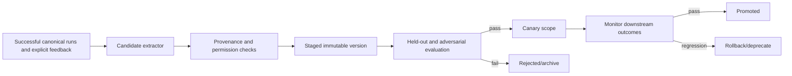
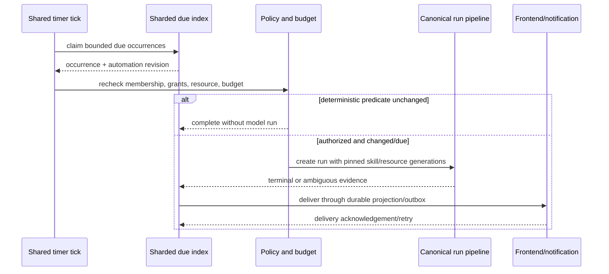

# Skills, learned skills, and cost-efficient automation research

Status: research/design artifact for [issue #52](https://gitcode.com/urandon/sessionless/issues/52), dated 2026-08-25. The issue remains open for design acceptance and creation of separate Skills and Automation epics.

## Evidence vocabulary

- **Documented**: stated by a first-party product, standard, or project document.
- **Observed**: verified in a pinned source tree.
- **Inferred**: a Sessionless-specific conclusion based on documented or observed evidence.
- **Unknown**: requires an experiment, product decision, or cost measurement.

Pinned code evidence uses OpenCode `3a31c4ea801915c0b050df4b3842997ea62b6e93`, Hermes Agent `c80a0a551c7038517456ee0aeb60203ec92aedb6`, Zed `d9ad6aff67e47de43abb270d22de75dd950f1b48`, and DeepSeek Harness `b150a551b8d465e31e418e1b2eaf5e79bbb7d28e`.

## Recommendation

Create two linked epics, not one implementation subsystem:

- **Skills** owns immutable packages of instructions, references, and optional reviewed scripts; provenance, requested capabilities, resolution, evaluation, promotion, and rollback are first-class.
- **Automation** owns durable triggers, due work, authorization/budget preflight, execution, delivery, reconciliation, and user-visible run history.

They share #46 capability grants, #45 memory candidates, #49 usage facts, #63 promotion/regression gates, and canonical Session/Run/Attempt identities. A skill does not schedule itself, grant itself permissions, or become trusted because it was learned repeatedly. An automation does not embed a mutable skill or ambient provider credential; each admitted attempt pins exact skill and resource generations.

## Source-backed comparison

| System | Evidence | Useful pattern | Limitation for Sessionless |
| --- | --- | --- | --- |
| OpenAI Codex and ChatGPT | **Documented** in [skills](https://learn.chatgpt.com/docs/build-skills), [hooks](https://learn.chatgpt.com/docs/hooks), and [scheduled tasks](https://learn.chatgpt.com/docs/automations) | Skills package instructions/resources/scripts; hooks attach deterministic lifecycle behavior; scheduled tasks expose a product-level recurring workflow and notification experience. | Product-local packaging and scheduling do not define Sessionless tenant ownership, resource quota, durable retries, or learned-skill promotion. |
| Agent Skills standard | **Documented** through the [Agent Skills project](https://agentskills.io/) and referenced by OpenAI/Claude skill docs | Portable directory and `SKILL.md` convention separates discovery metadata from on-demand content. | Portability format is not a trust signature, capability grant, dependency lock, or evaluation result. |
| Claude Code | **Documented** in [skills](https://code.claude.com/docs/en/slash-commands), [extension overview](https://code.claude.com/docs/en/features-overview), and [hooks](https://code.claude.com/docs/en/hooks) | Skill descriptions load cheaply and bodies load on use; hooks are deterministic enforcement/automation; plugins package skills, hooks, agents, and MCP. | Skill content consumes context and may be truncated after compaction. Hooks execute host code and inherit the local trust boundary. Model-followed skill instructions are not enforcement. |
| Hermes Agent | **Observed** in pinned [background review](https://github.com/NousResearch/hermes-agent/blob/c80a0a551c7038517456ee0aeb60203ec92aedb6/agent/background_review.py), [skill manager](https://github.com/NousResearch/hermes-agent/blob/c80a0a551c7038517456ee0aeb60203ec92aedb6/tools/skill_manager_tool.py), [curator](https://github.com/NousResearch/hermes-agent/blob/c80a0a551c7038517456ee0aeb60203ec92aedb6/website/docs/user-guide/features/curator.md), [cron docs](https://github.com/NousResearch/hermes-agent/blob/c80a0a551c7038517456ee0aeb60203ec92aedb6/website/docs/user-guide/features/cron.md), and [scheduler](https://github.com/NousResearch/hermes-agent/blob/c80a0a551c7038517456ee0aeb60203ec92aedb6/cron/scheduler.py) | Restricted background learning fork; protected skill ownership; active/stale/archive/pin/adopt/restore lifecycle; cheap deterministic gates can avoid model calls for unchanged monitors. | Usage mainly measures view/use/patch/reuse rather than downstream success. Held-out evaluation is not a mandatory promotion gate; managed scheduler failures may fall back to an always-on ticker. |
| OpenCode | **Observed** in pinned [skill registry](https://github.com/anomalyco/opencode/blob/3a31c4ea801915c0b050df4b3842997ea62b6e93/packages/opencode/src/skill/index.ts), [discovery/download](https://github.com/anomalyco/opencode/blob/3a31c4ea801915c0b050df4b3842997ea62b6e93/packages/opencode/src/skill/discovery.ts), and [skill tool](https://github.com/anomalyco/opencode/blob/3a31c4ea801915c0b050df4b3842997ea62b6e93/packages/opencode/src/tool/skill.ts) | Multiple discovery conventions, permission-gated loading, and staged remote replacement. | Later duplicates can override built-ins; nearby files may be exposed; no publisher/content-signature verification was found. |
| DeepSeek Harness | **Observed** in pinned [architecture](https://github.com/deepseek-ai/deepseek-harness/blob/b150a551b8d465e31e418e1b2eaf5e79bbb7d28e/docs/architecture.md) | Plugin seams separate model, tools, session, sandbox, storage, and UI. | Developer-preview compatibility and broad runtime/plugin supply chain make it unsuitable as a production Sessionless skill host. |

## Skill product model

A skill is immutable content addressed by a digest. A mutable user-facing skill name points to a reviewed version; a run always records the resolved digest.

```text
Skill: skill_id, tenant/owner, name, visibility, active_version, lifecycle
SkillVersion: digest, manifest, content_ref, publisher/provenance, license,
              dependencies, requested_capabilities, compatible_harnesses,
              created_by, review_state, evaluation_baseline, created_at
SkillGrant: scope, capability grants, AI-resource policy, budget, expiry/revocation
```

Skill kinds:

- authored knowledge/reference;
- authored workflow/checklist;
- reviewed executable helper;
- platform-bundled skill;
- third-party imported package;
- learned candidate generated from observed successful work.

Executable scripts are optional artifacts and run only through #46 capabilities. A skill manifest cannot widen network, filesystem, tool, memory, or AI-resource grants. Dependencies are exact digests; resolution fails closed on collision, missing lock, incompatible platform, revoked publisher, or changed content.

### Learned-skill lifecycle



Candidate extraction sees only explicitly authorized session evidence. It may propose instructions but cannot import raw secrets, private output, credentials, or tool artifacts into a package. Promotion requires source provenance, human or policy review appropriate to scope, held-out utility, no permission expansion, and rollback readiness. Invocation count alone is never quality evidence.

## Automation product model

An automation is a durable request to evaluate a trigger and, if due and authorized, create an ordinary canonical run.

```text
Automation: automation_id, tenant/owner, scope, trigger spec/version,
            pinned skill/resource policy, input template ref, delivery policy,
            timezone/DST policy, budget, concurrency, enabled/revision
AutomationOccurrence: occurrence_id, scheduled_for, claim/fence,
                      run_id/attempt_id, state, next_reconcile_at, terminal evidence
```

Supported trigger families should be phased:

1. one-shot time;
2. recurring calendar schedule with explicit timezone and DST behavior;
3. event/webhook trigger;
4. deterministic monitor with change predicate;
5. dependent workflow trigger.

Every occurrence uses deterministic identity derived from automation revision
and logical scheduled time. The state machine is `due → claimed → preflight →
blocked_budget|dispatched → running → delivering →
succeeded|failed|cancelled|retry_wait|ambiguous`. `blocked_budget` retains the
same occurrence identity and moves back to `preflight` only after a budget,
resource, or operator-change wake; disabling or expiry moves it to `cancelled`.
Claims are leased and fenced. Retry does not create another logical occurrence
or double-charge internal quota.



## Permission and threat model

Non-negotiable invariants:

- installation, learning, promotion, scheduling, and invocation are separate permissions;
- a package cannot grant itself capabilities, credentials, wider scopes, or a larger budget;
- each run pins exact skill, automation, policy, and AI-resource generations;
- revocation prevents new admissions immediately; in-flight behavior follows the explicit drain/kill policy;
- untrusted skill text and dependencies are model input, not policy instructions;
- automation rechecks current membership and consent at occurrence time, not only creation time;
- no raw private session silently becomes training/evaluation/skill content;
- scheduler, policy, dependency, or provenance uncertainty fails closed;
- one automation cannot observe another tenant through timing, error detail, due-index scans, or notification routing.

| Threat | Control/evidence |
| --- | --- |
| Malicious skill asks for secrets or destructive tools | Capability requests are declarative and separately granted; runtime effect authorization remains #46-owned. |
| Dependency or remote package changes | Immutable digests, publisher/source provenance, exact lock, staged fetch, review, and rollback. |
| Learned skill captures poisoned output | Authorized provenance set, content scanning, held-out/adversarial #63 suite, explicit promotion. |
| Duplicate schedule execution | Deterministic occurrence ID, transactional claim, lease fence, run idempotency, terminal reconciliation. |
| Disabled user or revoked membership still runs | Occurrence-time authorization, security-version checks, and global/tenant/automation kill switches. |
| Expensive unchanged monitor | Deterministic precondition/hash first; model work only on meaningful change; explicit budget circuit breaker. |
| Notification leaks data | Tenant-bound delivery projection, bounded redacted preview, exact destination grant, durable audit. |
| Timezone/DST surprise | Store IANA zone and declared gap/overlap policy; preview next occurrences before enable. |

## Scheduler and cost alternatives

| Architecture | Advantages | Risks/cost | Decision |
| --- | --- | --- | --- |
| One cloud cron/timer per automation | Easy mental model. | Resource explosion, provider limits, expensive reconciliation, difficult bulk disable. | Reject. |
| Always-on in-process ticker | Low per-tick latency. | Permanent idle billing, single-runtime failure, poor scale-to-zero behavior. | Reject as managed fallback. |
| Shared periodic trigger + sharded YDB due index | Scale-to-zero, bounded scans/claims, central fencing and bulk control. | Tick granularity and YDB write/read cost. | **Recommended MVP.** Use one/few platform ticks and fixed shards. |
| Queue-native delayed delivery | Natural wake-up per occurrence. | Provider maximum-delay limits, reschedule churn, difficult far-future updates. | Evaluate later as a near-term optimization, not sole authority. |

Small/medium/large scenarios must be priced in #49 using enabled automations, due occurrences per minute, deterministic no-op ratio, model-run ratio, retries, delivery, YDB operations, storage, and model/resource usage. Default tick resolution should be product-driven, not sub-minute by assumption. Batch due claims; cap occurrences per tenant/tick; use backpressure and visible lateness rather than unbounded catch-up.

Quota ownership:

- storage and scheduler overhead: automation owner/tenant allowance;
- model and worker execution: pinned AI resource and run owner;
- external tools: exact tool resource owner;
- notifications: automation owner and destination policy;
- learned-skill extraction/evaluation: skill owner or explicitly funded platform program.

When budget is exhausted, the occurrence is `blocked_budget` with a visible reason. It is not silently skipped, moved to another user's subscription, or executed with API billing fallback.

## Decisions, rejected alternatives, and unknowns

Accepted recommendations:

- separate Skills and Automation epics;
- immutable digest-addressed versions and exact dependency locks;
- candidate → staged → evaluated → canary → promoted lifecycle;
- deterministic occurrence IDs and ordinary canonical runs;
- shared trigger plus sharded due index;
- deterministic preflight before any model call;
- activity metrics are diagnostic, while downstream outcome gates promotion.

Rejected:

- mutable skill directory as canonical product state;
- last-discovered package silently overriding another source;
- learned skill promotion from invocation/reuse count;
- a skill carrying implicit tool/resource permission;
- one cron resource per user/automation;
- fallback to an always-on ticker when managed scheduling fails;
- best-effort fire-and-forget notifications without occurrence reconciliation.

Open questions:

- Which Agent Skills fields are sufficient for portable import, and which Sessionless manifest extension is required?
- Which publisher/signature trust model is appropriate before a public marketplace exists?
- What minimum held-out sample and canary window qualify a learned skill?
- Which deterministic monitor predicates can run without a model while remaining understandable to users?
- What is the acceptable schedule granularity and lateness SLO at MVP scale?
- How should federation-owned automations charge shared AI/tool resources and expose results to members?

## Proposed Skills epic

| Phase | Issue-sized outcome | Dependencies | Estimate | Acceptance evidence |
| ---: | --- | --- | ---: | --- |
| S1 | Define skill/version/manifest/dependency/provenance contracts | #46 contracts, #52 | 5 SP / 3d | Canonical fixtures, digest determinism, collision and scope validation. |
| S2 | Implement tenant-scoped package storage, resolver, and lifecycle | S1, #25, #51 | 8 SP / 5d | Import/update/revoke/rollback, exact locks, supply-chain tests. |
| S3 | Integrate capability grants and isolated invocation | S1-S2, #46 | 8 SP / 5d | No permission widening, replacement env, bounded context/artifacts. |
| S4 | Add author/import/review/admin UX | S1-S3, #29, #54 | 8 SP / 5d | Accessible provenance/capability/diff/rollback flows. |
| S5 | Implement learned-candidate extraction and staging | S1-S3, #45 | 8 SP / 5d | Source authorization, poison/secret filtering, idempotent extraction. |
| S6 | Add evaluation, canary, promotion, monitoring, and rollback | S4-S5, #63, #49 | 8 SP / 5d | Held-out utility, non-compensable safety gates, regression rollback. |

Skills estimate: **45 SP / 28 engineering days** before reserve.

## Proposed Automation epic

| Phase | Issue-sized outcome | Dependencies | Estimate | Acceptance evidence |
| ---: | --- | --- | ---: | --- |
| A1 | Define automation, trigger, occurrence, timezone, and state contracts | #20, #39, #52 | 5 SP / 3d | Versioned fixtures, DST/gap/overlap and idempotency tests. |
| A2 | Add YDB sharded due index, claims, fences, and reconciler | A1, #16 | 8 SP / 5d | Bounded queries, duplicate tick, crash/fence-loss, catch-up limits. |
| A3 | Integrate authorization, budgets, deterministic predicates, and canonical runs | A1-A2, #46, #49, #51 | 8 SP / 5d | Revocation, no-op, quota, retry, and no-fallback tests. |
| A4 | Add durable delivery, cancellation, retry, and ambiguous reconciliation | A1-A3, #23, #37 | 8 SP / 5d | Duplicate delivery, terminal recovery, disabled destination tests. |
| A5 | Add user schedule/monitor/history UX and admin kill switches | A1-A4, #29, #54 | 8 SP / 5d | Preview/enable/pause/run-now/history, accessibility, two-tenant tests. |
| A6 | Add scale/cost/reliability evaluation and staged rollout | A1-A5, #49, #63 | 5 SP / 3d | Load scenarios, lateness SLO, cost ceilings, rollback drill. |

Automation estimate: **42 SP / 26 engineering days** before reserve.

Rollout for skills: platform-bundled read-only workflows → user-authored instruction-only skills → imported signed/reviewed packages → executable helpers → learned candidates in review-only mode → narrow canaries. Rollback changes the active pointer to the last validated digest, revokes new admission, and preserves run provenance.

Rollout for automation: disabled contracts/fakes → one-shot internal schedules → opt-in recurring text-only runs → deterministic monitors → tool-bearing runs → federation only after #48/#51 policy. Rollback disables new claims, fences workers, drains/reconciles occurrences, and keeps schedules/history visible.

Success metrics:

- zero skill-caused permission expansion or cross-tenant package resolution;
- 100% skill-bearing attempts record exact digest, provenance, and grants;
- learned-skill promotion improves held-out downstream success with no safety regression;
- automation duplicate logical execution rate is zero under retries/crashes;
- p95 occurrence lateness meets the declared tier without permanent idle compute;
- deterministic no-op monitors consume zero model tokens;
- per-enabled-automation scheduler cost and per-occurrence execution cost remain inside #49 budgets;
- rollback and global/tenant/automation kill-switch drills complete within the declared SLO.
