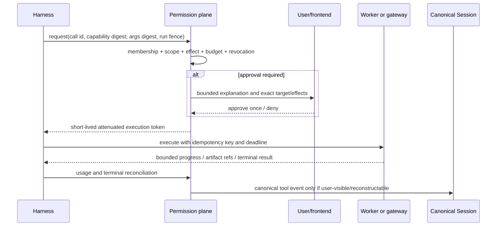

# Built-in tools, MCP extensibility, and permission-plane research

Status: research/design artifact for [issue #46](https://gitcode.com/urandon/sessionless/issues/46), dated 2026-08-25. The issue remains open for design acceptance and epic creation.

## Evidence vocabulary

- **Documented**: stated by a first-party product, protocol, or project document.
- **Observed**: verified in a pinned source tree.
- **Inferred**: a Sessionless-specific conclusion derived from documented or observed evidence.
- **Unknown**: requires an implementation spike, policy answer, or measurement.

Pinned code evidence uses OpenCode `3a31c4ea801915c0b050df4b3842997ea62b6e93`, Zed `d9ad6aff67e47de43abb270d22de75dd950f1b48`, Hermes Agent `c80a0a551c7038517456ee0aeb60203ec92aedb6`, and DeepSeek Harness `b150a551b8d465e31e418e1b2eaf5e79bbb7d28e`.

## Recommendation

Sessionless should own a harness-neutral capability and permission plane. A worker receives an immutable admitted capability manifest, attenuated credentials, and bounded session material; every call is authorized again against current membership, revocation, consent, and budget state at the execution boundary.

The trusted built-in set should remain small and product-semantic:

- read bounded canonical session context;
- read/write explicitly authorized memory candidates through the future #45 contract;
- open or publish exact tenant-scoped artifact handles;
- request approval or user input;
- report progress, usage, diagnostics, and cancellation acknowledgement.

Filesystem, shell, process, browser, web, external applications, notifications, and third-party APIs are execution-plane capabilities. They may be implemented by a Sessionless-owned worker tool or MCP server, but they are not ambient powers of the model or AI-resource credential.

## Source-backed comparison

| System | Evidence | Useful pattern | Limitation for Sessionless |
| --- | --- | --- | --- |
| MCP specification | **Documented** in [tools](https://modelcontextprotocol.io/specification/2025-11-25/server/tools), [authorization](https://modelcontextprotocol.io/specification/2025-06-18/basic/authorization), and [security principles](https://modelcontextprotocol.io/specification/2025-03-26/index) | Standard discovery/call schemas, progress/cancellation, OAuth resource indicators, audience validation, PKCE, and explicit warning that tool annotations are untrusted. | MCP defines interoperability, not Sessionless tenant authorization, isolation, billing, or side-effect policy. Experimental task APIs are not a stable product contract. |
| OpenAI Codex | **Documented** in [MCP](https://learn.chatgpt.com/docs/extend/mcp?surface=cli) and [agent approvals and security](https://learn.chatgpt.com/docs/agent-approvals-security) | Separates sandboxing, approval policy, internet access, and MCP configuration; provides a user-visible approval surface. | Product defaults and local-user trust do not establish a multi-tenant worker security boundary. |
| Claude Code | **Documented** in [permissions](https://code.claude.com/docs/en/permissions), [MCP](https://code.claude.com/docs/en/mcp), [hooks](https://code.claude.com/docs/en/hooks), and [tools](https://code.claude.com/docs/en/tools-reference) | Deny/ask/allow rules, lifecycle enforcement hooks, managed policies, local/remote MCP, and visible tool configuration. Pre-tool hooks can block before permission rules. | Local settings, hooks, and inherited environment remain host-level authority. Prompt instructions and model decisions are not hard security controls. |
| Zed native agent | **Observed** in pinned [tools](https://github.com/zed-industries/zed/blob/d9ad6aff67e47de43abb270d22de75dd950f1b48/crates/agent/src/tools.rs), [profiles](https://github.com/zed-industries/zed/blob/d9ad6aff67e47de43abb270d22de75dd950f1b48/crates/agent_settings/src/agent_profile.rs), [permissions](https://github.com/zed-industries/zed/blob/d9ad6aff67e47de43abb270d22de75dd950f1b48/crates/agent/src/tool_permissions.rs), and [MCP registry](https://github.com/zed-industries/zed/blob/d9ad6aff67e47de43abb270d22de75dd950f1b48/crates/agent/src/tools/context_server_registry.rs) | Compiled built-ins, profile visibility, deny → confirm → allow precedence, blocked unparseable shell substitutions, and provenance-bearing MCP IDs. | External ACP agents expose their own approvals; native policy is not necessarily the final enforcement boundary for external agents. |
| OpenCode | **Observed** in pinned [tool registry](https://github.com/anomalyco/opencode/blob/3a31c4ea801915c0b050df4b3842997ea62b6e93/packages/opencode/src/tool/registry.ts), [session tools](https://github.com/anomalyco/opencode/blob/3a31c4ea801915c0b050df4b3842997ea62b6e93/packages/opencode/src/session/tools.ts), [MCP runtime](https://github.com/anomalyco/opencode/blob/3a31c4ea801915c0b050df4b3842997ea62b6e93/packages/opencode/src/mcp/index.ts), and [permissions](https://github.com/anomalyco/opencode/blob/3a31c4ea801915c0b050df4b3842997ea62b6e93/packages/opencode/src/permission/index.ts) | Unified dynamic discovery and local/remote MCP support. | Plugins receive broad context, stdio MCP inherits host `process.env`, and remembered allows are instance/directory state rather than explicit tenant/resource/session grants. |
| Hermes Agent | **Observed** in pinned [registry](https://github.com/NousResearch/hermes-agent/blob/c80a0a551c7038517456ee0aeb60203ec92aedb6/tools/registry.py) and [MCP tool](https://github.com/NousResearch/hermes-agent/blob/c80a0a551c7038517456ee0aeb60203ec92aedb6/tools/mcp_tool.py) | Source ownership, collision handling, and dynamic availability. | MCP may default to broad trust; read-only classification partly trusts server hints; policy/security-module failures can fail open. |
| DeepSeek Harness | **Observed** in pinned [architecture](https://github.com/deepseek-ai/deepseek-harness/blob/b150a551b8d465e31e418e1b2eaf5e79bbb7d28e/docs/architecture.md), [ACP](https://github.com/deepseek-ai/deepseek-harness/blob/b150a551b8d465e31e418e1b2eaf5e79bbb7d28e/packages/acp/acp/README.md), and [sandbox](https://github.com/deepseek-ai/deepseek-harness/blob/b150a551b8d465e31e418e1b2eaf5e79bbb7d28e/docs/subsystems/sandbox.md) | Replaceable model/tool/session/sandbox plugins and one-shot ACP approvals. | File sandboxing does not isolate network/process/credentials; developer-preview protocol lacks a complete stable call lifecycle. |

## Capability and risk taxonomy

Every capability declares effects independently. A tool is not classified by one `readOnly` boolean.

| Dimension | Values and policy meaning |
| --- | --- |
| State effect | read, additive write, mutating write, destructive |
| Execution | none, code interpretation, process execution, privileged execution |
| Data | public, tenant-internal, personal, secret-bearing, regulated |
| Reach | closed local, workspace, private network, open network, human/external entity |
| Resource | free/bounded, metered platform, user subscription, external paid API |
| Reversibility | reversible, compensatable, ambiguous, irreversible |
| Interaction | automatic, notify, ask once, ask every call, dual control |

The platform-owned effect set should at least include `read`, `write`, `execute`, `egress`, `spend`, `credential_use`, `notify`, and `destructive`. MCP annotations can enrich explanations, but only a trusted catalog review or Sessionless-owned adapter may convert them into enforceable claims.

### Baseline built-in boundary

| Capability | Placement | Rationale |
| --- | --- | --- |
| Canonical context and bounded history | Built-in product port | Enforces session participation and immutable context semantics. |
| Memory candidate/read/forget | Built-in product port | Must share #45 provenance, deletion, and permissions. |
| Exact artifact open/publish | Built-in product port | Preserves tenant prefixes, digests, and manifests. |
| Progress, usage, cancel, approval, user input | Built-in runtime port | Required by every harness and frontend; cannot depend on one MCP server. |
| Filesystem/search/edit | Worker capability | Meaning depends on an authorized workspace and isolation boundary. |
| Shell/process/code execution | Worker capability | Requires process, filesystem, network, and budget enforcement below the model. |
| Web/browser | Worker or controlled gateway | Open-world output is untrusted and carries egress/privacy cost. |
| External SaaS/communication | MCP or reviewed adapter | Needs resource-specific OAuth, consent, side-effect, and audit semantics. |
| Scheduling/notifications | Product service | Durable timing and delivery belong to #52; a model tool only requests them. |

## Grant and authorization contract

A grant is explicit and versioned:

```text
grant_id, tenant_id, subject(user|worker|run), capability_id, capability_digest,
scope(resource|project|session|run), allowed_effects, credential_ref/generation,
approval_policy, budget, issued_by, issued_at, expires_at, revoked_at, policy_revision
```

Admission freezes the visible tool names, schemas, provenance, and digests for prompt reproducibility. Call-time authorization rechecks active membership, grant revision, exact arguments or derived target scope, credential generation, budget, and revocation. A stable prompt manifest therefore does not create a stale permission bypass.

No worker subprocess inherits the host environment. Sessionless builds an explicit environment allowlist and materializes only the credential for the exact capability invocation. Provider subscription credentials are never exposed to MCP or tool processes merely because the model uses that provider.

## Invocation lifecycle



The call state machine is `requested → authorized|approval_pending|denied → dispatched → running → succeeded|failed|cancelled|ambiguous`. Side-effecting retries require a tool-supported idempotency key or an explicit reconciliation procedure. An ambiguous result never becomes an automatic retry.

Large inputs and results are exact immutable artifact references. Inline output, event count, wall time, and aggregate bytes are bounded. Unknown protocol fields may be retained as sanitized evidence but cannot trigger execution.

## MCP topology alternatives

| Alternative | Strengths | Risks and cost | Decision |
| --- | --- | --- | --- |
| Worker-direct MCP | Lowest latency; local stdio and `localhost` resources work naturally on attached workers. | Each worker implements auth/policy/health; local server can attack worker; duplicated connections. | Use for explicitly user-managed local MCP under the same worker isolation boundary. |
| Central MCP gateway | Central OAuth, audit, rate limit, schema validation, circuit breaking, and connection reuse. | Gateway sees data and secrets; adds latency/cost; cannot reach worker-local endpoints. | Use for managed and third-party remote MCP. |
| Hybrid | Correct execution locality with one product policy contract. | More routing and conformance work. | **Recommended.** The control plane chooses a reviewed execution placement; policy semantics remain identical. |

Server lifecycle: catalog/discover → review trust and license → install/connect → fetch and hash manifest → health/conformance probe → enable in a scope → admit calls → rotate credentials/version → drain → disable/revoke → remove and delete local secret material. Tool names exposed to the model are stable namespaced IDs; display names cannot collide into replacement.

## Threat model and invariants

- policy evaluation, schema validation, secret materialization, or audit failure is fail-closed;
- tenant and membership checks precede schema discovery that could leak tool availability;
- tool/MCP output is untrusted content and cannot change policy or approve a later call;
- credential tokens are audience-bound, short-lived, non-pass-through, and never logged;
- stdio servers receive a replacement environment and restricted readable/writable roots;
- an approval names the target, effects, credential/resource, and persistence; vague blanket consent is invalid;
- remembered approval is a revocable scoped grant, never an instance-global boolean;
- destructive and external-human side effects require explicit policy even when declared idempotent;
- cancellation has a bounded grace and kills/revokes the whole execution unit when possible;
- emergency kill switches can disable one capability, server version, resource, tenant, or all external effects.

Key abuse tests include malicious schema/description, false read-only hints, prompt injection in tool output, symlink/path escape, environment scraping, OAuth confused deputy/token passthrough, cross-tenant IDs, replayed approval, stale grant after membership revocation, ambiguous external write, output bomb, forked descendants, and cancellation races.

## Cost and reliability model

Attribute exact compute, network, browser/runtime time, external API usage, artifact storage, and connection time to the capability call and resource owner. #49 defines durable usage facts; sampled traces are diagnostic only.

Alternatives:

- **Always-on gateway connections:** low call latency and reusable OAuth sessions, but idle tenants produce continuous cost. Reserve for measured high-volume managed integrations.
- **Scale-to-zero per call:** cheapest idle state and simplest isolation, but cold start and repeated auth/handshake cost. Default for low-frequency remote tools.
- **Bounded pooled gateway:** share transport/runtime by server and trust class, never credentials or authorization state; expire idle connections. Recommended after a measured concurrency threshold.

Reliability budgets must declare per-call deadline, retry class, idempotency support, output limits, circuit breaker, and degradation behavior. If an unavailable tool is necessary to the user request, the agent reports it; it does not silently choose a different side effect or paid resource.

## Decisions, rejected alternatives, and unknowns

Accepted recommendations:

- product-owned capability/effect taxonomy and grants;
- immutable admitted manifests plus call-time authorization;
- minimal product-semantic built-ins;
- hybrid worker-direct/managed-gateway MCP placement;
- explicit environment replacement and credential attenuation;
- canonical tool events only for reconstructable user-visible work; operational chatter remains attempt evidence.

Rejected:

- trusting `readOnlyHint` or server descriptions as authorization;
- giving every harness its native tool list and approval model as product semantics;
- ambient host environment inheritance;
- provider credential access for arbitrary tools;
- one global “always allow” flag;
- automatic retry of ambiguous side effects;
- dynamically changing schemas mid-attempt.

Open questions:

- Which local MCP transports can be supported safely by the first attached-worker daemon?
- Which managed MCP integrations justify pooled connections before product demand exists?
- Should Sessionless sign reviewed capability manifests or rely on pinned artifact digests plus catalog provenance?
- How are OAuth consent and credential ownership represented for federation/shared resources?
- Which tool result fields are canonical Session events versus access-controlled audit evidence?

## Proposed Tooling epic

| Phase | Issue-sized outcome | Dependencies | Estimate | Acceptance evidence |
| ---: | --- | --- | ---: | --- |
| 1 | Define capability, effect, grant, call, result, and error contracts | #4, #20, #46 | 5 SP / 3d | Versioned fixtures and transition/tenant validation tests. |
| 2 | Implement policy evaluator, scoped grants, approval records, and revocation | phase 1, #58 | 8 SP / 5d | Deny precedence, stale membership, replay, expiry, and two-tenant tests. |
| 3 | Implement minimal built-in product ports and canonical tool-event mapping | phases 1-2, #23, #24, #45 contracts | 8 SP / 5d | Bounded context/artifact/cancel flows and duplicate-finalization tests. |
| 4 | Implement worker capability manifest and isolated local execution broker | phases 1-2, #47 | 8 SP / 5d | Replacement env, roots, process-group cleanup, output/deadline limits. |
| 5 | Implement managed remote MCP gateway and OAuth secret broker | phases 1-2, #48, #51 | 13 SP / 8d | Audience/PKCE/rotation, token non-pass-through, revoke, circuit-breaker tests. |
| 6 | Add catalog, install/enable/disable, versioning, and conformance probes | phases 4-5 | 8 SP / 5d | Collision, schema drift, health, rollback, and supply-chain evidence. |
| 7 | Add user/admin approvals, traces, cancellation, and diagnostics | phases 2-6, #29, #54 | 8 SP / 5d | Accessible browser tests and redacted audit/export checks. |
| 8 | Add metering, reliability gates, and adversarial evaluation | phases 3-7, #49, #63 | 5 SP / 3d | Exact usage reconciliation and non-compensable permission suites. |

Estimated total: **63 SP / 39 engineering days**, before reserve and before individual SaaS connector work.

Rollout: contracts/fakes → built-ins only → one reviewed worker-local read tool → one managed read-only remote MCP → additive writes with per-call approval → carefully selected remembered grants. Rollback disables the capability/server version, revokes tokens and new admissions, drains bounded in-flight calls, and leaves canonical sessions and unrelated tools available.

Success metrics:

- zero unauthorized/cross-tenant effects in adversarial tests;
- 100% calls resolve to a pinned capability digest, grant, run, and resource owner;
- no secret bytes in Session events, queue messages, logs, or artifacts;
- bounded p95 authorization and dispatch latency;
- cancellation/descendant cleanup meets the declared grace;
- ambiguous side effects are reconciled rather than retried;
- task-success improvement from each added capability is demonstrated in #63 against its token/cost/context overhead.
