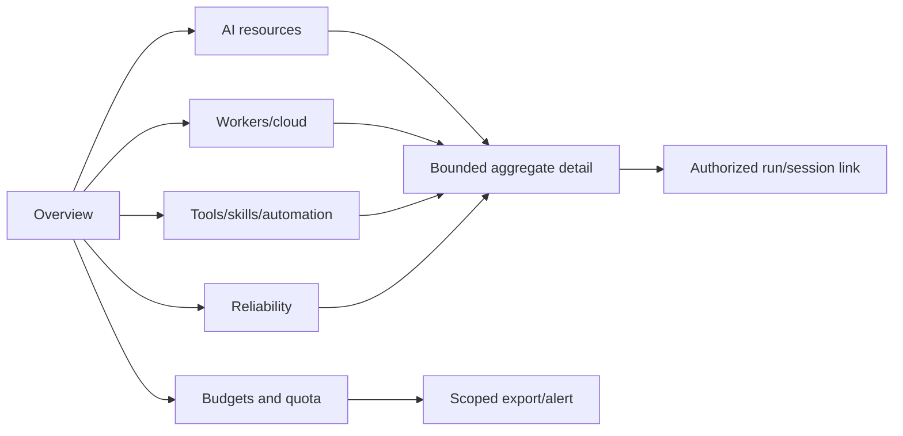
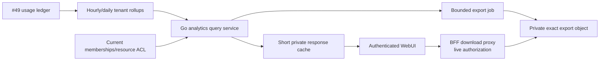

# Membership-scoped usage analytics for the user WebUI

Research date: 2026-08-25

Tracks: [#53](https://gitcode.com/urandon/sessionless/issues/53)

Status: decision-ready research; the issue remains open for design/epic acceptance

## Decision summary

The user WebUI should answer four questions without exposing platform-wide or another member's data:

1. What did I and the tenants I am authorized to view use?
2. Which AI, worker, tool, skill, storage, and cloud resources paid for it?
3. Are budgets, quotas, reliability, or data-policy constraints limiting work?
4. Can I trace an aggregate to an authorized session/run without seeing secrets or another user's content?

The UI reads only pre-aggregated, membership-scoped views defined by #49. It never queries raw logs, traces, provider dashboards, Object Storage usage batches, or platform admin APIs from the browser. Costs are visibly classified as observed provider cost, reconciled invoice/cloud cost, or estimate. Unknown and partial coverage are first-class states.

This product surface is distinct from the platform administration console in #54. Tenant owners may manage their tenant's budgets and resource sharing, but cannot see platform-wide margins, other tenants, secret metadata, worker host details, security investigations, or operator controls.

## Product and competitor evidence

| Source | Useful product pattern | Limitation to avoid |
|---|---|---|
| [ChatGPT Enterprise/Edu workspace analytics](https://help.openai.com/en/articles/10875114-workspace-analytics-for-chatgpt-enterprise-and-edu) | Overview trends, user adoption, projects, tools/connectors and skills; analytics-viewer role; small organizational groups can be omitted from insights. | Activity is not cost or outcome quality. Do not copy individual ranking/labels into a consumer product without purpose and consent. |
| [Claude Team/Enterprise usage analytics](https://support.claude.com/en/articles/12883420-view-usage-analytics-for-team-and-enterprise-plans) | Members may see their own product/model/skill usage and relation to spend limits; organization views are role-gated. | Provider analytics cover only that provider and plan; Sessionless must show provenance and missing dimensions. |
| [Anthropic Usage and Cost API](https://platform.claude.com/docs/en/manage-claude/usage-cost-api) | Separate usage/cost records and administrator credential; daily cost grain and workspace grouping. | Admin API access must remain server-side; daily provider cost cannot support false per-turn precision. |
| [OpenAI Usage API](https://platform.openai.com/docs/api-reference/usage) | Project/API-key grouping and separate Costs endpoint for invoice-oriented reporting. | Usage may not reconcile exactly to Costs; surface the reconciliation state. |
| [OpenRouter workspaces](https://openrouter.ai/docs/guides/features/workspaces/overview) and [usage accounting](https://openrouter.ai/docs/cookbook/administration/usage-accounting) | Workspace/member policy, route-aware token/cost facts, model/provider observability. | Router account-wide visibility and actual prompt logging settings must not leak through Sessionless tenant membership. |

## Personas and authorization

| Persona | May see | May not see | May change |
|---|---|---|---|
| Member | Own runs/usage, tenant aggregates permitted by membership, resources shared with them | Other member detail unless role grants it; platform/internal cost | Personal filters/alerts; own export where policy permits |
| Tenant analyst | Tenant aggregate, approved dimensions, coverage/freshness | Prompts, outputs, secrets, other tenants, platform margins | Saved views and aggregate export |
| Tenant owner/billing manager | Tenant/member/resource cost and budget views, reconciliation status | Platform-wide or credential contents | Tenant budgets, alerts, resource beneficiary limits |
| Resource owner | Usage/capacity charged to their shared AI/worker resource and named beneficiaries where policy allows | Beneficiary session content; unrelated tenant data | Resource budgets, sharing and availability policy |
| Support viewer | Nothing through the user UI beyond their own membership | Any privileged support/platform view | None; uses #54 controlled support flow instead |

Authorization is evaluated server-side for every query, drill-down, and export
download using current membership, role, resource ACL, and requested tenant. A
URL parameter is only a selector. Revoked membership invalidates cached
responses and makes the BFF download proxy deny the export immediately.
Federation views are intersections of the viewer's beneficiary and
resource-owner permissions, not unions of every participating tenant.

## Information architecture

### 1. Overview

- selected tenant and date range;
- reconciled and estimated spend, token/compute/storage totals, successful runs, error rate;
- budget/quota status and next known reset;
- data freshness and coverage banner;
- comparison with previous equal period, never an unlabelled lifetime comparison.

### 2. AI resources

- usage/cost by resource, provider, actual route, model, and execution placement;
- subscription/API/router/local resource type and billing owner;
- observed quota buckets, unknown states, throttles, and route-policy violations;
- no presentation of an estimated subscription percentage as currency.

### 3. Workers and platform resources

- attached/cloud attempts, execution time, cold-start/tail latency, failures, cancellations;
- owner-attributed storage/network/YDB/cloud cost where #49 supports it;
- user-friendly explanations, not host paths, IPs, credentials, or internal topology.

### 4. Tools, MCP, skills, and automation

- calls, success/failure/cancellation, latency, spend, approvals/denials;
- skill use and downstream outcome/evaluation status when #63 provides it;
- scheduled jobs due/executed/skipped and zero-model-token fast paths;
- activity does not imply quality or promotion.

### 5. Reliability

- run status classes, provider vs worker vs product attribution, p50/p95 latency;
- retry/ambiguous completion counts and affected authorized runs;
- links to incident-safe explanations, never raw provider errors/logs.

### 6. Budgets, alerts, and exports

- personal/tenant/resource budgets, consumption, reservations, resets, and denial policy;
- alerts for thresholds, quota unknown/stale, reconciliation variance, unusual growth;
- asynchronous bounded CSV/JSON export with exact scope, grain, expiry, and audit record.

## Navigation and drill-down



Every card includes value, unit/currency, scope, period, grain, provenance class, freshness, coverage, and whether it is observed/reconciled/estimated. Empty means no events; unknown means the source could not establish a value; partial means known coverage is incomplete. Those states must not collapse to zero.

## Read model and API



Recommended endpoints:

```text
GET  /api/web/v1/analytics/overview?tenant_id=&from=&to=&grain=
GET  /api/web/v1/analytics/resources?...&cursor=
GET  /api/web/v1/analytics/tools?...&cursor=
GET  /api/web/v1/analytics/reliability?...&cursor=
GET  /api/web/v1/analytics/budgets?tenant_id=
POST /api/web/v1/analytics/exports
GET  /api/web/v1/analytics/exports/{export_id}
```

The server derives allowed dimensions from role and requested scope. Arbitrary SQL-like group-by, raw IDs, and high-cardinality labels are not accepted. Cursors bind tenant, membership generation, normalized filters, grain, query version, and expiry. Cache keys include authorization generation and never cross tenants.

## Query, cache, and cost budgets

- default 30-day range; maximum interactive range 13 months at daily grain;
- hourly grain limited to 30 days; longer ranges automatically require daily/monthly rollups;
- at most two group dimensions and a fixed allowlist per endpoint;
- top lists are bounded and include an `other` aggregate where safe;
- one request fans out over a fixed number of tenant-first rollup ranges, never members or raw events;
- private cache TTL 30–120 seconds with membership/resource generation in the key;
- exports are asynchronous, one active export per user/tenant policy, size/range capped, automatically expired;
- browser polling backs off and stops in the background; no per-card independent refresh loops;
- the UI displays rollup freshness rather than forcing synchronous reconciliation;
- endpoint RU/latency/cardinality budgets are regression-tested against generated high-volume fixtures.

## Privacy, safety, and UX requirements

| Risk | Control |
|---|---|
| Cross-tenant/member inference | Current membership and dimension-level authorization; small-cohort suppression; two-tenant negative E2E. |
| Member ranking harms privacy | No default leaderboard. Per-member detail requires explicit tenant role/purpose; user sees their own usage by default. |
| Prompt/tool content leaks through labels | Content-free metric catalog; display names are controlled metadata, not model text; escape all values. |
| Export outlives access | Browser receives only a BFF download URL. The BFF rechecks live membership/resource ACL and the export's authorization generation on every download, reads the private object with its server-side exact capability, and streams it without exposing a presigned Object Storage URL. Membership revocation denies new downloads; an already-started stream and bytes already downloaded remain explicit residual risks. |
| False billing precision | Separate observed, reconciled, allocated, estimated; show currency and price revision; link correction history. |
| Stale quota causes spend | Show observed timestamp/expiry; stale/unknown quota follows admission policy and cannot be presented as remaining allowance. |
| Dashboard itself creates material cost | Precomputed rollups, bounded filters, cache, request budget, no raw scans/log queries. |
| Accessibility/mobile failure | Semantic tables/charts, textual equivalents, keyboard/focus support, contrast, responsive stacking, no color-only status. |

Charts must have textual summaries and accessible tables. Monetary values use locale-aware formatting without floating-point rounding claims. UTC boundaries are canonical; the UI may render the user's timezone while stating how billing/provider periods differ.

## Decisions, rejected alternatives, and open questions

Accepted:

- user analytics is an authorized read model over #49, not a second ledger;
- Overview plus resources, workers/cloud, tools/skills, reliability, and budgets;
- every number carries scope, time, provenance, freshness, coverage, and precision class;
- personal/member/tenant/resource-owner views are distinct;
- bounded asynchronous export and short authorization-aware cache;
- responsive and accessible UI is part of acceptance.

Rejected:

- querying provider/admin APIs directly from the browser;
- querying logs/traces/raw Object Storage for dashboard cards;
- platform-wide data in the user BFF;
- default member leaderboards or prompt/topic classification;
- arbitrary group-by/query builder;
- treating tool/skill call count as outcome quality;
- treating unknown/partial as zero.

Open questions:

1. Which tenant roles may see per-member detail, and should that be opt-in by deployment?
2. What minimum cohort size is appropriate for shared/federated analytics?
3. Which costs can be shown before provider/cloud reconciliation without confusing users?
4. What user-facing success metric from #63 should accompany skill/tool activity?
5. Which export retention and deletion guarantees are required by product policy?

## Proposed User Analytics WebUI epic

| Work item | Estimate | Dependencies | Acceptance |
|---|---:|---|---|
| UA-01 personas, metric catalog, API contracts and threat model | 5 SP | #49, #30 | Dimension-level authorization and unknown/partial semantics are contract-tested. |
| UA-02 tenant/resource rollup read service | 8 SP | #49 MM-04 | Bounded query plans; membership generation and two-tenant negatives pass. |
| UA-03 Overview/resources/budgets UI | 8 SP | UA-01, UA-02, #33 | Responsive/accessible cards and tables show provenance/freshness/precision. |
| UA-04 tools/skills/automation/reliability UI | 5 SP | UA-02, #46, #52, #63 | Activity and outcome/evaluation are distinct; safe run drill-down. |
| UA-05 exports and user alerts | 5 SP | UA-02 | Exact-scope expiring export; revoked membership cannot download; alert dedupe. |
| UA-06 browser/security/load E2E | 5 SP | UA-03–UA-05, #35 | Cross-tenant, cohort, cache, high-cardinality, accessibility, and mobile gates pass. |

Rollout: internal fixture tenant -> read-only maintainer canary -> tenant-owner beta -> member self-view -> optional per-member analytics. Each surface has a feature flag. Rollback removes routes/navigation and stops export jobs without altering the #49 ledger or quota enforcement.

Success metrics: analytics endpoint p50/p95 and RU, rollup freshness, reconciliation coverage shown, cache hit rate, export completion/expiry, dashboard cloud cost, accessibility violations, cross-tenant denials, and the percentage of sessions where users can explain resource/cost attribution without support.
