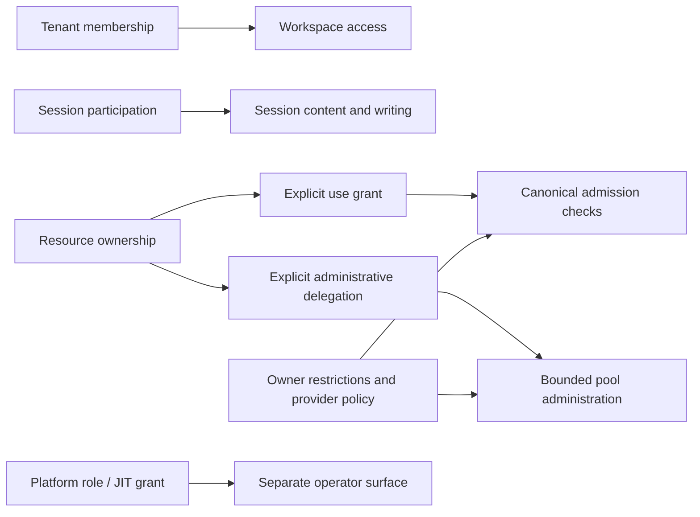

# Tenant and federation administration contract

Status: owner-accepted initial product scope plus explicitly deferred future envelopes.
Owner: [#139](https://gitcode.com/urandon/sessionless/issues/139); canonical resource owner: [#51](https://gitcode.com/urandon/sessionless/issues/51).
Consumes [product UX](product-ux-contract.md), [design rules](design-rules.md) and
[delivery roadmap](product-ux-roadmap.md).

Source provenance: wiki snapshot inspected on 2026-10-01 at
`1a6b208468dc99a53a9eb9f4e1444e9716a8aad4`; documentation delivery base
`a463e9780651667be8a28b0bdce339688c7ad453`. Relevant domain/ports/BFF/Svelte,
blob-delivery and existing UX paths were unchanged between these revisions.
File/line evidence below is pinned to the inspection snapshot, not a promise
about an arbitrary future branch.

Independent source-snapshot resolutions:
[#138 CLEAN](https://gitcode.com/urandon/sessionless/issues/138#note_192407004)
and [#139 CLEAN](https://gitcode.com/urandon/sessionless/issues/139#note_192407016).
[Owner acceptance](https://gitcode.com/urandon/sessionless/issues/139#note_192407231)
selects the **initial** D1–D5 scope only. The extracted document delta still
requires normal independent MR review and exact-head checks/CI; source CLEAN
does not transfer to changed text automatically. No implementation, deployment,
migration, provider/credential access or runtime activation is authorized here.

## 1. Recommended scope boundary

The accepted initial administrative UI uses an explicitly tenant-scoped capacity pool: owners contribute eligible resource capacity to named beneficiaries under versioned use grants. Treat this as the first federation-admin slice, not as a claim that every federation must be tenant-scoped.

Do not allow cross-tenant inheritance through the UI. If #51/#118 requires cross-tenant execution, require a separate owner-approved directional trust/grant contract, explicit source and beneficiary scopes, data/host consent, accounting attribution and revocation enforcement. A cross-tenant backend capability does not make a generic admin UI ready.

Alternatives:
- Same-tenant pool: smallest membership/privacy boundary; less flexible organization topology. Recommended initial UI.
- Cross-tenant federation: useful shared capacity across independent organizations, but requires explicit trust edges, consent, disclosure and accounting/recovery semantics. Separate later slice.
- Implicit shared organization/global admin: rejected; creates transitive privilege and data leakage.

Design acceptance does not expand #118 runtime scope or enable sharing. Existing admission/revocation work continues under its reviewed contract.

## 2. Permission graph



These are separate predicates, not implications: membership does not imply session content; resource use does not imply ownership; delegated admin does not imply use or platform role. A diagram arrow is not a new implementation mechanism.

Proposed effective administrative authority = actor's scoped delegation ∩ owner's delegation envelope ∩ current resource/pool policy ∩ provider/license eligibility. Grant validity and canonical admission remain server-authoritative. No UI scheduler or fallback.

## 3. Observable/control/forbidden matrix

| Actor | Observable | Permitted controls when implemented | Explicitly forbidden |
|---|---|---|---|
| Tenant owner | Member roles, workspace policy, safe resources, authorized aggregates | Membership maintenance, scoped policy; request eligible owner contribution | Read all transcripts; appropriate another owner's resource; create platform role |
| Delegated tenant admin (proposed) | Exact delegated membership/policy subset | Only delegated methods/targets; no delegation amplification | Self-escalation, creating an owner or broader grant than allowed |
| Resource owner | Own grants/reserve/restrictions, policy-approved non-revealing consumption attribution, operation evidence | Contribute/withdraw capacity, approve/revise/revoke own grants, owner-approved worker actions | Treat consumer prompts as ordinary admin data; expose credentials |
| Pool admin (proposed) | Pool members, contributed-resource summaries, capacity limits, disclosure-policy-approved aggregates (otherwise withheld) | Beneficiary membership and narrower use-grant proposals within owner envelope | Override owner denial/expiry/reserve; grant access to absent resources |
| Beneficiary | Eligible capability/privacy summary, own decisions/consumption and remaining limit | Request/use eligible capacity, withdraw participation | Other member detail; grant administration; bypass admission |
| Platform support/operator | Metadata under scoped #54 role | Audited typed operations; limited content access only via approved JIT grant | Automatic membership/content access or unrestricted impersonation |

Current generic tenant admin authorizer is owner-only; delegated tenant/pool administration is deferred. The observable/control matrix contains future permission envelopes; the accepted initial scope overrides any broader candidate control. Resource/worker owner scopes must be verified against their specific existing ports, not generalized from tenant ownership.

## 4. Future entity and command sketches (not first-slice APIs)

A grant references immutable identities, not stored secret values:

```text
ResourceUseGrant:
  id, source_tenant_id, resource_id, beneficiary_scope
  policy_revision, generation, owner_approval_ref
  allowed_workload/model/data_classes, host_privacy_disclosure_ref
  owner_reserve, beneficiary_limits, valid_from, expires_at
  authorization/revocation evidence refs

AdministrativeDelegation:
  id, delegator, delegate, scope, allowed_commands/targets
  ceiling_policy_revision, generation, expires_at, audit_ref
```

These DTOs are contract sketches only; exact schema, state machine and serialization belong canonical backend owners. Quota numbers include units/window and unknown semantics. Bounds cannot be user-supplied bypasses. A delegation cannot outlive or exceed its parent authority; revoke/expiry invalidates dependent eligibility.

Read projections: pool/resource summaries, beneficiary eligible capabilities, grant details, authorized aggregate usage only after the §6 disclosure release decision, and operation receipts. Every projection records source scope, snapshot/observed time, freshness, coverage, authority generation and bounded page cursor. No secrets, raw endpoint/host path, tool payload or conversation content.

Future command catalog, excluded unless separately accepted: propose contribution, owner approve/revise/withdraw, invite/remove beneficiary, propose narrower use grant, revoke grant, change within-ceiling limits, transfer administration. Accept exact scope/target, expected revisions/generations, idempotency key and audited reason. Plan/confirm/apply for impactful changes.

The server recomputes authorization and conditions at apply time. A stale plan or lost delegation fails explicitly; no apply from cached browser permission. Commands return typed outcomes and durable receipt IDs. Retried requests with the same key do not create duplicate invitations/grants or repeated side effects.

## 5. Grant and recovery wireflows

Contribution: owner chooses owned resource → eligibility/policy/licensing checks → data classes + host disclosure + reserve preview → specific beneficiary proposal → required owner/beneficiary approvals → server admission eligibility → resource summary with version/expiry.

Access: beneficiary sees eligible summary → accepts necessary sharing disclosure → sends canonical Session work → admission accepts or gives typed denial. Denial may mean revoked, expired, limit exhausted/unknown, unsupported data/workload, unavailable owner capacity or policy change. No secret credential sharing.

Withdrawal: exact grant/version → show affected eligibility and known in-flight consequences → confirm → persist canonical revocation/fence → receipt. Future admission blocked according to canonical contract. In-flight work follows the existing fence/recovery authority; remote ACK/process stop/erasure remain separate, possibly unknown. UI cannot assert deletion from an offline host.

Departure/dissolution: remove beneficiary/pool → invalidate affected eligibility → preserve bounded audit/historical accounting attribution → reauthorize BFF reads/commands and fresh capability issuance → receipt. Previously issued bearer download URLs retain possible residual validity until their stated expiry; they are not revoked by membership/cache-generation changes. Retention/deletion follows approved policy, not cascade-delete UI intuition.

Last-owner/admin: refuse ordinary removal that would leave no valid required administrator. Use explicit confirmed handover to eligible successor. Exceptional loss uses a separately approved recovery workflow with audit and appropriate multiple-party/JIT authorization; never a universal support override. Exact operator recovery roles remain #54 input.

## 6. Privacy and consumption

Member sees own authorized usage. Tenant analytics, resource-owner consumption summaries and federation attribution require both explicit scope permission and the applicable safe aggregate-disclosure decision; absence of transcripts is insufficient privacy proof. Billing/detail permission must be explicit. Before that decision, potentially revealing aggregates are withheld, not enabled by default.

Small-cohort disclosure threshold and differentiation protections remain an explicit #53/#139 review decision, not an invented fixed number. Before applicable approval, withhold any tenant/pool/resource aggregate that could reveal unauthorized individual consumption, as well as member detail and risky exports. Own 700 + total 1,000 in a two-member cohort would disclose the other's 300 even without a detail route. Server release decisions must account for overlapping filters/windows, known own values and join/leave differences; a UI instruction not to subtract cannot stop client-side inference. Coarsened release requires an accepted policy and negative tests, not guessed rounding/thresholds. Personal-only #150 can proceed under its own reviewed contract without all of #139 closing; tenant aggregate exposure in #150 inherits the applicable #53 disclosure decision and #139 only for federation/delegation semantics. Bound grouping/time windows following #53.

Historical consumption may remain auditable after departure without keeping departed users able to query it. Retention, pseudonymous attribution and export scope need explicit policy. Authorization generation invalidates private caches and denies fresh BFF reads/commands/capability issuance. Previously issued direct bearer URLs may remain usable until stated expiry (current blob-download cap at most two minutes from issuance); this includes a first GET after revocation. In-progress/already downloaded bytes are residual exposure and cannot be recalled. Future analytics exports stay disabled until a separately reviewed audited delivery contract defines authorization at issuance/redemption; do not claim an unimplemented live-authorized proxy or reuse the blob presigner as immediate revocation.

Use unknown/partial/observed/estimated/reconciled labels from #49; grants/quotas are not invoices. Aggregates need fixed inputs and freshness/coverage. Prototype with synthetic fixtures only.

Critical disclosure: host operators may technically inspect admitted execution data. UI restrictions are not host confidentiality. Consent must describe hosting/privacy class before sharing; no silent policy expansion on fallback. Credentials must not be copied between tenant/pool admins.

## 7. Adversarial acceptance matrix

Fixture: tenants A/B; resource owners O1/O2; consumers C1/C2; pool admin D; viewer V; separate scoped platform operator P.

| Case | Required result |
|---|---|
| A membership + guessed B resource/session ID | Denied before content/metadata disclosure; safe error |
| A tenant owner, not participant in C1 Session | No transcript or attachment access |
| D tries O2 resource or limits beyond delegated ceiling | Denied; no grant/side effect |
| D delegates broader authority to self/C2 | Denied; no self-escalation |
| Viewer uses write command or direct API bypass | Server denies independently of UI |
| Grant expires/revokes between plan and apply/admission | Typed denial; no stale-plan acceptance |
| Duplicate approve/withdraw with same key | One logical outcome; stable receipt |
| Owner offline after revoke | Future eligibility fenced; remote stop/erasure unknown unless evidenced |
| Mint blob URL → remove participant/member → redeem before / after expiry | Fresh BFF read/capability issuance denied after revoke; pre-issued bearer URL can remain usable before expiry, not after expiry; in-progress/received bytes cannot be recalled |
| Beneficiary removed while a future analytics export is pending | Export remains disabled without approved audited delivery contract; if redemption reauthorization is selected, prove it server-side rather than assuming the existing blob presigner provides it |
| Two-member own 700 + total 1,000 reveals C2's 300 | Withhold revealing total before disclosure-policy acceptance; aggregate permission alone cannot authorize individual inference |
| Overlapping filters/windows or join/leave deltas reveal C2 | Withhold/reject prohibited release; test the applicable server policy across query combinations and departures; no guessed threshold or client-only subtraction rule |
| Last-admin removal / invalid successor | Refused; explicit recovery/handover path |
| Cross-tenant use without explicit directional grant/consent | Denied; no membership-based transitivity |
| Platform tenant selector / IdP claim without role/JIT | Denied; no content access |
| Live resource revisions change while editing | CAS conflict and safe re-plan; no broad overwrite |

Include deterministic expiry/generation/duplicate-command and audit tests under repository testing practices, plus keyboard/mobile confirmation/receipt flows. Independent review must challenge this graph, not merely check screenshots.

### 7.1 First-command freeze before sizing admin implementation (N2)

#146 and #148 are planning envelopes, not one MR implementing every command listed in §4. The owner has selected initial D1/D2 and first commands below. Complete their detailed manifests before implementation/sizing:

- exact first read(s) and command(s), actor/target scope and exclusions;
- existing canonical owner/port and revision/admission authority;
- missing persistence/command/receipt contracts, each named and reviewed before its integration;
- deterministic negative/replay/concurrency evidence and rollout permissions;
- excluded families and their follow-up owner, without silently bundling them.

#146 reuses the existing membership authorization contract; no generic membership-mutation port is assumed merely because a role authorizer exists. Invitations, broad policy administration, ownership handover and exceptional recovery are not automatically included in the first command. #148 consumes accepted #118/#51 admission/revocation contracts; accepted D2 excludes administrative delegation from the first slice. Any later accepted delegation authority requires a separate bounded follow-up rather than folding a new state machine into this MR. Initial command selection is accepted below; detailed persistence/port/receipt contracts and broader delegation decisions are not.


## Accepted initial scope and remaining decisions

The [owner receipt](https://gitcode.com/urandon/sessionless/issues/139#note_192407231)
selects these initial product choices, not a complete federation/platform policy:

| Decision | Accepted initial choice | Still deferred |
| --- | --- | --- |
| D1 | Same-tenant capacity-pool administration UI first. | Cross-tenant admin topology and directional trust/data/accounting/recovery rules. Do not narrow or enable #118 execution through a UI decision. |
| D2 | Owner-only administration. Tenant ownership, resource ownership, Session participation and platform role are separate predicates. | Administrative delegation, role editor, delegation amplification and broader membership/policy commands. |
| D3 | Consent binds exact resource, use scope, data class and disclosure version; materially changed conditions require renewed consent. Revoke follows #118 canonical authority and #82 evidence vocabulary. | Exact consent schema/persistence and reviewed in-flight enforcement integration; graceful withdrawal is a distinct future action, not immediate revoke. |
| D4 | Personal-only usage first. Potentially revealing tenant/pool totals, member detail and analytics exports stay withheld. | Final server-side aggregate/anti-differencing policy, export delivery and numeric retention periods remain #49/#53/#139 decisions; no guessed cohort threshold or retention days. |
| D5 | Separate metadata-only read-only platform console. Ordinary removal cannot leave no owner; exceptional recovery/content support access is not enabled initially. | #54 role/auth/security acceptance, JIT/dual-control/break-glass/recovery/support-content contracts and rollout evidence. |

A resource owner is not automatically a tenant owner, and a tenant owner cannot
appropriate another owner's resource. Shared-host disclosure must explicitly
state that the host operator may technically access admitted execution data;
omitting that data from the UI is not host confidentiality.

Initial child handoffs:
[#146](https://gitcode.com/urandon/sessionless/issues/146#note_192407260) is bounded
member listing plus non-owner membership revoke;
[#148](https://gitcode.com/urandon/sessionless/issues/148#note_192407264) is own-grant
projections plus one exact owned use-grant revoke. A revoke of a use grant is
not revoke of the worker/resource/credential or unrelated grants. The full
candidate catalogs below are future design envelopes, not initial permissions.

## First-command readiness manifests

### TENANT-1a: #146

Accepted scope is bounded member listing and non-owner membership revoke by a
currently authorized tenant owner. Both member/viewer targets must be distinct
from owner; no owner target is writable through this initial command. Reject
self-escalation and cross-tenant targets. No invitations, role assignment,
ownership handover, broad policy administration or exceptional recovery.

Existing [TenantMembership.Authorize](../internal/domain/web_auth.go) is an
authorization predicate; [WebAuthStore](../internal/ports/web.go) lists one user's
memberships, not arbitrary tenant members. Neither establishes this admin API.
Name/review the missing authorized paginated member-read DTO/port, dedicated
revoke transaction with expected SecurityVersion/revision, idempotency and
payload-conflict rules, atomic audit/durable receipt and authorization-cache
consequences before integration. No second identity directory.

Tests: two tenants; owner/member/viewer actor; all owner-target denials; stale
version/permission lost between preview and apply; duplicate/lost response and
same-key divergent payload; audit/transaction failure without unaudited partial
effect; fresh BFF authorization/capability issuance denied after revoke;
pre-issued URL redemption before/after expiry. Membership revoke does not
invent automatic cancellation of attempts or erasure of bytes/history.

### POOL-1a: #148

Accepted scope is safe projections of the resource owner's own grants and one
exact use-grant revoke for that owned resource. Tenant ownership without
resource ownership is insufficient. Do not revoke a worker/resource/credential,
unrelated grants, or an identity. Grant creation/approval/revision, delegation,
bulk withdrawal, invitations/limit editor and cross-tenant admin UI are excluded
initially, despite broader planning issue titles.

Use relevant accepted #118/#51 admission/revocation authority. The DTO sketches
above do not establish grant persistence. Identify exact existing/missing
owner-scoped read/revoke ports/schema, resource/grant/policy versions and
generations, canonical deny-first fence, idempotency/payload conflict, atomic
audit/receipt and recovery before implementation. If missing, design/test the
bounded contract with its owner, not another admission engine.

Tests: two owners/two tenants, guessed/mismatched resource/grant, tenant-owner
without resource ownership, stale/expired/revoked parent authority, revision
change during apply, replay/lost response/divergent key payload, concurrent
admission/revoke, offline/late/reconnected evidence and unchanged terminal
fencing. No revealing consumer aggregates initially. Host/data consent binds
the exact admitted tuple; reviewed persistence remains required.

### Shared readiness, wireflows and query bounds

For each read, freeze allowed projection, tenant/owner predicate, indexed bounded
query/cursor, maximum page/window/grouping/cardinality, freshness and safe error
contract. Exact numeric budgets belong to the relevant accepted read-model
design; no arbitrary values or raw YDB/log scans are permitted as a substitute.
Unknown budgets and missing audit/receipt persistence block implementation
integration, not independent design research.

Initial tenant flow: authorized scope → bounded members → exact non-owner target
and version → effect/residual-access preview → confirm → application-time
authorization/CAS → durable receipt; stale version/permission loss returns a safe
denial and re-plan, never silently overwrites.

Initial pool flow: owned resource → own grant/version → canonical consequence
and host/offline caveat → confirm exact use-grant revoke → durable canonical
receipt → independent remote acknowledgement/freshness. Missing capability
stays unavailable with reason. Reuse [accessibility acceptance](design-rules.md#reusable-drawer-and-confirmation-acceptance).

Future creation/expiry/revision/reserve/beneficiary-limit/withdrawal and
departure/dissolution/recovery flows in the broader catalog remain design
envelopes. Each additional family needs a named authoritative contract, bounds,
acceptance and owner decision. No mass inclusion in a suggested 5–8 SP MR.

## Dependency direction and delivery limits

[Product UX #138](https://gitcode.com/urandon/sessionless/issues/138) →
this scoped authority contract → relevant admin/disclosure children.
#146 API precedes #147 UI; relevant #118/#51 authority and #148 precede #149 UI.
#49/#53 bounded rollups plus applicable disclosure policy precede #151.
Personal-only #150 does not wait for all of #139. #54 owns platform-specific
role/auth/JIT/recovery; it is not tenant or resource ownership.

See [roadmap](product-ux-roadmap.md) for the acyclic task graph and conditional
planning scenario. No new #34/#35 gate, automatic runtime enablement or
requirement to close every broad research parent. Final retention/export,
cross-tenant administration, delegation and recovery decisions remain open.

## Source custody and review limits

| Reviewed wiki body | Exact UTF-8 SHA-256 |
| --- | --- |
| [Product-UX-Contract-Draft-2026-10-01.md](https://gitcode.com/urandon/sessionless/wiki/Product-UX-Contract-Draft-2026-10-01.md) | `c1065fb360df108fa1e95bbb71992fe786397fbd5888b4c5060272c16a271514` |
| [Tenant-Federation-Admin-Draft-2026-10-01.md](https://gitcode.com/urandon/sessionless/wiki/Tenant-Federation-Admin-Draft-2026-10-01.md) | `5f11c974aa436b6e8e5b36f23be1d4156c92f0d8633708207e4610392b964b4e` |
| [UX-Delivery-Roadmap-Draft-2026-10-01.md](https://gitcode.com/urandon/sessionless/wiki/UX-Delivery-Roadmap-Draft-2026-10-01.md) | `54de32273868786754c87ad51ffd0388fa3bcff3cd951d352446df523e8a0986` |

These are source-body hashes, not hashes of these extracted files. The source
wiki remains an immutable review reference for this delivery; this extraction
splits design rules, incorporates the additive owner decision receipt, labels
future capabilities, and adds a screen/API/evidence handoff. Review those
changes independently. GitCode issues own live execution status; this document
does not certify production readiness or close the issues.
