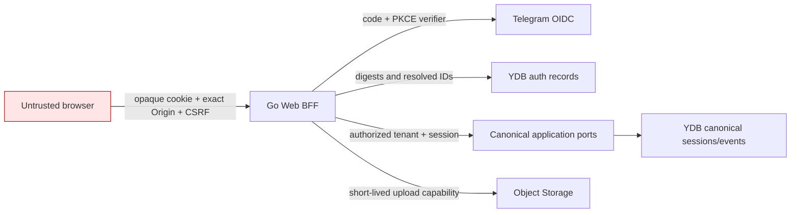

# Web authentication and API contracts

This document freezes the WEB-01 contracts. WEB-02 now implements the Go BFF,
Telegram OIDC adapter, YDB auth tables, and operator bootstrap described here.
The canonical resource API and browser application remain WEB-03 and WEB-04.

The WebUI is a projection over canonical Sessionless sessions and events.
Telegram is the first identity provider for the WebUI, but Telegram chats,
updates, usernames, and transport identifiers do not grant product access.

## Trust boundaries



The browser may supply resource and tenant selectors. The BFF treats them as
untrusted input and resolves authority from the current web session, an active
tenant membership, and (for session resources) a session participant record.
Authentication alone never creates a tenant or membership.

## Telegram OIDC flow

The selected flow is Authorization Code with PKCE `S256`. Telegram documents
the authorization, token, and JWKS endpoints and requires server-side ID-token
validation. OAuth security guidance recommends PKCE for confidential web
clients as well as public clients, transaction-specific state/nonce values,
and exact registered redirect URI matching:

- [Telegram Login OIDC](https://core.telegram.org/bots/telegram-login)
- [OpenID Connect Core 1.0](https://openid.net/specs/openid-connect-core-1_0.html)
- [RFC 7636: PKCE](https://www.rfc-editor.org/rfc/rfc7636)
- [RFC 9700: OAuth 2.0 Security Best Current Practice](https://www.rfc-editor.org/rfc/rfc9700)

```mermaid
sequenceDiagram
    actor User
    participant Browser
    participant BFF
    participant YDB
    participant Telegram

    User->>BFF: GET /auth/telegram/start
    BFF->>YDB: store state digest, browser-binding digest, nonce, verifier, expiry
    BFF-->>Browser: browser-binding cookie + Telegram redirect
    Browser->>Telegram: code request with state, nonce, PKCE S256
    Telegram-->>BFF: code + state
    BFF->>YDB: atomically consume challenge by state digest and browser binding
    BFF->>Telegram: server-side code exchange with verifier and client secret
    Telegram-->>BFF: signed ID token
    BFF->>BFF: verify signature, algorithm, iss, aud, exp, iat, nonce
    BFF->>YDB: resolve/create external identity only
    BFF->>YDB: resolve explicit enrollment grant and active memberships
    alt no membership or grant
        BFF-->>Browser: 403 access_denied
    else active membership
        BFF->>YDB: store opaque-session and CSRF digests
        BFF-->>Browser: __Host- cookies; redirect without code/state
    end
```

### Protocol defaults

- Production issuer is exactly `https://oauth.telegram.org`; audience is the
  configured Bot ID. The redirect URI is one exact HTTPS URI. Loopback HTTP is
  allowed only in an explicitly local environment.
- State, nonce, browser-binding, session, invitation, and CSRF secrets contain
  at least 32 random bytes. Application tables store SHA-256 digests, not raw
  bearer values.
- The PKCE verifier is 43–128 RFC 7636 unreserved characters. Only `S256` is
  accepted.
- The requested scopes are exactly `openid profile`; phone access is not
  requested by the MVP.
- A login challenge expires after 10 minutes and is consumed exactly once in a
  serializable transaction before code exchange. It is bound to the browser
  that initiated the login.
- The MVP pins the Telegram client to `RS256`. A configured algorithm change is
  a reviewed deployment change, not a value accepted from the token header.
- JWKS responses have a bounded 10-minute cache. An unknown `kid` triggers one
  synchronous refresh; if the key or allowed algorithm remains unknown, login
  fails closed.
- The callback response clears code/state-bearing URLs with an immediate local
  redirect and sends `Cache-Control: no-store` and a restrictive Referrer
  Policy. Authorization codes, tokens, cookies, raw state/nonce, PKCE verifiers,
  invitation secrets, CSRF values, and upload URLs are redacted from logs.

`internal/domain.OIDCLoginChallenge`, `OIDCIdentityClaims`, and
`internal/ports.OIDCProvider` encode these boundaries. The OIDC adapter returns
verified identity claims only; provider tokens cannot cross the port.

## Identity, membership, and enrollment

An `ExternalSubject(provider, subject)` maps immutably to one internal
`UserID`. A successful OIDC exchange may create or refresh this mapping. It may
not create a tenant membership by itself.

An active `TenantMembership(tenant_id, user_id)` is the authorization source.
Roles are `owner`, `member`, and `viewer`; statuses are `active`, `suspended`,
and `revoked`. Every security-relevant membership mutation increments a
positive `security_version`, invalidating web sessions issued against the old
version.

Enrollment sources are evaluated in this order:

1. an active membership corroborated by an existing authorized frontend
   binding;
2. a one-time tenant invitation;
3. an explicitly audited development bootstrap grant.

There is no fourth or implicit fallback. Invitations store a secret digest,
expiry, role, and optional provider/subject restriction. Consumption and
membership creation are one serializable transaction; expiry, subject mismatch,
replay, and competing consumption fail closed.

The development bootstrap exists only for `cloud-dev`. `make web-bootstrap`
exposes it as an operator-only command with these requirements:

- use the normal YDB metadata/environment credential chain; never accept a YDB
  IAM token, invitation secret, or service-account key on the command line;
- require an already verified external identity or an explicitly supplied
  internal user ID plus provider/subject match;
- require the exact environment, tenant, role, operator identity, human reason,
  and typed confirmation through an interactive prompt or standard input;
- atomically create the membership and append a redacted audit record;
- be idempotent only for the exact same user, tenant, role, operator, and reason;
- refuse every environment except `cloud-dev`.

This procedure does not depend on a Telegram webhook. General membership
administration and production bootstrap are outside the MVP contract.

## First-party web session

The browser receives at least 256 bits of opaque session material. YDB stores
only its digest, the authenticated subject, internal user, active tenant,
membership security version, CSRF digest, and lifecycle timestamps.

| Property | Default / invariant |
| --- | --- |
| Cookie | `__Host-sessionless`; `Secure`; `HttpOnly`; `SameSite=Lax`; `Path=/`; no `Domain` |
| Idle expiry | 12 hours, enforced server-side |
| Absolute expiry | 7 days, enforced server-side |
| Rotation | mandatory after login and every tenant switch |
| Revocation | logout, membership suspension/revocation/version change, operator action |
| Tenant switch | selected tenant must have a fresh active membership; old digest is revoked atomically |
| Browser storage | no access/ID token, client secret, provider credential, or Sessionless bearer token |

Every request resolves the session digest by a bounded point lookup, then
rechecks expiry, revocation, membership status, user/tenant equality, role, and
security version. A browser-supplied `tenant_id` is only a tenant-switch
selector. It never overrides `active_tenant_id` in the stored session.

Every mutation also requires an exact normalized HTTPS `Origin` and a
session-bound CSRF value in `X-Sessionless-CSRF`. The readable
`__Host-sessionless-csrf` cookie uses `Secure`, `SameSite=Strict`, `Path=/`, and
no `Domain`; YDB stores its digest with the HttpOnly session.

## Same-origin API

The DTOs live in `internal/webcontract`. They intentionally contain no
authoritative user, role, or tenant field, except that
`POST /api/web/v1/active-tenant` carries the tenant selector that must be
resolved to a membership before session rotation.

| Method and path | Request selector/body | Authorization and result |
| --- | --- | --- |
| `GET /auth/telegram/start` | optional local `return_to` | create browser-bound challenge; redirect |
| `GET /auth/telegram/callback` | exactly one of `code` or `error`, plus `state` | consume challenge; verify claims; resolve enrollment |
| `POST /auth/logout` | none | CSRF; revoke current digest; clear cookies |
| `GET /api/web/v1/me` | none | resolved identity and memberships |
| `GET /api/web/v1/tenants` | none | active memberships only |
| `POST /api/web/v1/active-tenant` | `tenant_id` selector | active membership; rotate session |
| `GET /api/web/v1/sessions` | bounded cursor/limit | active tenant plus participant read grant |
| `POST /api/web/v1/sessions` | idempotency key | membership write grant; create canonical session |
| `GET /api/web/v1/sessions/{session_id}/events` | `after_sequence` or cursor, bounded limit | participant read grant; ordered canonical events |
| `POST /api/web/v1/sessions/{session_id}/archive` | desired state/idempotency | participant write grant |
| `POST /api/web/v1/sessions/{session_id}/messages` | text, up to 8 committed upload IDs, idempotency key | participant write grant; canonical ingestion port |
| `POST /api/web/v1/uploads` | session selector, idempotency key, name, media type, size, SHA-256 | participant write grant; short-lived intent |
| `POST /api/web/v1/uploads/{upload_id}/commit` | matching upload selector | reauthorize and verify storage metadata |
| `GET /api/web/v1/runs/{run_id}` | run selector | run tenant/session participant read grant |
| `GET /api/web/v1/sessions/{session_id}/events/{sequence}/attachments/{index}` | canonical event and attachment selectors | participant read grant; short-lived exact-object download capability |

Resource-not-found and unauthorized-resource responses have the same public
shape so tenant/session ID probing cannot distinguish them. Errors use:

```json
{
  "error": {
    "code": "stable_machine_code",
    "message": "safe user-facing message",
    "request_id": "opaque-correlation-id"
  }
}
```

The initial status mapping is `400 invalid_request`, `401 unauthenticated`,
`403 access_denied|csrf_failed`, `404 not_found`, `409 conflict`, `413
payload_too_large`, `429 rate_limited`, and `503 temporarily_unavailable`.
Responses never echo credentials, provider payloads, internal object keys, or
authorization failure details.

### Audit contract

Append a redacted audit event for login success/failure, logout, tenant switch,
session rotation/revocation, invitation consumption, development bootstrap,
CSRF rejection, and privileged session/upload mutations. Each event contains a
stable action/code, occurred-at time, request ID, actor/user when resolved,
tenant when resolved, selected resource IDs, and the membership security
version used for authorization. Pre-authentication failures use a provider plus
one-way subject fingerprint rather than the raw provider token or claims body.

Audit records never contain authorization codes, ID/access tokens, client
secrets, cookies, state/nonce/verifier values, invitation or CSRF secrets,
upload URLs, request bodies, message content, file content, or raw error
objects. Audit persistence participates in the corresponding state transaction
where the action mutates YDB; best-effort logging is not an audit substitute.

## Upload-intent contract

Large browser uploads go directly to Object Storage through a short-lived
capability URL. The stored intent is bound to tenant, user, target canonical
session, object key, name, media type, expected size, expected SHA-256, expiry,
and one-time status. Its object key is generated server-side under:

```text
tenants/<tenant-id>/uploads/<upload-id>/...
```

Commit reauthorizes the current web session and target session, obtains object
metadata from Object Storage, and compares tenant, exact key, size, and digest.
The browser cannot commit a different key or tenant by changing its JSON. An
expired or already committed intent fails closed; abandoned objects are
retention-controlled staging data and never become canonical events.

Presigned URLs are capabilities: responses containing them use `no-store`, and
logs, audit payloads, analytics, browser-persistent storage, and referrers must
not contain them. WEB-03 defines allowed media types, maximum object size,
malware/content inspection, and the final event attachment projection.

## Browser response policy

WEB-02/04 must set at least:

- `Strict-Transport-Security: max-age=31536000; includeSubDomains` after the
  delegated development hostname is HTTPS-only;
- `Content-Security-Policy` with `default-src 'self'`, `object-src 'none'`,
  `base-uri 'none'`, and `frame-ancestors 'none'`; narrowly list only verified
  Telegram/OIDC navigation and Object Storage upload origins;
- `X-Content-Type-Options: nosniff`;
- `Referrer-Policy: no-referrer` on auth/capability responses and
  `strict-origin-when-cross-origin` elsewhere;
- `Cache-Control: no-store` on auth, identity, tenant, mutation, and upload
  capability responses; fingerprinted static assets may be immutable.

The BFF is same-origin. It does not enable credentialed wildcard CORS.

## Ownership of follow-up verification

- WEB-02: signature/JWKS behavior, challenge and invitation concurrency,
  identity immutability, session rotation/revocation, membership-version
  invalidation, and audited bootstrap.
- WEB-03: resource-level IDOR checks, canonical operation authorization,
  upload storage verification, bounded pagination, and error-shape parity.
- WEB-04: browser storage, CSP, cookie, and CSRF integration tests.
- WEB-06: two-user/two-tenant browser E2E, replay/fixation negatives, cloud
  headers, secret/log scanning, and incident procedures.

The focused threat model and executable-test mapping are in
[web-threat-model.md](web-threat-model.md).
