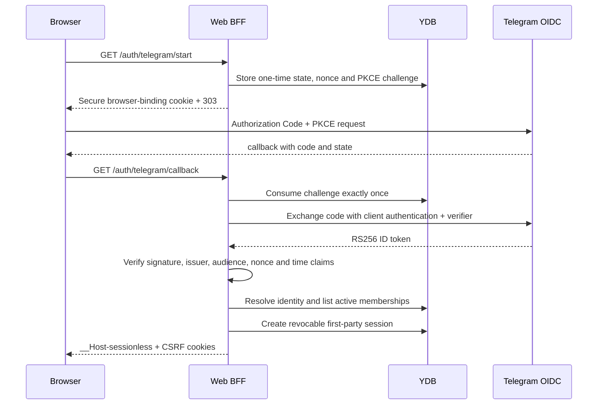

# Web BFF and Telegram OIDC

## Boundary

`web-bff` is a same-origin Go backend-for-frontend. Telegram proves ownership
of an external identity; it does not grant tenant access. Every authenticated
request is authorized against a current Sessionless tenant membership stored in
YDB. Browser-provided tenant IDs are selectors only.

The browser receives opaque first-party session and CSRF cookies. Telegram
tokens, authorization codes, PKCE verifiers, OIDC nonces, and client secrets are
never returned to browser JavaScript or written to logs.



## HTTP routes

| Method | Route | Purpose |
| --- | --- | --- |
| `GET` | `/healthz`, `/readyz`, `/version` | Process health and build metadata |
| `GET` | `/auth/telegram/start` | Create a one-time login challenge and redirect to Telegram |
| `GET` | `/auth/telegram/callback` | Consume the challenge, verify Telegram OIDC, and create a Web session |
| `POST` | `/auth/logout` | Revoke the current Web session |
| `GET` | `/api/web/v1/me` | Return the current identity and active tenant |
| `GET` | `/api/web/v1/tenants` | Return the caller's active memberships |
| `POST` | `/api/web/v1/active-tenant` | Rotate the Web session into another authorized tenant |

Mutation routes require an exact `Origin` match and a double-submit CSRF value
whose digest must also match the current server-side session. Switching tenants
always revokes the previous session and rotates both opaque values. Cookies use
the `__Host-` prefix, `Secure`, `HttpOnly` where applicable, `Path=/`, and no
`Domain` attribute. The default idle lifetime is 12 hours and the absolute
lifetime is seven days.

An authenticated Telegram identity with no active membership receives a stable
`403 access_denied` response and no Web session. Membership is created only by
an existing frontend participant, a validated invitation, or the audited
cloud-development bootstrap command.

## Telegram provider configuration

The implementation follows Telegram's OIDC Authorization Code flow with PKCE
`S256`. The production defaults are:

- issuer `https://oauth.telegram.org`;
- authorization endpoint `https://oauth.telegram.org/auth`;
- token endpoint `https://oauth.telegram.org/token`;
- JWKS endpoint `https://oauth.telegram.org/.well-known/jwks.json`;
- scopes `openid profile`;
- ID-token signing algorithm exactly `RS256`.

JWKS responses are size-bounded and cached for at most ten minutes. An unknown
key ID triggers one refresh before authentication fails closed. Token endpoint
responses and tokens never appear in errors. Provider endpoint overrides are
accepted only for loopback addresses in the local environment.

Source: [Telegram Login: OIDC integration](https://core.telegram.org/bots/telegram-login).

## Runtime configuration and secrets

| Variable | Meaning |
| --- | --- |
| `SESSIONLESS_ENVIRONMENT` | `local`, `cloud-dev`, or production environment name |
| `WEB_BASE_URL` | Exact public HTTPS origin; callback is derived from it |
| `WEB_PORT` | BFF listen port |
| `TELEGRAM_OIDC_ISSUER` | Expected ID-token issuer |
| `TELEGRAM_OIDC_AUTHORIZATION_ENDPOINT` | Telegram authorization endpoint |
| `TELEGRAM_OIDC_TOKEN_ENDPOINT` | Server-side token endpoint |
| `TELEGRAM_OIDC_JWKS_URL` | Signing-key endpoint |
| `TELEGRAM_OIDC_CLIENT_ID` | Telegram application client ID |
| `TELEGRAM_OIDC_CLIENT_SECRET` | Telegram application secret |
| `YDB_CONNECTION_STRING` | YDB endpoint/database coordinates only |

The client secret must be injected into the process environment from an OS
secret store locally and Lockbox in Yandex Cloud. It must not be present in
Terraform state, container arguments, images, DSNs, repository files, or logs.

`oidc-fake` is a Go-only local fixture. It uses the `OIDC_FIXTURE_*` variables,
generates one ephemeral RSA key per process, supports one-time authorization
codes, and refuses every environment except exact `local`. It is not built into
the production Web BFF image.

## YDB data and access paths

| Table | Primary key | Hot-path access |
| --- | --- | --- |
| `external_identities` | `(shard_bucket, provider, subject)` | Point lookup from verified Telegram subject |
| `external_identities_by_user` | `(user_bucket, user_id, provider, subject)` | Bounded reverse lookup |
| `tenant_memberships` | `(user_bucket, user_id, tenant_id)` | Bounded user-prefix list or point membership check |
| `tenant_invitations` | `(tenant_id, invitation_id)` | Point consume with TTL |
| `oidc_login_challenges` | `(shard_bucket, state_digest)` | One-time point consume with TTL |
| `web_sessions` | `(shard_bucket, session_digest)` | Point authorize, rotate, and revoke with TTL |
| `web_security_audit_events` | `(shard_bucket, occurred_at, request_id)` | Durable login-failure and CSRF-rejection audit without requiring a resolved tenant |
| `development_bootstrap_grants` | `(tenant_id, user_id)` | Exact idempotency ledger for cloud-dev grants |

The leading buckets are stable hashes of the point-lookup identity. They avoid
monotonic or attacker-selected hot prefixes while preserving deterministic
lookups. They are logical key distribution, not a manually managed physical
partition count: YDB automatic partitioning by size and load remains enabled on
all tables.

Telegram ingestion atomically materializes the same external-identity mapping
and owner membership used by the Web BFF. Therefore a user who already owns a
Telegram tenant can sign in through OIDC without a separate data copy or a
transport identifier becoming a product identity.

## Audited cloud-development bootstrap

Bootstrap is deliberately unavailable in production and never accepts secret
or authority-bearing command-line arguments. The external identity must already
exist. Set the target and operator metadata in the environment, then type the
exact confirmation requested on standard input:

```sh
export SESSIONLESS_ENVIRONMENT=cloud-dev
export WEB_BOOTSTRAP_TENANT_ID=ten_example
export WEB_BOOTSTRAP_USER_ID=usr_example
export WEB_BOOTSTRAP_ROLE=owner
export WEB_BOOTSTRAP_OPERATOR=operator@example.com
export WEB_BOOTSTRAP_REASON='initial cloud-dev Web access'
export YDB_CONNECTION_STRING='grpcs://ydb.serverless.yandexcloud.net:2135/...'
make web-bootstrap
```

The command requires `BOOTSTRAP <user> INTO <tenant>` exactly. A successful
grant creates or verifies one membership and appends an audit event. Repeating
the exact grant is idempotent; changed role, operator, or reason is a conflict.

## Verification

Credential-free unit tests cover the complete local authorization-code flow,
PKCE, one-time code use, RS256 verification, membership denial, secure cookie
attributes, CSRF rejection, tenant rotation, old-session rejection, and logout.
YDB integration tests prove exactly one winner for concurrent challenge
consumption, stable external-identity resolution, tenant isolation, membership
security-version invalidation, and session rotation.

Run:

```sh
go test -race ./internal/oidcfixture ./internal/telegramoidc ./internal/webbff
make ydb-integration
```

Login failures and CSRF rejections are synchronously persisted to
`web_security_audit_events`; a failed audit write fails the request with
`503 temporarily_unavailable`. Pre-authentication events contain the provider
and, only after verification, a one-way external-subject fingerprint. They
never contain raw claims or browser credentials.

Request logs contain only request ID, method, path, and status. Query strings,
cookies, authorization codes, tokens, state, nonce, PKCE values, provider
response bodies, and raw security errors are excluded.
