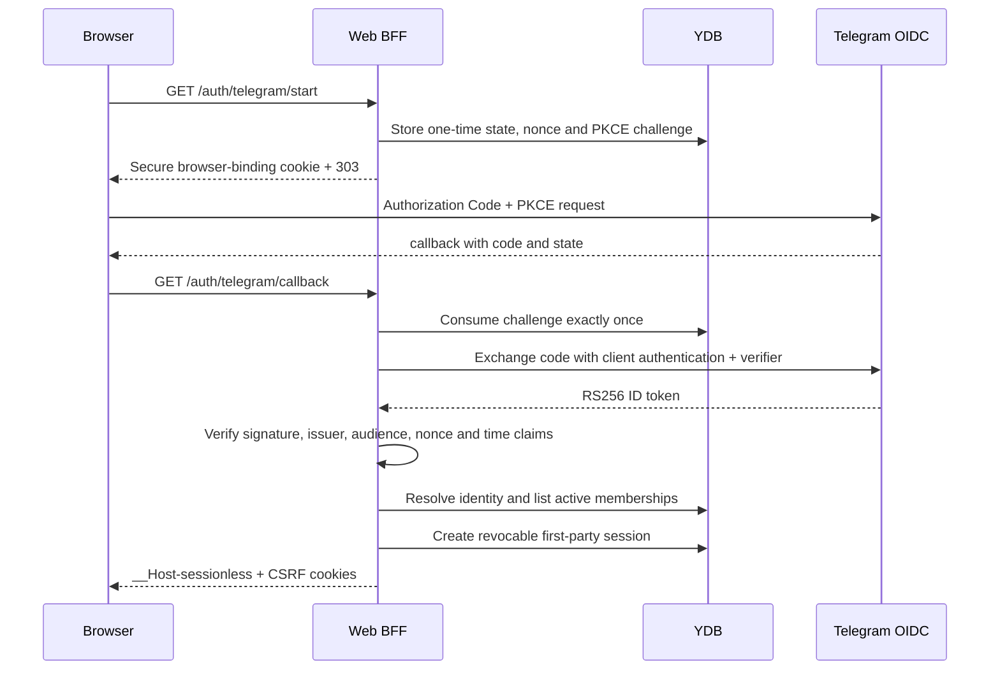

# Web BFF and Telegram OIDC

## Boundary

`web-bff` is a same-origin Go backend-for-frontend. Telegram proves ownership
of an external identity; it does not grant tenant access. Every authenticated
request is authorized against a current Sessionless tenant membership stored in
YDB. Browser-provided tenant IDs are selectors only.

The browser receives opaque first-party session and CSRF cookies. Telegram
tokens, authorization codes, PKCE verifiers, OIDC nonces, and client secrets are
never returned to browser JavaScript or written to logs.



## HTTP routes

| Method | Route | Purpose |
| --- | --- | --- |
| `GET` | `/healthz`, `/readyz`, `/version` | Process health and build metadata |
| `GET` | `/auth/telegram/start` | Create a one-time login challenge and redirect to Telegram |
| `GET` | `/auth/telegram/callback` | Consume the challenge, verify Telegram OIDC, and create a Web session |
| `POST` | `/auth/logout` | Revoke the current Web session |
| `GET` | `/api/web/v1/me` | Return the current identity and active tenant |
| `GET` | `/api/web/v1/tenants` | Return the caller's active memberships |
| `POST` | `/api/web/v1/active-tenant` | Rotate the Web session into another authorized tenant |
| `GET`, `POST` | `/api/web/v1/sessions` | Page active/archived sessions or create one idempotently |
| `GET` | `/api/web/v1/sessions/{session_id}` | Open bounded participant-authorized session metadata |
| `GET` | `/api/web/v1/sessions/{session_id}/events` | Page ordered canonical event payloads after authorization |
| `GET` | `/api/web/v1/sessions/{session_id}/runs` | Page provider/harness execution observations |
| `GET` | `/api/web/v1/sessions/{session_id}/compute` | Return participant-authorized safe compute/quota status |
| `POST` | `/api/web/v1/sessions/{session_id}/archive` | Archive or unarchive without deleting history |
| `POST` | `/api/web/v1/sessions/{session_id}/messages` | Append an idempotent canonical Web message and create its run |
| `POST` | `/api/web/v1/uploads` | Create an exact-object direct-upload capability |
| `POST` | `/api/web/v1/uploads/{upload_id}/commit` | Verify and commit the exact staged object |
| `GET` | `/api/web/v1/runs/{run_id}` | Read one participant-authorized run |
| `GET` | `/api/web/v1/sessions/{session_id}/events/{sequence}/attachments/{index}` | Create a short-lived capability for one canonical attachment |
| `GET` | `/api/web/v1/sessions/{session_id}/runs/{run_id}/artifact-manifests/{manifest_id}/artifacts/{index}` | Create a short-lived capability for one exact worker artifact |

Mutation routes require an exact `Origin` match and a double-submit CSRF value
whose digest must also match the current server-side session. Switching tenants
always revokes the previous session and rotates both opaque values. Cookies use
the `__Host-` prefix, `Secure`, `HttpOnly` where applicable, `Path=/`, and no
`Domain` attribute. The default idle lifetime is 12 hours and the absolute
lifetime is seven days.

Browser code cannot supply raw frontend coordinates. On message submission the
server creates or verifies the binding `(web, session_id)` for the authorized
canonical session. The generic revision-fenced binding operation remains an
internal adapter boundary and is deliberately not registered as a Web route.

Any failed OIDC callback, including provider denial or missing enrollment,
redirects to the stable same-origin `/login?auth_error=access_denied` recovery
route and creates no Web session. Provider error names and descriptions are
never reflected into the URL or response body. Membership is created only by
an existing frontend participant, a validated invitation, or the audited
cloud-development bootstrap command.

If the callback failure cannot be durably audited, the login still fails
closed and clears the code/state-bearing callback URL through the stable
`/login?auth_error=temporarily_unavailable` recovery route. No provider or
audit-storage detail is reflected to the browser.

## Telegram provider configuration

The implementation follows Telegram's OIDC Authorization Code flow with PKCE
`S256`. The production defaults are:

- issuer `https://oauth.telegram.org`;
- authorization endpoint `https://oauth.telegram.org/auth`;
- token endpoint `https://oauth.telegram.org/token`;
- JWKS endpoint `https://oauth.telegram.org/.well-known/jwks.json`;
- scopes `openid profile`;
- ID-token signing algorithm exactly `RS256`.

JWKS responses are size-bounded and cached for at most ten minutes. An unknown
key ID triggers one refresh before authentication fails closed. Token endpoint
responses and tokens never appear in errors. Provider endpoint overrides are
accepted only for loopback addresses in the local environment.

Source: [Telegram Login: OIDC integration](https://core.telegram.org/bots/telegram-login).

## Runtime configuration and secrets

| Variable | Meaning |
| --- | --- |
| `SESSIONLESS_ENVIRONMENT` | `local`, `cloud-dev`, or production environment name |
| `WEB_BASE_URL` | Exact public HTTPS origin; callback is derived from it |
| `WEB_PORT` | BFF listen port |
| `PORT` | Serverless platform listen port; takes precedence over `WEB_PORT` when set |
| `WEB_OBJECT_STORAGE_ORIGIN` | Exact browser-facing capability origin; required with the Web API, HTTPS except loopback HTTP in `local` |
| `TELEGRAM_OIDC_ISSUER` | Expected ID-token issuer |
| `TELEGRAM_OIDC_AUTHORIZATION_ENDPOINT` | Telegram authorization endpoint |
| `TELEGRAM_OIDC_TOKEN_ENDPOINT` | Server-side token endpoint |
| `TELEGRAM_OIDC_JWKS_URL` | Signing-key endpoint |
| `TELEGRAM_OIDC_CLIENT_ID` | Telegram application client ID |
| `TELEGRAM_OIDC_CLIENT_SECRET` | Telegram application secret |
| `YDB_CONNECTION_STRING` | YDB endpoint/database coordinates only |
| `SESSION_API_CURSOR_HMAC_KEY` | At least 32 secret bytes for scoped opaque continuation tokens |
| `SESSION_API_ID_HMAC_KEY` | At least 32 secret bytes for deterministic session, upload, event, run, and dispatch IDs |
| `WEB_MAX_UPLOAD_BYTES` | Optional positive object limit; defaults to `33554432` (32 MiB) |
| `WEB_ALLOWED_MCP_SERVERS` | Optional comma-separated allowlist copied into Web-created jobs |
| `QUEUE_ENDPOINT`, `QUEUE_REGION` | Queue coordinates used to publish canonical scheduler wakes |
| `OUTBOX_QUEUE_ACCESS_KEY_ID`, `OUTBOX_QUEUE_SECRET_ACCESS_KEY` | Optional queue credentials; each falls back to its `QUEUE_*` counterpart locally |
| `SCHEDULER_WAKE_QUEUE_URL` | Scheduler-wake queue receiving durable ingress wake hints |
| `S3_ENDPOINT`, `S3_REGION`, `S3_BUCKET` | Exact Object Storage coordinates |
| `S3_ACCESS_KEY_ID`, `S3_SECRET_ACCESS_KEY`, `S3_FORCE_PATH_STYLE` | Static S3-compatible credentials and addressing, used by local MinIO |
| `S3_IAM_METADATA_CREDENTIALS` | Use the workload service-account IAM token for Yandex Object Storage and its Presign API |

The client secret must be injected into the process environment from an OS
secret store locally and Lockbox in Yandex Cloud. It must not be present in
Terraform state, container arguments, images, DSNs, repository files, or logs.

`oidc-fake` is a Go-only local fixture. It uses the `OIDC_FIXTURE_*` variables,
generates one ephemeral RSA key per process, supports one-time authorization
codes, and refuses every environment except exact `local`. It is not built into
the production Web BFF image.

## Canonical message and object flow

The browser uploads large objects directly rather than proxying bytes through
the serverless BFF:

1. Create an upload intent with the target session, a fresh idempotency key,
   filename, allowed media type, byte count, lowercase SHA-256, and a canonical
   padded standard-base64 `content_md5` for the same bytes.
2. Use the returned `PUT` URL once, preserving every returned header exactly.
   The URL and headers, including `Content-MD5`, identify one server-generated
   staging object and expire quickly.
3. Commit the same `upload_id`. The BFF reauthorizes the user and verifies
   authoritative size, media type, checksum, key, and ETag from Object Storage.
4. Submit text and up to eight committed upload IDs to the session message
   route. The BFF resolves exactly one compute connection owned by the
   requesting user, promotes each unchanged object into the immutable event
   namespace, and atomically creates the canonical event/run.
5. Poll the returned run ID using `If-None-Match` and the server's
   `Retry-After`/`X-Sessionless-Poll-After-Ms` hints. Fetch new transcript
   events with `after_sequence`; do not combine it with `cursor`.

Before submission, the UI can read
`GET /api/web/v1/sessions/{session_id}/compute`. It returns `not_configured`,
`ready`, or `ambiguous`; only `ready` includes provider, entitlement, quota,
and observation time. Connection IDs, credential references, and tokens are
not part of the response.

Session/list/event/run reads return representation-derived ETags and answer a
matching `If-None-Match` with `304`. Attachment and worker-artifact routes
return a short-lived exact-object `GET` capability rather than an Object
Storage key. Worker-artifact lookup requires the participant-authorized exact
session/run/manifest relationship and a bounded index; assistant projections
publish only the opaque run and manifest selectors. All capability responses
remain `Cache-Control: no-store`; URLs must be redacted from request, audit,
and analytics logs and must not be persisted in browser storage.

The default accepted upload size is 32 MiB. The built-in safe media allowlist
is JSON, PDF, ZIP, GIF, JPEG, PNG, WebP, CSV, Markdown, and plain text. The
upload-intent lifetime is at most ten minutes, an upload capability at most
five minutes, and a download capability at most two minutes. Staging retention
is a storage lifecycle concern; an unclaimed staging object never becomes
canonical session history.

In Yandex workload-IAM mode the adapter authenticates with the service-account
IAM token and calls the official
[Object Storage `PresignService.Create`](https://yandex.cloud/en/docs/storage/api-ref/grpc/Presign/create)
endpoint at `storage.api.cloud.yandex.net:443`. Local static-key mode uses the
S3-compatible [pre-signed URL](https://yandex.cloud/en/docs/storage/concepts/pre-signed-urls)
contract through the AWS SDK.

## YDB data and access paths

| Table | Primary key | Hot-path access |
| --- | --- | --- |
| `external_identities` | `(shard_bucket, provider, subject)` | Point lookup from verified Telegram subject |
| `external_identities_by_user` | `(user_bucket, user_id, provider, subject)` | Bounded reverse lookup |
| `tenant_memberships` | `(user_bucket, user_id, tenant_id)` | Bounded user-prefix list or point membership check |
| `tenant_invitations` | `(tenant_id, invitation_id)` | Point consume with TTL |
| `oidc_login_challenges` | `(shard_bucket, state_digest)` | One-time point consume with TTL |
| `web_sessions` | `(shard_bucket, session_digest)` | Point authorize, rotate, and revoke with TTL |
| `web_security_audit_events` | `(shard_bucket, occurred_at, request_id)` | Durable login-failure and CSRF-rejection audit without requiring a resolved tenant |
| `development_bootstrap_grants` | `(tenant_id, user_id)` | Exact idempotency ledger for cloud-dev grants |
| `web_upload_intents` | `(tenant_id, upload_id)` | Point authorize, commit, and atomic bounded claim |
| `web_upload_intent_creations` | `(tenant_id, user_id, creation_idempotency_key)` | Exact upload-creation retry ledger |

The leading buckets are stable hashes of the point-lookup identity. They avoid
monotonic or attacker-selected hot prefixes while preserving deterministic
lookups. They are logical key distribution, not a manually managed physical
partition count: YDB automatic partitioning by size and load remains enabled on
all tables.

Telegram ingestion atomically materializes the same external-identity mapping
and owner membership used by the Web BFF. Therefore a user who already owns a
Telegram tenant can sign in through OIDC without a separate data copy or a
transport identifier becoming a product identity.

## Audited cloud-development bootstrap

Bootstrap is deliberately unavailable in production and never accepts secret
or authority-bearing command-line arguments. The external identity must already
exist. Set the target and operator metadata in the environment, then type the
exact confirmation requested on standard input:

```sh
export SESSIONLESS_ENVIRONMENT=cloud-dev
export WEB_BOOTSTRAP_TENANT_ID=ten_example
export WEB_BOOTSTRAP_USER_ID=usr_example
export WEB_BOOTSTRAP_ROLE=owner
export WEB_BOOTSTRAP_OPERATOR=operator@example.com
export WEB_BOOTSTRAP_REASON='initial cloud-dev Web access'
export YDB_CONNECTION_STRING='grpcs://ydb.serverless.yandexcloud.net:2135/...'
make web-bootstrap
```

The command requires `BOOTSTRAP <user> INTO <tenant>` exactly. A successful
grant creates or verifies one membership and appends an audit event. Repeating
the exact grant is idempotent; changed role, operator, or reason is a conflict.

## Verification

Credential-free unit tests cover the complete local authorization-code flow,
PKCE, one-time code use, RS256 verification, membership denial, secure cookie
attributes, CSRF rejection, tenant rotation, old-session rejection, and logout.
YDB integration tests prove exactly one winner for concurrent challenge
consumption, stable external-identity resolution, tenant isolation, membership
security-version invalidation, and session rotation.

Run the repository-supported checks:

```sh
make test
make build
make ydb-integration
```

Login failures and CSRF rejections are synchronously persisted to
`web_security_audit_events`; a failed audit write fails the request with
`503 temporarily_unavailable`. Pre-authentication events contain the provider
and, only after verification, a one-way external-subject fingerprint. They
never contain raw claims or browser credentials.

Request logs contain only request ID, method, path, and status. Query strings,
cookies, authorization codes, tokens, state, nonce, PKCE values, provider
response bodies, and raw security errors are excluded.

The session route authorization, pagination, consistency, bounded metadata,
and error contracts are specified in [session-api.md](session-api.md).
